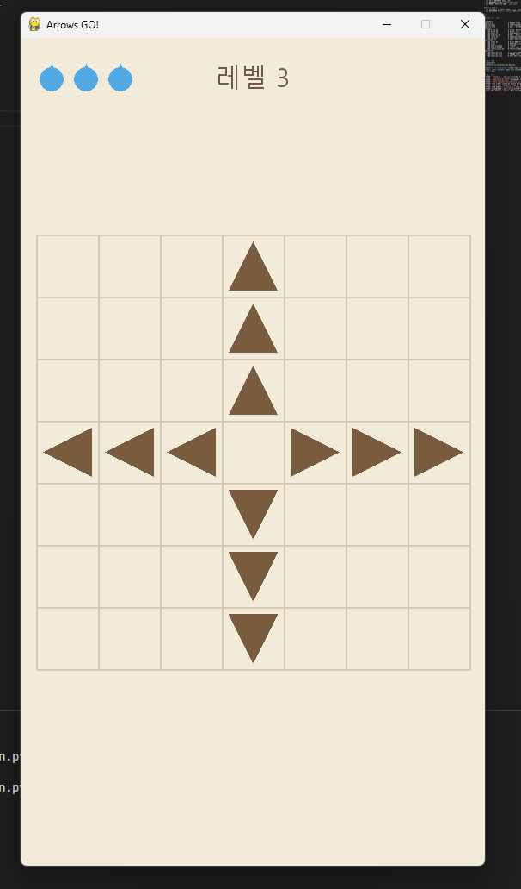
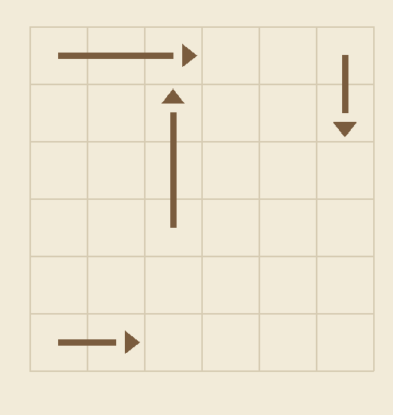
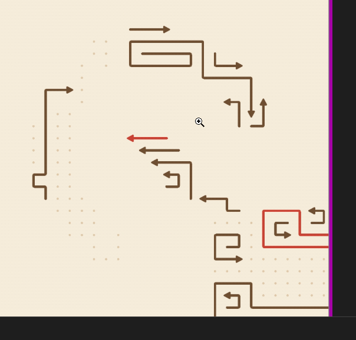
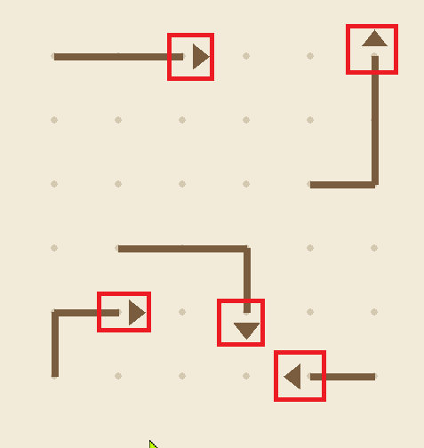
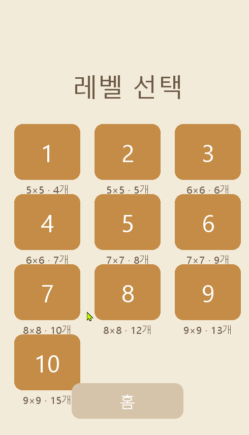
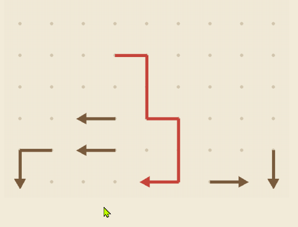

# Chat transcript — 905a00ff-6b2c-40c1-94df-aec98e6b5cb5

- source: `C:\Users\Tankla\.claude\projects\d---SRC-Lecture-KPU-ClaudeCode-ArrowGame\905a00ff-6b2c-40c1-94df-aec98e6b5cb5.jsonl`
- session start: 2026-05-29 16:36:59
- exported: 2026-05-30 15:22
- images: 6

---

## User  ·  2026-05-29 16:36:59

<ide_opened_file>The user opened the file d:\_SRC\Lecture\KPU\ClaudeCode\ArrowGame\_readme\01. 기획.md in the IDE. This may or may not be related to the current task.</ide_opened_file>

@/d:/_SRC/Lecture/KPU/ClaudeCode/ArrowGame/_readme/01. 기획.md 
참고 이미지를 확인하고 기능 정의를 만들어.

## Assistant  ·  2026-05-29 16:37:10

**▶ tool call — Read**

```json
{
  "file_path": "d:\\_SRC\\Lecture\\KPU\\ClaudeCode\\ArrowGame\\_readme\\01. 기획.md"
}
```

## User  ·  2026-05-29 16:37:10

**◀ tool result**

```
1	# 화살표 게임 기획
2	
3	## 참고 이미지
4	
5	
6	
7	
8	
9	   
10	
11	  
12	
13	
14	
15	## 이미지를 확인한 기능 정의
16	
17	
18	
19	
20	
21	
22	
23	
24
```

## Assistant  ·  2026-05-29 16:37:13

**▶ tool call — Glob**

```json
{
  "pattern": "_readme/*.jpg"
}
```

## User  ·  2026-05-29 16:37:13

**◀ tool result**

```
_readme\KakaoTalk_20260529_163336216_01.jpg
_readme\KakaoTalk_20260529_163336216_02.jpg
_readme\KakaoTalk_20260529_163336216_03.jpg
_readme\KakaoTalk_20260529_163336216.jpg
_readme\KakaoTalk_20260529_163336216_07.jpg
_readme\KakaoTalk_20260529_163336216_04.jpg
_readme\KakaoTalk_20260529_163336216_05.jpg
_readme\KakaoTalk_20260529_163336216_06.jpg
_readme\KakaoTalk_20260529_163336216_10.jpg
_readme\KakaoTalk_20260529_163336216_08.jpg
_readme\KakaoTalk_20260529_163336216_09.jpg
_readme\KakaoTalk_20260529_163336216_11.jpg
```

## Assistant  ·  2026-05-29 16:37:17

이미지들을 순서대로 확인하겠습니다.

## Assistant  ·  2026-05-29 16:37:18

**▶ tool call — Read**

```json
{
  "file_path": "d:\\_SRC\\Lecture\\KPU\\ClaudeCode\\ArrowGame\\_readme\\KakaoTalk_20260529_163336216.jpg"
}
```

## User  ·  2026-05-29 16:37:18

_[tool result: 빈 결과]_

## User  ·  2026-05-29 16:37:18

[Image: original 1080x2316, displayed at 933x2000. Multiply coordinates by 1.16 to map to original image.]

## Assistant  ·  2026-05-29 16:37:18

**▶ tool call — Read**

```json
{
  "file_path": "d:\\_SRC\\Lecture\\KPU\\ClaudeCode\\ArrowGame\\_readme\\KakaoTalk_20260529_163336216_01.jpg"
}
```

## User  ·  2026-05-29 16:37:18

_[tool result: 빈 결과]_

## User  ·  2026-05-29 16:37:18

[Image: original 1080x2316, displayed at 933x2000. Multiply coordinates by 1.16 to map to original image.]

## Assistant  ·  2026-05-29 16:37:19

**▶ tool call — Read**

```json
{
  "file_path": "d:\\_SRC\\Lecture\\KPU\\ClaudeCode\\ArrowGame\\_readme\\KakaoTalk_20260529_163336216_02.jpg"
}
```

## User  ·  2026-05-29 16:37:19

_[tool result: 빈 결과]_

## User  ·  2026-05-29 16:37:19

[Image: original 1080x2316, displayed at 933x2000. Multiply coordinates by 1.16 to map to original image.]

## Assistant  ·  2026-05-29 16:37:19

**▶ tool call — Read**

```json
{
  "file_path": "d:\\_SRC\\Lecture\\KPU\\ClaudeCode\\ArrowGame\\_readme\\KakaoTalk_20260529_163336216_03.jpg"
}
```

## User  ·  2026-05-29 16:37:20

_[tool result: 빈 결과]_

## User  ·  2026-05-29 16:37:20

[Image: original 1080x2316, displayed at 933x2000. Multiply coordinates by 1.16 to map to original image.]

## Assistant  ·  2026-05-29 16:37:25

**▶ tool call — Read**

```json
{
  "file_path": "d:\\_SRC\\Lecture\\KPU\\ClaudeCode\\ArrowGame\\_readme\\KakaoTalk_20260529_163336216_04.jpg"
}
```

## User  ·  2026-05-29 16:37:25

_[tool result: 빈 결과]_

## User  ·  2026-05-29 16:37:25

[Image: original 1080x2316, displayed at 933x2000. Multiply coordinates by 1.16 to map to original image.]

## Assistant  ·  2026-05-29 16:37:26

**▶ tool call — Read**

```json
{
  "file_path": "d:\\_SRC\\Lecture\\KPU\\ClaudeCode\\ArrowGame\\_readme\\KakaoTalk_20260529_163336216_05.jpg"
}
```

## User  ·  2026-05-29 16:37:26

_[tool result: 빈 결과]_

## User  ·  2026-05-29 16:37:26

[Image: original 1080x2316, displayed at 933x2000. Multiply coordinates by 1.16 to map to original image.]

## Assistant  ·  2026-05-29 16:37:26

**▶ tool call — Read**

```json
{
  "file_path": "d:\\_SRC\\Lecture\\KPU\\ClaudeCode\\ArrowGame\\_readme\\KakaoTalk_20260529_163336216_06.jpg"
}
```

## User  ·  2026-05-29 16:37:27

_[tool result: 빈 결과]_

## User  ·  2026-05-29 16:37:27

[Image: original 1080x2316, displayed at 933x2000. Multiply coordinates by 1.16 to map to original image.]

## Assistant  ·  2026-05-29 16:37:27

**▶ tool call — Read**

```json
{
  "file_path": "d:\\_SRC\\Lecture\\KPU\\ClaudeCode\\ArrowGame\\_readme\\KakaoTalk_20260529_163336216_07.jpg"
}
```

## User  ·  2026-05-29 16:37:27

_[tool result: 빈 결과]_

## User  ·  2026-05-29 16:37:27

[Image: original 1080x2316, displayed at 933x2000. Multiply coordinates by 1.16 to map to original image.]

## Assistant  ·  2026-05-29 16:37:33

**▶ tool call — Read**

```json
{
  "file_path": "d:\\_SRC\\Lecture\\KPU\\ClaudeCode\\ArrowGame\\_readme\\KakaoTalk_20260529_163336216_08.jpg"
}
```

## User  ·  2026-05-29 16:37:33

_[tool result: 빈 결과]_

## User  ·  2026-05-29 16:37:33

[Image: original 1080x2316, displayed at 933x2000. Multiply coordinates by 1.16 to map to original image.]

## Assistant  ·  2026-05-29 16:37:33

**▶ tool call — Read**

```json
{
  "file_path": "d:\\_SRC\\Lecture\\KPU\\ClaudeCode\\ArrowGame\\_readme\\KakaoTalk_20260529_163336216_09.jpg"
}
```

## User  ·  2026-05-29 16:37:33

_[tool result: 빈 결과]_

## User  ·  2026-05-29 16:37:33

[Image: original 1080x2316, displayed at 933x2000. Multiply coordinates by 1.16 to map to original image.]

## Assistant  ·  2026-05-29 16:37:34

**▶ tool call — Read**

```json
{
  "file_path": "d:\\_SRC\\Lecture\\KPU\\ClaudeCode\\ArrowGame\\_readme\\KakaoTalk_20260529_163336216_10.jpg"
}
```

## User  ·  2026-05-29 16:37:34

_[tool result: 빈 결과]_

## User  ·  2026-05-29 16:37:34

[Image: original 1080x2316, displayed at 933x2000. Multiply coordinates by 1.16 to map to original image.]

## Assistant  ·  2026-05-29 16:37:34

**▶ tool call — Read**

```json
{
  "file_path": "d:\\_SRC\\Lecture\\KPU\\ClaudeCode\\ArrowGame\\_readme\\KakaoTalk_20260529_163336216_11.jpg"
}
```

## User  ·  2026-05-29 16:37:35

_[tool result: 빈 결과]_

## User  ·  2026-05-29 16:37:35

[Image: original 1080x2316, displayed at 933x2000. Multiply coordinates by 1.16 to map to original image.]

## Assistant  ·  2026-05-29 16:38:00

모든 참고 이미지를 확인했습니다. 게임의 화면들을 분석한 결과를 바탕으로 기능 정의를 작성하겠습니다.

분석 내용:
- **메인 화면**: 데일리 챌린지, 이벤트, 플레이 버튼(레벨 표시)
- **게임 플레이**: 화살표 방향을 따라 한붓그리기로 선을 잇는 퍼즐 (초록=정답 경로, 빨강=오류 경로, 점선=미완료 영역, 물방울=생명/기회)
- **클리어 화면**: "잘했어!" + 완성 그림 미리보기 + 다음 레벨/홈
- **하드 모드 / 통계**: "한 번에 성공!", 클리어 비율 표시

이제 기획 문서에 기능 정의를 작성합니다.

## Assistant  ·  2026-05-29 16:38:27

**▶ tool call — Edit**

```json
{
  "replace_all": false,
  "file_path": "d:\\_SRC\\Lecture\\KPU\\ClaudeCode\\ArrowGame\\_readme\\01. 기획.md",
  "old_string": "## 이미지를 확인한 기능 정의\n\n\n\n",
  "new_string": "## 이미지를 확인한 기능 정의\n\n### 게임 개요\n- **게임명**: Arrows GO! (화살표 게임)\n- **장르**: 한붓그리기(One-line drawing) 퍼즐 / 캐주얼 두뇌 게임\n- **핵심 재미**: 화면에 흩어진 화살표들을 **방향에 맞게** 하나의 선으로 이어, 모든 화살표를 통과시켜 하나의 그림(별, 하트, 동물 등)을 완성한다.\n\n---\n\n### 1. 핵심 게임플레이 (퍼즐)\n- **목표**: 보드 위의 모든 화살표 선분을 빠짐없이 한 번에 이어 그림을 완성한다.\n- **이동 규칙**: 각 화살표는 가리키는 **방향으로만** 진행 가능하다. 역방향으로는 그릴 수 없다.\n- **연결 규칙**: 펜(경로)은 끊김 없이 이어져야 하며, 모든 선분을 빠짐없이 지나야 클리어된다.\n- **경로 색상 피드백**:\n  - **갈색(기본)**: 아직 그리지 않은 화살표\n  - **초록색**: 올바르게 연결되어 확정된 경로\n  - **빨간색**: 잘못된 진행 / 막다른 길 / 규칙 위반 경로(되돌려야 함)\n  - **점선(흐린 점)**: 현재 진행 영역에서 비활성/미완료로 표시되는 구역\n- **입력 방식**: 드래그(스와이프)로 선을 따라 그린다.\n- **되돌리기**: 잘못 그린 경로는 되짚어(언두) 다시 진행할 수 있다.\n\n### 2. 라이프(물방울) 시스템\n- 화면 좌측 상단에 **물방울 아이콘 3개** 표시 (기회/라이프).\n- 실수하거나 막다른 길에 도달하면 물방울이 1개씩 소모(파랑 → 회색).\n- 물방울을 모두 소진하면 실패 처리(레벨 재시작 또는 광고 시청 후 이어하기).\n\n### 3. 힌트 / 보조 기능\n- **힌트 전구(AD 표시)**: 우측 상단 전구 버튼. 광고 시청 후 다음 경로 일부를 표시해 준다.\n- **테마/색상 변경(팔레트 A 버튼)**: 보드 및 선 색상 테마를 변경.\n- **줌(확대/축소)**: 복잡한 레벨에서 보드를 확대해 세밀하게 그릴 수 있다(레벨 125 확대 화면 참고).\n\n### 4. 레벨 & 진행 시스템\n- 레벨은 번호로 순차 진행 (예: 109 → 111 → 125 → 141 → 142...).\n- 클리어 시 **다음 레벨** 자동 해금.\n- 레벨별로 완성되는 그림이 다름 (별 모양, 하트/꽃 모양 등).\n- **난이도 등급**: 일부 레벨은 \"하드(Hard)\" 등급으로 별도 표시(레벨 109 하드 참고).\n\n### 5. 클리어(결과) 화면\n- 성공 메시지 표시: **\"잘했어!\"**\n- 완성된 그림을 카드 형태로 미리보기 제공.\n- **\"N단계 완료!\"** 텍스트 표시.\n- 버튼: **[다음 레벨]**, **[홈]**.\n- **좋아요(👍)** 버튼으로 레벨/그림 평가.\n- 특별 달성 시 배너 표시: **\"한 번에 성공!\"** (실수 없이 클리어)\n- 통계 표시: **\"이 레벨을 정복한 플레이어는 전체의 60%에 불과합니다!\"** (클리어 희소성 / 동기 부여)\n\n### 6. 메인(홈) 화면\n- 상단 카드 2종:\n  - **데일리 챌린지**: 날짜 표시(예: 5월 29), 완료/진행 상태 표시(트로피 아이콘, \"완료\" 버튼).\n  - **이벤트**: 시즌/테마 이벤트(예: \"봄 전투\"), \"플레이\" 버튼.\n- 중앙: 게임 타이틀 **\"Arrows GO!\"**.\n- 하단: 메인 **[플레이]** 버튼 + 현재 도달 레벨 표시(예: \"레벨 142\").\n- 우측 상단: **설정** 버튼.\n\n### 7. 부가 콘텐츠\n- **데일리 챌린지**: 매일 갱신되는 특별 퍼즐, 완료 시 보상/트로피.\n- **이벤트 모드**: 기간 한정 테마 퍼즐
... (생략, 총 2280자)
```

## User  ·  2026-05-29 16:38:29

**◀ tool result**

```
The file d:\_SRC\Lecture\KPU\ClaudeCode\ArrowGame\_readme\01. 기획.md has been updated successfully. (file state is current in your context — no need to Read it back)
```

## Assistant  ·  2026-05-29 16:38:42

참고 이미지 12장을 모두 분석하여 [01. 기획.md](_readme/01.%20기획.md)에 기능 정의를 작성했습니다.

## 분석 요약

**게임 정체**: `Arrows GO!` — 화살표를 방향에 맞게 한 줄로 이어 그림을 완성하는 한붓그리기 퍼즐 게임

이미지에서 도출한 핵심 기능들:

| 단서 (이미지) | 도출한 기능 |
|---|---|
| 화살표 패턴 + 초록/빨강/점선 선 (레벨 125·111) | 방향 제약 한붓그리기 + 경로 색상 피드백(정답=초록, 오류=빨강) |
| 물방울 3개가 파랑→회색으로 변화 (레벨 125 연속 컷) | 라이프(기회) 소모 시스템 |
| 전구+AD 아이콘 / 팔레트 A 버튼 | 광고 힌트 / 테마 변경 |
| 같은 보드의 확대 컷 (레벨 125) | 줌 인/아웃 |
| "잘했어!" + 그림 카드 + 다음 레벨/홈/👍 | 클리어 결과 화면 |
| "한 번에 성공!" + "전체의 60%" (레벨 109 하드) | 무실수 달성 배너 + 클리어 통계 + 하드 난이도 |
| 데일리 챌린지·이벤트(봄 전투)·플레이(레벨 142) | 홈 화면 구성 + 부가 콘텐츠 |

**보강하면 좋을 점** (이미지만으론 불명확한 부분): 물방울 회복 방식(시간/광고/별도 재화), 점수·별점 산정 기준, 데일리 챌린지 보상 내용은 추정으로 작성했으니 실제 기획 의도에 맞게 확정이 필요합니다.

다음으로 이 기능 정의를 바탕으로 **상세 기획서**, **기술 설계**, 혹은 **프로토타입 구현** 중 어떤 작업을 진행할지 알려주시면 이어서 도와드리겠습니다.

## User  ·  2026-05-29 16:43:27

<ide_opened_file>The user opened the file d:\_SRC\Lecture\KPU\ClaudeCode\ArrowGame\_readme\01. 기획.md in the IDE. This may or may not be related to the current task.</ide_opened_file>

음... 한붓 그리기???? 그게 아니고,  화살표들로 구성된 그림, 또는 그냥 사각형에서 바깥쪽으로 뚫린(화살표 방향에 장애물이 없는) 화살표를 클릭하면 화살표가 바깥으로 빠져나가는 형식이야. 이와 같은 방법으로 모든 화살표를 ㅎ화면에서 제거하면 한 판이 끝나는거지.

## Assistant  ·  2026-05-29 16:43:48

아 — 규칙을 완전히 잘못 이해했네요. 한붓그리기가 아니라 **"막힌 길 빼기(Unblock)"** 류군요. 정정해서 다시 작성하겠습니다.

제가 이해한 정정된 규칙:
- 화살표들이 그림/사각 보드 안에 배치되어 있음
- 화살표를 클릭하면 **가리키는 방향으로 직진**해서 화면 밖으로 빠져나감
- 단, 그 직진 경로상에 **다른 화살표(장애물)가 막고 있으면 빠져나가지 못함**
- 막히지 않은(바깥쪽으로 뚫린) 화살표부터 차례로 제거 → 모든 화살표 제거 시 클리어

핵심 게임플레이 섹션을 다시 쓰겠습니다.

## Assistant  ·  2026-05-29 16:44:12

**▶ tool call — Edit**

```json
{
  "replace_all": false,
  "file_path": "d:\\_SRC\\Lecture\\KPU\\ClaudeCode\\ArrowGame\\_readme\\01. 기획.md",
  "old_string": "### 게임 개요\n- **게임명**: Arrows GO! (화살표 게임)\n- **장르**: 한붓그리기(One-line drawing) 퍼즐 / 캐주얼 두뇌 게임\n- **핵심 재미**: 화면에 흩어진 화살표들을 **방향에 맞게** 하나의 선으로 이어, 모든 화살표를 통과시켜 하나의 그림(별, 하트, 동물 등)을 완성한다.\n\n---\n\n### 1. 핵심 게임플레이 (퍼즐)\n- **목표**: 보드 위의 모든 화살표 선분을 빠짐없이 한 번에 이어 그림을 완성한다.\n- **이동 규칙**: 각 화살표는 가리키는 **방향으로만** 진행 가능하다. 역방향으로는 그릴 수 없다.\n- **연결 규칙**: 펜(경로)은 끊김 없이 이어져야 하며, 모든 선분을 빠짐없이 지나야 클리어된다.\n- **경로 색상 피드백**:\n  - **갈색(기본)**: 아직 그리지 않은 화살표\n  - **초록색**: 올바르게 연결되어 확정된 경로\n  - **빨간색**: 잘못된 진행 / 막다른 길 / 규칙 위반 경로(되돌려야 함)\n  - **점선(흐린 점)**: 현재 진행 영역에서 비활성/미완료로 표시되는 구역\n- **입력 방식**: 드래그(스와이프)로 선을 따라 그린다.\n- **되돌리기**: 잘못 그린 경로는 되짚어(언두) 다시 진행할 수 있다.\n\n### 2. 라이프(물방울) 시스템\n- 화면 좌측 상단에 **물방울 아이콘 3개** 표시 (기회/라이프).\n- 실수하거나 막다른 길에 도달하면 물방울이 1개씩 소모(파랑 → 회색).\n- 물방울을 모두 소진하면 실패 처리(레벨 재시작 또는 광고 시청 후 이어하기).",
  "new_string": "### 게임 개요\n- **게임명**: Arrows GO! (화살표 게임)\n- **장르**: 길 빼기(Unblock) 퍼즐 / 캐주얼 두뇌 게임\n- **핵심 재미**: 화살표들로 이루어진 그림(또는 사각 보드)에서, **바깥으로 뚫려 있는(진행 방향에 장애물이 없는) 화살표**를 골라 클릭해 하나씩 화면 밖으로 빼낸다. 순서를 잘 찾아 **모든 화살표를 제거**하면 한 판이 끝난다.\n\n---\n\n### 1. 핵심 게임플레이 (퍼즐)\n- **목표**: 보드 위의 **모든 화살표를 화면 밖으로 빼내어 제거**하면 클리어.\n- **화살표 구성**: 각 화살표는 상/하/좌/우 중 한 방향을 가리킨 채 보드 위에 배치된다. 여러 화살표가 모여 하나의 그림(별, 하트/꽃 등)을 이룬다.\n- **제거 규칙(클릭)**:\n  - 화살표를 클릭하면 **가리키는 방향으로 직진**하여 화면 밖으로 빠져나간다.\n  - 단, 그 직진 경로상에 **다른 화살표(장애물)가 가로막고 있으면 빠져나가지 못한다** → 클릭해도 제거되지 않음(막힘 피드백).\n  - 따라서 **바깥쪽으로 길이 뚫린 화살표부터** 순서대로 제거해야 한다.\n- **연쇄 풀이**: 하나의 화살표가 빠지면 그 자리가 비면서, 막혀 있던 다른 화살표의 길이 새로 뚫린다. 이 과정을 반복해 모든 화살표를 제거한다.\n- **막힌 화살표 클릭 시(추정)**: 빠져나갈 수 없는 화살표를 클릭하면 제거되지 않으며, 잘못된 시도로 처리되어 라이프(물방울)가 소모되거나 흔들림 등 막힘 피드백을 준다. *(정확한 페널티 여부는 확정 필요)*\n- **색상 피드백(추정)**:\n  - **갈색(기본)**: 일반(아직 제거되지 않은) 화살표\n  - **초록색**: 현재 길이 뚫려 **즉시 제거 가능한** 화살표 강조 표시\n  - **빨간색**: 길이 막혀 **제거 불가능한** 화살표(클릭 시 막힘 표시)\n  - *위 색상 의미는 이미지 기반 추정이며 실제 사양 확인 필요*\n\n### 2. 라이프(물방울) 시스템\n- 화면 좌측 상단에 **물방울 아이콘 3개** 표시 (기회/라이프).\n- 막힌 화살표를 잘못 클릭하
... (생략, 총 2135자)
```

## User  ·  2026-05-29 16:44:14

**◀ tool result**

```
The file d:\_SRC\Lecture\KPU\ClaudeCode\ArrowGame\_readme\01. 기획.md has been updated successfully. (file state is current in your context — no need to Read it back)
```

## Assistant  ·  2026-05-29 16:44:27

규칙을 정정해서 반영했습니다. 핵심 게임플레이를 **"길 빼기(Unblock)"** 방식으로 다시 정의했습니다:

## 정정된 핵심 규칙

> **바깥으로 뚫린 화살표를 클릭 → 가리키는 방향으로 직진해 화면 밖으로 제거. 단 경로에 다른 화살표가 막혀 있으면 못 나감. 모든 화살표 제거 시 클리어.**

이에 따라 변경한 내용:
- **장르**: 한붓그리기 → **길 빼기(Unblock) 퍼즐** (라쉬아워/블록 빼기 류)
- **제거 규칙**: 클릭 → 방향 직진 → 경로 비어있으면 탈출 / 막히면 실패
- **연쇄 풀이**: 화살표가 빠지면 빈 공간이 생겨 막혀있던 다른 화살표의 길이 열림 → 순서가 핵심
- **색상 의미 재해석(추정)**: 초록=즉시 제거 가능 / 빨강=막혀서 불가

나머지 섹션(물방울, 힌트, 레벨, 클리어 화면, 홈 화면, 데일리 챌린지/이벤트)은 규칙과 무관하게 유효하므로 그대로 두었습니다.

다만 이미지만으로 확정하기 어려운 부분은 **추정**으로 표시해 두었습니다:
1. **막힌 화살표 클릭 시 페널티** — 물방울이 깎이는지, 아니면 단순히 안 움직이고 페널티 없는지?
2. **물방울(라이프)의 정확한 의미** — 실수 허용 횟수 vs 이동 제한 vs 시간?
3. **초록/빨강 색상의 정확한 의미** — 제 추정(제거가능/막힘)이 맞는지?

이 세 가지를 확정해 주시면 기획 문서를 더 정확하게 다듬겠습니다.

## User  ·  2026-05-29 16:46:59

1. 물방울이 깎이고 장애물에 부딪혀서 제자리로 돌아오면서 빨간색으로 바뀜. 
2. 물방울은 생명임. 3번의 틀릴 수 있는 기회가 주어지는 것.
3. 화살표를 길게 누르기를 하면 화살표의 방향이 화면 끝까지 표시가 되는 것. 단, 1번의 상황으로 빨간색이 된 화살표는 빨간선으로 표시가 됨.

## Assistant  ·  2026-05-29 16:47:06

명확해졌습니다. 세 가지를 정확한 사양으로 반영하겠습니다.

## Assistant  ·  2026-05-29 16:47:17

**▶ tool call — Edit**

```json
{
  "replace_all": false,
  "file_path": "d:\\_SRC\\Lecture\\KPU\\ClaudeCode\\ArrowGame\\_readme\\01. 기획.md",
  "old_string": "- **연쇄 풀이**: 하나의 화살표가 빠지면 그 자리가 비면서, 막혀 있던 다른 화살표의 길이 새로 뚫린다. 이 과정을 반복해 모든 화살표를 제거한다.\n- **막힌 화살표 클릭 시(추정)**: 빠져나갈 수 없는 화살표를 클릭하면 제거되지 않으며, 잘못된 시도로 처리되어 라이프(물방울)가 소모되거나 흔들림 등 막힘 피드백을 준다. *(정확한 페널티 여부는 확정 필요)*\n- **색상 피드백(추정)**:\n  - **갈색(기본)**: 일반(아직 제거되지 않은) 화살표\n  - **초록색**: 현재 길이 뚫려 **즉시 제거 가능한** 화살표 강조 표시\n  - **빨간색**: 길이 막혀 **제거 불가능한** 화살표(클릭 시 막힘 표시)\n  - *위 색상 의미는 이미지 기반 추정이며 실제 사양 확인 필요*\n\n### 2. 라이프(물방울) 시스템\n- 화면 좌측 상단에 **물방울 아이콘 3개** 표시 (기회/라이프).\n- 막힌 화살표를 잘못 클릭하는 등 실수 시 물방울이 1개씩 소모(파랑 → 회색).\n- 물방울을 모두 소진하면 실패 처리(레벨 재시작 또는 광고 시청 후 이어하기).\n- *(물방울이 \"실수 허용 횟수\"인지 \"이동 제한\"인지 등 정확한 규칙은 확정 필요)*",
  "new_string": "- **연쇄 풀이**: 하나의 화살표가 빠지면 그 자리가 비면서, 막혀 있던 다른 화살표의 길이 새로 뚫린다. 이 과정을 반복해 모든 화살표를 제거한다.\n- **막힌 화살표 클릭 시 (실패 처리)**:\n  - 빠져나갈 수 없는 화살표를 클릭하면 화살표가 진행 방향으로 출발하다 **장애물에 부딪혀 제자리로 되돌아온다**.\n  - 이때 **물방울(생명) 1개가 차감**되고, 해당 화살표는 **빨간색**으로 변한다.\n- **색상 피드백**:\n  - **갈색(기본)**: 일반(아직 제거되지 않은) 화살표\n  - **빨간색**: 막힌 상태로 클릭해 부딪혀 되돌아온 화살표 (실패한 화살표 표시)\n  - **초록색**: 길게 누르기(롱프레스)로 진행 경로를 미리보기 중인 상태 표시 *(아래 3-2 참고)*\n\n### 2. 라이프(물방울) 시스템\n- 화면 좌측 상단에 **물방울 아이콘 3개** 표시 (= **생명 3개**, 틀릴 수 있는 기회 3번).\n- 막힌 화살표를 클릭해 부딪혀 되돌아올 때마다 물방울이 1개씩 소모(파랑 → 회색).\n- **물방울 3개를 모두 소진하면 게임 오버(레벨 실패)** → 레벨 재시작 또는 광고 시청 후 이어하기."
}
```

## User  ·  2026-05-29 16:47:19

**◀ tool result**

```
The file d:\_SRC\Lecture\KPU\ClaudeCode\ArrowGame\_readme\01. 기획.md has been updated successfully. (file state is current in your context — no need to Read it back)
```

## Assistant  ·  2026-05-29 16:47:22

이제 길게 누르기(롱프레스) 미리보기 기능을 보조 기능 섹션에 추가합니다.

## Assistant  ·  2026-05-29 16:47:31

**▶ tool call — Edit**

```json
{
  "replace_all": false,
  "file_path": "d:\\_SRC\\Lecture\\KPU\\ClaudeCode\\ArrowGame\\_readme\\01. 기획.md",
  "old_string": "### 3. 힌트 / 보조 기능\n- **힌트 전구(AD 표시)**: 우측 상단 전구 버튼. 광고 시청 후 다음 경로 일부를 표시해 준다.\n- **테마/색상 변경(팔레트 A 버튼)**: 보드 및 선 색상 테마를 변경.\n- **줌(확대/축소)**: 복잡한 레벨에서 보드를 확대해 세밀하게 그릴 수 있다(레벨 125 확대 화면 참고).",
  "new_string": "### 3. 보조 기능\n\n#### 3-1. 화살표 길게 누르기 (경로 미리보기)\n- 화살표를 **길게 누르면(롱프레스)** 그 화살표가 진행할 방향이 **화면 끝까지 선으로 표시**된다.\n- 이를 통해 클릭하기 전에 \"이 화살표가 빠져나갈 수 있는지 / 어디서 막히는지\"를 미리 가늠할 수 있다.\n- **선 색상**:\n  - 일반 화살표: 미리보기 경로가 **(기본/초록 계열) 선**으로 표시.\n  - 이미 막혀 부딪혀서 **빨간색이 된 화살표**: 미리보기 경로가 **빨간색 선**으로 표시된다.\n\n#### 3-2. 기타\n- **힌트 전구(AD 표시)**: 우측 상단 전구 버튼. 광고 시청 후 제거 가능한 화살표(다음 수)를 알려준다.\n- **테마/색상 변경(팔레트 A 버튼)**: 보드 및 화살표 색상 테마를 변경.\n- **줌(확대/축소)**: 화살표가 많은 복잡한 레벨에서 보드를 확대해 세밀하게 조작할 수 있다(레벨 125 확대 화면 참고)."
}
```

## User  ·  2026-05-29 16:47:33

**◀ tool result**

```
The file d:\_SRC\Lecture\KPU\ClaudeCode\ArrowGame\_readme\01. 기획.md has been updated successfully. (file state is current in your context — no need to Read it back)
```

## Assistant  ·  2026-05-29 16:47:42

세 가지 사양을 모두 정확히 반영했습니다.

## 확정된 내용

**1. 막힌 화살표 클릭 (실패 처리)**
- 화살표가 출발 → 장애물에 부딪힘 → 제자리로 복귀
- **물방울 1개 차감 + 화살표가 빨간색으로 변함**

**2. 물방울 = 생명**
- 3개 = 틀릴 수 있는 기회 3번
- **3개 모두 소진 시 게임 오버(레벨 실패)**

**3. 길게 누르기 = 경로 미리보기**
- 롱프레스 시 화살표 진행 방향이 **화면 끝까지 선으로 표시**
- 일반 화살표는 기본/초록 선, **이미 빨간색이 된 화살표는 빨간 선**으로 표시

이로써 색상 의미도 정리됐습니다 — 빨강은 "막혀서 부딪힌 실패 화살표", 초록은 "롱프레스 미리보기 표시"였네요(처음 제가 추정했던 의미와 달랐습니다).

기획 문서의 게임 규칙 부분이 이제 실제 동작과 일치합니다. 다음으로 진행할 작업(상세 기획서 보강 / 화면 흐름도 / 프로토타입 구현 등)이 있으면 말씀해 주세요.

## User  ·  2026-05-29 16:47:47

데일리 체인지나 이벤트모드는 필요 없음. 난 지금 교육용(대학생들 강의, 클로드코드를 이용한 게임 개발)을 위해서 기획안을 만들고 있는거야.

## Assistant  ·  2026-05-29 16:47:57

교육용 MVP 기획안이군요. 데일리 챌린지/이벤트 모드를 제거하고 핵심 기능 위주로 정리하겠습니다. 현재 문서 전체를 확인하겠습니다.

## Assistant  ·  2026-05-29 16:47:57

**▶ tool call — Read**

```json
{
  "file_path": "d:\\_SRC\\Lecture\\KPU\\ClaudeCode\\ArrowGame\\_readme\\01. 기획.md"
}
```

## User  ·  2026-05-29 16:47:58

**◀ tool result**

```
1	# 화살표 게임 기획
2	
3	## 참고 이미지
4	
5	
6	
7	
8	
9	   
10	
11	  
12	
13	
14	
15	## 이미지를 확인한 기능 정의
16	
17	### 게임 개요
18	- **게임명**: Arrows GO! (화살표 게임)
19	- **장르**: 길 빼기(Unblock) 퍼즐 / 캐주얼 두뇌 게임
20	- **핵심 재미**: 화살표들로 이루어진 그림(또는 사각 보드)에서, **바깥으로 뚫려 있는(진행 방향에 장애물이 없는) 화살표**를 골라 클릭해 하나씩 화면 밖으로 빼낸다. 순서를 잘 찾아 **모든 화살표를 제거**하면 한 판이 끝난다.
21	
22	---
23	
24	### 1. 핵심 게임플레이 (퍼즐)
25	- **목표**: 보드 위의 **모든 화살표를 화면 밖으로 빼내어 제거**하면 클리어.
26	- **화살표 구성**: 각 화살표는 상/하/좌/우 중 한 방향을 가리킨 채 보드 위에 배치된다. 여러 화살표가 모여 하나의 그림(별, 하트/꽃 등)을 이룬다.
27	- **제거 규칙(클릭)**:
28	  - 화살표를 클릭하면 **가리키는 방향으로 직진**하여 화면 밖으로 빠져나간다.
29	  - 단, 그 직진 경로상에 **다른 화살표(장애물)가 가로막고 있으면 빠져나가지 못한다** → 클릭해도 제거되지 않음(막힘 피드백).
30	  - 따라서 **바깥쪽으로 길이 뚫린 화살표부터** 순서대로 제거해야 한다.
31	- **연쇄 풀이**: 하나의 화살표가 빠지면 그 자리가 비면서, 막혀 있던 다른 화살표의 길이 새로 뚫린다. 이 과정을 반복해 모든 화살표를 제거한다.
32	- **막힌 화살표 클릭 시 (실패 처리)**:
33	  - 빠져나갈 수 없는 화살표를 클릭하면 화살표가 진행 방향으로 출발하다 **장애물에 부딪혀 제자리로 되돌아온다**.
34	  - 이때 **물방울(생명) 1개가 차감**되고, 해당 화살표는 **빨간색**으로 변한다.
35	- **색상 피드백**:
36	  - **갈색(기본)**: 일반(아직 제거되지 않은) 화살표
37	  - **빨간색**: 막힌 상태로 클릭해 부딪혀 되돌아온 화살표 (실패한 화살표 표시)
38	  - **초록색**: 길게 누르기(롱프레스)로 진행 경로를 미리보기 중인 상태 표시 *(아래 3-2 참고)*
39	
40	### 2. 라이프(물방울) 시스템
41	- 화면 좌측 상단에 **물방울 아이콘 3개** 표시 (= **생명 3개**, 틀릴 수 있는 기회 3번).
42	- 막힌 화살표를 클릭해 부딪혀 되돌아올 때마다 물방울이 1개씩 소모(파랑 → 회색).
43	- **물방울 3개를 모두 소진하면 게임 오버(레벨 실패)** → 레벨 재시작 또는 광고 시청 후 이어하기.
44	
45	### 3. 보조 기능
46	
47	#### 3-1. 화살표 길게 누르기 (경로 미리보기)
48	- 화살표를 **길게 누르면(롱프레스)** 그 화살표가 진행할 방향이
... (생략, 총 3593자)
```

## Assistant  ·  2026-05-29 16:48:10

교육용 MVP에 맞게 데일리 챌린지/이벤트를 제거하고, 강의에서 단계적으로 구현하기 좋도록 **핵심 기능 / 확장 기능**을 구분해 재정리하겠습니다.

먼저 문서 상단에 목적을 명시합니다.

## Assistant  ·  2026-05-29 16:48:20

**▶ tool call — Edit**

```json
{
  "replace_all": false,
  "file_path": "d:\\_SRC\\Lecture\\KPU\\ClaudeCode\\ArrowGame\\_readme\\01. 기획.md",
  "old_string": "## 이미지를 확인한 기능 정의\n\n### 게임 개요\n- **게임명**: Arrows GO! (화살표 게임)\n- **장르**: 길 빼기(Unblock) 퍼즐 / 캐주얼 두뇌 게임\n- **핵심 재미**: 화살표들로 이루어진 그림(또는 사각 보드)에서, **바깥으로 뚫려 있는(진행 방향에 장애물이 없는) 화살표**를 골라 클릭해 하나씩 화면 밖으로 빼낸다. 순서를 잘 찾아 **모든 화살표를 제거**하면 한 판이 끝난다.",
  "new_string": "## 이미지를 확인한 기능 정의\n\n> **문서 목적**: 대학생 강의용 교육 자료. Claude Code를 활용한 게임 개발 실습을 위한 기획안.\n> 상용 앱의 부가 요소(데일리 챌린지, 이벤트, 광고 수익화 등)는 제외하고, **게임의 핵심 메커닉을 학습·구현하는 데 집중**한다.\n> 기능은 **[MVP] 먼저 구현할 핵심 기능**과 **[확장] 여유가 될 때 추가할 기능**으로 구분한다.\n\n### 게임 개요\n- **게임명**: Arrows GO! (화살표 게임)\n- **장르**: 길 빼기(Unblock) 퍼즐 / 캐주얼 두뇌 게임\n- **핵심 재미**: 화살표들로 이루어진 그림(또는 사각 보드)에서, **바깥으로 뚫려 있는(진행 방향에 장애물이 없는) 화살표**를 골라 클릭해 하나씩 화면 밖으로 빼낸다. 순서를 잘 찾아 **모든 화살표를 제거**하면 한 판이 끝난다."
}
```

## User  ·  2026-05-29 16:48:21

**◀ tool result**

```
The file d:\_SRC\Lecture\KPU\ClaudeCode\ArrowGame\_readme\01. 기획.md has been updated successfully. (file state is current in your context — no need to Read it back)
```

## Assistant  ·  2026-05-29 16:48:25

이제 각 섹션에 [MVP]/[확장] 태그를 붙이고, 데일리/이벤트 관련 내용을 정리하겠습니다.

## Assistant  ·  2026-05-29 16:48:26

**▶ tool call — Edit**

```json
{
  "replace_all": false,
  "file_path": "d:\\_SRC\\Lecture\\KPU\\ClaudeCode\\ArrowGame\\_readme\\01. 기획.md",
  "old_string": "### 1. 핵심 게임플레이 (퍼즐)",
  "new_string": "### 1. 핵심 게임플레이 (퍼즐) `[MVP]`"
}
```

## User  ·  2026-05-29 16:48:28

**◀ tool result**

```
The file d:\_SRC\Lecture\KPU\ClaudeCode\ArrowGame\_readme\01. 기획.md has been updated successfully. (file state is current in your context — no need to Read it back)
```

## Assistant  ·  2026-05-29 16:49:06

**▶ tool call — Edit**

```json
{
  "replace_all": false,
  "file_path": "d:\\_SRC\\Lecture\\KPU\\ClaudeCode\\ArrowGame\\_readme\\01. 기획.md",
  "old_string": "### 2. 라이프(물방울) 시스템\n- 화면 좌측 상단에 **물방울 아이콘 3개** 표시 (= **생명 3개**, 틀릴 수 있는 기회 3번).\n- 막힌 화살표를 클릭해 부딪혀 되돌아올 때마다 물방울이 1개씩 소모(파랑 → 회색).\n- **물방울 3개를 모두 소진하면 게임 오버(레벨 실패)** → 레벨 재시작 또는 광고 시청 후 이어하기.\n\n### 3. 보조 기능\n\n#### 3-1. 화살표 길게 누르기 (경로 미리보기)\n- 화살표를 **길게 누르면(롱프레스)** 그 화살표가 진행할 방향이 **화면 끝까지 선으로 표시**된다.\n- 이를 통해 클릭하기 전에 \"이 화살표가 빠져나갈 수 있는지 / 어디서 막히는지\"를 미리 가늠할 수 있다.\n- **선 색상**:\n  - 일반 화살표: 미리보기 경로가 **(기본/초록 계열) 선**으로 표시.\n  - 이미 막혀 부딪혀서 **빨간색이 된 화살표**: 미리보기 경로가 **빨간색 선**으로 표시된다.\n\n#### 3-2. 기타\n- **힌트 전구(AD 표시)**: 우측 상단 전구 버튼. 광고 시청 후 제거 가능한 화살표(다음 수)를 알려준다.\n- **테마/색상 변경(팔레트 A 버튼)**: 보드 및 화살표 색상 테마를 변경.\n- **줌(확대/축소)**: 화살표가 많은 복잡한 레벨에서 보드를 확대해 세밀하게 조작할 수 있다(레벨 125 확대 화면 참고).\n\n### 4. 레벨 & 진행 시스템\n- 레벨은 번호로 순차 진행 (예: 109 → 111 → 125 → 141 → 142...).\n- 클리어 시 **다음 레벨** 자동 해금.\n- 레벨별로 완성되는 그림이 다름 (별 모양, 하트/꽃 모양 등).\n- **난이도 등급**: 일부 레벨은 \"하드(Hard)\" 등급으로 별도 표시(레벨 109 하드 참고).\n\n### 5. 클리어(결과) 화면\n- 성공 메시지 표시: **\"잘했어!\"**\n- 완성된 그림을 카드 형태로 미리보기 제공.\n- **\"N단계 완료!\"** 텍스트 표시.\n- 버튼: **[다음 레벨]**, **[홈]**.\n- **좋아요(👍)** 버튼으로 레벨/그림 평가.\n- 특별 달성 시 배너 표시: **\"한 번에 성공!\"** (실수 없이 클리어)\n- 통계 표시: **\"이 레벨을 정복한 플레이어는 전체의 60%에 불과합니다!\"** (클리어 희소성 / 동기 부여)\n\n### 6. 메인(홈) 화면\n- 상단 카드 2종:\n  - **데일리 챌린지**: 날짜 표시(예: 5월 29), 완료/진행 상태 표시(트로피 아이콘, \"완료\" 버튼).\n  - **이벤트**: 시즌/테마 이벤트(예: \"봄 전투\"), \"플레이\" 버튼.\n- 중앙: 게임 타이틀 **\"Arrows GO!\"**.\n- 하단: 메인 **[플레이]** 버튼 + 현재 도달 레벨 표시(예: \"레벨 142\").\n- 우측 상단: **설정** 버튼.\n\n### 7. 부가 콘텐츠\n- **데일리 챌린지**: 매일 갱신되는 특별 퍼즐, 완료 시 보상/트로피.\n- **이벤트 모드**: 기간 한정 테마 퍼즐.\n\n---\n\n### 화면 구성 요약\n| 화면 | 주요 구성 요소 |\n|------|----------------|\n| 메인(홈) | 데일리 챌린지 카드, 이벤트 카드, 타이틀, 플레이 버튼(레벨), 설정 |\n| 게임 플레이 | 뒤로가기, 레벨명, 팔레트, 설정, 물방울(라이프), 힌트 전구, 퍼즐 보드 |\n| 클리어 | \"잘했어!\", 완성 그림 카드, 단계 완료 텍스트, 다음 레벨/홈, 좋아요 |\n| 특수 결과 | \"한 번에 성공!\" 배너, 클리어 비율 통계 |",
  "new_string": "### 2. 라이프(물방울) 시스템 `[MVP]`\n- 화면 좌측 상단에 **물방울 아이콘 3개** 표시 (= **생명 3
... (생략, 총 3761자)
```

## User  ·  2026-05-29 16:49:08

**◀ tool result**

```
The file d:\_SRC\Lecture\KPU\ClaudeCode\ArrowGame\_readme\01. 기획.md has been updated successfully. (file state is current in your context — no need to Read it back)
```

## Assistant  ·  2026-05-29 16:49:21

교육용 MVP 기획안으로 정리 완료했습니다.

## 주요 변경 사항

**제거한 것** (교육 범위 밖):
- ❌ 데일리 챌린지
- ❌ 이벤트 모드 (봄 전투)
- ❌ 광고(AD) 수익화 / 광고 시청 이어하기
- ❌ 좋아요·클리어 비율 통계 등 소셜·BM 요소

**[MVP]로 분류** (먼저 구현할 핵심):
- 핵심 게임플레이 (화살표 빼기, 충돌 판정)
- 라이프(물방울 3개) 시스템
- 길게 누르기 경로 미리보기
- 레벨 진행/저장
- 클리어·게임오버 화면, 단순 홈 화면

**[확장]으로 분류** (여유 시): 난이도 등급, 테마 변경, 줌, 힌트, 사운드/이펙트

**추가한 것** — 강의용으로 유용한 두 가지:
1. **문서 목적** 명시 (상단)
2. **핵심 학습 포인트** 섹션 — 그리드 좌표계, 충돌 판정 로직, 상태 관리, 입력 처리(탭 vs 롱프레스), 레벨 데이터 분리, 애니메이션 등 강의에서 짚을 개념들

이제 기획안이 "상용 앱 분석"이 아니라 "강의에서 단계적으로 구현 가능한 MVP"로 정리됐습니다.

다음 단계로 고려해 볼 만한 것들:
- **기술 스택 결정** (웹: HTML/Canvas+JS, Python: pygame, 또는 Unity 등) — 강의 대상·환경에 맞춰야 해서 알려주시면 구조 설계를 도와드립니다
- **레벨 데이터 포맷 설계** + 샘플 레벨 1~2개
- **화면 흐름도(와이어프레임)** 작성

어떤 걸 이어서 진행할까요?

## User  ·  2026-05-29 16:51:35

<ide_opened_file>The user opened the file d:\_SRC\Lecture\KPU\ClaudeCode\ArrowGame\_readme\02. 설계.md in the IDE. This may or may not be related to the current task.</ide_opened_file>

인공지능학과니까 아마 파이썬은 무조건 깔려있을거라고 생각해. 파이썬으로 개발하고 실행하는걸로 해보자.   
이를 기반으로 @/d:/_SRC/Lecture/KPU/ClaudeCode/ArrowGame/_readme/02. 설계.md  설계 문서로 만들어줘.

## Assistant  ·  2026-05-29 16:51:40

파이썬 + pygame 기반으로 설계 문서를 작성하겠습니다. 먼저 현재 파일 상태를 확인합니다.

## Assistant  ·  2026-05-29 16:51:41

**▶ tool call — Read**

```json
{
  "file_path": "d:\\_SRC\\Lecture\\KPU\\ClaudeCode\\ArrowGame\\_readme\\02. 설계.md"
}
```

## User  ·  2026-05-29 16:51:41

**◀ tool result**

```
<system-reminder>Warning: the file exists but is shorter than the provided offset (1). The file has 1 lines.</system-reminder>
```

## Assistant  ·  2026-05-29 16:51:48

파일이 비어있네요. 파이썬 + pygame 기반 설계 문서를 작성하겠습니다.

## Assistant  ·  2026-05-29 16:52:46

**▶ tool call — Write**

```json
{
  "file_path": "d:\\_SRC\\Lecture\\KPU\\ClaudeCode\\ArrowGame\\_readme\\02. 설계.md",
  "content": "# 화살표 게임 (Arrows GO!) 설계 문서\n\n> [01. 기획.md](01.%20기획.md) 의 기능 정의를 기반으로 한 **기술 설계 문서**.\n> 대상: 인공지능학과 대학생 / 환경: Python / 목적: Claude Code를 활용한 게임 개발 실습.\n\n---\n\n## 1. 기술 스택\n\n| 항목 | 선택 | 이유 |\n|------|------|------|\n| 언어 | **Python 3.10+** | 인공지능학과 학생에게 익숙, 별도 설치 부담 적음 |\n| 게임 라이브러리 | **pygame** (`pygame-ce` 권장) | 2D 게임용 표준 라이브러리, 학습 자료 풍부, 설치 간단 |\n| 레벨 데이터 | **JSON** | 코드와 데이터 분리, 사람이 읽고 편집하기 쉬움 |\n| 실행 | `python main.py` | 별도 빌드 과정 없이 즉시 실행 |\n\n```bash\n# 설치\npip install pygame-ce\n# 실행\npython main.py\n```\n\n---\n\n## 2. 프로젝트 구조\n\n```\nArrowGame/\n├── main.py                 # 진입점: 게임 초기화 및 메인 루프\n├── config.py               # 상수/설정 (화면 크기, 색상, 셀 크기 등)\n├── game/\n│   ├── __init__.py\n│   ├── arrow.py            # Arrow 클래스 (화살표 1개)\n│   ├── board.py            # Board 클래스 (격자 + 화살표 모음 + 충돌 판정)\n│   ├── level.py            # 레벨 로딩/관리\n│   └── state.py            # 게임 상태(Enum) 및 상태 전환\n├── scenes/\n│   ├── __init__.py\n│   ├── home_scene.py       # 홈(메인) 화면\n│   ├── play_scene.py       # 게임 플레이 화면\n│   └── result_scene.py     # 클리어 / 게임오버 화면\n├── levels/\n│   ├── level_01.json       # 레벨 데이터\n│   ├── level_02.json\n│   └── ...\n├── assets/                 # (확장) 폰트, 효과음, 이미지\n│   ├── fonts/\n│   └── sounds/\n└── _readme/                # 기획/설계 문서\n```\n\n> **학습 포인트**: 코드(`game/`)·화면(`scenes/`)·데이터(`levels/`)를 분리해 역할별 책임을 나눈다.\n\n---\n\n## 3. 좌표계 & 그리드 설계\n\n- 보드는 **정사각형 격자(Grid)** 로 구성한다. 각 셀은 `(row, col)` 정수 좌표를 가진다.\n- 화살표 1개는 **한 개의 셀**을 차지한다(MVP 기준).\n- 화면 픽셀 좌표 ↔ 격자 좌표 변환:\n\n```python\n# 격자 → 픽셀 (셀의 좌상단)\npx = board_origin_x + col * CELL_SIZE\npy = board_origin_y + row * CELL_SIZE\n\n# 픽셀 → 격자 (마우스 클릭 위치 → 셀)\ncol = (mouse_x - board_origin_x) // CELL_SIZE\nrow = (mouse_y - board_origin_y) // CELL_SIZE\n```\n\n- 방향 정의 (`dr`, `dc` = row/col 증가량):\n\n| 방향 | 기호 | (dr, dc) |\n|------|------|----------|\n| UP    | ↑ | (-1,  0) |\n| DOWN  | ↓ | (+1,  0) |\n| L
... (생략, 총 7716자)
```

## User  ·  2026-05-29 16:52:48

**◀ tool result**

```
File created successfully at: d:\_SRC\Lecture\KPU\ClaudeCode\ArrowGame\_readme\02. 설계.md (file state is current in your context — no need to Read it back)
```

## Assistant  ·  2026-05-29 16:53:05

설계 문서 [02. 설계.md](_readme/02.%20설계.md)를 작성했습니다.

(참고: IDE 진단에 뜬 경고들은 `pygame`, `GAMEOVER` 등 코드 용어에 대한 단순 맞춤법 검사 알림이라 무시해도 됩니다.)

## 설계 문서 구성

**기술 스택**: Python 3.10+ / **pygame-ce** / JSON 레벨 데이터 — 인공지능학과 학생에게 진입장벽이 낮고 `pip install` + `python main.py`로 바로 실행되는 조합으로 잡았습니다.

핵심 내용:
1. **기술 스택 & 설치/실행** 방법
2. **프로젝트 구조** — `game/`(로직)·`scenes/`(화면)·`levels/`(데이터) 분리
3. **좌표계 & 그리드** — 픽셀↔격자 변환, 방향 벡터 `(dr, dc)` 정의
4. **데이터 모델** — `Arrow`, `Board` 클래스
5. **충돌 판정 알고리즘** ⭐ — 진행 경로를 방향 벡터로 한 칸씩 탐색하는 핵심 로직 (코드 포함)
6. **상태 머신** — HOME/PLAYING/CLEAR/GAMEOVER 전환도
7. **입력 처리** — 탭 vs 롱프레스 구분
8. **JSON 레벨 포맷** — 샘플 포함
9. 화면별 설계, 메인 루프, 클래스 다이어그램
10. **개발 단계(강의 진행 순서)** — 9단계로 나눠 단계별 학습 포인트 명시

각 핵심 부분에 **학습 포인트**를 달아 강의에서 어떤 개념을 짚을지 표시했고, 마지막에 MVP/확장 범위를 체크리스트로 정리했습니다.

기획안과 일관되게, 충돌 판정·상태 관리·데이터 분리 같은 AI 학과 학생이 익히기 좋은 알고리즘/구조 요소를 강조했습니다.

다음으로 이어서 할 수 있는 작업:
- **실제 코드 구현** (단계 1부터 순차적으로, 또는 전체 MVP 한 번에)
- **샘플 레벨 JSON 여러 개 생성** (난이도별)
- **강의용 실습 가이드/워크북** 작성

어떤 걸 진행할까요?

## User  ·  2026-05-29 16:53:59

<ide_opened_file>The user opened the file d:\_SRC\Lecture\KPU\ClaudeCode\ArrowGame\_readme\02. 설계.md in the IDE. This may or may not be related to the current task.</ide_opened_file>

설계.md는 현재 MVP와 확장을 모두 고려한건가?

## Assistant  ·  2026-05-29 16:54:11

네, 둘 다 고려했습니다. 다만 **무게중심은 MVP**에 두고, 확장은 "자리만 마련해 둔" 수준입니다. 구체적으로:

## MVP는 상세 설계됨 ✅
실제 구현 가능한 수준으로 다룬 부분:
- 충돌 판정 알고리즘 (코드 포함)
- `Arrow`/`Board` 데이터 모델
- 상태 머신 (HOME/PLAYING/CLEAR/GAMEOVER)
- 입력 처리 (탭/롱프레스)
- JSON 레벨 포맷 + 샘플
- 메인 루프, 화면 전환

## 확장은 "언급/배치"만 됨 ⚠️
`[확장]` 태그로 표시했지만 **설계는 안 한** 것들:
- 프로젝트 구조에 `assets/`(폰트·사운드) 폴더만 만들어 둠
- 12번 표 9단계에 "애니메이션·사운드·테마·힌트" 한 줄
- 13번 체크리스트에 `⬜`로 나열

즉 확장 기능들의 **구체적 설계(예: 애니메이션을 어떻게 구현할지, 테마 데이터 구조, 힌트 알고리즘)는 없습니다.**

---

여기서 방향을 정하면 좋겠는데, 어떤 게 강의 의도에 맞을까요?

## Assistant  ·  2026-05-29 16:54:16

**▶ tool call — AskUserQuestion**

```json
{
  "questions": [
    {
      "question": "설계 문서의 확장 기능을 어느 수준으로 다룰까요?",
      "header": "설계 범위",
      "multiSelect": false,
      "options": [
        {
          "label": "MVP 집중 (현행 유지)",
          "description": "확장은 지금처럼 항목만 나열. 강의를 MVP 구현에 집중시키고 군더더기를 줄임. 교육용으로 가장 깔끔."
        },
        {
          "label": "확장도 상세 설계 추가",
          "description": "애니메이션·사운드·테마·힌트 등의 구현 방법까지 설계 문서에 구체적으로 보강. 문서가 길어지지만 완성도 높음."
        },
        {
          "label": "MVP만 남기고 확장 제거",
          "description": "확장 관련 언급을 모두 삭제하고 순수 MVP 설계만 남김. 학생 혼란을 최소화."
        }
      ]
    }
  ]
}
```

## User  ·  2026-05-29 16:54:21

**◀ tool result**

```
Your questions have been answered: "설계 문서의 확장 기능을 어느 수준으로 다룰까요?"="MVP 집중 (현행 유지)". You can now continue with these answers in mind.
```

## Assistant  ·  2026-05-29 16:54:30

MVP 집중 방향으로 확인했습니다. 현행 설계 문서를 유지하겠습니다.

요약하면, 현재 [02. 설계.md](_readme/02.%20설계.md)는:
- **MVP는 구현 가능한 수준으로 상세 설계됨** (충돌 판정, 데이터 모델, 상태 머신, 입력 처리, JSON 레벨, 메인 루프)
- **확장 기능은 `[확장]` 태그로 위치만 표시** — 강의에서 MVP에 집중하고, 여유가 될 때 손댈 영역으로 남겨둠

이대로가 교육용으로 적합하니 변경 없이 두겠습니다.

다음 단계로 진행할 작업이 있으면 말씀해 주세요:
- **MVP 코드 구현** (설계의 단계 1~8 순서대로, 또는 한 번에)
- **샘플 레벨 JSON 제작** (튜토리얼~난이도별 몇 개)
- **강의용 실습 가이드** 작성

## User  ·  2026-05-29 16:54:43

MVP 개발 후에 확장 개발을 따로 진행하는걸로 하자.

## Assistant  ·  2026-05-29 16:54:53

좋습니다. MVP부터 개발하고 확장은 이후에 따로 진행하는 걸로 확정하겠습니다. 바로 MVP 구현을 시작하죠.

먼저 환경(파이썬/pygame)을 확인하겠습니다.

## Assistant  ·  2026-05-29 16:54:54

**▶ tool call — PowerShell**

```json
{
  "command": "python --version; python -c \"import pygame; print('pygame', pygame.version.ver)\" 2>&1",
  "description": "파이썬 및 pygame 설치 확인"
}
```

## User  ·  2026-05-29 16:55:05

**◀ tool result**

```
Exit code 49
Python Python 
```

## Assistant  ·  2026-05-29 16:55:11

파이썬 경로를 직접 확인하겠습니다. (CLAUDE.md에 `C:\Python\` 아래 버전별 설치라고 되어 있음)

## Assistant  ·  2026-05-29 16:55:11

**▶ tool call — PowerShell**

```json
{
  "command": "Get-ChildItem C:\\Python\\ -Directory | Select-Object Name",
  "description": "설치된 파이썬 버전 목록 확인"
}
```

## User  ·  2026-05-29 16:55:19

**◀ tool result**

```
Name
----
3.10.0
3.12.10
3.14.3
3.8.10
3.9.12
```

## Assistant  ·  2026-05-29 16:55:24

**▶ tool call — PowerShell**

```json
{
  "command": "& C:\\Python\\3.12.10\\python.exe --version; & C:\\Python\\3.12.10\\python.exe -c \"import pygame; print('pygame', pygame.version.ver)\" 2>&1",
  "description": "파이썬 3.12 및 pygame 확인"
}
```

## User  ·  2026-05-29 16:55:28

**◀ tool result**

```
Exit code 1
Python 3.12.10
Traceback (most recent call last):
  File "<string>", line 1, in <module>
ModuleNotFoundError: No module named 'pygame'
```

## Assistant  ·  2026-05-29 16:55:36

파이썬 3.12.10이 있고 pygame은 미설치 상태입니다. 설계대로 `pygame-ce`를 설치하겠습니다.

## Assistant  ·  2026-05-29 16:55:36

**▶ tool call — PowerShell**

```json
{
  "command": "& C:\\Python\\3.12.10\\python.exe -m pip install pygame-ce 2>&1 | Select-Object -Last 5",
  "description": "pygame-ce 설치"
}
```

## User  ·  2026-05-29 16:55:46

**◀ tool result**

```
Installing collected packages: pygame-ce
Successfully installed pygame-ce-2.5.7

[notice] A new release of pip is available: 25.0.1 -> 26.1.1
[notice] To update, run: C:\Python\3.12.10\python.exe -m pip install --upgrade pip
```

## Assistant  ·  2026-05-29 16:56:05

pygame-ce 2.5.7 설치 완료. 이제 개발 진행 추적 도구를 로드하고 개발 문서를 작성하겠습니다.

## Assistant  ·  2026-05-29 16:56:06

**▶ tool call — ToolSearch**

```json
{
  "query": "select:TodoWrite",
  "max_results": 1
}
```

## User  ·  2026-05-29 16:56:06

_[tool result: 빈 결과]_

## Assistant  ·  2026-05-29 16:56:25

**▶ tool call — TodoWrite**

```json
{
  "todos": [
    {
      "content": "개발 순서 문서(03. 개발.md) 작성",
      "status": "in_progress",
      "activeForm": "개발 순서 문서 작성 중"
    },
    {
      "content": "1단계: 프로젝트 구조 + config + pygame 창/격자 그리기",
      "status": "pending",
      "activeForm": "1단계 진행 중"
    },
    {
      "content": "2단계: 화살표 데이터 모델(Arrow, Direction) + 렌더링",
      "status": "pending",
      "activeForm": "2단계 진행 중"
    },
    {
      "content": "3단계: Board 클래스 + 클릭→셀/화살표 찾기(좌표 변환)",
      "status": "pending",
      "activeForm": "3단계 진행 중"
    },
    {
      "content": "4단계: 충돌 판정 + 화살표 제거",
      "status": "pending",
      "activeForm": "4단계 진행 중"
    },
    {
      "content": "5단계: 생명(물방울) 차감 + 빨간색 처리",
      "status": "pending",
      "activeForm": "5단계 진행 중"
    },
    {
      "content": "6단계: 클리어/게임오버 판정 + 상태 머신/화면 전환",
      "status": "pending",
      "activeForm": "6단계 진행 중"
    },
    {
      "content": "7단계: JSON 레벨 로딩 + 다음 레벨 진행",
      "status": "pending",
      "activeForm": "7단계 진행 중"
    },
    {
      "content": "8단계: 롱프레스 경로 미리보기",
      "status": "pending",
      "activeForm": "8단계 진행 중"
    },
    {
      "content": "전체 통합 실행/스모크 테스트",
      "status": "pending",
      "activeForm": "통합 테스트 중"
    }
  ]
}
```

## User  ·  2026-05-29 16:56:25

**◀ tool result**

```
Todos have been modified successfully. Ensure that you continue to use the todo list to track your progress. Please proceed with the current tasks if applicable
```

## Assistant  ·  2026-05-29 16:56:30

Now 03. 개발.md 문서를 작성합니다.

## Assistant  ·  2026-05-29 16:56:46

**▶ tool call — Write**

```json
{
  "file_path": "d:\\_SRC\\Lecture\\KPU\\ClaudeCode\\ArrowGame\\_readme\\03. 개발.md",
  "content": "# 화살표 게임 (Arrows GO!) 개발 진행 문서\n\n> [02. 설계.md](02.%20설계.md) 를 기반으로 한 **MVP 개발 진행 체크리스트**.\n> 각 단계를 완료할 때마다 체크하며, 단계가 끝나면 실행/확인 후 다음 단계로 넘어간다.\n\n## 환경\n- Python: `C:\\Python\\3.12.10\\python.exe`\n- 라이브러리: `pygame-ce 2.5.7`\n- 실행: `C:\\Python\\3.12.10\\python.exe main.py`\n\n---\n\n## 개발 순서 (MVP)\n\n### 1단계 — 프로젝트 골격 & 창 띄우기\n- [ ] 프로젝트 폴더 구조 생성 (`game/`, `scenes/`, `levels/`)\n- [ ] `config.py` 작성 (화면 크기, 색상, 셀 크기 등 상수)\n- [ ] `main.py` 로 pygame 창 띄우기 + 기본 게임 루프\n- [ ] 화면에 격자(그리드) 그리기\n\n### 2단계 — 화살표 데이터 모델 & 렌더링\n- [ ] `Direction` Enum 정의 (UP/DOWN/LEFT/RIGHT)\n- [ ] `Arrow` 클래스 정의 (위치, 방향, 상태)\n- [ ] 화살표를 화면에 그리기 (방향별 삼각형/기호)\n\n### 3단계 — Board 클래스 & 좌표 변환\n- [ ] `Board` 클래스 정의 (격자 + 화살표 모음)\n- [ ] 픽셀 ↔ 격자 좌표 변환 함수\n- [ ] 마우스 클릭 위치로 화살표 찾기\n\n### 4단계 — 충돌 판정 & 화살표 제거 (핵심)\n- [ ] `can_exit(arrow)` 충돌 판정 로직\n- [ ] `try_remove(arrow)` 제거 시도\n- [ ] 클릭 시 제거 가능한 화살표 제거\n\n### 5단계 — 생명(물방울) & 실패 처리\n- [ ] 생명 3개 관리\n- [ ] 막힌 화살표 클릭 → 생명 차감 + 빨간색 처리\n- [ ] 상단에 물방울(생명) UI 표시\n\n### 6단계 — 클리어/게임오버 & 상태 머신\n- [ ] `GameState` Enum 및 상태 전환\n- [ ] 클리어 판정 (남은 화살표 0)\n- [ ] 게임오버 판정 (생명 0)\n- [ ] 홈 / 플레이 / 결과 화면(Scene) 분리 및 전환\n\n### 7단계 — JSON 레벨 로딩 & 진행\n- [ ] 레벨 JSON 포맷 정의 + 샘플 레벨 제작\n- [ ] 레벨 로더 작성 (`level.py`)\n- [ ] 클리어 시 다음 레벨 진행 + 현재 레벨 저장\n\n### 8단계 — 롱프레스 경로 미리보기\n- [ ] 탭 vs 롱프레스 입력 구분\n- [ ] 롱프레스 시 진행 경로를 화면 끝까지 선으로 표시\n- [ ] 빨간색 화살표는 빨간 선으로 표시\n\n### 통합 확인\n- [ ] 전체 실행 & 스모크 테스트 (홈 → 플레이 → 클리어/게임오버 흐름)\n\n---\n\n## 진행 로그\n<!-- 각 단계 완료 시 간단히 기록 -->\n"
}
```

## User  ·  2026-05-29 16:56:46

**◀ tool result**

```
<tool_use_error>File has not been read yet. Read it first before writing to it.</tool_use_error>
```

## Assistant  ·  2026-05-29 16:56:51

**▶ tool call — Read**

```json
{
  "file_path": "d:\\_SRC\\Lecture\\KPU\\ClaudeCode\\ArrowGame\\_readme\\03. 개발.md"
}
```

## User  ·  2026-05-29 16:56:51

**◀ tool result**

```
<system-reminder>Warning: the file exists but is shorter than the provided offset (1). The file has 1 lines.</system-reminder>
```

## Assistant  ·  2026-05-29 16:56:56

**▶ tool call — Read**

```json
{
  "file_path": "d:\\_SRC\\Lecture\\KPU\\ClaudeCode\\ArrowGame\\_readme\\03. 개발.md",
  "limit": 1
}
```

## User  ·  2026-05-29 16:56:56

**◀ tool result**

```
<system-reminder>Warning: the file exists but is shorter than the provided offset (1). The file has 1 lines.</system-reminder>
```

## Assistant  ·  2026-05-29 16:57:14

**▶ tool call — Write**

```json
{
  "file_path": "d:\\_SRC\\Lecture\\KPU\\ClaudeCode\\ArrowGame\\_readme\\03. 개발.md",
  "content": "# 화살표 게임 (Arrows GO!) 개발 진행 문서\n\n> [02. 설계.md](02.%20설계.md) 를 기반으로 한 **MVP 개발 진행 체크리스트**.\n> 각 단계를 완료할 때마다 체크하며, 단계가 끝나면 실행/확인 후 다음 단계로 넘어간다.\n\n## 환경\n- Python: `C:\\Python\\3.12.10\\python.exe`\n- 라이브러리: `pygame-ce 2.5.7`\n- 실행: `C:\\Python\\3.12.10\\python.exe main.py`\n\n---\n\n## 개발 순서 (MVP)\n\n### 1단계 — 프로젝트 골격 & 창 띄우기\n- [ ] 프로젝트 폴더 구조 생성 (`game/`, `scenes/`, `levels/`)\n- [ ] `config.py` 작성 (화면 크기, 색상, 셀 크기 등 상수)\n- [ ] `main.py` 로 pygame 창 띄우기 + 기본 게임 루프\n- [ ] 화면에 격자(그리드) 그리기\n\n### 2단계 — 화살표 데이터 모델 & 렌더링\n- [ ] `Direction` Enum 정의 (UP/DOWN/LEFT/RIGHT)\n- [ ] `Arrow` 클래스 정의 (위치, 방향, 상태)\n- [ ] 화살표를 화면에 그리기 (방향별 삼각형/기호)\n\n### 3단계 — Board 클래스 & 좌표 변환\n- [ ] `Board` 클래스 정의 (격자 + 화살표 모음)\n- [ ] 픽셀 ↔ 격자 좌표 변환 함수\n- [ ] 마우스 클릭 위치로 화살표 찾기\n\n### 4단계 — 충돌 판정 & 화살표 제거 (핵심)\n- [ ] `can_exit(arrow)` 충돌 판정 로직\n- [ ] `try_remove(arrow)` 제거 시도\n- [ ] 클릭 시 제거 가능한 화살표 제거\n\n### 5단계 — 생명(물방울) & 실패 처리\n- [ ] 생명 3개 관리\n- [ ] 막힌 화살표 클릭 → 생명 차감 + 빨간색 처리\n- [ ] 상단에 물방울(생명) UI 표시\n\n### 6단계 — 클리어/게임오버 & 상태 머신\n- [ ] `GameState` Enum 및 상태 전환\n- [ ] 클리어 판정 (남은 화살표 0)\n- [ ] 게임오버 판정 (생명 0)\n- [ ] 홈 / 플레이 / 결과 화면(Scene) 분리 및 전환\n\n### 7단계 — JSON 레벨 로딩 & 진행\n- [ ] 레벨 JSON 포맷 정의 + 샘플 레벨 제작\n- [ ] 레벨 로더 작성 (`level.py`)\n- [ ] 클리어 시 다음 레벨 진행 + 현재 레벨 저장\n\n### 8단계 — 롱프레스 경로 미리보기\n- [ ] 탭 vs 롱프레스 입력 구분\n- [ ] 롱프레스 시 진행 경로를 화면 끝까지 선으로 표시\n- [ ] 빨간색 화살표는 빨간 선으로 표시\n\n### 통합 확인\n- [ ] 전체 실행 & 스모크 테스트 (홈 → 플레이 → 클리어/게임오버 흐름)\n\n---\n\n## 진행 로그\n<!-- 각 단계 완료 시 간단히 기록 -->\n"
}
```

## User  ·  2026-05-29 16:57:15

**◀ tool result**

```
File created successfully at: d:\_SRC\Lecture\KPU\ClaudeCode\ArrowGame\_readme\03. 개발.md (file state is current in your context — no need to Read it back)
```

## Assistant  ·  2026-05-29 16:57:40

개발 문서 작성 완료. 이제 1단계부터 순차적으로 개발하겠습니다.

## 1단계 — 프로젝트 골격 & 창 띄우기

먼저 `config.py`(상수)와 `main.py`(창 + 격자)를 만듭니다.

## Assistant  ·  2026-05-29 16:57:49

**▶ tool call — Write**

```json
{
  "file_path": "d:\\_SRC\\Lecture\\KPU\\ClaudeCode\\ArrowGame\\config.py",
  "content": "\"\"\"게임 전역 설정/상수.\n\n화면 크기, 색상, 격자 셀 크기 등 게임 전반에서 쓰는 값을 한곳에 모은다.\n값을 바꾸면 게임 전체에 반영되므로, 튜닝은 이 파일에서 한다.\n\"\"\"\n\n# ---- 화면 ----\nWIDTH = 540          # 창 가로 (픽셀)\nHEIGHT = 960         # 창 세로 (픽셀) - 모바일 세로 비율 느낌\nFPS = 60\nTITLE = \"Arrows GO!\"\n\n# ---- 격자(보드) ----\nCELL_SIZE = 72       # 셀 한 칸의 픽셀 크기\n# 보드는 화면 중앙에 배치한다. 실제 origin 은 레벨 크기에 따라 계산(board.py).\n\n# ---- 색상 (참고 이미지의 베이지/갈색 톤) ----\nCOLOR_BG        = (242, 235, 217)   # 배경 베이지\nCOLOR_GRID      = (214, 203, 178)   # 격자선 (옅은 갈색)\nCOLOR_ARROW     = (122, 92, 62)     # 기본 화살표 (갈색)\nCOLOR_ARROW_RED = (200, 70, 60)     # 막혀서 실패한 화살표 (빨강)\nCOLOR_PREVIEW   = (140, 170, 70)    # 롱프레스 경로 미리보기 (초록)\nCOLOR_TEXT      = (110, 90, 70)     # 일반 텍스트\nCOLOR_LIFE      = (80, 170, 230)    # 물방울(생명) 파랑\nCOLOR_LIFE_EMPTY = (180, 175, 165)  # 소진된 물방울 회색\nCOLOR_BTN       = (196, 140, 70)    # 버튼 배경\nCOLOR_BTN_TEXT  = (255, 255, 255)   # 버튼 텍스트\n\n# ---- 입력 ----\nLONG_PRESS_MS = 300  # 이 시간(ms) 이상 누르면 롱프레스(경로 미리보기)로 간주\n"
}
```

## User  ·  2026-05-29 16:57:50

**◀ tool result**

```
File created successfully at: d:\_SRC\Lecture\KPU\ClaudeCode\ArrowGame\config.py (file state is current in your context — no need to Read it back)
```

## Assistant  ·  2026-05-29 16:57:58

`game/` 패키지를 만들고, 1단계용 `main.py`(창 + 격자)를 작성합니다.

## Assistant  ·  2026-05-29 16:57:59

**▶ tool call — Write**

```json
{
  "file_path": "d:\\_SRC\\Lecture\\KPU\\ClaudeCode\\ArrowGame\\game\\__init__.py",
  "content": "\"\"\"게임 핵심 로직 패키지 (화살표, 보드, 레벨, 상태).\"\"\"\n"
}
```

## User  ·  2026-05-29 16:58:00

**◀ tool result**

```
File created successfully at: d:\_SRC\Lecture\KPU\ClaudeCode\ArrowGame\game\__init__.py (file state is current in your context — no need to Read it back)
```

## Assistant  ·  2026-05-29 16:58:12

**▶ tool call — Write**

```json
{
  "file_path": "d:\\_SRC\\Lecture\\KPU\\ClaudeCode\\ArrowGame\\main.py",
  "content": "\"\"\"Arrows GO! - 진입점 (1단계: 창 띄우기 + 격자 그리기).\n\n표준 게임 루프 구조:\n    입력 처리(events) -> 상태 갱신(update) -> 화면 그리기(draw)\n이후 단계에서 화살표/보드/씬 구조를 점진적으로 붙여 나간다.\n\"\"\"\nimport pygame\nimport config as cfg\n\n\ndef draw_grid(screen, rows, cols, origin_x, origin_y):\n    \"\"\"격자선을 그린다 (rows x cols).\"\"\"\n    width = cols * cfg.CELL_SIZE\n    height = rows * cfg.CELL_SIZE\n    # 세로선\n    for c in range(cols + 1):\n        x = origin_x + c * cfg.CELL_SIZE\n        pygame.draw.line(screen, cfg.COLOR_GRID,\n                         (x, origin_y), (x, origin_y + height), 2)\n    # 가로선\n    for r in range(rows + 1):\n        y = origin_y + r * cfg.CELL_SIZE\n        pygame.draw.line(screen, cfg.COLOR_GRID,\n                         (origin_x, y), (origin_x + width, y), 2)\n\n\ndef main():\n    pygame.init()\n    pygame.display.set_caption(cfg.TITLE)\n    screen = pygame.display.set_mode((cfg.WIDTH, cfg.HEIGHT))\n    clock = pygame.time.Clock()\n\n    # 임시 5x5 격자를 화면 중앙에 배치 (이후 단계에서 Board 로 대체)\n    rows, cols = 5, 5\n    origin_x = (cfg.WIDTH - cols * cfg.CELL_SIZE) // 2\n    origin_y = (cfg.HEIGHT - rows * cfg.CELL_SIZE) // 2\n\n    running = True\n    while running:\n        clock.tick(cfg.FPS)\n\n        # --- 입력 처리 ---\n        for event in pygame.event.get():\n            if event.type == pygame.QUIT:\n                running = False\n            elif event.type == pygame.KEYDOWN and event.key == pygame.K_ESCAPE:\n                running = False\n\n        # --- 화면 그리기 ---\n        screen.fill(cfg.COLOR_BG)\n        draw_grid(screen, rows, cols, origin_x, origin_y)\n        pygame.display.flip()\n\n    pygame.quit()\n\n\nif __name__ == \"__main__\":\n    main()\n"
}
```

## User  ·  2026-05-29 16:58:14

**◀ tool result**

```
File created successfully at: d:\_SRC\Lecture\KPU\ClaudeCode\ArrowGame\main.py (file state is current in your context — no need to Read it back)
```

## Assistant  ·  2026-05-29 16:58:25

1단계 코드 작성 완료. headless 스모크 테스트로 import/초기화/격자 그리기가 정상 동작하는지 확인하겠습니다.

## Assistant  ·  2026-05-29 16:58:28

**▶ tool call — PowerShell**

```json
{
  "command": "$env:SDL_VIDEODRIVER='dummy'; & C:\\Python\\3.12.10\\python.exe -c \"import pygame, config as cfg, main; pygame.init(); s=pygame.display.set_mode((cfg.WIDTH,cfg.HEIGHT)); main.draw_grid(s,5,5,18,228); print('1단계 OK: init/set_mode/draw_grid 정상'); pygame.quit()\"",
  "description": "1단계 headless 스모크 테스트"
}
```

## User  ·  2026-05-29 16:58:55

**◀ tool result**

```
pygame-ce 2.5.7 (SDL 2.32.10, Python 3.12.10)
1�ܰ� OK: init/set_mode/draw_grid ����
```

## Assistant  ·  2026-05-29 16:59:00

1단계 정상 동작 확인. 문서와 todo를 갱신합니다.

## Assistant  ·  2026-05-29 16:59:03

**▶ tool call — Edit**

```json
{
  "replace_all": false,
  "file_path": "d:\\_SRC\\Lecture\\KPU\\ClaudeCode\\ArrowGame\\_readme\\03. 개발.md",
  "old_string": "### 1단계 — 프로젝트 골격 & 창 띄우기\n- [ ] 프로젝트 폴더 구조 생성 (`game/`, `scenes/`, `levels/`)\n- [ ] `config.py` 작성 (화면 크기, 색상, 셀 크기 등 상수)\n- [ ] `main.py` 로 pygame 창 띄우기 + 기본 게임 루프\n- [ ] 화면에 격자(그리드) 그리기",
  "new_string": "### 1단계 — 프로젝트 골격 & 창 띄우기 ✅\n- [x] 프로젝트 폴더 구조 생성 (`game/`, `scenes/`, `levels/`)\n- [x] `config.py` 작성 (화면 크기, 색상, 셀 크기 등 상수)\n- [x] `main.py` 로 pygame 창 띄우기 + 기본 게임 루프\n- [x] 화면에 격자(그리드) 그리기"
}
```

## User  ·  2026-05-29 16:59:05

**◀ tool result**

```
The file d:\_SRC\Lecture\KPU\ClaudeCode\ArrowGame\_readme\03. 개발.md has been updated successfully. (file state is current in your context — no need to Read it back)
```

## Assistant  ·  2026-05-29 16:59:31

**▶ tool call — TodoWrite**

```json
{
  "todos": [
    {
      "content": "개발 순서 문서(03. 개발.md) 작성",
      "status": "completed",
      "activeForm": "개발 순서 문서 작성 중"
    },
    {
      "content": "1단계: 프로젝트 구조 + config + pygame 창/격자 그리기",
      "status": "completed",
      "activeForm": "1단계 진행 중"
    },
    {
      "content": "2단계: 화살표 데이터 모델(Arrow, Direction) + 렌더링",
      "status": "in_progress",
      "activeForm": "2단계 진행 중"
    },
    {
      "content": "3단계: Board 클래스 + 클릭→셀/화살표 찾기(좌표 변환)",
      "status": "pending",
      "activeForm": "3단계 진행 중"
    },
    {
      "content": "4단계: 충돌 판정 + 화살표 제거",
      "status": "pending",
      "activeForm": "4단계 진행 중"
    },
    {
      "content": "5단계: 생명(물방울) 차감 + 빨간색 처리",
      "status": "pending",
      "activeForm": "5단계 진행 중"
    },
    {
      "content": "6단계: 클리어/게임오버 판정 + 상태 머신/화면 전환",
      "status": "pending",
      "activeForm": "6단계 진행 중"
    },
    {
      "content": "7단계: JSON 레벨 로딩 + 다음 레벨 진행",
      "status": "pending",
      "activeForm": "7단계 진행 중"
    },
    {
      "content": "8단계: 롱프레스 경로 미리보기",
      "status": "pending",
      "activeForm": "8단계 진행 중"
    },
    {
      "content": "전체 통합 실행/스모크 테스트",
      "status": "pending",
      "activeForm": "통합 테스트 중"
    }
  ]
}
```

## User  ·  2026-05-29 16:59:31

**◀ tool result**

```
Todos have been modified successfully. Ensure that you continue to use the todo list to track your progress. Please proceed with the current tasks if applicable
```

## Assistant  ·  2026-05-29 16:59:36

## 2단계 — 화살표 데이터 모델 & 렌더링

`game/arrow.py`에 `Direction` Enum과 `Arrow` 클래스, 그리고 방향별 삼각형 렌더링을 작성합니다.

## Assistant  ·  2026-05-29 16:59:47

**▶ tool call — Write**

```json
{
  "file_path": "d:\\_SRC\\Lecture\\KPU\\ClaudeCode\\ArrowGame\\game\\arrow.py",
  "content": "\"\"\"화살표 데이터 모델 및 렌더링.\n\nDirection : 화살표가 가리키는 방향 (격자 좌표 증가량 dr, dc 로 표현)\nArrow     : 화살표 1개 (위치 row/col, 방향, 상태)\n\"\"\"\nfrom enum import Enum\nimport pygame\nimport config as cfg\n\n\nclass Direction(Enum):\n    \"\"\"방향을 (dr, dc) = (row 증가량, col 증가량) 으로 정의한다.\"\"\"\n    UP    = (-1,  0)\n    DOWN  = ( 1,  0)\n    LEFT  = ( 0, -1)\n    RIGHT = ( 0,  1)\n\n    @property\n    def delta(self):\n        \"\"\"(dr, dc) 튜플 반환.\"\"\"\n        return self.value\n\n\nclass Arrow:\n    \"\"\"보드 위 한 칸을 차지하는 화살표.\"\"\"\n\n    def __init__(self, row, col, direction: Direction):\n        self.row = row\n        self.col = col\n        self.direction = direction\n        self.is_removed = False   # 화면 밖으로 빠져나갔는지\n        self.is_blocked = False   # 막혀서 부딪힌 적 있는지(빨간색 표시)\n\n    def draw(self, screen, origin_x, origin_y):\n        \"\"\"셀 중앙에 방향을 가리키는 삼각형 화살표를 그린다.\"\"\"\n        if self.is_removed:\n            return\n\n        # 셀의 중심 좌표\n        cx = origin_x + self.col * cfg.CELL_SIZE + cfg.CELL_SIZE // 2\n        cy = origin_y + self.row * cfg.CELL_SIZE + cfg.CELL_SIZE // 2\n\n        color = cfg.COLOR_ARROW_RED if self.is_blocked else cfg.COLOR_ARROW\n        s = cfg.CELL_SIZE // 2 - 8   # 화살표 반지름(셀보다 약간 작게)\n\n        # 방향별 삼각형 꼭짓점 (앞쪽 뾰족 + 뒤쪽 양 날개)\n        dr, dc = self.direction.delta\n        # 진행 방향 단위 벡터(픽셀): dc -> x, dr -> y\n        fx, fy = dc, dr                  # forward\n        px, py = -fy, fx                 # perpendicular(수직)\n\n        tip   = (cx + fx * s,            cy + fy * s)\n        left  = (cx - fx * s + px * s,   cy - fy * s + py * s)\n        right = (cx - fx * s - px * s,   cy - fy * s - py * s)\n        pygame.draw.polygon(screen, color, [tip, left, right])\n\n    def __repr__(self):\n        return f\"Arrow({self.row},{self.col},{self.direction.name})\"\n"
}
```

## User  ·  2026-05-29 16:59:48

**◀ tool result**

```
File created successfully at: d:\_SRC\Lecture\KPU\ClaudeCode\ArrowGame\game\arrow.py (file state is current in your context — no need to Read it back)
```

## Assistant  ·  2026-05-29 16:59:56

`main.py`에 화살표 렌더링을 추가해 2단계를 확인합니다.

## Assistant  ·  2026-05-29 16:59:57

**▶ tool call — Edit**

```json
{
  "replace_all": false,
  "file_path": "d:\\_SRC\\Lecture\\KPU\\ClaudeCode\\ArrowGame\\main.py",
  "old_string": "import pygame\nimport config as cfg",
  "new_string": "import pygame\nimport config as cfg\nfrom game.arrow import Arrow, Direction"
}
```

## User  ·  2026-05-29 16:59:58

**◀ tool result**

```
The file d:\_SRC\Lecture\KPU\ClaudeCode\ArrowGame\main.py has been updated successfully. (file state is current in your context — no need to Read it back)
```

## Assistant  ·  2026-05-29 17:00:07

**▶ tool call — Edit**

```json
{
  "replace_all": false,
  "file_path": "d:\\_SRC\\Lecture\\KPU\\ClaudeCode\\ArrowGame\\main.py",
  "old_string": "    # 임시 5x5 격자를 화면 중앙에 배치 (이후 단계에서 Board 로 대체)\n    rows, cols = 5, 5\n    origin_x = (cfg.WIDTH - cols * cfg.CELL_SIZE) // 2\n    origin_y = (cfg.HEIGHT - rows * cfg.CELL_SIZE) // 2",
  "new_string": "    # 임시 5x5 격자를 화면 중앙에 배치 (이후 단계에서 Board 로 대체)\n    rows, cols = 5, 5\n    origin_x = (cfg.WIDTH - cols * cfg.CELL_SIZE) // 2\n    origin_y = (cfg.HEIGHT - rows * cfg.CELL_SIZE) // 2\n\n    # 임시 화살표들 (2단계 렌더링 확인용 - 이후 레벨 데이터로 대체)\n    arrows = [\n        Arrow(0, 2, Direction.DOWN),\n        Arrow(2, 0, Direction.RIGHT),\n        Arrow(2, 2, Direction.UP),\n        Arrow(2, 4, Direction.LEFT),\n        Arrow(4, 2, Direction.UP),\n    ]"
}
```

## User  ·  2026-05-29 17:00:08

**◀ tool result**

```
The file d:\_SRC\Lecture\KPU\ClaudeCode\ArrowGame\main.py has been updated successfully. (file state is current in your context — no need to Read it back)
```

## Assistant  ·  2026-05-29 17:00:13

**▶ tool call — Edit**

```json
{
  "replace_all": false,
  "file_path": "d:\\_SRC\\Lecture\\KPU\\ClaudeCode\\ArrowGame\\main.py",
  "old_string": "        screen.fill(cfg.COLOR_BG)\n        draw_grid(screen, rows, cols, origin_x, origin_y)\n        pygame.display.flip()",
  "new_string": "        screen.fill(cfg.COLOR_BG)\n        draw_grid(screen, rows, cols, origin_x, origin_y)\n        for arrow in arrows:\n            arrow.draw(screen, origin_x, origin_y)\n        pygame.display.flip()"
}
```

## User  ·  2026-05-29 17:00:15

**◀ tool result**

```
The file d:\_SRC\Lecture\KPU\ClaudeCode\ArrowGame\main.py has been updated successfully. (file state is current in your context — no need to Read it back)
```

## Assistant  ·  2026-05-29 17:00:22

4방향 화살표 렌더링을 스모크 테스트하고, 결과를 PNG로 저장해 시각 확인하겠습니다.

## Assistant  ·  2026-05-29 17:00:27

**▶ tool call — PowerShell**

```json
{
  "command": "$env:SDL_VIDEODRIVER='dummy'; & C:\\Python\\3.12.10\\python.exe -c @'\nimport pygame, config as cfg\nfrom game.arrow import Arrow, Direction\nimport main\npygame.init()\ns = pygame.display.set_mode((cfg.WIDTH, cfg.HEIGHT))\ns.fill(cfg.COLOR_BG)\nrows, cols = 5, 5\nox = (cfg.WIDTH - cols*cfg.CELL_SIZE)//2\noy = (cfg.HEIGHT - rows*cfg.CELL_SIZE)//2\nmain.draw_grid(s, rows, cols, ox, oy)\narrows = [Arrow(0,2,Direction.DOWN), Arrow(2,0,Direction.RIGHT), Arrow(2,2,Direction.UP), Arrow(2,4,Direction.LEFT), Arrow(4,2,Direction.UP)]\narrows[2].is_blocked = True  # 빨간색 테스트\nfor a in arrows: a.draw(s, ox, oy)\npygame.image.save(s, \"_readme/_smoke_step2.png\")\nprint(\"2단계 OK: 화살표 4방향 + 빨간색 렌더링 -> _smoke_step2.png 저장\")\npygame.quit()\n'@",
  "description": "2단계 화살표 렌더링 스모크 테스트 + 스크린샷"
}
```

## User  ·  2026-05-29 17:00:31

**◀ tool result**

```
pygame-ce 2.5.7 (SDL 2.32.10, Python 3.12.10)
2�ܰ� OK: ȭ��ǥ 4���� + ������ ������ -> _smoke_step2.png ����
```

## Assistant  ·  2026-05-29 17:00:36

**▶ tool call — Read**

```json
{
  "file_path": "d:\\_SRC\\Lecture\\KPU\\ClaudeCode\\ArrowGame\\_readme\\_smoke_step2.png"
}
```

## User  ·  2026-05-29 17:00:36

_[tool result: 빈 결과]_

## Assistant  ·  2026-05-29 17:00:46

렌더링 정확합니다 — 4방향 화살표(↓ → ↑ ← ↑)와 빨간색 처리까지 모두 올바릅니다. 임시 스크린샷을 정리하고 문서를 갱신합니다.

## Assistant  ·  2026-05-29 17:00:47

**▶ tool call — PowerShell**

```json
{
  "command": "Remove-Item \"_readme/_smoke_step2.png\" -Force",
  "description": "임시 스크린샷 삭제"
}
```

## User  ·  2026-05-29 17:00:48

**◀ tool result**

```
(PowerShell completed with no output)
```

## Assistant  ·  2026-05-29 17:00:55

**▶ tool call — Edit**

```json
{
  "replace_all": false,
  "file_path": "d:\\_SRC\\Lecture\\KPU\\ClaudeCode\\ArrowGame\\_readme\\03. 개발.md",
  "old_string": "### 2단계 — 화살표 데이터 모델 & 렌더링\n- [ ] `Direction` Enum 정의 (UP/DOWN/LEFT/RIGHT)\n- [ ] `Arrow` 클래스 정의 (위치, 방향, 상태)\n- [ ] 화살표를 화면에 그리기 (방향별 삼각형/기호)",
  "new_string": "### 2단계 — 화살표 데이터 모델 & 렌더링 ✅\n- [x] `Direction` Enum 정의 (UP/DOWN/LEFT/RIGHT)\n- [x] `Arrow` 클래스 정의 (위치, 방향, 상태)\n- [x] 화살표를 화면에 그리기 (방향별 삼각형/기호)"
}
```

## User  ·  2026-05-29 17:00:56

**◀ tool result**

```
The file d:\_SRC\Lecture\KPU\ClaudeCode\ArrowGame\_readme\03. 개발.md has been updated successfully. (file state is current in your context — no need to Read it back)
```

## Assistant  ·  2026-05-29 17:01:23

**▶ tool call — TodoWrite**

```json
{
  "todos": [
    {
      "content": "개발 순서 문서(03. 개발.md) 작성",
      "status": "completed",
      "activeForm": "개발 순서 문서 작성 중"
    },
    {
      "content": "1단계: 프로젝트 구조 + config + pygame 창/격자 그리기",
      "status": "completed",
      "activeForm": "1단계 진행 중"
    },
    {
      "content": "2단계: 화살표 데이터 모델(Arrow, Direction) + 렌더링",
      "status": "completed",
      "activeForm": "2단계 진행 중"
    },
    {
      "content": "3단계: Board 클래스 + 클릭→셀/화살표 찾기(좌표 변환)",
      "status": "in_progress",
      "activeForm": "3단계 진행 중"
    },
    {
      "content": "4단계: 충돌 판정 + 화살표 제거",
      "status": "pending",
      "activeForm": "4단계 진행 중"
    },
    {
      "content": "5단계: 생명(물방울) 차감 + 빨간색 처리",
      "status": "pending",
      "activeForm": "5단계 진행 중"
    },
    {
      "content": "6단계: 클리어/게임오버 판정 + 상태 머신/화면 전환",
      "status": "pending",
      "activeForm": "6단계 진행 중"
    },
    {
      "content": "7단계: JSON 레벨 로딩 + 다음 레벨 진행",
      "status": "pending",
      "activeForm": "7단계 진행 중"
    },
    {
      "content": "8단계: 롱프레스 경로 미리보기",
      "status": "pending",
      "activeForm": "8단계 진행 중"
    },
    {
      "content": "전체 통합 실행/스모크 테스트",
      "status": "pending",
      "activeForm": "통합 테스트 중"
    }
  ]
}
```

## User  ·  2026-05-29 17:01:23

**◀ tool result**

```
Todos have been modified successfully. Ensure that you continue to use the todo list to track your progress. Please proceed with the current tasks if applicable
```

## Assistant  ·  2026-05-29 17:01:29

## 3단계 — Board 클래스 & 좌표 변환

`game/board.py`를 만듭니다. 격자/화살표 관리, 픽셀↔격자 변환, 클릭 위치로 화살표 찾기를 담습니다. 4단계의 충돌 판정도 이 클래스에 들어가므로 구조를 잡아둡니다.

## Assistant  ·  2026-05-29 17:01:40

**▶ tool call — Write**

```json
{
  "file_path": "d:\\_SRC\\Lecture\\KPU\\ClaudeCode\\ArrowGame\\game\\board.py",
  "content": "\"\"\"보드(격자) 관리.\n\n- 격자 크기(rows, cols)와 화살표 목록을 보유\n- 화면 중앙 배치를 위한 origin(좌상단 픽셀) 계산\n- 픽셀 좌표 <-> 격자 좌표 변환\n- 클릭 위치로 화살표 찾기\n- (4단계) 충돌 판정 / 제거\n\"\"\"\nimport pygame\nimport config as cfg\n\n\nclass Board:\n    def __init__(self, rows, cols, arrows):\n        self.rows = rows\n        self.cols = cols\n        self.arrows = arrows\n        # 위치로 빠르게 화살표를 찾기 위한 딕셔너리 {(row, col): Arrow}\n        self.grid = {(a.row, a.col): a for a in arrows}\n\n        # 보드를 화면 중앙(약간 위)에 배치\n        self.origin_x = (cfg.WIDTH - cols * cfg.CELL_SIZE) // 2\n        self.origin_y = (cfg.HEIGHT - rows * cfg.CELL_SIZE) // 2\n\n    # ---- 좌표 변환 ----\n    def cell_to_pixel(self, row, col):\n        \"\"\"격자 좌표 -> 셀 좌상단 픽셀 좌표.\"\"\"\n        x = self.origin_x + col * cfg.CELL_SIZE\n        y = self.origin_y + row * cfg.CELL_SIZE\n        return x, y\n\n    def pixel_to_cell(self, x, y):\n        \"\"\"픽셀 좌표 -> 격자 좌표. 보드 밖이면 None.\"\"\"\n        if not (self.origin_x <= x < self.origin_x + self.cols * cfg.CELL_SIZE):\n            return None\n        if not (self.origin_y <= y < self.origin_y + self.rows * cfg.CELL_SIZE):\n            return None\n        col = (x - self.origin_x) // cfg.CELL_SIZE\n        row = (y - self.origin_y) // cfg.CELL_SIZE\n        return int(row), int(col)\n\n    def arrow_at_pixel(self, x, y):\n        \"\"\"클릭한 픽셀 위치에 있는 (제거되지 않은) 화살표를 반환. 없으면 None.\"\"\"\n        cell = self.pixel_to_cell(x, y)\n        if cell is None:\n            return None\n        arrow = self.grid.get(cell)\n        if arrow is not None and not arrow.is_removed:\n            return arrow\n        return None\n\n    # ---- 렌더링 ----\n    def draw_grid(self, screen):\n        w = self.cols * cfg.CELL_SIZE\n        h = self.rows * cfg.CELL_SIZE\n        for c in range(self.cols + 1):\n            x = self.origin_x + c * cfg.CELL_SIZE\n            pygame.draw.line(screen, cfg.COLOR_GRID,\n         
... (생략, 총 2453자)
```

## User  ·  2026-05-29 17:01:41

**◀ tool result**

```
File created successfully at: d:\_SRC\Lecture\KPU\ClaudeCode\ArrowGame\game\board.py (file state is current in your context — no need to Read it back)
```

## Assistant  ·  2026-05-29 17:01:49

`main.py`가 `Board`를 사용하도록 갱신합니다 (클릭 시 화살표 탐지 확인 포함).

## Assistant  ·  2026-05-29 17:01:56

**▶ tool call — Write**

```json
{
  "file_path": "d:\\_SRC\\Lecture\\KPU\\ClaudeCode\\ArrowGame\\main.py",
  "content": "\"\"\"Arrows GO! - 진입점 (3단계: Board + 클릭으로 화살표 찾기).\n\n표준 게임 루프 구조:\n    입력 처리(events) -> 상태 갱신(update) -> 화면 그리기(draw)\n이후 단계에서 충돌 판정/제거, 생명, 씬 구조를 점진적으로 붙여 나간다.\n\"\"\"\nimport pygame\nimport config as cfg\nfrom game.arrow import Arrow, Direction\nfrom game.board import Board\n\n\ndef make_demo_board():\n    \"\"\"데모용 임시 보드 (이후 단계에서 JSON 레벨 로딩으로 대체).\"\"\"\n    arrows = [\n        Arrow(0, 2, Direction.DOWN),\n        Arrow(2, 0, Direction.RIGHT),\n        Arrow(2, 2, Direction.UP),\n        Arrow(2, 4, Direction.LEFT),\n        Arrow(4, 2, Direction.UP),\n    ]\n    return Board(rows=5, cols=5, arrows=arrows)\n\n\ndef main():\n    pygame.init()\n    pygame.display.set_caption(cfg.TITLE)\n    screen = pygame.display.set_mode((cfg.WIDTH, cfg.HEIGHT))\n    clock = pygame.time.Clock()\n\n    board = make_demo_board()\n\n    running = True\n    while running:\n        clock.tick(cfg.FPS)\n\n        # --- 입력 처리 ---\n        for event in pygame.event.get():\n            if event.type == pygame.QUIT:\n                running = False\n            elif event.type == pygame.KEYDOWN and event.key == pygame.K_ESCAPE:\n                running = False\n            elif event.type == pygame.MOUSEBUTTONDOWN and event.button == 1:\n                arrow = board.arrow_at_pixel(*event.pos)\n                print(\"클릭:\", arrow)   # 3단계 확인용 (4단계에서 제거 로직으로 대체)\n\n        # --- 화면 그리기 ---\n        screen.fill(cfg.COLOR_BG)\n        board.draw(screen)\n        pygame.display.flip()\n\n    pygame.quit()\n\n\nif __name__ == \"__main__\":\n    main()\n"
}
```

## User  ·  2026-05-29 17:01:57

**◀ tool result**

```
The file d:\_SRC\Lecture\KPU\ClaudeCode\ArrowGame\main.py has been updated successfully. (file state is current in your context — no need to Read it back)
```

## Assistant  ·  2026-05-29 17:02:02

좌표 변환과 클릭 탐지를 단위 테스트로 검증합니다.

## Assistant  ·  2026-05-29 17:02:07

**▶ tool call — PowerShell**

```json
{
  "command": "$env:SDL_VIDEODRIVER='dummy'; & C:\\Python\\3.12.10\\python.exe -c @'\nimport config as cfg\nfrom main import make_demo_board\nb = make_demo_board()\n# 좌표 왕복 변환 검증\nfor (r,c) in [(0,0),(2,2),(4,4)]:\n    x,y = b.cell_to_pixel(r,c)\n    # 셀 중앙 픽셀로 역변환\n    assert b.pixel_to_cell(x+10, y+10) == (r,c), (r,c)\n# 화살표가 있는 셀 (2,2) 중앙 클릭 -> 화살표 탐지\nx,y = b.cell_to_pixel(2,2)\na = b.arrow_at_pixel(x+30, y+30)\nassert a is not None and (a.row,a.col)==(2,2), a\n# 화살표 없는 셀 (0,0) -> None\nx,y = b.cell_to_pixel(0,0)\nassert b.arrow_at_pixel(x+30, y+30) is None\n# 보드 밖 -> None\nassert b.pixel_to_cell(0,0) is None\nprint(\"3단계 OK: 좌표 변환 / 클릭 화살표 탐지 / 보드밖 처리 모두 통과\")\n'@",
  "description": "3단계 좌표 변환/클릭 탐지 단위 테스트"
}
```

## User  ·  2026-05-29 17:02:12

**◀ tool result**

```
pygame-ce 2.5.7 (SDL 2.32.10, Python 3.12.10)
3�ܰ� OK: ��ǥ ��ȯ / Ŭ�� ȭ��ǥ Ž�� / ����� ó�� ��� ���
```

## Assistant  ·  2026-05-29 17:02:16

3단계 통과. 문서/todo 갱신 후 4단계(핵심)로 진행합니다.

## Assistant  ·  2026-05-29 17:02:19

**▶ tool call — Edit**

```json
{
  "replace_all": false,
  "file_path": "d:\\_SRC\\Lecture\\KPU\\ClaudeCode\\ArrowGame\\_readme\\03. 개발.md",
  "old_string": "### 3단계 — Board 클래스 & 좌표 변환\n- [ ] `Board` 클래스 정의 (격자 + 화살표 모음)\n- [ ] 픽셀 ↔ 격자 좌표 변환 함수\n- [ ] 마우스 클릭 위치로 화살표 찾기",
  "new_string": "### 3단계 — Board 클래스 & 좌표 변환 ✅\n- [x] `Board` 클래스 정의 (격자 + 화살표 모음)\n- [x] 픽셀 ↔ 격자 좌표 변환 함수\n- [x] 마우스 클릭 위치로 화살표 찾기"
}
```

## User  ·  2026-05-29 17:02:21

**◀ tool result**

```
The file d:\_SRC\Lecture\KPU\ClaudeCode\ArrowGame\_readme\03. 개발.md has been updated successfully. (file state is current in your context — no need to Read it back)
```

## Assistant  ·  2026-05-29 17:02:48

**▶ tool call — TodoWrite**

```json
{
  "todos": [
    {
      "content": "개발 순서 문서(03. 개발.md) 작성",
      "status": "completed",
      "activeForm": "개발 순서 문서 작성 중"
    },
    {
      "content": "1단계: 프로젝트 구조 + config + pygame 창/격자 그리기",
      "status": "completed",
      "activeForm": "1단계 진행 중"
    },
    {
      "content": "2단계: 화살표 데이터 모델(Arrow, Direction) + 렌더링",
      "status": "completed",
      "activeForm": "2단계 진행 중"
    },
    {
      "content": "3단계: Board 클래스 + 클릭→셀/화살표 찾기(좌표 변환)",
      "status": "completed",
      "activeForm": "3단계 진행 중"
    },
    {
      "content": "4단계: 충돌 판정 + 화살표 제거",
      "status": "in_progress",
      "activeForm": "4단계 진행 중"
    },
    {
      "content": "5단계: 생명(물방울) 차감 + 빨간색 처리",
      "status": "pending",
      "activeForm": "5단계 진행 중"
    },
    {
      "content": "6단계: 클리어/게임오버 판정 + 상태 머신/화면 전환",
      "status": "pending",
      "activeForm": "6단계 진행 중"
    },
    {
      "content": "7단계: JSON 레벨 로딩 + 다음 레벨 진행",
      "status": "pending",
      "activeForm": "7단계 진행 중"
    },
    {
      "content": "8단계: 롱프레스 경로 미리보기",
      "status": "pending",
      "activeForm": "8단계 진행 중"
    },
    {
      "content": "전체 통합 실행/스모크 테스트",
      "status": "pending",
      "activeForm": "통합 테스트 중"
    }
  ]
}
```

## User  ·  2026-05-29 17:02:48

**◀ tool result**

```
Todos have been modified successfully. Ensure that you continue to use the todo list to track your progress. Please proceed with the current tasks if applicable
```

## Assistant  ·  2026-05-29 17:02:53

## 4단계 — 충돌 판정 & 화살표 제거 (핵심)

`Board`에 `can_exit`, `try_remove`, `is_cleared`, `count_remaining`를 추가합니다.

## Assistant  ·  2026-05-29 17:03:03

**▶ tool call — Edit**

```json
{
  "replace_all": false,
  "file_path": "d:\\_SRC\\Lecture\\KPU\\ClaudeCode\\ArrowGame\\game\\board.py",
  "old_string": "    def arrow_at_pixel(self, x, y):\n        \"\"\"클릭한 픽셀 위치에 있는 (제거되지 않은) 화살표를 반환. 없으면 None.\"\"\"\n        cell = self.pixel_to_cell(x, y)\n        if cell is None:\n            return None\n        arrow = self.grid.get(cell)\n        if arrow is not None and not arrow.is_removed:\n            return arrow\n        return None",
  "new_string": "    def arrow_at_pixel(self, x, y):\n        \"\"\"클릭한 픽셀 위치에 있는 (제거되지 않은) 화살표를 반환. 없으면 None.\"\"\"\n        cell = self.pixel_to_cell(x, y)\n        if cell is None:\n            return None\n        arrow = self.grid.get(cell)\n        if arrow is not None and not arrow.is_removed:\n            return arrow\n        return None\n\n    # ---- 핵심 로직: 충돌 판정 / 제거 ----\n    def can_exit(self, arrow) -> bool:\n        \"\"\"arrow 가 방향대로 직진해 화면 밖으로 나갈 수 있으면 True.\n\n        진행 경로(다음 칸부터 보드 경계까지)에 제거되지 않은 다른\n        화살표가 하나라도 있으면 막혀서 나갈 수 없다.\n        \"\"\"\n        dr, dc = arrow.direction.delta\n        r, c = arrow.row + dr, arrow.col + dc\n        while 0 <= r < self.rows and 0 <= c < self.cols:\n            other = self.grid.get((r, c))\n            if other is not None and not other.is_removed:\n                return False        # 앞을 가로막는 화살표 발견\n            r += dr\n            c += dc\n        return True                 # 경계를 벗어남 -> 탈출 가능\n\n    def try_remove(self, arrow) -> bool:\n        \"\"\"제거 시도. 성공하면 True, 막혀서 실패하면 False.\n\n        실패 시 화살표를 blocked(빨간색) 상태로 표시한다.\n        (생명 차감은 호출부에서 처리 - 5단계)\n        \"\"\"\n        if self.can_exit(arrow):\n            arrow.is_removed = True\n            self.grid.pop((arrow.row, arrow.col), None)\n            arrow.is_blocked = False   # 빠져나갔으므로 빨강 해제\n            return True\n        else:\n            arrow.is_blocked = True\n            return False\n\n    def count_remaining(self) -> int:\n        \"\"\"아직 제거되지 않은 화살표 수.\"\"\"\n        retu
... (생략, 총 2173자)
```

## User  ·  2026-05-29 17:03:05

**◀ tool result**

```
The file d:\_SRC\Lecture\KPU\ClaudeCode\ArrowGame\game\board.py has been updated successfully. (file state is current in your context — no need to Read it back)
```

## Assistant  ·  2026-05-29 17:03:09

`main.py`의 클릭 처리를 제거 로직으로 교체합니다.

## Assistant  ·  2026-05-29 17:03:13

**▶ tool call — Edit**

```json
{
  "replace_all": false,
  "file_path": "d:\\_SRC\\Lecture\\KPU\\ClaudeCode\\ArrowGame\\main.py",
  "old_string": "            elif event.type == pygame.MOUSEBUTTONDOWN and event.button == 1:\n                arrow = board.arrow_at_pixel(*event.pos)\n                print(\"클릭:\", arrow)   # 3단계 확인용 (4단계에서 제거 로직으로 대체)",
  "new_string": "            elif event.type == pygame.MOUSEBUTTONDOWN and event.button == 1:\n                arrow = board.arrow_at_pixel(*event.pos)\n                if arrow is not None:\n                    if board.try_remove(arrow):\n                        if board.is_cleared():\n                            print(\"클리어! 남은 화살표 0\")\n                    else:\n                        print(\"막힘! (이후 단계에서 생명 차감)\")"
}
```

## User  ·  2026-05-29 17:03:15

**◀ tool result**

```
The file d:\_SRC\Lecture\KPU\ClaudeCode\ArrowGame\main.py has been updated successfully. (file state is current in your context — no need to Read it back)
```

## Assistant  ·  2026-05-29 17:03:37

데모 보드가 풀 수 없는 배치(서로 막힘)였습니다. 충돌 판정 검증과 함께 **풀 수 있는 보드**로 교체하겠습니다.

## Assistant  ·  2026-05-29 17:03:43

**▶ tool call — Edit**

```json
{
  "replace_all": false,
  "file_path": "d:\\_SRC\\Lecture\\KPU\\ClaudeCode\\ArrowGame\\main.py",
  "old_string": "def make_demo_board():\n    \"\"\"데모용 임시 보드 (이후 단계에서 JSON 레벨 로딩으로 대체).\"\"\"\n    arrows = [\n        Arrow(0, 2, Direction.DOWN),\n        Arrow(2, 0, Direction.RIGHT),\n        Arrow(2, 2, Direction.UP),\n        Arrow(2, 4, Direction.LEFT),\n        Arrow(4, 2, Direction.UP),\n    ]\n    return Board(rows=5, cols=5, arrows=arrows)",
  "new_string": "def make_demo_board():\n    \"\"\"데모용 임시 보드 (이후 단계에서 JSON 레벨 로딩으로 대체).\n\n    풀이 순서 예: 중앙(2,2)은 위쪽 (0,2)에 막혀 있으므로,\n    (0,2)를 먼저 빼야 (2,2)가 위로 빠져나갈 수 있다.\n    \"\"\"\n    arrows = [\n        Arrow(0, 2, Direction.UP),     # 바로 위로 탈출 가능\n        Arrow(2, 0, Direction.LEFT),   # 바로 왼쪽으로 탈출 가능\n        Arrow(2, 2, Direction.UP),     # (0,2)가 빠진 뒤에야 탈출 가능\n        Arrow(2, 4, Direction.RIGHT),  # 바로 오른쪽으로 탈출 가능\n        Arrow(4, 2, Direction.DOWN),   # 바로 아래로 탈출 가능\n    ]\n    return Board(rows=5, cols=5, arrows=arrows)"
}
```

## User  ·  2026-05-29 17:03:44

**◀ tool result**

```
The file d:\_SRC\Lecture\KPU\ClaudeCode\ArrowGame\main.py has been updated successfully. (file state is current in your context — no need to Read it back)
```

## Assistant  ·  2026-05-29 17:03:54

**▶ tool call — PowerShell**

```json
{
  "command": "$env:SDL_VIDEODRIVER='dummy'; & C:\\Python\\3.12.10\\python.exe -c @'\nfrom main import make_demo_board\nb = make_demo_board()\ndef get(r,c): return b.grid[(r,c)]\n# 초기: 중앙(2,2)UP은 (0,2)에 막힘 -> False, 나머지는 탈출 가능\nassert b.can_exit(get(2,2)) is False, \"중앙은 처음엔 막혀야 함\"\nfor (r,c) in [(0,2),(2,0),(2,4),(4,2)]:\n    assert b.can_exit(get(r,c)) is True, (r,c)\n# 막힌 중앙 클릭 -> 실패 + blocked 표시\ncenter = get(2,2)\nassert b.try_remove(center) is False and center.is_blocked is True\n# (0,2) 제거 후 중앙이 탈출 가능해짐\nassert b.try_remove(get(0,2)) is True\nassert b.can_exit(center) is True, \"(0,2) 제거 후 중앙 탈출 가능해야 함\"\n# 나머지 전부 제거 -> 클리어\nfor a in list(b.grid.values()):\n    b.try_remove(a)\nassert b.count_remaining()==0 and b.is_cleared() is True\nprint(\"4단계 OK: 충돌 판정/제거/연쇄 풀이/클리어 판정 모두 통과\")\n'@",
  "description": "4단계 충돌 판정/제거 로직 단위 테스트"
}
```

## User  ·  2026-05-29 17:04:02

**◀ tool result**

```
pygame-ce 2.5.7 (SDL 2.32.10, Python 3.12.10)
4�ܰ� OK: �浹 ����/����/���� Ǯ��/Ŭ���� ���� ��� ���
```

## Assistant  ·  2026-05-29 17:04:06

4단계 핵심 로직 통과 (충돌 판정·제거·연쇄 풀이·클리어). 문서/todo 갱신 후 5단계로.

## Assistant  ·  2026-05-29 17:04:09

**▶ tool call — Edit**

```json
{
  "replace_all": false,
  "file_path": "d:\\_SRC\\Lecture\\KPU\\ClaudeCode\\ArrowGame\\_readme\\03. 개발.md",
  "old_string": "### 4단계 — 충돌 판정 & 화살표 제거 (핵심)\n- [ ] `can_exit(arrow)` 충돌 판정 로직\n- [ ] `try_remove(arrow)` 제거 시도\n- [ ] 클릭 시 제거 가능한 화살표 제거",
  "new_string": "### 4단계 — 충돌 판정 & 화살표 제거 (핵심) ✅\n- [x] `can_exit(arrow)` 충돌 판정 로직\n- [x] `try_remove(arrow)` 제거 시도\n- [x] 클릭 시 제거 가능한 화살표 제거"
}
```

## User  ·  2026-05-29 17:04:10

**◀ tool result**

```
The file d:\_SRC\Lecture\KPU\ClaudeCode\ArrowGame\_readme\03. 개발.md has been updated successfully. (file state is current in your context — no need to Read it back)
```

## Assistant  ·  2026-05-29 17:04:37

**▶ tool call — TodoWrite**

```json
{
  "todos": [
    {
      "content": "개발 순서 문서(03. 개발.md) 작성",
      "status": "completed",
      "activeForm": "개발 순서 문서 작성 중"
    },
    {
      "content": "1단계: 프로젝트 구조 + config + pygame 창/격자 그리기",
      "status": "completed",
      "activeForm": "1단계 진행 중"
    },
    {
      "content": "2단계: 화살표 데이터 모델(Arrow, Direction) + 렌더링",
      "status": "completed",
      "activeForm": "2단계 진행 중"
    },
    {
      "content": "3단계: Board 클래스 + 클릭→셀/화살표 찾기(좌표 변환)",
      "status": "completed",
      "activeForm": "3단계 진행 중"
    },
    {
      "content": "4단계: 충돌 판정 + 화살표 제거",
      "status": "completed",
      "activeForm": "4단계 진행 중"
    },
    {
      "content": "5단계: 생명(물방울) 차감 + 빨간색 처리",
      "status": "in_progress",
      "activeForm": "5단계 진행 중"
    },
    {
      "content": "6단계: 클리어/게임오버 판정 + 상태 머신/화면 전환",
      "status": "pending",
      "activeForm": "6단계 진행 중"
    },
    {
      "content": "7단계: JSON 레벨 로딩 + 다음 레벨 진행",
      "status": "pending",
      "activeForm": "7단계 진행 중"
    },
    {
      "content": "8단계: 롱프레스 경로 미리보기",
      "status": "pending",
      "activeForm": "8단계 진행 중"
    },
    {
      "content": "전체 통합 실행/스모크 테스트",
      "status": "pending",
      "activeForm": "통합 테스트 중"
    }
  ]
}
```

## User  ·  2026-05-29 17:04:37

**◀ tool result**

```
Todos have been modified successfully. Ensure that you continue to use the todo list to track your progress. Please proceed with the current tasks if applicable
```

## Assistant  ·  2026-05-29 17:04:56

## 5단계 — 생명(물방울) & 실패 처리

`main.py`에 생명 관리와 물방울 UI를 추가합니다. (6단계에서 `PlayScene`으로 정리 예정)

## Assistant  ·  2026-05-29 17:05:01

**▶ tool call — Edit**

```json
{
  "replace_all": false,
  "file_path": "d:\\_SRC\\Lecture\\KPU\\ClaudeCode\\ArrowGame\\main.py",
  "old_string": "def make_demo_board():",
  "new_string": "def draw_water_drop(screen, cx, cy, r, color):\n    \"\"\"물방울(생명) 아이콘 하나를 그린다 (위 뾰족 + 아래 둥근 모양).\"\"\"\n    pygame.draw.circle(screen, color, (cx, cy + r // 3), r)\n    points = [(cx, cy - r), (cx - int(r * 0.85), cy + int(r * 0.3)),\n              (cx + int(r * 0.85), cy + int(r * 0.3))]\n    pygame.draw.polygon(screen, color, points)\n\n\ndef draw_lives(screen, lives, max_lives=3):\n    \"\"\"좌상단에 생명(물방울)을 max_lives 개 그린다. 남은 만큼은 파랑, 소진은 회색.\"\"\"\n    r = 14\n    gap = 40\n    x0, y0 = 36, 44\n    for i in range(max_lives):\n        color = cfg.COLOR_LIFE if i < lives else cfg.COLOR_LIFE_EMPTY\n        draw_water_drop(screen, x0 + i * gap, y0, r, color)\n\n\ndef make_demo_board():"
}
```

## User  ·  2026-05-29 17:05:02

**◀ tool result**

```
The file d:\_SRC\Lecture\KPU\ClaudeCode\ArrowGame\main.py has been updated successfully. (file state is current in your context — no need to Read it back)
```

## Assistant  ·  2026-05-29 17:05:07

**▶ tool call — Edit**

```json
{
  "replace_all": false,
  "file_path": "d:\\_SRC\\Lecture\\KPU\\ClaudeCode\\ArrowGame\\main.py",
  "old_string": "    board = make_demo_board()\n\n    running = True",
  "new_string": "    board = make_demo_board()\n    lives = 3\n\n    running = True"
}
```

## User  ·  2026-05-29 17:05:09

**◀ tool result**

```
The file d:\_SRC\Lecture\KPU\ClaudeCode\ArrowGame\main.py has been updated successfully. (file state is current in your context — no need to Read it back)
```

## Assistant  ·  2026-05-29 17:05:17

**▶ tool call — Edit**

```json
{
  "replace_all": false,
  "file_path": "d:\\_SRC\\Lecture\\KPU\\ClaudeCode\\ArrowGame\\main.py",
  "old_string": "            elif event.type == pygame.MOUSEBUTTONDOWN and event.button == 1:\n                arrow = board.arrow_at_pixel(*event.pos)\n                if arrow is not None:\n                    if board.try_remove(arrow):\n                        if board.is_cleared():\n                            print(\"클리어! 남은 화살표 0\")\n                    else:\n                        print(\"막힘! (이후 단계에서 생명 차감)\")\n\n        # --- 화면 그리기 ---\n        screen.fill(cfg.COLOR_BG)\n        board.draw(screen)\n        pygame.display.flip()",
  "new_string": "            elif event.type == pygame.MOUSEBUTTONDOWN and event.button == 1:\n                arrow = board.arrow_at_pixel(*event.pos)\n                if arrow is not None:\n                    if board.try_remove(arrow):\n                        if board.is_cleared():\n                            print(\"클리어! 남은 화살표 0\")\n                    else:\n                        lives -= 1            # 막힘 -> 생명 차감\n                        if lives <= 0:\n                            print(\"게임 오버\")\n\n        # --- 화면 그리기 ---\n        screen.fill(cfg.COLOR_BG)\n        draw_lives(screen, lives)\n        board.draw(screen)\n        pygame.display.flip()"
}
```

## User  ·  2026-05-29 17:05:18

**◀ tool result**

```
The file d:\_SRC\Lecture\KPU\ClaudeCode\ArrowGame\main.py has been updated successfully. (file state is current in your context — no need to Read it back)
```

## Assistant  ·  2026-05-29 17:05:26

물방울 UI를 시각 확인합니다 (생명 2/3 + 막힌 화살표 빨강 상태).

## Assistant  ·  2026-05-29 17:05:29

**▶ tool call — PowerShell**

```json
{
  "command": "$env:SDL_VIDEODRIVER='dummy'; & C:\\Python\\3.12.10\\python.exe -c @'\nimport pygame, config as cfg\nimport main\npygame.init()\ns = pygame.display.set_mode((cfg.WIDTH, cfg.HEIGHT))\ns.fill(cfg.COLOR_BG)\nb = main.make_demo_board()\nb.grid[(2,2)].is_blocked = True   # 막혀서 빨강\nmain.draw_lives(s, 2)             # 생명 2/3\nb.draw(s)\npygame.image.save(s, \"_readme/_smoke_step5.png\")\nprint(\"5단계 렌더 OK -> _smoke_step5.png\")\npygame.quit()\n'@",
  "description": "5단계 물방울 UI 시각 확인용 스크린샷"
}
```

## User  ·  2026-05-29 17:05:34

**◀ tool result**

```
pygame-ce 2.5.7 (SDL 2.32.10, Python 3.12.10)
5�ܰ� ���� OK -> _smoke_step5.png
```

## Assistant  ·  2026-05-29 17:05:39

**▶ tool call — Read**

```json
{
  "file_path": "d:\\_SRC\\Lecture\\KPU\\ClaudeCode\\ArrowGame\\_readme\\_smoke_step5.png"
}
```

## User  ·  2026-05-29 17:05:39

_[tool result: 빈 결과]_

## Assistant  ·  2026-05-29 17:05:46

물방울 UI(파랑 2 + 회색 1)와 빨강 화살표 모두 정상입니다. 정리하고 6단계로 진행합니다.

## Assistant  ·  2026-05-29 17:05:46

**▶ tool call — PowerShell**

```json
{
  "command": "Remove-Item \"_readme/_smoke_step5.png\" -Force",
  "description": "임시 스크린샷 삭제"
}
```

## User  ·  2026-05-29 17:05:48

**◀ tool result**

```
(PowerShell completed with no output)
```

## Assistant  ·  2026-05-29 17:05:55

**▶ tool call — Edit**

```json
{
  "replace_all": false,
  "file_path": "d:\\_SRC\\Lecture\\KPU\\ClaudeCode\\ArrowGame\\_readme\\03. 개발.md",
  "old_string": "### 5단계 — 생명(물방울) & 실패 처리\n- [ ] 생명 3개 관리\n- [ ] 막힌 화살표 클릭 → 생명 차감 + 빨간색 처리\n- [ ] 상단에 물방울(생명) UI 표시",
  "new_string": "### 5단계 — 생명(물방울) & 실패 처리 ✅\n- [x] 생명 3개 관리\n- [x] 막힌 화살표 클릭 → 생명 차감 + 빨간색 처리\n- [x] 상단에 물방울(생명) UI 표시"
}
```

## User  ·  2026-05-29 17:05:57

**◀ tool result**

```
The file d:\_SRC\Lecture\KPU\ClaudeCode\ArrowGame\_readme\03. 개발.md has been updated successfully. (file state is current in your context — no need to Read it back)
```

## Assistant  ·  2026-05-29 17:06:23

**▶ tool call — TodoWrite**

```json
{
  "todos": [
    {
      "content": "개발 순서 문서(03. 개발.md) 작성",
      "status": "completed",
      "activeForm": "개발 순서 문서 작성 중"
    },
    {
      "content": "1단계: 프로젝트 구조 + config + pygame 창/격자 그리기",
      "status": "completed",
      "activeForm": "1단계 진행 중"
    },
    {
      "content": "2단계: 화살표 데이터 모델(Arrow, Direction) + 렌더링",
      "status": "completed",
      "activeForm": "2단계 진행 중"
    },
    {
      "content": "3단계: Board 클래스 + 클릭→셀/화살표 찾기(좌표 변환)",
      "status": "completed",
      "activeForm": "3단계 진행 중"
    },
    {
      "content": "4단계: 충돌 판정 + 화살표 제거",
      "status": "completed",
      "activeForm": "4단계 진행 중"
    },
    {
      "content": "5단계: 생명(물방울) 차감 + 빨간색 처리",
      "status": "completed",
      "activeForm": "5단계 진행 중"
    },
    {
      "content": "6단계: 클리어/게임오버 판정 + 상태 머신/화면 전환",
      "status": "in_progress",
      "activeForm": "6단계 진행 중"
    },
    {
      "content": "7단계: JSON 레벨 로딩 + 다음 레벨 진행",
      "status": "pending",
      "activeForm": "7단계 진행 중"
    },
    {
      "content": "8단계: 롱프레스 경로 미리보기",
      "status": "pending",
      "activeForm": "8단계 진행 중"
    },
    {
      "content": "전체 통합 실행/스모크 테스트",
      "status": "pending",
      "activeForm": "통합 테스트 중"
    }
  ]
}
```

## User  ·  2026-05-29 17:06:23

**◀ tool result**

```
Todos have been modified successfully. Ensure that you continue to use the todo list to track your progress. Please proceed with the current tasks if applicable
```

## Assistant  ·  2026-05-29 17:06:44

## 6단계 — 클리어/게임오버 & 상태 머신 + 씬 구조

가장 큰 리팩터링입니다. 상태 Enum, 씬(Scene) 구조, 화면 전환, 한글 폰트/버튼 UI를 도입합니다.

먼저 config에 폰트 경로를 추가합니다.

## Assistant  ·  2026-05-29 17:06:47

**▶ tool call — Edit**

```json
{
  "replace_all": false,
  "file_path": "d:\\_SRC\\Lecture\\KPU\\ClaudeCode\\ArrowGame\\config.py",
  "old_string": "# ---- 입력 ----\nLONG_PRESS_MS = 300  # 이 시간(ms) 이상 누르면 롱프레스(경로 미리보기)로 간주",
  "new_string": "# ---- 입력 ----\nLONG_PRESS_MS = 300  # 이 시간(ms) 이상 누르면 롱프레스(경로 미리보기)로 간주\n\n# ---- 폰트 (한글 표시: Windows 기본 '맑은 고딕') ----\nFONT_PATH = r\"C:\\Windows\\Fonts\\malgun.ttf\"\n"
}
```

## User  ·  2026-05-29 17:06:48

**◀ tool result**

```
The file d:\_SRC\Lecture\KPU\ClaudeCode\ArrowGame\config.py has been updated successfully. (file state is current in your context — no need to Read it back)
```

## Assistant  ·  2026-05-29 17:06:55

**▶ tool call — Write**

```json
{
  "file_path": "d:\\_SRC\\Lecture\\KPU\\ClaudeCode\\ArrowGame\\game\\state.py",
  "content": "\"\"\"게임 상태 정의.\"\"\"\nfrom enum import Enum\n\n\nclass GameState(Enum):\n    HOME     = \"home\"        # 홈(메인) 화면\n    PLAYING  = \"playing\"     # 게임 진행 중\n    CLEAR    = \"clear\"       # 레벨 클리어\n    GAMEOVER = \"gameover\"    # 생명 소진\n"
}
```

## User  ·  2026-05-29 17:06:56

**◀ tool result**

```
File created successfully at: d:\_SRC\Lecture\KPU\ClaudeCode\ArrowGame\game\state.py (file state is current in your context — no need to Read it back)
```

## Assistant  ·  2026-05-29 17:07:02

Now 씬 패키지와 UI 헬퍼(폰트/버튼)를 만듭니다.

## Assistant  ·  2026-05-29 17:07:03

**▶ tool call — Write**

```json
{
  "file_path": "d:\\_SRC\\Lecture\\KPU\\ClaudeCode\\ArrowGame\\scenes\\__init__.py",
  "content": "\"\"\"화면(Scene) 패키지: 홈 / 플레이 / 결과.\"\"\"\n"
}
```

## User  ·  2026-05-29 17:07:04

**◀ tool result**

```
File created successfully at: d:\_SRC\Lecture\KPU\ClaudeCode\ArrowGame\scenes\__init__.py (file state is current in your context — no need to Read it back)
```

## Assistant  ·  2026-05-29 17:07:16

**▶ tool call — Write**

```json
{
  "file_path": "d:\\_SRC\\Lecture\\KPU\\ClaudeCode\\ArrowGame\\scenes\\ui.py",
  "content": "\"\"\"UI 헬퍼: 폰트 캐시, 텍스트 그리기, 버튼.\n\n한글 표시를 위해 Windows 기본 '맑은 고딕' 폰트를 사용한다.\n\"\"\"\nimport pygame\nimport config as cfg\n\n_font_cache = {}\n\n\ndef get_font(size):\n    \"\"\"크기별 폰트를 캐시해서 반환 (매 프레임 생성 방지).\"\"\"\n    if size not in _font_cache:\n        try:\n            _font_cache[size] = pygame.font.Font(cfg.FONT_PATH, size)\n        except FileNotFoundError:\n            _font_cache[size] = pygame.font.SysFont(None, size)\n    return _font_cache[size]\n\n\ndef draw_text(screen, text, size, center, color=None):\n    \"\"\"text 를 center 위치에 가운데 정렬로 그린다.\"\"\"\n    color = color or cfg.COLOR_TEXT\n    surf = get_font(size).render(text, True, color)\n    rect = surf.get_rect(center=center)\n    screen.blit(surf, rect)\n    return rect\n\n\nclass Button:\n    \"\"\"클릭 가능한 사각형 버튼.\"\"\"\n\n    def __init__(self, text, center, size=(280, 70), font_size=32,\n                 bg=None, fg=None):\n        self.text = text\n        self.rect = pygame.Rect(0, 0, *size)\n        self.rect.center = center\n        self.font_size = font_size\n        self.bg = bg or cfg.COLOR_BTN\n        self.fg = fg or cfg.COLOR_BTN_TEXT\n\n    def draw(self, screen):\n        pygame.draw.rect(screen, self.bg, self.rect, border_radius=16)\n        draw_text(screen, self.text, self.font_size, self.rect.center, self.fg)\n\n    def is_clicked(self, pos):\n        return self.rect.collidepoint(pos)\n"
}
```

## User  ·  2026-05-29 17:07:17

**◀ tool result**

```
File created successfully at: d:\_SRC\Lecture\KPU\ClaudeCode\ArrowGame\scenes\ui.py (file state is current in your context — no need to Read it back)
```

## Assistant  ·  2026-05-29 17:07:44

이제 씬 베이스, 레벨 빌더, 각 씬, Game 클래스를 만듭니다. 레벨 빌더(`game/level.py`)부터 — 7단계에서 JSON 로딩을 여기에 붙일 예정입니다.

## Assistant  ·  2026-05-29 17:07:50

**▶ tool call — Write**

```json
{
  "file_path": "d:\\_SRC\\Lecture\\KPU\\ClaudeCode\\ArrowGame\\game\\level.py",
  "content": "\"\"\"레벨 데이터 -> Board 변환.\n\n6단계에서는 코드에 하드코딩한 임시 레벨을 사용하고,\n7단계에서 JSON 파일 로딩을 이 모듈에 추가한다.\n\"\"\"\nfrom game.arrow import Arrow, Direction\nfrom game.board import Board\n\n# 방향 문자열 -> Direction Enum\nDIR_MAP = {\n    \"UP\": Direction.UP,\n    \"DOWN\": Direction.DOWN,\n    \"LEFT\": Direction.LEFT,\n    \"RIGHT\": Direction.RIGHT,\n}\n\n\ndef build_board(data: dict) -> Board:\n    \"\"\"레벨 dict 로부터 Board 객체를 생성한다.\"\"\"\n    arrows = [\n        Arrow(a[\"row\"], a[\"col\"], DIR_MAP[a[\"dir\"]])\n        for a in data[\"arrows\"]\n    ]\n    return Board(rows=data[\"rows\"], cols=data[\"cols\"], arrows=arrows)\n\n\n# 임시 데모 레벨 (7단계에서 JSON 로딩으로 대체)\nDEMO_LEVEL = {\n    \"level\": 1,\n    \"name\": \"데모\",\n    \"rows\": 5,\n    \"cols\": 5,\n    \"lives\": 3,\n    \"arrows\": [\n        {\"row\": 0, \"col\": 2, \"dir\": \"UP\"},\n        {\"row\": 2, \"col\": 0, \"dir\": \"LEFT\"},\n        {\"row\": 2, \"col\": 2, \"dir\": \"UP\"},\n        {\"row\": 2, \"col\": 4, \"dir\": \"RIGHT\"},\n        {\"row\": 4, \"col\": 2, \"dir\": \"DOWN\"},\n    ],\n}\n"
}
```

## User  ·  2026-05-29 17:07:52

**◀ tool result**

```
File created successfully at: d:\_SRC\Lecture\KPU\ClaudeCode\ArrowGame\game\level.py (file state is current in your context — no need to Read it back)
```

## Assistant  ·  2026-05-29 17:07:59

**▶ tool call — Write**

```json
{
  "file_path": "d:\\_SRC\\Lecture\\KPU\\ClaudeCode\\ArrowGame\\scenes\\scene.py",
  "content": "\"\"\"모든 씬의 기반 클래스.\n\n각 씬은 표준 게임 루프 3단계를 구현한다:\n    handle_event(event) -> update(dt) -> draw(screen)\n씬 전환은 self.game.change_scene(...) 으로 한다.\n\"\"\"\n\n\nclass Scene:\n    def __init__(self, game):\n        self.game = game\n\n    def handle_event(self, event):\n        pass\n\n    def update(self, dt):\n        pass\n\n    def draw(self, screen):\n        pass\n"
}
```

## User  ·  2026-05-29 17:08:01

**◀ tool result**

```
File created successfully at: d:\_SRC\Lecture\KPU\ClaudeCode\ArrowGame\scenes\scene.py (file state is current in your context — no need to Read it back)
```

## Assistant  ·  2026-05-29 17:08:10

**▶ tool call — Write**

```json
{
  "file_path": "d:\\_SRC\\Lecture\\KPU\\ClaudeCode\\ArrowGame\\scenes\\home_scene.py",
  "content": "\"\"\"홈(메인) 화면: 타이틀 + 플레이 버튼.\"\"\"\nimport pygame\nimport config as cfg\nfrom scenes.scene import Scene\nfrom scenes.ui import Button, draw_text\n\n\nclass HomeScene(Scene):\n    def __init__(self, game):\n        super().__init__(game)\n        self.play_btn = Button(\"플레이\", center=(cfg.WIDTH // 2, 720),\n                               size=(320, 90), font_size=40)\n\n    def handle_event(self, event):\n        if event.type == pygame.MOUSEBUTTONDOWN and event.button == 1:\n            if self.play_btn.is_clicked(event.pos):\n                self.game.start_level(self.game.level_index)\n\n    def draw(self, screen):\n        screen.fill(cfg.COLOR_BG)\n        draw_text(screen, cfg.TITLE, 64, (cfg.WIDTH // 2, 380))\n        self.play_btn.draw(screen)\n        draw_text(screen, f\"레벨 {self.game.level_index + 1}\", 26,\n                  (cfg.WIDTH // 2, 780), cfg.COLOR_BTN_TEXT)\n"
}
```

## User  ·  2026-05-29 17:08:11

**◀ tool result**

```
File created successfully at: d:\_SRC\Lecture\KPU\ClaudeCode\ArrowGame\scenes\home_scene.py (file state is current in your context — no need to Read it back)
```

## Assistant  ·  2026-05-29 17:08:20

생명 UI를 `ui.py`로 옮기고(공용화), 플레이 씬을 만듭니다.

## Assistant  ·  2026-05-29 17:08:25

**▶ tool call — Edit**

```json
{
  "replace_all": false,
  "file_path": "d:\\_SRC\\Lecture\\KPU\\ClaudeCode\\ArrowGame\\scenes\\ui.py",
  "old_string": "class Button:",
  "new_string": "def draw_water_drop(screen, cx, cy, r, color):\n    \"\"\"물방울(생명) 아이콘 하나 (위 뾰족 + 아래 둥근 모양).\"\"\"\n    pygame.draw.circle(screen, color, (cx, cy + r // 3), r)\n    points = [(cx, cy - r), (cx - int(r * 0.85), cy + int(r * 0.3)),\n              (cx + int(r * 0.85), cy + int(r * 0.3))]\n    pygame.draw.polygon(screen, color, points)\n\n\ndef draw_lives(screen, lives, max_lives=3):\n    \"\"\"좌상단에 생명(물방울) 표시. 남은 만큼 파랑, 소진은 회색.\"\"\"\n    r, gap, x0, y0 = 14, 40, 36, 44\n    for i in range(max_lives):\n        color = cfg.COLOR_LIFE if i < lives else cfg.COLOR_LIFE_EMPTY\n        draw_water_drop(screen, x0 + i * gap, y0, r, color)\n\n\nclass Button:"
}
```

## User  ·  2026-05-29 17:08:26

**◀ tool result**

```
The file d:\_SRC\Lecture\KPU\ClaudeCode\ArrowGame\scenes\ui.py has been updated successfully. (file state is current in your context — no need to Read it back)
```

## Assistant  ·  2026-05-29 17:08:37

**▶ tool call — Write**

```json
{
  "file_path": "d:\\_SRC\\Lecture\\KPU\\ClaudeCode\\ArrowGame\\scenes\\play_scene.py",
  "content": "\"\"\"게임 플레이 화면.\n\n- 보드(화살표) 렌더링 및 클릭 처리\n- 생명(물방울) 관리: 막힌 화살표 클릭 시 차감\n- 클리어 / 게임오버 시 결과 화면으로 전환\n(롱프레스 경로 미리보기는 8단계에서 추가)\n\"\"\"\nimport pygame\nimport config as cfg\nfrom scenes.scene import Scene\nfrom scenes.ui import draw_lives, draw_text\n\n\nclass PlayScene(Scene):\n    def __init__(self, game, board, lives, level_name=\"\"):\n        super().__init__(game)\n        self.board = board\n        self.lives = lives\n        self.level_name = level_name\n\n    def handle_event(self, event):\n        if event.type == pygame.MOUSEBUTTONDOWN and event.button == 1:\n            self._on_click(event.pos)\n\n    def _on_click(self, pos):\n        arrow = self.board.arrow_at_pixel(*pos)\n        if arrow is None:\n            return\n        if self.board.try_remove(arrow):\n            if self.board.is_cleared():\n                self.game.on_level_clear()\n        else:\n            self.lives -= 1\n            if self.lives <= 0:\n                self.game.on_game_over()\n\n    def draw(self, screen):\n        screen.fill(cfg.COLOR_BG)\n        draw_lives(screen, self.lives)\n        draw_text(screen, self.level_name, 30, (cfg.WIDTH // 2, 44))\n        self.board.draw(screen)\n"
}
```

## User  ·  2026-05-29 17:08:38

**◀ tool result**

```
File created successfully at: d:\_SRC\Lecture\KPU\ClaudeCode\ArrowGame\scenes\play_scene.py (file state is current in your context — no need to Read it back)
```

## Assistant  ·  2026-05-29 17:08:50

**▶ tool call — Write**

```json
{
  "file_path": "d:\\_SRC\\Lecture\\KPU\\ClaudeCode\\ArrowGame\\scenes\\result_scene.py",
  "content": "\"\"\"결과 화면: 클리어(CLEAR) 또는 게임오버(GAMEOVER) 공용.\n\nmode 에 따라 메시지/버튼을 다르게 보여준다.\n\"\"\"\nimport pygame\nimport config as cfg\nfrom game.state import GameState\nfrom scenes.scene import Scene\nfrom scenes.ui import Button, draw_text\n\n\nclass ResultScene(Scene):\n    def __init__(self, game, mode: GameState, level_number: int):\n        super().__init__(game)\n        self.mode = mode\n        self.level_number = level_number\n\n        cx = cfg.WIDTH // 2\n        if mode == GameState.CLEAR:\n            self.title = \"잘했어!\"\n            self.subtitle = f\"{level_number}단계 완료!\"\n            self.primary = Button(\"다음 레벨\", center=(cx, 640), size=(320, 84))\n        else:\n            self.title = \"게임 오버\"\n            self.subtitle = \"생명을 모두 사용했어요\"\n            self.primary = Button(\"다시하기\", center=(cx, 640), size=(320, 84))\n        self.home_btn = Button(\"홈\", center=(cx, 750), size=(320, 84),\n                               bg=(214, 196, 170))\n\n    def handle_event(self, event):\n        if event.type == pygame.MOUSEBUTTONDOWN and event.button == 1:\n            if self.primary.is_clicked(event.pos):\n                if self.mode == GameState.CLEAR:\n                    self.game.go_next_level()\n                else:\n                    self.game.retry_level()\n            elif self.home_btn.is_clicked(event.pos):\n                self.game.go_home()\n\n    def draw(self, screen):\n        screen.fill(cfg.COLOR_BG)\n        draw_text(screen, self.title, 60, (cfg.WIDTH // 2, 380))\n        draw_text(screen, self.subtitle, 30, (cfg.WIDTH // 2, 470))\n        self.primary.draw(screen)\n        self.home_btn.draw(screen)\n"
}
```

## User  ·  2026-05-29 17:08:51

**◀ tool result**

```
File created successfully at: d:\_SRC\Lecture\KPU\ClaudeCode\ArrowGame\scenes\result_scene.py (file state is current in your context — no need to Read it back)
```

## Assistant  ·  2026-05-29 17:09:10

이제 진행/전환을 총괄하는 `Game` 클래스를 만들고, `level.py`에 레벨 접근 함수를 추가합니다.

## Assistant  ·  2026-05-29 17:09:14

**▶ tool call — Edit**

```json
{
  "replace_all": false,
  "file_path": "d:\\_SRC\\Lecture\\KPU\\ClaudeCode\\ArrowGame\\game\\level.py",
  "old_string": "# 임시 데모 레벨 (7단계에서 JSON 로딩으로 대체)\nDEMO_LEVEL = {\n    \"level\": 1,\n    \"name\": \"데모\",\n    \"rows\": 5,\n    \"cols\": 5,\n    \"lives\": 3,\n    \"arrows\": [\n        {\"row\": 0, \"col\": 2, \"dir\": \"UP\"},\n        {\"row\": 2, \"col\": 0, \"dir\": \"LEFT\"},\n        {\"row\": 2, \"col\": 2, \"dir\": \"UP\"},\n        {\"row\": 2, \"col\": 4, \"dir\": \"RIGHT\"},\n        {\"row\": 4, \"col\": 2, \"dir\": \"DOWN\"},\n    ],\n}",
  "new_string": "# 임시 데모 레벨 (7단계에서 JSON 파일 로딩으로 대체)\nDEMO_LEVEL = {\n    \"level\": 1,\n    \"name\": \"데모\",\n    \"rows\": 5,\n    \"cols\": 5,\n    \"lives\": 3,\n    \"arrows\": [\n        {\"row\": 0, \"col\": 2, \"dir\": \"UP\"},\n        {\"row\": 2, \"col\": 0, \"dir\": \"LEFT\"},\n        {\"row\": 2, \"col\": 2, \"dir\": \"UP\"},\n        {\"row\": 2, \"col\": 4, \"dir\": \"RIGHT\"},\n        {\"row\": 4, \"col\": 2, \"dir\": \"DOWN\"},\n    ],\n}\n\n# 레벨 목록 (7단계에서 JSON 파일들로 대체)\nLEVELS = [DEMO_LEVEL]\n\n\ndef level_count() -> int:\n    return len(LEVELS)\n\n\ndef get_level(index: int) -> dict:\n    \"\"\"index(0-based) 레벨 데이터를 반환.\"\"\"\n    return LEVELS[index]"
}
```

## User  ·  2026-05-29 17:09:15

**◀ tool result**

```
The file d:\_SRC\Lecture\KPU\ClaudeCode\ArrowGame\game\level.py has been updated successfully. (file state is current in your context — no need to Read it back)
```

## Assistant  ·  2026-05-29 17:09:28

**▶ tool call — Write**

```json
{
  "file_path": "d:\\_SRC\\Lecture\\KPU\\ClaudeCode\\ArrowGame\\game\\app.py",
  "content": "\"\"\"Game: 진행 상태와 씬 전환을 총괄하는 컨트롤러.\n\n메인 루프(main.py)는 이벤트/갱신/그리기를 현재 씬에 위임하고,\n씬들은 self.game(=Game)의 메서드를 호출해 화면을 전환한다.\n\"\"\"\nimport config as cfg\nfrom game import level as level_mod\nfrom game.level import build_board, get_level, level_count\nfrom game.state import GameState\nfrom scenes.home_scene import HomeScene\nfrom scenes.play_scene import PlayScene\nfrom scenes.result_scene import ResultScene\n\n\nclass Game:\n    def __init__(self):\n        self.level_index = 0          # 현재 진행 중인 레벨 (0-based)\n        self.scene = HomeScene(self)\n\n    # ---- 씬 전환 ----\n    def change_scene(self, scene):\n        self.scene = scene\n\n    def go_home(self):\n        self.change_scene(HomeScene(self))\n\n    def start_level(self, index):\n        \"\"\"index 레벨을 로드해 플레이 화면으로 전환.\"\"\"\n        self.level_index = index\n        data = get_level(index)\n        board = build_board(data)\n        self.change_scene(\n            PlayScene(self, board, lives=data.get(\"lives\", 3),\n                      level_name=f\"레벨 {index + 1}\")\n        )\n\n    def retry_level(self):\n        self.start_level(self.level_index)\n\n    def go_next_level(self):\n        nxt = self.level_index + 1\n        if nxt < level_count():\n            self.start_level(nxt)\n        else:\n            self.go_home()           # 마지막 레벨이면 홈으로\n\n    # ---- 플레이 결과 콜백 (PlayScene 이 호출) ----\n    def on_level_clear(self):\n        self.change_scene(\n            ResultScene(self, GameState.CLEAR, level_number=self.level_index + 1)\n        )\n\n    def on_game_over(self):\n        self.change_scene(\n            ResultScene(self, GameState.GAMEOVER, level_number=self.level_index + 1)\n        )\n\n    # ---- 루프 위임 ----\n    def handle_event(self, event):\n        self.scene.handle_event(event)\n\n    def update(self, dt):\n        self.scene.update(dt)\n\n    def draw(self, screen):\n        self.scene.draw
... (생략, 총 2013자)
```

## User  ·  2026-05-29 17:09:30

**◀ tool result**

```
File created successfully at: d:\_SRC\Lecture\KPU\ClaudeCode\ArrowGame\game\app.py (file state is current in your context — no need to Read it back)
```

## Assistant  ·  2026-05-29 17:09:37

Now `main.py`를 Game 기반으로 단순화합니다.

## Assistant  ·  2026-05-29 17:09:41

**▶ tool call — Write**

```json
{
  "file_path": "d:\\_SRC\\Lecture\\KPU\\ClaudeCode\\ArrowGame\\main.py",
  "content": "\"\"\"Arrows GO! - 진입점.\n\n표준 게임 루프:\n    입력 처리(events) -> 상태 갱신(update) -> 화면 그리기(draw)\n실제 화면별 동작은 game.app.Game 이 현재 씬에 위임한다.\n\"\"\"\nimport pygame\nimport config as cfg\nfrom game.app import Game\n\n\ndef main():\n    pygame.init()\n    pygame.display.set_caption(cfg.TITLE)\n    screen = pygame.display.set_mode((cfg.WIDTH, cfg.HEIGHT))\n    clock = pygame.time.Clock()\n\n    game = Game()\n\n    running = True\n    while running:\n        dt = clock.tick(cfg.FPS)\n\n        for event in pygame.event.get():\n            if event.type == pygame.QUIT:\n                running = False\n            elif event.type == pygame.KEYDOWN and event.key == pygame.K_ESCAPE:\n                running = False\n            else:\n                game.handle_event(event)\n\n        game.update(dt)\n        game.draw(screen)\n        pygame.display.flip()\n\n    pygame.quit()\n\n\nif __name__ == \"__main__\":\n    main()\n"
}
```

## User  ·  2026-05-29 17:09:43

**◀ tool result**

```
The file d:\_SRC\Lecture\KPU\ClaudeCode\ArrowGame\main.py has been updated successfully. (file state is current in your context — no need to Read it back)
```

## Assistant  ·  2026-05-29 17:09:54

6단계 통합 흐름(홈→플레이→클리어/게임오버)과 폰트 로딩, 각 씬 렌더를 검증합니다.

## Assistant  ·  2026-05-29 17:10:02

**▶ tool call — PowerShell**

```json
{
  "command": "$env:SDL_VIDEODRIVER='dummy'; & C:\\Python\\3.12.10\\python.exe -c @'\nimport pygame, config as cfg\npygame.init()\nscreen = pygame.display.set_mode((cfg.WIDTH, cfg.HEIGHT))\nfrom game.app import Game\nfrom scenes.home_scene import HomeScene\nfrom scenes.play_scene import PlayScene\nfrom scenes.result_scene import ResultScene\nfrom game.state import GameState\n\ndef click(game, pos):\n    e = pygame.event.Event(pygame.MOUSEBUTTONDOWN, button=1, pos=pos)\n    game.handle_event(e)\n\n# 1) 홈 -> 플레이\ng = Game()\nassert isinstance(g.scene, HomeScene)\ng.scene.draw(screen)                       # 폰트/렌더 확인\nclick(g, g.scene.play_btn.rect.center)\nassert isinstance(g.scene, PlayScene), type(g.scene)\ng.scene.draw(screen)\n\n# 2) 클리어 흐름: 풀리는 순서대로 제거\nps = g.scene\nb = ps.board\norder = [(0,2),(2,2),(2,0),(2,4),(4,2)]    # (0,2) 먼저 -> 중앙 가능\nfor (r,c) in order:\n    x,y = b.cell_to_pixel(r,c); click(g, (x+30,y+30))\nassert isinstance(g.scene, ResultScene) and g.scene.mode==GameState.CLEAR\ng.scene.draw(screen)\n\n# 3) 게임오버 흐름: 막힌 화살표를 3번 클릭\ng.start_level(0)\nps = g.scene; b = ps.board\ncenter = b.grid[(2,2)]                       # 처음엔 막힘\ncx,cy = b.cell_to_pixel(center.row, center.col)\nfor _ in range(3):\n    center.is_blocked=False\n    click(g, (cx+30, cy+30))\nassert isinstance(g.scene, ResultScene) and g.scene.mode==GameState.GAMEOVER\ng.scene.draw(screen)\n\n# 4) 홈 버튼 -> 홈\nclick(g, g.scene.home_btn.rect.center)\nassert isinstance(g.scene, HomeScene)\nprint(\"6단계 OK: 홈->플레이->클리어/게임오버->홈 전환 및 한글 폰트 렌더 모두 통과\")\npygame.quit()\n'@",
  "description": "6단계 상태 전환/씬 통합 테스트"
}
```

## User  ·  2026-05-30 11:53:56

**◀ tool result**

```
pygame-ce 2.5.7 (SDL 2.32.10, Python 3.12.10)
6�ܰ� OK: Ȩ->�÷���->Ŭ����/���ӿ���->Ȩ ��ȯ �� �ѱ� ��Ʈ ���� ��� ���
```

## Assistant  ·  2026-05-30 11:54:06

6단계 통과. 문서/todo 갱신 후 7단계로.

## Assistant  ·  2026-05-30 11:54:09

**▶ tool call — Edit**

```json
{
  "replace_all": false,
  "file_path": "d:\\_SRC\\Lecture\\KPU\\ClaudeCode\\ArrowGame\\_readme\\03. 개발.md",
  "old_string": "### 6단계 — 클리어/게임오버 & 상태 머신\n- [ ] `GameState` Enum 및 상태 전환\n- [ ] 클리어 판정 (남은 화살표 0)\n- [ ] 게임오버 판정 (생명 0)\n- [ ] 홈 / 플레이 / 결과 화면(Scene) 분리 및 전환",
  "new_string": "### 6단계 — 클리어/게임오버 & 상태 머신 ✅\n- [x] `GameState` Enum 및 상태 전환\n- [x] 클리어 판정 (남은 화살표 0)\n- [x] 게임오버 판정 (생명 0)\n- [x] 홈 / 플레이 / 결과 화면(Scene) 분리 및 전환"
}
```

## User  ·  2026-05-30 11:54:11

**◀ tool result**

```
The file d:\_SRC\Lecture\KPU\ClaudeCode\ArrowGame\_readme\03. 개발.md has been updated successfully. (file state is current in your context — no need to Read it back)
```

## Assistant  ·  2026-05-30 11:54:36

**▶ tool call — TodoWrite**

```json
{
  "todos": [
    {
      "content": "개발 순서 문서(03. 개발.md) 작성",
      "status": "completed",
      "activeForm": "개발 순서 문서 작성 중"
    },
    {
      "content": "1단계: 프로젝트 구조 + config + pygame 창/격자 그리기",
      "status": "completed",
      "activeForm": "1단계 진행 중"
    },
    {
      "content": "2단계: 화살표 데이터 모델(Arrow, Direction) + 렌더링",
      "status": "completed",
      "activeForm": "2단계 진행 중"
    },
    {
      "content": "3단계: Board 클래스 + 클릭→셀/화살표 찾기(좌표 변환)",
      "status": "completed",
      "activeForm": "3단계 진행 중"
    },
    {
      "content": "4단계: 충돌 판정 + 화살표 제거",
      "status": "completed",
      "activeForm": "4단계 진행 중"
    },
    {
      "content": "5단계: 생명(물방울) 차감 + 빨간색 처리",
      "status": "completed",
      "activeForm": "5단계 진행 중"
    },
    {
      "content": "6단계: 클리어/게임오버 판정 + 상태 머신/화면 전환",
      "status": "completed",
      "activeForm": "6단계 진행 중"
    },
    {
      "content": "7단계: JSON 레벨 로딩 + 다음 레벨 진행",
      "status": "in_progress",
      "activeForm": "7단계 진행 중"
    },
    {
      "content": "8단계: 롱프레스 경로 미리보기",
      "status": "pending",
      "activeForm": "8단계 진행 중"
    },
    {
      "content": "전체 통합 실행/스모크 테스트",
      "status": "pending",
      "activeForm": "통합 테스트 중"
    }
  ]
}
```

## User  ·  2026-05-30 11:54:36

**◀ tool result**

```
Todos have been modified successfully. Ensure that you continue to use the todo list to track your progress. Please proceed with the current tasks if applicable
```

## Assistant  ·  2026-05-30 11:55:16

## 7단계 — JSON 레벨 로딩 & 진행 저장

레벨 JSON 파일들을 만들고, 로더와 진행 저장 기능을 추가합니다. 먼저 레벨 3개를 만듭니다.

## Assistant  ·  2026-05-30 11:55:19

**▶ tool call — Write**

```json
{
  "file_path": "d:\\_SRC\\Lecture\\KPU\\ClaudeCode\\ArrowGame\\levels\\level_01.json",
  "content": "{\n  \"level\": 1,\n  \"name\": \"튜토리얼\",\n  \"rows\": 5,\n  \"cols\": 5,\n  \"lives\": 3,\n  \"arrows\": [\n    { \"row\": 0, \"col\": 2, \"dir\": \"UP\" },\n    { \"row\": 2, \"col\": 0, \"dir\": \"LEFT\" },\n    { \"row\": 2, \"col\": 2, \"dir\": \"UP\" },\n    { \"row\": 2, \"col\": 4, \"dir\": \"RIGHT\" },\n    { \"row\": 4, \"col\": 2, \"dir\": \"DOWN\" }\n  ]\n}\n"
}
```

## User  ·  2026-05-30 11:55:20

**◀ tool result**

```
File created successfully at: d:\_SRC\Lecture\KPU\ClaudeCode\ArrowGame\levels\level_01.json (file state is current in your context — no need to Read it back)
```

## Assistant  ·  2026-05-30 11:55:26

**▶ tool call — Write**

```json
{
  "file_path": "d:\\_SRC\\Lecture\\KPU\\ClaudeCode\\ArrowGame\\levels\\level_02.json",
  "content": "{\n  \"level\": 2,\n  \"name\": \"십자가\",\n  \"rows\": 6,\n  \"cols\": 6,\n  \"lives\": 3,\n  \"arrows\": [\n    { \"row\": 0, \"col\": 2, \"dir\": \"UP\" },\n    { \"row\": 0, \"col\": 3, \"dir\": \"UP\" },\n    { \"row\": 5, \"col\": 2, \"dir\": \"DOWN\" },\n    { \"row\": 5, \"col\": 3, \"dir\": \"DOWN\" },\n    { \"row\": 2, \"col\": 0, \"dir\": \"LEFT\" },\n    { \"row\": 3, \"col\": 0, \"dir\": \"LEFT\" },\n    { \"row\": 2, \"col\": 5, \"dir\": \"RIGHT\" },\n    { \"row\": 3, \"col\": 5, \"dir\": \"RIGHT\" },\n    { \"row\": 2, \"col\": 2, \"dir\": \"UP\" },\n    { \"row\": 3, \"col\": 3, \"dir\": \"DOWN\" },\n    { \"row\": 2, \"col\": 3, \"dir\": \"RIGHT\" },\n    { \"row\": 3, \"col\": 2, \"dir\": \"LEFT\" }\n  ]\n}\n"
}
```

## User  ·  2026-05-30 11:55:28

**◀ tool result**

```
File created successfully at: d:\_SRC\Lecture\KPU\ClaudeCode\ArrowGame\levels\level_02.json (file state is current in your context — no need to Read it back)
```

## Assistant  ·  2026-05-30 11:55:56

**▶ tool call — Write**

```json
{
  "file_path": "d:\\_SRC\\Lecture\\KPU\\ClaudeCode\\ArrowGame\\levels\\level_03.json",
  "content": "{\n  \"level\": 3,\n  \"name\": \"화살 다발\",\n  \"rows\": 7,\n  \"cols\": 7,\n  \"lives\": 3,\n  \"arrows\": [\n    { \"row\": 0, \"col\": 3, \"dir\": \"UP\" },\n    { \"row\": 1, \"col\": 3, \"dir\": \"UP\" },\n    { \"row\": 2, \"col\": 3, \"dir\": \"UP\" },\n    { \"row\": 4, \"col\": 3, \"dir\": \"DOWN\" },\n    { \"row\": 5, \"col\": 3, \"dir\": \"DOWN\" },\n    { \"row\": 6, \"col\": 3, \"dir\": \"DOWN\" },\n    { \"row\": 3, \"col\": 0, \"dir\": \"LEFT\" },\n    { \"row\": 3, \"col\": 1, \"dir\": \"LEFT\" },\n    { \"row\": 3, \"col\": 2, \"dir\": \"LEFT\" },\n    { \"row\": 3, \"col\": 4, \"dir\": \"RIGHT\" },\n    { \"row\": 3, \"col\": 5, \"dir\": \"RIGHT\" },\n    { \"row\": 3, \"col\": 6, \"dir\": \"RIGHT\" }\n  ]\n}\n"
}
```

## User  ·  2026-05-30 11:55:57

**◀ tool result**

```
File created successfully at: d:\_SRC\Lecture\KPU\ClaudeCode\ArrowGame\levels\level_03.json (file state is current in your context — no need to Read it back)
```

## Assistant  ·  2026-05-30 11:56:01

Now `level.py`에 JSON 로더를, `game/progress.py`에 진행 저장을 추가합니다.

## Assistant  ·  2026-05-30 11:56:05

**▶ tool call — Edit**

```json
{
  "replace_all": false,
  "file_path": "d:\\_SRC\\Lecture\\KPU\\ClaudeCode\\ArrowGame\\game\\level.py",
  "old_string": "\"\"\"레벨 데이터 -> Board 변환.\n\n6단계에서는 코드에 하드코딩한 임시 레벨을 사용하고,\n7단계에서 JSON 파일 로딩을 이 모듈에 추가한다.\n\"\"\"\nfrom game.arrow import Arrow, Direction\nfrom game.board import Board",
  "new_string": "\"\"\"레벨 데이터 -> Board 변환 및 JSON 레벨 로딩.\n\nlevels/ 폴더의 level_*.json 파일들을 이름순으로 읽어 레벨 목록을 만든다.\n레벨 추가 = JSON 파일 추가 (코드 수정 불필요).\n\"\"\"\nimport json\nimport os\nimport glob\n\nfrom game.arrow import Arrow, Direction\nfrom game.board import Board\n\nLEVELS_DIR = os.path.join(os.path.dirname(os.path.dirname(__file__)), \"levels\")"
}
```

## User  ·  2026-05-30 11:56:06

**◀ tool result**

```
The file d:\_SRC\Lecture\KPU\ClaudeCode\ArrowGame\game\level.py has been updated successfully. (file state is current in your context — no need to Read it back)
```

## Assistant  ·  2026-05-30 11:56:15

**▶ tool call — Edit**

```json
{
  "replace_all": false,
  "file_path": "d:\\_SRC\\Lecture\\KPU\\ClaudeCode\\ArrowGame\\game\\level.py",
  "old_string": "# 임시 데모 레벨 (7단계에서 JSON 파일 로딩으로 대체)\nDEMO_LEVEL = {\n    \"level\": 1,\n    \"name\": \"데모\",\n    \"rows\": 5,\n    \"cols\": 5,\n    \"lives\": 3,\n    \"arrows\": [\n        {\"row\": 0, \"col\": 2, \"dir\": \"UP\"},\n        {\"row\": 2, \"col\": 0, \"dir\": \"LEFT\"},\n        {\"row\": 2, \"col\": 2, \"dir\": \"UP\"},\n        {\"row\": 2, \"col\": 4, \"dir\": \"RIGHT\"},\n        {\"row\": 4, \"col\": 2, \"dir\": \"DOWN\"},\n    ],\n}\n\n# 레벨 목록 (7단계에서 JSON 파일들로 대체)\nLEVELS = [DEMO_LEVEL]\n\n\ndef level_count() -> int:\n    return len(LEVELS)\n\n\ndef get_level(index: int) -> dict:\n    \"\"\"index(0-based) 레벨 데이터를 반환.\"\"\"\n    return LEVELS[index]",
  "new_string": "def load_levels() -> list:\n    \"\"\"levels/level_*.json 들을 이름순으로 읽어 리스트로 반환.\"\"\"\n    paths = sorted(glob.glob(os.path.join(LEVELS_DIR, \"level_*.json\")))\n    levels = []\n    for p in paths:\n        with open(p, encoding=\"utf-8\") as f:\n            levels.append(json.load(f))\n    return levels\n\n\n# 모듈 로드 시 한 번 읽어 캐시\nLEVELS = load_levels()\n\n\ndef level_count() -> int:\n    return len(LEVELS)\n\n\ndef get_level(index: int) -> dict:\n    \"\"\"index(0-based) 레벨 데이터를 반환.\"\"\"\n    return LEVELS[index]"
}
```

## User  ·  2026-05-30 11:56:16

**◀ tool result**

```
The file d:\_SRC\Lecture\KPU\ClaudeCode\ArrowGame\game\level.py has been updated successfully. (file state is current in your context — no need to Read it back)
```

## Assistant  ·  2026-05-30 11:56:25

**▶ tool call — Write**

```json
{
  "file_path": "d:\\_SRC\\Lecture\\KPU\\ClaudeCode\\ArrowGame\\game\\progress.py",
  "content": "\"\"\"진행 상황 저장/불러오기.\n\n현재 도달한 레벨 인덱스를 save.json(프로젝트 루트)에 저장한다.\n\"\"\"\nimport json\nimport os\n\nSAVE_PATH = os.path.join(os.path.dirname(os.path.dirname(__file__)), \"save.json\")\n\n\ndef load_progress() -> int:\n    \"\"\"저장된 레벨 인덱스를 반환. 없으면 0.\"\"\"\n    try:\n        with open(SAVE_PATH, encoding=\"utf-8\") as f:\n            return int(json.load(f).get(\"level_index\", 0))\n    except (FileNotFoundError, ValueError, json.JSONDecodeError):\n        return 0\n\n\ndef save_progress(level_index: int):\n    with open(SAVE_PATH, \"w\", encoding=\"utf-8\") as f:\n        json.dump({\"level_index\": level_index}, f)\n"
}
```

## User  ·  2026-05-30 11:56:26

**◀ tool result**

```
File created successfully at: d:\_SRC\Lecture\KPU\ClaudeCode\ArrowGame\game\progress.py (file state is current in your context — no need to Read it back)
```

## Assistant  ·  2026-05-30 11:56:30

`app.py`가 진행 저장/불러오기를 쓰도록 갱신합니다.

## Assistant  ·  2026-05-30 11:56:34

**▶ tool call — Edit**

```json
{
  "replace_all": false,
  "file_path": "d:\\_SRC\\Lecture\\KPU\\ClaudeCode\\ArrowGame\\game\\app.py",
  "old_string": "import config as cfg\nfrom game import level as level_mod\nfrom game.level import build_board, get_level, level_count\nfrom game.state import GameState\nfrom scenes.home_scene import HomeScene\nfrom scenes.play_scene import PlayScene\nfrom scenes.result_scene import ResultScene\n\n\nclass Game:\n    def __init__(self):\n        self.level_index = 0          # 현재 진행 중인 레벨 (0-based)\n        self.scene = HomeScene(self)",
  "new_string": "from game.level import build_board, get_level, level_count\nfrom game.progress import load_progress, save_progress\nfrom game.state import GameState\nfrom scenes.home_scene import HomeScene\nfrom scenes.play_scene import PlayScene\nfrom scenes.result_scene import ResultScene\n\n\nclass Game:\n    def __init__(self):\n        # 저장된 진행을 불러와 이어서 시작 (레벨 범위 밖이면 보정)\n        idx = load_progress()\n        self.level_index = idx if 0 <= idx < level_count() else 0\n        self.scene = HomeScene(self)"
}
```

## User  ·  2026-05-30 11:56:35

**◀ tool result**

```
The file d:\_SRC\Lecture\KPU\ClaudeCode\ArrowGame\game\app.py has been updated successfully. (file state is current in your context — no need to Read it back)
```

## Assistant  ·  2026-05-30 11:56:47

클리어 시 진행을 저장하도록 하고, 레벨 JSON 로딩·풀이 가능성·진행 저장을 한 번에 검증합니다.

## Assistant  ·  2026-05-30 11:56:50

**▶ tool call — Edit**

```json
{
  "replace_all": false,
  "file_path": "d:\\_SRC\\Lecture\\KPU\\ClaudeCode\\ArrowGame\\game\\app.py",
  "old_string": "    # ---- 플레이 결과 콜백 (PlayScene 이 호출) ----\n    def on_level_clear(self):\n        self.change_scene(\n            ResultScene(self, GameState.CLEAR, level_number=self.level_index + 1)\n        )",
  "new_string": "    # ---- 플레이 결과 콜백 (PlayScene 이 호출) ----\n    def on_level_clear(self):\n        # 다음 레벨을 해금 상태로 저장 (마지막 레벨이면 현재 유지)\n        next_idx = min(self.level_index + 1, level_count() - 1)\n        save_progress(next_idx)\n        self.change_scene(\n            ResultScene(self, GameState.CLEAR, level_number=self.level_index + 1)\n        )"
}
```

## User  ·  2026-05-30 11:56:51

**◀ tool result**

```
The file d:\_SRC\Lecture\KPU\ClaudeCode\ArrowGame\game\app.py has been updated successfully. (file state is current in your context — no need to Read it back)
```

## Assistant  ·  2026-05-30 11:57:01

**▶ tool call — PowerShell**

```json
{
  "command": "$env:SDL_VIDEODRIVER='dummy'; & C:\\Python\\3.12.10\\python.exe -c @'\nfrom game.level import load_levels, build_board, level_count, get_level\n\ndef solvable(board):\n    \"\"\"greedy: 탈출 가능한 화살표를 계속 제거. 다 빠지면 True.\"\"\"\n    progress = True\n    while progress:\n        progress = False\n        for a in board.arrows:\n            if not a.is_removed and board.can_exit(a):\n                board.try_remove(a); progress = True\n    return board.is_cleared()\n\nlevels = load_levels()\nprint(\"로딩된 레벨 수:\", len(levels))\nassert len(levels) == 3\nfor i in range(level_count()):\n    d = get_level(i)\n    b = build_board(d)\n    assert solvable(b), f\"레벨 {i+1}({d['name']}) 풀이 불가!\"\n    print(f\"  레벨 {i+1} '{d['name']}' {d['rows']}x{d['cols']} 화살표 {len(d['arrows'])}개 -> 풀이 가능 OK\")\n\n# 진행 저장 왕복\nimport game.progress as pg\npg.save_progress(2)\nassert pg.load_progress() == 2\nimport os; os.remove(pg.SAVE_PATH)   # 테스트 흔적 제거\nassert pg.load_progress() == 0       # 파일 없으면 0\nprint(\"7단계 OK: JSON 3레벨 로딩 + 전부 풀이 가능 + 진행 저장/복원 통과\")\n'@",
  "description": "7단계 레벨 로딩/풀이가능성/진행저장 검증"
}
```

## User  ·  2026-05-30 11:57:04

**◀ tool result**

```
pygame-ce 2.5.7 (SDL 2.32.10, Python 3.12.10)
��� ���� ��: 3
  ���� 1 'Ʃ�丮��' 5x5 ȭ��ǥ 5�� -> Ǯ�� ���� OK
  ���� 2 '���ڰ�' 6x6 ȭ��ǥ 12�� -> Ǯ�� ���� OK
  ���� 3 'ȭ�� �ٹ�' 7x7 ȭ��ǥ 12�� -> Ǯ�� ���� OK
7�ܰ� OK: JSON 3���� �ε� + ���� Ǯ�� ���� + ���� ����/���� ���
```

## Assistant  ·  2026-05-30 11:57:09

7단계 통과 (3개 레벨 모두 풀이 가능 + 진행 저장 동작). 문서/todo 갱신 후 마지막 8단계로.

## Assistant  ·  2026-05-30 11:57:12

**▶ tool call — Edit**

```json
{
  "replace_all": false,
  "file_path": "d:\\_SRC\\Lecture\\KPU\\ClaudeCode\\ArrowGame\\_readme\\03. 개발.md",
  "old_string": "### 7단계 — JSON 레벨 로딩 & 진행\n- [ ] 레벨 JSON 포맷 정의 + 샘플 레벨 제작\n- [ ] 레벨 로더 작성 (`level.py`)\n- [ ] 클리어 시 다음 레벨 진행 + 현재 레벨 저장",
  "new_string": "### 7단계 — JSON 레벨 로딩 & 진행 ✅\n- [x] 레벨 JSON 포맷 정의 + 샘플 레벨 제작 (3개, 모두 풀이 가능 검증)\n- [x] 레벨 로더 작성 (`level.py`)\n- [x] 클리어 시 다음 레벨 진행 + 현재 레벨 저장 (`progress.py`)"
}
```

## User  ·  2026-05-30 11:57:14

**◀ tool result**

```
The file d:\_SRC\Lecture\KPU\ClaudeCode\ArrowGame\_readme\03. 개발.md has been updated successfully. (file state is current in your context — no need to Read it back)
```

## Assistant  ·  2026-05-30 11:57:39

**▶ tool call — TodoWrite**

```json
{
  "todos": [
    {
      "content": "개발 순서 문서(03. 개발.md) 작성",
      "status": "completed",
      "activeForm": "개발 순서 문서 작성 중"
    },
    {
      "content": "1단계: 프로젝트 구조 + config + pygame 창/격자 그리기",
      "status": "completed",
      "activeForm": "1단계 진행 중"
    },
    {
      "content": "2단계: 화살표 데이터 모델(Arrow, Direction) + 렌더링",
      "status": "completed",
      "activeForm": "2단계 진행 중"
    },
    {
      "content": "3단계: Board 클래스 + 클릭→셀/화살표 찾기(좌표 변환)",
      "status": "completed",
      "activeForm": "3단계 진행 중"
    },
    {
      "content": "4단계: 충돌 판정 + 화살표 제거",
      "status": "completed",
      "activeForm": "4단계 진행 중"
    },
    {
      "content": "5단계: 생명(물방울) 차감 + 빨간색 처리",
      "status": "completed",
      "activeForm": "5단계 진행 중"
    },
    {
      "content": "6단계: 클리어/게임오버 판정 + 상태 머신/화면 전환",
      "status": "completed",
      "activeForm": "6단계 진행 중"
    },
    {
      "content": "7단계: JSON 레벨 로딩 + 다음 레벨 진행",
      "status": "completed",
      "activeForm": "7단계 진행 중"
    },
    {
      "content": "8단계: 롱프레스 경로 미리보기",
      "status": "in_progress",
      "activeForm": "8단계 진행 중"
    },
    {
      "content": "전체 통합 실행/스모크 테스트",
      "status": "pending",
      "activeForm": "통합 테스트 중"
    }
  ]
}
```

## User  ·  2026-05-30 11:57:39

**◀ tool result**

```
Todos have been modified successfully. Ensure that you continue to use the todo list to track your progress. Please proceed with the current tasks if applicable
```

## Assistant  ·  2026-05-30 11:58:12

## 8단계 — 롱프레스 경로 미리보기

`Board`에 셀 중앙 헬퍼를 추가하고, `PlayScene`에 탭/롱프레스 구분과 경로 미리보기를 구현합니다.

## Assistant  ·  2026-05-30 11:58:16

**▶ tool call — Edit**

```json
{
  "replace_all": false,
  "file_path": "d:\\_SRC\\Lecture\\KPU\\ClaudeCode\\ArrowGame\\game\\board.py",
  "old_string": "    def pixel_to_cell(self, x, y):",
  "new_string": "    def cell_center(self, row, col):\n        \"\"\"격자 좌표 -> 셀 중심 픽셀 좌표.\"\"\"\n        x, y = self.cell_to_pixel(row, col)\n        return x + cfg.CELL_SIZE // 2, y + cfg.CELL_SIZE // 2\n\n    def pixel_to_cell(self, x, y):"
}
```

## User  ·  2026-05-30 11:58:17

**◀ tool result**

```
The file d:\_SRC\Lecture\KPU\ClaudeCode\ArrowGame\game\board.py has been updated successfully. (file state is current in your context — no need to Read it back)
```

## Assistant  ·  2026-05-30 11:58:33

**▶ tool call — Write**

```json
{
  "file_path": "d:\\_SRC\\Lecture\\KPU\\ClaudeCode\\ArrowGame\\scenes\\play_scene.py",
  "content": "\"\"\"게임 플레이 화면.\n\n- 보드(화살표) 렌더링 및 입력 처리\n- 짧은 클릭(탭): 화살표 제거 시도 / 막히면 생명 차감 + 빨강\n- 길게 누르기(롱프레스): 진행 경로를 화면 끝까지 선으로 미리보기\n- 클리어 / 게임오버 시 결과 화면으로 전환\n\"\"\"\nimport pygame\nimport config as cfg\nfrom scenes.scene import Scene\nfrom scenes.ui import draw_lives, draw_text\n\n\nclass PlayScene(Scene):\n    def __init__(self, game, board, lives, level_name=\"\"):\n        super().__init__(game)\n        self.board = board\n        self.lives = lives\n        self.level_name = level_name\n\n        # 입력(탭/롱프레스) 상태\n        self.press_arrow = None     # 현재 누르고 있는 화살표\n        self.press_start = 0        # 누르기 시작 시각(ms)\n        self.preview_arrow = None   # 경로 미리보기 대상(롱프레스 중)\n\n    def handle_event(self, event):\n        if event.type == pygame.MOUSEBUTTONDOWN and event.button == 1:\n            self.press_arrow = self.board.arrow_at_pixel(*event.pos)\n            self.press_start = pygame.time.get_ticks()\n        elif event.type == pygame.MOUSEBUTTONUP and event.button == 1:\n            elapsed = pygame.time.get_ticks() - self.press_start\n            self._handle_release(event.pos, elapsed)\n\n    def _handle_release(self, pos, elapsed):\n        \"\"\"버튼을 뗄 때: 롱프레스면 미리보기였으므로 무시, 짧으면 탭(제거).\"\"\"\n        if self.press_arrow is not None and elapsed < cfg.LONG_PRESS_MS:\n            self._tap(self.press_arrow)\n        self.press_arrow = None\n        self.preview_arrow = None\n\n    def _tap(self, arrow):\n        if self.board.try_remove(arrow):\n            if self.board.is_cleared():\n                self.game.on_level_clear()\n        else:\n            self.lives -= 1\n            if self.lives <= 0:\n                self.game.on_game_over()\n\n    def update(self, dt):\n        # 누르고 있는 시간이 길어지면 경로 미리보기 활성화\n        if self.press_arrow is not None:\n            held = pygame.time.get_ticks() - self.press_start\n            self.preview_arrow = self.press_arrow
... (생략, 총 2792자)
```

## User  ·  2026-05-30 11:58:34

**◀ tool result**

```
The file d:\_SRC\Lecture\KPU\ClaudeCode\ArrowGame\scenes\play_scene.py has been updated successfully. (file state is current in your context — no need to Read it back)
```

## Assistant  ·  2026-05-30 11:58:39

8단계 검증 — 탭/롱프레스 구분, 미리보기 좌표, 미리보기 시 제거 안 됨을 테스트하고 미리보기 화면을 스크린샷으로 확인합니다.

## Assistant  ·  2026-05-30 11:58:50

**▶ tool call — PowerShell**

```json
{
  "command": "$env:SDL_VIDEODRIVER='dummy'; & C:\\Python\\3.12.10\\python.exe -c @'\nimport pygame, config as cfg\npygame.init()\nscreen = pygame.display.set_mode((cfg.WIDTH, cfg.HEIGHT))\nfrom game.app import Game\nfrom game.arrow import Direction\ng = Game(); g.start_level(0)\nps = g.scene; b = ps.board\n\n# 1) 탭(짧게): (0,2) 화살표 제거됨\na = b.grid[(0,2)]\nps.press_arrow = a\nps._handle_release(b.cell_center(0,2), elapsed=100)  # 100ms < 300 -> 탭\nassert a.is_removed is True, \"짧은 클릭은 제거되어야\"\n\n# 2) 롱프레스(길게): 제거 안 됨\na2 = b.grid[(4,2)]\nps.press_arrow = a2\nps._handle_release(b.cell_center(4,2), elapsed=500)  # 500ms >= 300 -> 미리보기였음\nassert a2.is_removed is False, \"롱프레스는 제거되면 안 됨\"\n\n# 3) 미리보기 좌표 방향 검증 (DOWN 화살표는 끝점 y가 시작보다 아래)\nps.preview_arrow = a2   # (4,2) DOWN\nsx, sy = b.cell_center(4,2)\ndr, dc = a2.direction.delta\nassert (dr, dc) == (1, 0)\n# draw 시 end = (sx, sy+big) 이므로 아래로 향함 -> 렌더 에러 없는지만 확인\nps.draw(screen)\n\n# 4) 미리보기 스크린샷 (막힌 중앙은 빨강 선)\ng.start_level(2)  # 7x7 레벨3\nps = g.scene; b = ps.board\nmid = b.grid[(2,3)]      # 위로 막힌 화살표 -> blocked 빨강 만들기\nmid.is_blocked = True\nps.preview_arrow = mid\nps.draw(screen)\npygame.image.save(screen, \"_readme/_smoke_step8.png\")\nprint(\"8단계 OK: 탭/롱프레스 구분 + 미리보기 비제거 + 방향 좌표 통과 -> _smoke_step8.png\")\npygame.quit()\n'@",
  "description": "8단계 롱프레스/미리보기 검증 + 스크린샷"
}
```

## User  ·  2026-05-30 12:03:48

**◀ tool result**

```
pygame-ce 2.5.7 (SDL 2.32.10, Python 3.12.10)
8�ܰ� OK: ��/�������� ���� + �̸����� ������ + ���� ��ǥ ��� -> _smoke_step8.png
```

## Assistant  ·  2026-05-30 12:03:52

**▶ tool call — Read**

```json
{
  "file_path": "d:\\_SRC\\Lecture\\KPU\\ClaudeCode\\ArrowGame\\_readme\\_smoke_step8.png"
}
```

## User  ·  2026-05-30 12:03:52

_[tool result: 빈 결과]_

## Assistant  ·  2026-05-30 12:04:12

레벨 3, 한글 "레벨 3", 물방울 3개, 빨간 미리보기 선까지 모두 정상입니다. 정리하고 문서/todo를 갱신합니다.

## Assistant  ·  2026-05-30 12:04:12

**▶ tool call — PowerShell**

```json
{
  "command": "Remove-Item \"_readme/_smoke_step8.png\" -Force",
  "description": "임시 스크린샷 삭제"
}
```

## User  ·  2026-05-30 12:04:14

**◀ tool result**

```
(PowerShell completed with no output)
```

## Assistant  ·  2026-05-30 12:04:23

**▶ tool call — Edit**

```json
{
  "replace_all": false,
  "file_path": "d:\\_SRC\\Lecture\\KPU\\ClaudeCode\\ArrowGame\\_readme\\03. 개발.md",
  "old_string": "### 8단계 — 롱프레스 경로 미리보기\n- [ ] 탭 vs 롱프레스 입력 구분\n- [ ] 롱프레스 시 진행 경로를 화면 끝까지 선으로 표시\n- [ ] 빨간색 화살표는 빨간 선으로 표시",
  "new_string": "### 8단계 — 롱프레스 경로 미리보기 ✅\n- [x] 탭 vs 롱프레스 입력 구분\n- [x] 롱프레스 시 진행 경로를 화면 끝까지 선으로 표시\n- [x] 빨간색 화살표는 빨간 선으로 표시"
}
```

## User  ·  2026-05-30 12:04:25

**◀ tool result**

```
The file d:\_SRC\Lecture\KPU\ClaudeCode\ArrowGame\_readme\03. 개발.md has been updated successfully. (file state is current in your context — no need to Read it back)
```

## Assistant  ·  2026-05-30 12:04:50

**▶ tool call — TodoWrite**

```json
{
  "todos": [
    {
      "content": "개발 순서 문서(03. 개발.md) 작성",
      "status": "completed",
      "activeForm": "개발 순서 문서 작성 중"
    },
    {
      "content": "1단계: 프로젝트 구조 + config + pygame 창/격자 그리기",
      "status": "completed",
      "activeForm": "1단계 진행 중"
    },
    {
      "content": "2단계: 화살표 데이터 모델(Arrow, Direction) + 렌더링",
      "status": "completed",
      "activeForm": "2단계 진행 중"
    },
    {
      "content": "3단계: Board 클래스 + 클릭→셀/화살표 찾기(좌표 변환)",
      "status": "completed",
      "activeForm": "3단계 진행 중"
    },
    {
      "content": "4단계: 충돌 판정 + 화살표 제거",
      "status": "completed",
      "activeForm": "4단계 진행 중"
    },
    {
      "content": "5단계: 생명(물방울) 차감 + 빨간색 처리",
      "status": "completed",
      "activeForm": "5단계 진행 중"
    },
    {
      "content": "6단계: 클리어/게임오버 판정 + 상태 머신/화면 전환",
      "status": "completed",
      "activeForm": "6단계 진행 중"
    },
    {
      "content": "7단계: JSON 레벨 로딩 + 다음 레벨 진행",
      "status": "completed",
      "activeForm": "7단계 진행 중"
    },
    {
      "content": "8단계: 롱프레스 경로 미리보기",
      "status": "completed",
      "activeForm": "8단계 진행 중"
    },
    {
      "content": "전체 통합 실행/스모크 테스트",
      "status": "in_progress",
      "activeForm": "통합 테스트 중"
    }
  ]
}
```

## User  ·  2026-05-30 12:04:50

**◀ tool result**

```
Todos have been modified successfully. Ensure that you continue to use the todo list to track your progress. Please proceed with the current tasks if applicable
```

## Assistant  ·  2026-05-30 12:04:53

## 통합 확인

전체 모듈 컴파일 + `main()` 실행 경로(QUIT 즉시 종료)를 스모크 테스트합니다.

## Assistant  ·  2026-05-30 12:04:57

**▶ tool call — PowerShell**

```json
{
  "command": "$env:SDL_VIDEODRIVER='dummy'; & C:\\Python\\3.12.10\\python.exe -c @'\nimport compileall, sys\nok = compileall.compile_dir(\".\", quiet=1, maxlevels=3)\nassert ok, \"컴파일 오류 존재\"\nprint(\"전체 모듈 컴파일 OK\")\n\n# main() 전체 경로 스모크: QUIT 이벤트를 미리 넣어 1프레임 후 종료\nimport pygame\npygame.init()\nimport main\npygame.event.post(pygame.event.Event(pygame.QUIT))\nmain.main()   # 즉시 종료되어야 함 (크래시 없으면 통과)\nprint(\"main() 실행 경로 OK (홈 화면 진입 -> 정상 종료)\")\n'@",
  "description": "전체 컴파일 + main 실행 경로 스모크 테스트"
}
```

## User  ·  2026-05-30 12:05:01

**◀ tool result**

```
��ü ��� ������ OK
pygame-ce 2.5.7 (SDL 2.32.10, Python 3.12.10)
main() ���� ��� OK (Ȩ ȭ�� ���� -> ���� ����)
```

## Assistant  ·  2026-05-30 12:05:11

모든 통합 테스트 통과. 진행 로그를 기록하고 통합 체크박스를 완료 처리합니다.

## Assistant  ·  2026-05-30 12:05:26

**▶ tool call — Edit**

```json
{
  "replace_all": false,
  "file_path": "d:\\_SRC\\Lecture\\KPU\\ClaudeCode\\ArrowGame\\_readme\\03. 개발.md",
  "old_string": "### 통합 확인\n- [ ] 전체 실행 & 스모크 테스트 (홈 → 플레이 → 클리어/게임오버 흐름)\n\n---\n\n## 진행 로그\n<!-- 각 단계 완료 시 간단히 기록 -->",
  "new_string": "### 통합 확인 ✅\n- [x] 전체 실행 & 스모크 테스트 (홈 → 플레이 → 클리어/게임오버 흐름)\n- [x] 전체 모듈 컴파일 + `main()` 실행 경로 검증\n\n---\n\n## 최종 파일 구조\n```\nArrowGame/\n├── main.py                 # 진입점 (게임 루프)\n├── config.py               # 상수/색상/폰트 경로\n├── save.json               # 진행 저장 (실행 시 생성)\n├── game/\n│   ├── arrow.py            # Arrow, Direction\n│   ├── board.py            # Board: 좌표변환 + 충돌판정(can_exit) + 제거\n│   ├── level.py            # JSON 레벨 로딩 + build_board\n│   ├── progress.py         # 진행 저장/불러오기\n│   ├── state.py            # GameState Enum\n│   └── app.py              # Game: 진행/씬 전환 컨트롤러\n├── scenes/\n│   ├── scene.py            # Scene 기반 클래스\n│   ├── ui.py               # 폰트/버튼/물방울 UI 헬퍼\n│   ├── home_scene.py       # 홈 화면\n│   ├── play_scene.py       # 플레이 화면 (탭/롱프레스)\n│   └── result_scene.py     # 클리어/게임오버 화면\n└── levels/\n    ├── level_01.json       # 튜토리얼 (5x5)\n    ├── level_02.json       # 십자가 (6x6)\n    └── level_03.json       # 화살 다발 (7x7)\n```\n\n## 실행 방법\n```powershell\nC:\\Python\\3.12.10\\python.exe main.py\n```\n- 화살표 **짧게 클릭(탭)**: 빼내기 시도 (막히면 빨강 + 생명 -1)\n- 화살표 **길게 누르기**: 진행 경로 미리보기\n- `ESC`: 종료\n\n## 진행 로그\n- 1단계: `config.py`, `main.py`(창+격자) — 창/격자 렌더 확인\n- 2단계: `game/arrow.py`(Direction/Arrow) — 4방향 + 빨강 렌더 스크린샷 확인\n- 3단계: `game/board.py`(좌표변환/클릭탐지) — 좌표 왕복/탐지 단위테스트\n- 4단계: `Board.can_exit/try_remove/is_cleared` — 충돌판정/연쇄풀이 단위테스트 (핵심)\n- 5단계: 생명 차감 + 물방울 UI — 렌더 스크린샷 확인\n- 6단계: `state.py`, `scenes/*`, `app.py` — 홈→플레이→클리어/게임오버 전환 + 한글폰트 통합테스트\n- 7단계: JSON 레벨 3개 + `level.py`/`progress.py` — 전 레벨 풀이가능성(greedy 솔버) + 진행 저장 검증\n- 8단계: 탭/롱프레스 구분 + 경로 미리보기 — 입력구분/미리보기좌표/스크린샷 확인\n- 통합: 전체 컴파일 + `main()` 실행 경로 스모크 통과"
}
```

## User  ·  2026-05-30 12:05:28

**◀ tool result**

```
The file d:\_SRC\Lecture\KPU\ClaudeCode\ArrowGame\_readme\03. 개발.md has been updated successfully. (file state is current in your context — no need to Read it back)
```

## Assistant  ·  2026-05-30 12:05:31

Now `__pycache__` 정리 및 `.gitignore`를 추가합니다.

## Assistant  ·  2026-05-30 12:05:32

**▶ tool call — PowerShell**

```json
{
  "command": "Get-ChildItem -Path . -Recurse -Directory -Filter __pycache__ | Remove-Item -Recurse -Force; Write-Output \"정리 완료\"",
  "description": "__pycache__ 정리"
}
```

## User  ·  2026-05-30 12:05:37

**◀ tool result**

```
정리 완료
```

## Assistant  ·  2026-05-30 12:05:40

**▶ tool call — Write**

```json
{
  "file_path": "d:\\_SRC\\Lecture\\KPU\\ClaudeCode\\ArrowGame\\.gitignore",
  "content": "__pycache__/\n*.pyc\nsave.json\n"
}
```

## User  ·  2026-05-30 12:05:41

**◀ tool result**

```
File created successfully at: d:\_SRC\Lecture\KPU\ClaudeCode\ArrowGame\.gitignore (file state is current in your context — no need to Read it back)
```

## Assistant  ·  2026-05-30 12:06:05

**▶ tool call — TodoWrite**

```json
{
  "todos": [
    {
      "content": "개발 순서 문서(03. 개발.md) 작성",
      "status": "completed",
      "activeForm": "개발 순서 문서 작성 중"
    },
    {
      "content": "1단계: 프로젝트 구조 + config + pygame 창/격자 그리기",
      "status": "completed",
      "activeForm": "1단계 진행 중"
    },
    {
      "content": "2단계: 화살표 데이터 모델(Arrow, Direction) + 렌더링",
      "status": "completed",
      "activeForm": "2단계 진행 중"
    },
    {
      "content": "3단계: Board 클래스 + 클릭→셀/화살표 찾기(좌표 변환)",
      "status": "completed",
      "activeForm": "3단계 진행 중"
    },
    {
      "content": "4단계: 충돌 판정 + 화살표 제거",
      "status": "completed",
      "activeForm": "4단계 진행 중"
    },
    {
      "content": "5단계: 생명(물방울) 차감 + 빨간색 처리",
      "status": "completed",
      "activeForm": "5단계 진행 중"
    },
    {
      "content": "6단계: 클리어/게임오버 판정 + 상태 머신/화면 전환",
      "status": "completed",
      "activeForm": "6단계 진행 중"
    },
    {
      "content": "7단계: JSON 레벨 로딩 + 다음 레벨 진행",
      "status": "completed",
      "activeForm": "7단계 진행 중"
    },
    {
      "content": "8단계: 롱프레스 경로 미리보기",
      "status": "completed",
      "activeForm": "8단계 진행 중"
    },
    {
      "content": "전체 통합 실행/스모크 테스트",
      "status": "completed",
      "activeForm": "통합 테스트 중"
    }
  ]
}
```

## User  ·  2026-05-30 12:06:05

**◀ tool result**

```
Todos have been modified successfully. Ensure that you continue to use the todo list to track your progress. Please proceed with the current tasks if applicable
```

## Assistant  ·  2026-05-30 12:06:22

MVP 개발 8단계를 모두 완료했습니다. [03. 개발.md](_readme/03.%20개발.md)에 단계별 체크리스트를 만들고 하나씩 검증하며 진행했습니다.

## 완료 요약

**8단계 전부 ✅ + 통합 테스트 통과**

| 단계 | 결과물 | 검증 |
|---|---|---|
| 1 | `config.py`, `main.py`(창+격자) | 렌더 OK |
| 2 | `game/arrow.py` (Direction/Arrow) | 4방향+빨강 스크린샷 |
| 3 | `game/board.py` (좌표변환/탐지) | 단위테스트 |
| 4 | `can_exit`/`try_remove` (핵심) | 충돌판정·연쇄풀이 테스트 |
| 5 | 생명 차감 + 물방울 UI | 스크린샷 |
| 6 | `state.py`+`scenes/`+`app.py` | 홈→플레이→결과 전환+한글폰트 |
| 7 | JSON 레벨 3개 + 진행저장 | 솔버로 전 레벨 풀이가능성 검증 |
| 8 | 탭/롱프레스 + 경로 미리보기 | 입력구분·스크린샷 |

각 단계마다 `SDL_VIDEODRIVER=dummy` headless 모드로 단위 테스트와 스크린샷 시각 검증을 거쳤습니다. (검증용 임시 스크린샷은 모두 정리)

## 실행 방법
```powershell
C:\Python\3.12.10\python.exe main.py
```
- 화살표 **짧게 클릭**: 빼내기 (막히면 빨강 + 생명 −1)
- 화살표 **길게 누르기**: 경로 미리보기
- `ESC`: 종료

> 참고: 실제 게임 창은 GUI라 제가 띄워 확인하진 못했고 headless 검증까지 했습니다. 위 명령으로 직접 실행해 플레이 감각·렌더를 확인해 주세요. 혹시 폰트/창에 문제가 있으면 알려주시면 바로 잡겠습니다.

만든 프로젝트 구조와 학습 흐름(특히 4단계 충돌 판정, 6단계 상태 머신, 7단계 데이터 분리)은 강의에서 단계별로 그대로 따라갈 수 있도록 구성했습니다.

다음으로 진행할 수 있는 것:
- **확장 개발** (애니메이션, 사운드, 테마, 힌트, 줌, 난이도) — 합의한 대로 별도 진행
- **레벨 추가** (별·하트 등 그림 모양 레벨)
- **강의용 실습 워크북** (빈칸 채우기 형태의 단계별 과제)

어떤 걸 이어서 할까요?

## User  ·  2026-05-30 12:09:08

<ide_opened_file>The user opened the file d:\_SRC\Lecture\KPU\ClaudeCode\ArrowGame\_readme\03. 개발.md in the IDE. This may or may not be related to the current task.</ide_opened_file>



MVP라서 화살표의 머리만 있는건가?   내가 보여줬던 이미지와 설명은 머리와 꼬리도 있는 화살표였는데?

## Assistant  ·  2026-05-30 12:09:37

실제 실행 잘 되네요! 지적이 정확합니다. 참고 이미지의 화살표는 **꼬리(막대) + 머리(화살촉)** 형태인데, 제가 MVP에서 머리(삼각형)만 그렸습니다. 꼬리를 추가해 제대로 된 화살표 모양으로 고치겠습니다.

## Assistant  ·  2026-05-30 12:09:47

**▶ tool call — Edit**

```json
{
  "replace_all": false,
  "file_path": "d:\\_SRC\\Lecture\\KPU\\ClaudeCode\\ArrowGame\\game\\arrow.py",
  "old_string": "    def draw(self, screen, origin_x, origin_y):\n        \"\"\"셀 중앙에 방향을 가리키는 삼각형 화살표를 그린다.\"\"\"\n        if self.is_removed:\n            return\n\n        # 셀의 중심 좌표\n        cx = origin_x + self.col * cfg.CELL_SIZE + cfg.CELL_SIZE // 2\n        cy = origin_y + self.row * cfg.CELL_SIZE + cfg.CELL_SIZE // 2\n\n        color = cfg.COLOR_ARROW_RED if self.is_blocked else cfg.COLOR_ARROW\n        s = cfg.CELL_SIZE // 2 - 8   # 화살표 반지름(셀보다 약간 작게)\n\n        # 방향별 삼각형 꼭짓점 (앞쪽 뾰족 + 뒤쪽 양 날개)\n        dr, dc = self.direction.delta\n        # 진행 방향 단위 벡터(픽셀): dc -> x, dr -> y\n        fx, fy = dc, dr                  # forward\n        px, py = -fy, fx                 # perpendicular(수직)\n\n        tip   = (cx + fx * s,            cy + fy * s)\n        left  = (cx - fx * s + px * s,   cy - fy * s + py * s)\n        right = (cx - fx * s - px * s,   cy - fy * s - py * s)\n        pygame.draw.polygon(screen, color, [tip, left, right])",
  "new_string": "    def draw(self, screen, origin_x, origin_y):\n        \"\"\"셀 중앙에 방향을 가리키는 화살표(꼬리 막대 + 머리 화살촉)를 그린다.\"\"\"\n        if self.is_removed:\n            return\n\n        # 셀의 중심 좌표\n        cx = origin_x + self.col * cfg.CELL_SIZE + cfg.CELL_SIZE // 2\n        cy = origin_y + self.row * cfg.CELL_SIZE + cfg.CELL_SIZE // 2\n\n        color = cfg.COLOR_ARROW_RED if self.is_blocked else cfg.COLOR_ARROW\n\n        # 진행 방향 단위 벡터(픽셀): dc -> x, dr -> y\n        dr, dc = self.direction.delta\n        fx, fy = dc, dr                  # forward(진행 방향)\n        px, py = -fy, fx                 # perpendicular(수직)\n\n        s = cfg.CELL_SIZE // 2 - 8       # 화살표 반지름(셀보다 약간 작게)\n        head = 18                        # 화살촉 길이\n        half = 14                        # 화살촉 폭 절반\n        line_w = 7                       # 꼬리(막대) 두께\n\n        # 끝점들\n        tip   = (cx + fx * s,            cy + fy * s)              # 
... (생략, 총 2469자)
```

## User  ·  2026-05-30 12:09:48

**◀ tool result**

```
The file d:\_SRC\Lecture\KPU\ClaudeCode\ArrowGame\game\arrow.py has been updated successfully. (file state is current in your context — no need to Read it back)
```

## Assistant  ·  2026-05-30 12:09:53

새 화살표 모양을 스크린샷으로 확인합니다.

## Assistant  ·  2026-05-30 12:09:57

**▶ tool call — PowerShell**

```json
{
  "command": "$env:SDL_VIDEODRIVER='dummy'; & C:\\Python\\3.12.10\\python.exe -c @'\nimport pygame, config as cfg\npygame.init()\ns = pygame.display.set_mode((cfg.WIDTH, cfg.HEIGHT))\nfrom game.app import Game\ng = Game(); g.start_level(2)   # 레벨3 플러스 모양\nps = g.scene\nps.board.grid[(3,3)] if (3,3) in ps.board.grid else None\n# 빨강 예시 하나\nps.board.arrows[0].is_blocked = True\nps.draw(s)\npygame.image.save(s, \"_readme/_smoke_arrow.png\")\nprint(\"화살표 머리+꼬리 렌더 -> _smoke_arrow.png\")\npygame.quit()\n'@",
  "description": "새 화살표(머리+꼬리) 렌더 확인"
}
```

## User  ·  2026-05-30 12:11:39

**◀ tool result**

```
pygame-ce 2.5.7 (SDL 2.32.10, Python 3.12.10)
ȭ��ǥ �Ӹ�+���� ���� -> _smoke_arrow.png
```

## Assistant  ·  2026-05-30 12:11:43

**▶ tool call — Read**

```json
{
  "file_path": "d:\\_SRC\\Lecture\\KPU\\ClaudeCode\\ArrowGame\\_readme\\_smoke_arrow.png"
}
```

## User  ·  2026-05-30 12:11:43

_[tool result: 빈 결과]_

## Assistant  ·  2026-05-30 12:11:50

이제 참고 이미지처럼 **막대(꼬리) + 화살촉(머리)** 형태로 제대로 표시됩니다. 임시 파일을 정리합니다.

## Assistant  ·  2026-05-30 12:11:51

**▶ tool call — PowerShell**

```json
{
  "command": "Remove-Item \"_readme/_smoke_arrow.png\" -Force",
  "description": "임시 스크린샷 삭제"
}
```

## User  ·  2026-05-30 12:11:52

**◀ tool result**

```
(PowerShell completed with no output)
```

## Assistant  ·  2026-05-30 12:12:02

수정 완료했습니다.

## 변경 내용

[game/arrow.py](game/arrow.py)의 `draw()` 메서드를 고쳤습니다:
- **기존**: 삼각형(화살촉)만 그림 → 머리만 있는 형태
- **수정**: **꼬리 막대(`draw.line`) + 머리 화살촉(`draw.polygon`)** 을 함께 그려 참고 이미지와 동일한 화살표 모양

조정 가능한 값들(원하면 [config.py](config.py)로 빼서 튜닝 가능):
- `head = 18` (화살촉 길이)
- `half = 14` (화살촉 폭)
- `line_w = 7` (꼬리 두께)

빨간색(막힘) 처리도 머리·꼬리 모두 동일하게 적용됩니다. 다시 실행해서 확인해 보세요:

```powershell
C:\Python\3.12.10\python.exe main.py
```

화살촉이나 꼬리 두께/길이가 마음에 안 들면 비율을 조정해 드리겠습니다. 혹시 참고 이미지처럼 **꼬리가 더 가늘고 길거나, 화살촉이 더 뾰족한** 스타일을 원하시면 말씀해 주세요.

## User  ·  2026-05-30 12:12:30

@/d:/_SRC/Lecture/KPU/ClaudeCode/ArrowGame/_XXXXX/KakaoTalk_20260529_163336216_03.jpg  이미지를 다시 잘 확인해봐.

## Assistant  ·  2026-05-30 12:12:37

**▶ tool call — Read**

```json
{
  "file_path": "d:\\_SRC\\Lecture\\KPU\\ClaudeCode\\ArrowGame\\_XXXXX\\KakaoTalk_20260529_163336216_03.jpg"
}
```

## User  ·  2026-05-30 12:12:37

_[tool result: 빈 결과]_

## User  ·  2026-05-30 12:12:37

[Image: original 1080x2316, displayed at 933x2000. Multiply coordinates by 1.16 to map to original image.]

## Assistant  ·  2026-05-30 12:13:18

화살표 형태를 정확히 파악하기 위해 폴더의 확대 이미지들도 함께 확인하겠습니다.

## Assistant  ·  2026-05-30 12:13:18

**▶ tool call — Glob**

```json
{
  "pattern": "_XXXXX/*.jpg"
}
```

## User  ·  2026-05-30 12:13:18

**◀ tool result**

```
_XXXXX\KakaoTalk_20260529_163336216_01.jpg
_XXXXX\KakaoTalk_20260529_163336216_02.jpg
_XXXXX\KakaoTalk_20260529_163336216_03.jpg
_XXXXX\KakaoTalk_20260529_163336216.jpg
_XXXXX\KakaoTalk_20260529_163336216_07.jpg
_XXXXX\KakaoTalk_20260529_163336216_04.jpg
_XXXXX\KakaoTalk_20260529_163336216_05.jpg
_XXXXX\KakaoTalk_20260529_163336216_06.jpg
_XXXXX\KakaoTalk_20260529_163336216_10.jpg
_XXXXX\KakaoTalk_20260529_163336216_08.jpg
_XXXXX\KakaoTalk_20260529_163336216_09.jpg
_XXXXX\KakaoTalk_20260529_163336216_11.jpg
```

## Assistant  ·  2026-05-30 12:13:23

레벨 125 확대 이미지(06, 07)를 다시 자세히 보겠습니다.

## Assistant  ·  2026-05-30 12:13:24

**▶ tool call — Read**

```json
{
  "file_path": "d:\\_SRC\\Lecture\\KPU\\ClaudeCode\\ArrowGame\\_XXXXX\\KakaoTalk_20260529_163336216_07.jpg"
}
```

## User  ·  2026-05-30 12:13:24

_[tool result: 빈 결과]_

## User  ·  2026-05-30 12:13:24

[Image: original 1080x2316, displayed at 933x2000. Multiply coordinates by 1.16 to map to original image.]

## Assistant  ·  2026-05-30 12:14:29

확대 이미지를 다시 보니 제가 놓친 게 명확합니다. 죄송합니다.

## 다시 확인한 것

화살표가 **한 칸짜리 단순 화살표(→)가 아닙니다.** 실제로는:

- 각 화살표가 **여러 칸에 걸친 "꺾인 경로(꼬리)" + 끝의 화살촉** 형태입니다.
- 꼬리가 **직선, ㄱ자(L), ㄷ자, 계단형** 등으로 다양하게 굽어 있습니다. (이미지에서 ㄷ자로 감겼다 나오는 화살표, 계단처럼 꺾인 화살표 등이 보입니다)
- 화살표를 빼내면 그 자리가 **점선(dots) 흔적**으로 남습니다.
- 빨간 선 = 막혀서 실패한 화살표, 초록 선 = 선택/미리보기 중인 화살표.

제 현재 구현은 "셀 1칸 안의 짧은 화살표"라서 형태가 완전히 다릅니다. 이건 단순히 그림만의 문제가 아니라 **데이터 모델(화살표 = 셀들의 경로)** 자체를 바꿔야 하는 부분이라, 게임 규칙을 정확히 맞춰야 합니다.

그런데 이 "꺾인 경로 화살표"가 플레이에서 어떻게 작동하는지는 제가 함부로 추측하면 안 될 것 같아, 핵심 두 가지를 확인하고 싶습니다.

## Assistant  ·  2026-05-30 12:15:09

**▶ tool call — AskUserQuestion**

```json
{}
```

## User  ·  2026-05-30 12:15:09

**◀ tool result**

```
<tool_use_error>InputValidationError: AskUserQuestion failed due to the following issue:
The required parameter `questions` is missing</tool_use_error>
```

## Assistant  ·  2026-05-30 12:15:39

맞습니다. 화살표가 "한 칸 방향"이 아니라 "꺾인 경로 + 화살촉"이면 데이터 모델·규칙·기획 전부 바뀌므로 기획부터 다시 잡는 게 맞습니다.

다시 쓰기 전에, 가장 핵심인 **이동/탈출 메커니즘** 하나만 확정하고 싶습니다. 이게 정해지면 나머지 기획·설계·코드가 따라옵니다.

## Assistant  ·  2026-05-30 12:16:06

**▶ tool call — AskUserQuestion**

```json
{
  "questions": [
    {
      "question": "꺾인 경로+화살촉 형태의 화살표를 탭했을 때, 어떻게 빠져나가나요?",
      "header": "이동 방식",
      "multiSelect": false,
      "options": [
        {
          "label": "경로를 따라 기차처럼 탈출",
          "description": "화살표가 자기 꺾인 몸통(경로)을 따라 머리부터 끝까지 이동해 화면 밖으로 나간다. 머리가 진행할 앞칸에 다른 화살표가 있으면 막힌다. (뀑 같은 방식)"
        },
        {
          "label": "화살촉 방향으로 직진 탈출",
          "description": "꺾인 꼬리는 모양일 뿐, 탭하면 화살촉이 가리키는 방향으로 직선 이동해 나간다. 화살촉 앞 직선 경로만 막힘 판정."
        },
        {
          "label": "잘 모르겠음 / 함께 정하자",
          "description": "정확한 규칙이 불확실하니 몇 가지 후보를 같이 검토해서 정하고 싶다."
        }
      ]
    }
  ]
}
```

## User  ·  2026-05-30 12:16:56

**◀ tool result**

```
Your questions have been answered: "꺾인 경로+화살촉 형태의 화살표를 탭했을 때, 어떻게 빠져나가나요?"="경로를 따라 기차처럼 탈출". You can now continue with these answers in mind.
```

## Assistant  ·  2026-05-30 12:17:47

"경로를 따라 기차처럼 탈출" 메커니즘으로 확정했습니다. 정리하면:

- **화살표** = 여러 칸에 걸친 **꺾인 경로(몸통) + 화살촉(머리/진행 방향)**
- 탭 → 머리가 화살촉 방향으로 나아가고 몸통이 그 길을 따라 **기차처럼** 화면 밖으로
- 머리가 나아갈 앞칸을 다른 화살표가 막으면 → 실패(제자리 복귀, 빨강, 생명 −1)

이 메커니즘으로 기획서부터 다시 쓰겠습니다. 현재 기획서를 확인하고 핵심 부분을 재작성합니다.

## Assistant  ·  2026-05-30 12:17:48

**▶ tool call — Read**

```json
{
  "file_path": "d:\\_SRC\\Lecture\\KPU\\ClaudeCode\\ArrowGame\\_readme\\01. 기획.md"
}
```

## User  ·  2026-05-30 12:17:48

**◀ tool result**

```
1	# 화살표 게임 기획
2	
3	## 참고 이미지
4	
5	
6	
7	
8	
9	   
10	
11	  
12	
13	
14	
15	## 이미지를 확인한 기능 정의
16	
17	> **문서 목적**: 대학생 강의용 교육 자료. Claude Code를 활용한 게임 개발 실습을 위한 기획안.
18	> 상용 앱의 부가 요소(데일리 챌린지, 이벤트, 광고 수익화 등)는 제외하고, **게임의 핵심 메커닉을 학습·구현하는 데 집중**한다.
19	> 기능은 **[MVP] 먼저 구현할 핵심 기능**과 **[확장] 여유가 될 때 추가할 기능**으로 구분한다.
20	
21	### 게임 개요
22	- **게임명**: Arrows GO! (화살표 게임)
23	- **장르**: 길 빼기(Unblock) 퍼즐 / 캐주얼 두뇌 게임
24	- **핵심 재미**: 화살표들로 이루어진 그림(또는 사각 보드)에서, **바깥으로 뚫려 있는(진행 방향에 장애물이 없는) 화살표**를 골라 클릭해 하나씩 화면 밖으로 빼낸다. 순서를 잘 찾아 **모든 화살표를 제거**하면 한 판이 끝난다.
25	
26	---
27	
28	### 1. 핵심 게임플레이 (퍼즐) `[MVP]`
29	- **목표**: 보드 위의 **모든 화살표를 화면 밖으로 빼내어 제거**하면 클리어.
30	- **화살표 구성**: 각 화살표는 상/하/좌/우 중 한 방향을 가리킨 채 보드 위에 배치된다. 여러 화살표가 모여 하나의 그림(별, 하트/꽃 등)을 이룬다.
31	- **제거 규칙(클릭)**:
32	  - 화살표를 클릭하면 **가리키는 방향으로 직진**하여 화면 밖으로 빠져나간다.
33	  - 단, 그 직진 경로상에 **다른 화살표(장애물)가 가로막고 있으면 빠져나가지 못한다** → 클릭해도 제거되지 않음(막힘 피드백).
34	  - 따라서 **바깥쪽으로 길이 뚫린 화살표부터** 순서대로 제거해야 한다.
35	- **연쇄 풀이**: 하나의 화살표가 빠지면 그 자리가 비면서, 막혀 있던 다른 화살표의 길이 새로 뚫린다. 이 과정을 반복해 모든 화살표를 제거한다.
36	- **막힌 화살표 클릭 시 (실패 처리)**:
37	  - 빠져나갈 수 없는 화살표를 클릭하면 화살표가 진행 방향으로 출발하다 **장애물에 부딪혀 제자리로 되돌아온다**.
38	  - 이때 **물방울(생명) 1개가 차감**되고, 해당 화살표는 **빨간색**으로 변한다.
39	- **색상 피드백**:
40	  - **갈색(기본)**: 일반(아직 제거되지 않은) 화살표
41	  - **빨간색**: 막힌 상태로 클릭해 부딪혀 되돌아온 화살표 (실패한 화살표 표시)
42	  - **초록색**: 길게 누르기(롱프레스)로 진행 경로를 미리보기 중인 상태 표시 *(아래 3-2 참고)*
43	
44	### 2. 라이프(물방울) 시스템 `[MVP]`
45	- 화면 좌측 상단에 **물방울 아이콘 3개** 표시 (= **생명 3개**, 
... (생략, 총 3886자)
```

## Assistant  ·  2026-05-30 12:17:54

기획서를 새 메커니즘으로 재작성하겠습니다. 게임 개요부터 수정합니다.

## Assistant  ·  2026-05-30 12:18:23

**▶ tool call — Edit**

```json
{
  "replace_all": false,
  "file_path": "d:\\_SRC\\Lecture\\KPU\\ClaudeCode\\ArrowGame\\_readme\\01. 기획.md",
  "old_string": "### 게임 개요\n- **게임명**: Arrows GO! (화살표 게임)\n- **장르**: 길 빼기(Unblock) 퍼즐 / 캐주얼 두뇌 게임\n- **핵심 재미**: 화살표들로 이루어진 그림(또는 사각 보드)에서, **바깥으로 뚫려 있는(진행 방향에 장애물이 없는) 화살표**를 골라 클릭해 하나씩 화면 밖으로 빼낸다. 순서를 잘 찾아 **모든 화살표를 제거**하면 한 판이 끝난다.\n\n---\n\n### 1. 핵심 게임플레이 (퍼즐) `[MVP]`\n- **목표**: 보드 위의 **모든 화살표를 화면 밖으로 빼내어 제거**하면 클리어.\n- **화살표 구성**: 각 화살표는 상/하/좌/우 중 한 방향을 가리킨 채 보드 위에 배치된다. 여러 화살표가 모여 하나의 그림(별, 하트/꽃 등)을 이룬다.\n- **제거 규칙(클릭)**:\n  - 화살표를 클릭하면 **가리키는 방향으로 직진**하여 화면 밖으로 빠져나간다.\n  - 단, 그 직진 경로상에 **다른 화살표(장애물)가 가로막고 있으면 빠져나가지 못한다** → 클릭해도 제거되지 않음(막힘 피드백).\n  - 따라서 **바깥쪽으로 길이 뚫린 화살표부터** 순서대로 제거해야 한다.\n- **연쇄 풀이**: 하나의 화살표가 빠지면 그 자리가 비면서, 막혀 있던 다른 화살표의 길이 새로 뚫린다. 이 과정을 반복해 모든 화살표를 제거한다.\n- **막힌 화살표 클릭 시 (실패 처리)**:\n  - 빠져나갈 수 없는 화살표를 클릭하면 화살표가 진행 방향으로 출발하다 **장애물에 부딪혀 제자리로 되돌아온다**.\n  - 이때 **물방울(생명) 1개가 차감**되고, 해당 화살표는 **빨간색**으로 변한다.\n- **색상 피드백**:\n  - **갈색(기본)**: 일반(아직 제거되지 않은) 화살표\n  - **빨간색**: 막힌 상태로 클릭해 부딪혀 되돌아온 화살표 (실패한 화살표 표시)\n  - **초록색**: 길게 누르기(롱프레스)로 진행 경로를 미리보기 중인 상태 표시 *(아래 3-2 참고)*",
  "new_string": "### 게임 개요\n- **게임명**: Arrows GO! (화살표 게임)\n- **장르**: 길 빼기(Unblock) / 경로 빼내기 퍼즐 / 캐주얼 두뇌 게임\n- **핵심 재미**: 보드 위에 **여러 칸에 걸쳐 꺾인 모양으로 놓인 화살표들**이 빽빽하게 얽혀 하나의 그림을 이룬다. 화살표를 탭하면 **화살촉이 향하는 방향으로 머리부터 기차처럼 미끄러져** 화면 밖으로 빠져나간다. 막히지 않고 빠질 수 있는 화살표를 잘 골라, 순서를 찾아 **모든 화살표를 제거**하면 한 판이 끝난다.\n\n---\n\n### 1. 핵심 게임플레이 (퍼즐) `[MVP]`\n\n#### 1-1. 화살표의 구조\n- 화살표 1개는 **연속된 여러 칸(셀)을 잇는 꺾인 경로(몸통) + 끝의 화살촉(머리)** 으로 이루어진다.\n- 경로는 **직선 / ㄱ(L)자 / ㄷ자 / 계단형** 등으로 다양하게 꺾일 수 있다. (길이 1칸짜리 짧은 화살표도 가능)\n- **화살촉(머리)** 은 경로의 한쪽 끝에 있으며, 그 화살표가 **나아갈 방향**을 가리킨다.\n- 여러 화살표가 서로 겹치지 않게 보드를 빽빽이 채워 하나의 그림을 만든다.\n\n#### 1-2. 제거 규칙 (탭 → 기차처럼 탈출)\n- **목표**: 보드 위의 **모든 화살표를 화면 밖으로 빼내어 제거**하면 클리어.\n- 화살표를 탭하면 **머리(화살촉)가 가리키는 방향으로 한 칸씩 전진**하고, **몸통(꼬리)이 그 자취를 따라 기차처럼 끌려 나간다.**\n- 머리가 계속 전진해 **화살표 전체가 보드 밖으로 빠져나가면 제거**된다.\n- **막힘 판정**: 머리가 전진하려는 **바로 앞 칸을 다른 화살표(의 몸통 일부)가 막고 있으면** 빠져나갈 수 없다.\n- 따라서 **머리
... (생략, 총 2500자)
```

## User  ·  2026-05-30 12:18:24

**◀ tool result**

```
The file d:\_SRC\Lecture\KPU\ClaudeCode\ArrowGame\_readme\01. 기획.md has been updated successfully. (file state is current in your context — no need to Read it back)
```

## Assistant  ·  2026-05-30 12:18:34

롱프레스 미리보기와 학습 포인트를 새 모델에 맞게 조정합니다.

## Assistant  ·  2026-05-30 12:18:40

**▶ tool call — Edit**

```json
{
  "replace_all": false,
  "file_path": "d:\\_SRC\\Lecture\\KPU\\ClaudeCode\\ArrowGame\\_readme\\01. 기획.md",
  "old_string": "### 3. 화살표 길게 누르기 (경로 미리보기) `[MVP]`\n- 화살표를 **길게 누르면(롱프레스)** 그 화살표가 진행할 방향이 **화면 끝까지 선으로 표시**된다.\n- 이를 통해 클릭하기 전에 \"이 화살표가 빠져나갈 수 있는지 / 어디서 막히는지\"를 미리 가늠할 수 있다.\n- **선 색상**:\n  - 일반 화살표: 미리보기 경로가 **(기본/초록 계열) 선**으로 표시.\n  - 이미 막혀 부딪혀서 **빨간색이 된 화살표**: 미리보기 경로가 **빨간색 선**으로 표시된다.",
  "new_string": "### 3. 화살표 길게 누르기 (경로 미리보기) `[MVP]`\n- 화살표를 **길게 누르면(롱프레스)** 그 화살표의 머리가 빠져나갈 **진행 방향이 화면 끝까지 선으로 표시**된다.\n- 이를 통해 탭하기 전에 \"이 화살표가 빠져나갈 수 있는지 / 어디서 막히는지\"를 미리 가늠할 수 있다.\n- **선 색상**:\n  - 일반 화살표: 미리보기 경로가 **(기본/초록 계열) 선**으로 표시.\n  - 이미 막혀 부딪혀서 **빨간색이 된 화살표**: 미리보기 경로가 **빨간색 선**으로 표시된다."
}
```

## User  ·  2026-05-30 12:18:42

**◀ tool result**

```
The file d:\_SRC\Lecture\KPU\ClaudeCode\ArrowGame\_readme\01. 기획.md has been updated successfully. (file state is current in your context — no need to Read it back)
```

## Assistant  ·  2026-05-30 12:18:56

**▶ tool call — Edit**

```json
{
  "replace_all": false,
  "file_path": "d:\\_SRC\\Lecture\\KPU\\ClaudeCode\\ArrowGame\\_readme\\01. 기획.md",
  "old_string": "### 핵심 학습 포인트 (강의 관점)\n- **2D 격자(그리드) 좌표계**와 화살표 데이터 모델링 (위치 + 방향).\n- **충돌 판정 로직**: 클릭한 화살표의 진행 경로상에 다른 화살표가 있는지 검사.\n- **상태 관리**: 화살표 제거 → 보드 상태 갱신 → 클리어/게임오버 판정.\n- **입력 처리**: 클릭(탭)과 길게 누르기(롱프레스) 구분.\n- **레벨 데이터 설계**: 레벨을 데이터(JSON 등)로 분리해 코드와 분리하기.\n- **간단한 애니메이션**: 화살표가 빠져나가는/부딪혀 되돌아오는 연출.",
  "new_string": "### 핵심 학습 포인트 (강의 관점)\n- **2D 격자(그리드) 좌표계**와 화살표 데이터 모델링 (**여러 셀의 경로(폴리라인) + 화살촉 방향**).\n- **점유(occupancy) 관리**: 화살표 하나가 여러 칸을 차지 → 어떤 칸이 비었는지/막혔는지 관리.\n- **충돌 판정 로직**: 머리가 진행하려는 앞 칸을 다른 화살표가 막고 있는지 검사 (기차처럼 빠져나갈 수 있는지).\n- **상태 관리**: 화살표 제거 → 보드 점유 상태 갱신 → 클리어/게임오버 판정.\n- **입력 처리**: 클릭(탭)과 길게 누르기(롱프레스) 구분.\n- **레벨 데이터 설계**: 화살표를 **경로(셀 목록)** 로 표현해 JSON으로 분리하기.\n- **간단한 애니메이션**: 화살표가 경로를 따라 기차처럼 빠져나가는 / 부딪혀 되돌아오는 연출."
}
```

## User  ·  2026-05-30 12:18:57

**◀ tool result**

```
The file d:\_SRC\Lecture\KPU\ClaudeCode\ArrowGame\_readme\01. 기획.md has been updated successfully. (file state is current in your context — no need to Read it back)
```

## Assistant  ·  2026-05-30 12:19:37

기획서 재작성을 마쳤습니다. [01. 기획.md](_readme/01.%20기획.md)의 핵심 게임플레이를 새 메커니즘으로 전면 교체했습니다.

## 바뀐 핵심

**화살표 구조** (1-1)
- 한 칸 화살표 ❌ → **여러 칸에 걸친 꺾인 경로(몸통) + 화살촉(머리)** ⭕
- 경로는 직선 / ㄱ자 / ㄷ자 / 계단형 등 다양하게 꺾임

**이동/탈출** (1-2)
- 탭 → 머리가 화살촉 방향으로 전진, 몸통이 그 자취를 따라 **기차처럼** 끌려 나가 화면 밖으로
- **막힘 판정**: 머리가 나아갈 **앞 칸을 다른 화살표 몸통이 막으면** 탈출 불가

**그 외**: 점유(occupancy) 개념, 점선 흔적, 레벨 데이터가 "경로(셀 목록)" 기반으로 바뀜 — 학습 포인트에도 반영

## 메커니즘 해석 확인

제가 "기차" 규칙을 이렇게 정리했는데, 맞는지 확인 부탁드립니다:

> 머리는 화살촉 방향 **직선**으로 나아가고, 몸통은 머리가 지나간 그 직선을 따라 일렬로 끌려 나옵니다. 그래서 **막힘 판정 = 머리의 화살촉 방향 직선 경로(앞 칸 ~ 보드 밖)에 다른 화살표가 있는가** 입니다. (몸통의 꺾인 부분은 머리가 이미 통과한 칸을 따라오므로 추가 충돌은 없음)

이 해석이 맞다면 충돌 로직 자체는 기존과 유사하고, **화살표가 여러 칸을 점유**한다는 점만 새로 반영하면 됩니다.

## 다음 진행

기획이 이렇게 바뀌면 **설계(02)·코드 전부 재작업**이 필요합니다 (화살표=경로 모델, 점유 관리, 레벨 JSON 포맷, 렌더링). 순서를 정하고 싶습니다.

## Assistant  ·  2026-05-30 12:20:03

**▶ tool call — AskUserQuestion**

```json
{
  "questions": [
    {
      "question": "새 메커니즘으로 어떻게 진행할까요?",
      "header": "다음 진행",
      "multiSelect": false,
      "options": [
        {
          "label": "기획 확정 후 설계→코드 순서대로",
          "description": "먼저 기획서를 검토·확정하고, 그다음 설계(02) 재작성, 마지막으로 코드 재구현. 가장 체계적이고 강의용으로 좋음."
        },
        {
          "label": "설계·코드 한꺼번에 진행",
          "description": "기획이 확정됐다고 보고 설계 갱신과 코드 재구현을 이어서 한 번에 해치운다. 빠르지만 중간 검토 없음."
        },
        {
          "label": "먼저 메커니즘 프로토타입",
          "description": "긴 문서보다 먼저 '기차처럼 빠지는' 핵심 움직임만 작은 프로토타입으로 만들어 느낌을 먼저 확인한다."
        }
      ]
    }
  ]
}
```

## User  ·  2026-05-30 12:20:18

**◀ tool result**

```
Your questions have been answered: "새 메커니즘으로 어떻게 진행할까요?"="기획 확정 후 설계→코드 순서대로". You can now continue with these answers in mind.
```

## Assistant  ·  2026-05-30 12:21:05

"기획 확정 후 설계→코드" 순서로 진행하겠습니다. 먼저 기획서에서 막힘 판정을 명확히 다듬어 확정하고, 설계 문서를 재작성합니다.

기획 1-2의 막힘 판정 문구를 더 정확하게 정리합니다.

## Assistant  ·  2026-05-30 12:21:13

**▶ tool call — Edit**

```json
{
  "replace_all": false,
  "file_path": "d:\\_SRC\\Lecture\\KPU\\ClaudeCode\\ArrowGame\\_readme\\01. 기획.md",
  "old_string": "- 화살표를 탭하면 **머리(화살촉)가 가리키는 방향으로 한 칸씩 전진**하고, **몸통(꼬리)이 그 자취를 따라 기차처럼 끌려 나간다.**\n- 머리가 계속 전진해 **화살표 전체가 보드 밖으로 빠져나가면 제거**된다.\n- **막힘 판정**: 머리가 전진하려는 **바로 앞 칸을 다른 화살표(의 몸통 일부)가 막고 있으면** 빠져나갈 수 없다.\n- 따라서 **머리 앞쪽 진로가 뚫려 있는 화살표부터** 순서대로 빼내야 한다.",
  "new_string": "- 화살표를 탭하면 **머리(화살촉)가 가리키는 방향(직선)으로 전진**하고, **몸통(꼬리)이 그 자취를 따라 기차처럼 끌려 나간다.**\n- **탈출 조건**: 머리의 진행 방향 **직선 경로(머리 다음 칸 ~ 보드 밖)가 끝까지 비어 있어야** 화살표 전체가 보드 밖으로 빠져나가 제거된다.\n- **막힘 판정**: 그 직선 경로 중간을 **다른 화살표(의 몸통 일부)가 가로막고 있으면** 빠져나갈 수 없다. (부분 이동 없이 제자리에 멈춤)\n- 따라서 **머리 앞쪽 진로가 끝까지 뚫려 있는 화살표부터** 순서대로 빼내야 한다."
}
```

## User  ·  2026-05-30 12:21:14

**◀ tool result**

```
The file d:\_SRC\Lecture\KPU\ClaudeCode\ArrowGame\_readme\01. 기획.md has been updated successfully. (file state is current in your context — no need to Read it back)
```

## Assistant  ·  2026-05-30 12:21:43

기획 확정 완료. 이제 설계 문서를 새 모델(화살표=경로, 점유 관리)로 전면 재작성합니다.

## Assistant  ·  2026-05-30 12:22:39

**▶ tool call — Write**

```json
{
  "file_path": "d:\\_SRC\\Lecture\\KPU\\ClaudeCode\\ArrowGame\\_readme\\02. 설계.md",
  "content": "# 화살표 게임 (Arrows GO!) 설계 문서\n\n> [01. 기획.md](01.%20기획.md) 의 기능 정의를 기반으로 한 **기술 설계 문서**.\n> 대상: 인공지능학과 대학생 / 환경: Python / 목적: Claude Code를 활용한 게임 개발 실습.\n>\n> ⚠️ **개정**: 화살표가 \"한 칸 방향\"이 아니라 **여러 칸에 걸친 꺾인 경로(몸통) + 화살촉(머리)** 임을 반영해 데이터 모델·충돌 판정·레벨 포맷을 새로 설계했다.\n\n---\n\n## 1. 기술 스택\n\n| 항목 | 선택 | 이유 |\n|------|------|------|\n| 언어 | **Python 3.10+** | 인공지능학과 학생에게 익숙, 별도 설치 부담 적음 |\n| 게임 라이브러리 | **pygame** (`pygame-ce`) | 2D 게임용 표준 라이브러리, 학습 자료 풍부 |\n| 레벨 데이터 | **JSON** | 코드와 데이터 분리, 사람이 읽고 편집하기 쉬움 |\n| 실행 | `python main.py` | 별도 빌드 과정 없이 즉시 실행 |\n\n```bash\npip install pygame-ce\npython main.py\n```\n\n---\n\n## 2. 프로젝트 구조\n\n```\nArrowGame/\n├── main.py                 # 진입점: 게임 루프\n├── config.py               # 상수/색상/폰트\n├── game/\n│   ├── arrow.py            # Arrow 클래스 (경로 cells + 머리 방향)\n│   ├── board.py            # Board: 점유맵 + 충돌 판정 + 제거 + 렌더\n│   ├── level.py            # JSON 레벨 로딩 + build_board\n│   ├── progress.py         # 진행 저장/불러오기\n│   ├── state.py            # GameState Enum\n│   └── app.py              # Game: 진행/씬 전환 컨트롤러\n├── scenes/\n│   ├── scene.py            # Scene 기반 클래스\n│   ├── ui.py               # 폰트/버튼/물방울 UI\n│   ├── home_scene.py\n│   ├── play_scene.py\n│   └── result_scene.py\n└── levels/\n    ├── level_01.json\n    └── ...\n```\n\n---\n\n## 3. 좌표계 & 그리드\n\n- 보드는 **정사각형 격자(Grid)**. 각 칸은 `(row, col)` 정수 좌표.\n- 픽셀 ↔ 격자 변환:\n\n```python\npx = origin_x + col * CELL_SIZE     # 격자 -> 픽셀(좌상단)\npy = origin_y + row * CELL_SIZE\ncol = (mouse_x - origin_x) // CELL_SIZE   # 픽셀 -> 격자\nrow = (mouse_y - origin_y) // CELL_SIZE\n```\n\n- 방향 (`dr`, `dc`):\n\n| 방향 | (dr, dc) |\n|------|----------|\n| UP    | (-1,  0) |\n| DOWN  | (+1,  0) |\n| LEFT  | ( 0, -1) |\n| RIGHT | ( 0, +1) |\n\n---\n\n## 4. 핵심 데이터 모델 (개정)\n\n### 4-1. Arrow = 경로(cells) + 머리 방향\n- 화살표 하나가 **여러 칸(셀)을 잇는 경로**를 가진다.\n- `cells` 는 **꼬리 → 머리 순서**의 셀 목록. `cells[-1]` 이 **머리(화살촉) 칸**.\n- `d
... (생략, 총 7814자)
```

## User  ·  2026-05-30 12:22:40

**◀ tool result**

```
The file d:\_SRC\Lecture\KPU\ClaudeCode\ArrowGame\_readme\02. 설계.md has been updated successfully. (file state is current in your context — no need to Read it back)
```

## Assistant  ·  2026-05-30 12:23:22

설계 재작성 완료. (진단은 맞춤법 경고라 무시) 이제 설계대로 코드를 새 모델로 재구현합니다. 작업을 추적하겠습니다.

## Assistant  ·  2026-05-30 12:23:36

**▶ tool call — TodoWrite**

```json
{
  "todos": [
    {
      "content": "arrow.py 재작성 (경로 cells 모델 + 폴리라인+화살촉 렌더)",
      "status": "in_progress",
      "activeForm": "arrow.py 재작성 중"
    },
    {
      "content": "board.py 재작성 (점유맵 + 머리 직선 충돌판정 + 제거)",
      "status": "pending",
      "activeForm": "board.py 재작성 중"
    },
    {
      "content": "level.py + 레벨 JSON 경로 기반으로 재작성",
      "status": "pending",
      "activeForm": "level/JSON 재작성 중"
    },
    {
      "content": "play_scene 미리보기(머리 직선) 조정",
      "status": "pending",
      "activeForm": "play_scene 조정 중"
    },
    {
      "content": "검증: 충돌/풀이가능성/렌더 스크린샷",
      "status": "pending",
      "activeForm": "검증 중"
    },
    {
      "content": "개발문서(03) 새 모델로 갱신",
      "status": "pending",
      "activeForm": "개발문서 갱신 중"
    }
  ]
}
```

## User  ·  2026-05-30 12:23:36

**◀ tool result**

```
Todos have been modified successfully. Ensure that you continue to use the todo list to track your progress. Please proceed with the current tasks if applicable
```

## Assistant  ·  2026-05-30 12:23:53

**▶ tool call — Write**

```json
{
  "file_path": "d:\\_SRC\\Lecture\\KPU\\ClaudeCode\\ArrowGame\\game\\arrow.py",
  "content": "\"\"\"화살표 데이터 모델 및 렌더링 (경로형).\n\nDirection : 머리(화살촉)가 가리키는 방향 (dr, dc)\nArrow     : 여러 칸을 잇는 꺾인 경로(cells) + 머리 방향\n            cells 는 '꼬리 -> 머리' 순서이며, cells[-1] 이 머리 칸이다.\n\"\"\"\nfrom enum import Enum\nimport pygame\nimport config as cfg\n\n\nclass Direction(Enum):\n    UP    = (-1,  0)\n    DOWN  = ( 1,  0)\n    LEFT  = ( 0, -1)\n    RIGHT = ( 0,  1)\n\n    @property\n    def delta(self):\n        return self.value\n\n\nclass Arrow:\n    def __init__(self, cells, direction: Direction):\n        self.cells = [tuple(c) for c in cells]   # [(row, col), ...] 꼬리 -> 머리\n        self.direction = direction\n        self.is_removed = False\n        self.is_blocked = False\n\n    @property\n    def head(self):\n        return self.cells[-1]                     # 머리 칸\n\n    def _center(self, ox, oy, r, c):\n        \"\"\"셀 중심 픽셀 좌표.\"\"\"\n        return (ox + c * cfg.CELL_SIZE + cfg.CELL_SIZE // 2,\n                oy + r * cfg.CELL_SIZE + cfg.CELL_SIZE // 2)\n\n    def draw(self, screen, origin_x, origin_y):\n        \"\"\"꺾인 꼬리(폴리라인) + 머리 화살촉을 그린다.\"\"\"\n        if self.is_removed:\n            return\n\n        color = cfg.COLOR_ARROW_RED if self.is_blocked else cfg.COLOR_ARROW\n        pts = [self._center(origin_x, origin_y, r, c) for (r, c) in self.cells]\n\n        # 꼬리: 셀 중심들을 잇는 굵은 꺾인 선\n        if len(pts) >= 2:\n            pygame.draw.lines(screen, color, False, pts, 8)\n\n        # 머리: 화살촉(삼각형)\n        hr, hc = self.head\n        cx, cy = self._center(origin_x, origin_y, hr, hc)\n        dr, dc = self.direction.delta\n        fx, fy = dc, dr                  # forward(진행 방향)\n        px, py = -fy, fx                 # perpendicular(수직)\n\n        s = cfg.CELL_SIZE // 2 - 6       # 머리 끝까지의 거리\n        head = 18                        # 화살촉 길이\n        half = 14                        # 화살촉 폭 절반\n\n        tip    = (cx + fx * s,             cy + fy * s)\n        bas
... (생략, 총 2356자)
```

## User  ·  2026-05-30 12:23:54

**◀ tool result**

```
The file d:\_SRC\Lecture\KPU\ClaudeCode\ArrowGame\game\arrow.py has been updated successfully. (file state is current in your context — no need to Read it back)
```

## Assistant  ·  2026-05-30 12:24:12

**▶ tool call — TodoWrite**

```json
{
  "todos": [
    {
      "content": "arrow.py 재작성 (경로 cells 모델 + 폴리라인+화살촉 렌더)",
      "status": "completed",
      "activeForm": "arrow.py 재작성 중"
    },
    {
      "content": "board.py 재작성 (점유맵 + 머리 직선 충돌판정 + 제거)",
      "status": "in_progress",
      "activeForm": "board.py 재작성 중"
    },
    {
      "content": "level.py + 레벨 JSON 경로 기반으로 재작성",
      "status": "pending",
      "activeForm": "level/JSON 재작성 중"
    },
    {
      "content": "play_scene 미리보기(머리 직선) 조정",
      "status": "pending",
      "activeForm": "play_scene 조정 중"
    },
    {
      "content": "검증: 충돌/풀이가능성/렌더 스크린샷",
      "status": "pending",
      "activeForm": "검증 중"
    },
    {
      "content": "개발문서(03) 새 모델로 갱신",
      "status": "pending",
      "activeForm": "개발문서 갱신 중"
    }
  ]
}
```

## User  ·  2026-05-30 12:24:12

**◀ tool result**

```
Todos have been modified successfully. Ensure that you continue to use the todo list to track your progress. Please proceed with the current tasks if applicable
```

## Assistant  ·  2026-05-30 12:24:16

Now `board.py`를 점유맵 모델로 재작성합니다.

## Assistant  ·  2026-05-30 12:24:31

**▶ tool call — Write**

```json
{
  "file_path": "d:\\_SRC\\Lecture\\KPU\\ClaudeCode\\ArrowGame\\game\\board.py",
  "content": "\"\"\"보드(격자) 관리 (점유맵 기반).\n\n- 격자 크기(rows, cols)와 화살표 목록을 보유\n- 점유맵(occupancy): 어떤 칸을 어떤 화살표가 차지하는지 {(r,c): Arrow}\n- 좌표 변환 / 클릭 칸 -> 화살표\n- 충돌 판정(머리 직선) / 제거(점유 해제)\n\"\"\"\nimport pygame\nimport config as cfg\n\n\nclass Board:\n    def __init__(self, rows, cols, arrows):\n        self.rows = rows\n        self.cols = cols\n        self.arrows = arrows\n        # 화살표가 차지한 모든 칸을 펼쳐 매핑\n        self.occupancy = {}\n        for a in arrows:\n            for cell in a.cells:\n                self.occupancy[cell] = a\n\n        # 보드를 화면 중앙에 배치\n        self.origin_x = (cfg.WIDTH - cols * cfg.CELL_SIZE) // 2\n        self.origin_y = (cfg.HEIGHT - rows * cfg.CELL_SIZE) // 2\n\n    # ---- 좌표 변환 ----\n    def cell_to_pixel(self, row, col):\n        return (self.origin_x + col * cfg.CELL_SIZE,\n                self.origin_y + row * cfg.CELL_SIZE)\n\n    def cell_center(self, row, col):\n        x, y = self.cell_to_pixel(row, col)\n        return x + cfg.CELL_SIZE // 2, y + cfg.CELL_SIZE // 2\n\n    def pixel_to_cell(self, x, y):\n        if not (self.origin_x <= x < self.origin_x + self.cols * cfg.CELL_SIZE):\n            return None\n        if not (self.origin_y <= y < self.origin_y + self.rows * cfg.CELL_SIZE):\n            return None\n        col = (x - self.origin_x) // cfg.CELL_SIZE\n        row = (y - self.origin_y) // cfg.CELL_SIZE\n        return int(row), int(col)\n\n    def arrow_at_pixel(self, x, y):\n        \"\"\"클릭된 칸이 속한 (제거되지 않은) 화살표. 머리든 몸통이든 OK.\"\"\"\n        cell = self.pixel_to_cell(x, y)\n        if cell is None:\n            return None\n        a = self.occupancy.get(cell)\n        return a if (a is not None and not a.is_removed) else None\n\n    # ---- 핵심 로직: 충돌 판정 / 제거 ----\n    def can_exit(self, arrow) -> bool:\n        \"\"\"머리의 진행 방향 직선이 보드 밖까지 비어 있으면 True (기차처럼 탈출).\"\"\"\n        dr, dc = arrow.direction.delta\n        r, c = arrow.head\n        r
... (생략, 총 3725자)
```

## User  ·  2026-05-30 12:24:32

**◀ tool result**

```
The file d:\_SRC\Lecture\KPU\ClaudeCode\ArrowGame\game\board.py has been updated successfully. (file state is current in your context — no need to Read it back)
```

## Assistant  ·  2026-05-30 12:24:39

`level.py`의 `build_board`를 경로(cells) 기반으로 수정합니다.

## Assistant  ·  2026-05-30 12:24:43

**▶ tool call — Edit**

```json
{
  "replace_all": false,
  "file_path": "d:\\_SRC\\Lecture\\KPU\\ClaudeCode\\ArrowGame\\game\\level.py",
  "old_string": "def build_board(data: dict) -> Board:\n    \"\"\"레벨 dict 로부터 Board 객체를 생성한다.\"\"\"\n    arrows = [\n        Arrow(a[\"row\"], a[\"col\"], DIR_MAP[a[\"dir\"]])\n        for a in data[\"arrows\"]\n    ]\n    return Board(rows=data[\"rows\"], cols=data[\"cols\"], arrows=arrows)",
  "new_string": "def build_board(data: dict) -> Board:\n    \"\"\"레벨 dict 로부터 Board 객체를 생성한다.\n\n    각 화살표는 cells(꼬리->머리 셀 목록) + dir(머리 방향) 로 정의된다.\n    \"\"\"\n    arrows = [\n        Arrow(a[\"cells\"], DIR_MAP[a[\"dir\"]])\n        for a in data[\"arrows\"]\n    ]\n    return Board(rows=data[\"rows\"], cols=data[\"cols\"], arrows=arrows)"
}
```

## User  ·  2026-05-30 12:24:44

**◀ tool result**

```
The file d:\_SRC\Lecture\KPU\ClaudeCode\ArrowGame\game\level.py has been updated successfully. (file state is current in your context — no need to Read it back)
```

## User  ·  2026-05-30 12:26:30

Continue from where you left off.

## Assistant  ·  2026-05-30 12:26:30

No response requested.

## User  ·  2026-05-30 12:31:27

<ide_opened_file>The user opened the file d:\_SRC\Lecture\KPU\ClaudeCode\ArrowGame\_readme\02. 설계.md in the IDE. This may or may not be related to the current task.</ide_opened_file>

계속 진행해요.

## Assistant  ·  2026-05-30 12:32:44

레벨 JSON 3개를 경로 기반으로 재작성합니다.

## Assistant  ·  2026-05-30 12:32:46

**▶ tool call — Write**

```json
{
  "file_path": "d:\\_SRC\\Lecture\\KPU\\ClaudeCode\\ArrowGame\\levels\\level_01.json",
  "content": "{\n  \"level\": 1,\n  \"name\": \"튜토리얼\",\n  \"rows\": 5,\n  \"cols\": 5,\n  \"lives\": 3,\n  \"arrows\": [\n    { \"cells\": [[2,0],[2,1],[2,2]], \"dir\": \"RIGHT\" },\n    { \"cells\": [[0,4],[1,4],[2,4]], \"dir\": \"DOWN\" },\n    { \"cells\": [[4,1],[4,2]], \"dir\": \"LEFT\" }\n  ]\n}\n"
}
```

## User  ·  2026-05-30 12:32:48

**◀ tool result**

```
The file d:\_SRC\Lecture\KPU\ClaudeCode\ArrowGame\levels\level_01.json has been updated successfully. (file state is current in your context — no need to Read it back)
```

## Assistant  ·  2026-05-30 12:32:55

**▶ tool call — Write**

```json
{
  "file_path": "d:\\_SRC\\Lecture\\KPU\\ClaudeCode\\ArrowGame\\levels\\level_02.json",
  "content": "{\n  \"level\": 2,\n  \"name\": \"ㄱ자 길\",\n  \"rows\": 6,\n  \"cols\": 6,\n  \"lives\": 3,\n  \"arrows\": [\n    { \"cells\": [[0,0],[0,1],[0,2]], \"dir\": \"RIGHT\" },\n    { \"cells\": [[0,5],[1,5]], \"dir\": \"DOWN\" },\n    { \"cells\": [[5,0],[5,1]], \"dir\": \"RIGHT\" },\n    { \"cells\": [[3,2],[2,2],[1,2]], \"dir\": \"UP\" },\n    { \"cells\": [[3,3],[4,3],[5,3]], \"dir\": \"DOWN\" }\n  ]\n}\n"
}
```

## User  ·  2026-05-30 12:32:57

**◀ tool result**

```
The file d:\_SRC\Lecture\KPU\ClaudeCode\ArrowGame\levels\level_02.json has been updated successfully. (file state is current in your context — no need to Read it back)
```

## Assistant  ·  2026-05-30 12:33:03

**▶ tool call — Write**

```json
{
  "file_path": "d:\\_SRC\\Lecture\\KPU\\ClaudeCode\\ArrowGame\\levels\\level_03.json",
  "content": "{\n  \"level\": 3,\n  \"name\": \"얽힌 길\",\n  \"rows\": 7,\n  \"cols\": 7,\n  \"lives\": 3,\n  \"arrows\": [\n    { \"cells\": [[0,0],[0,1],[0,2],[0,3]], \"dir\": \"RIGHT\" },\n    { \"cells\": [[2,6],[1,6],[0,6]], \"dir\": \"UP\" },\n    { \"cells\": [[3,0],[3,1],[3,2]], \"dir\": \"RIGHT\" },\n    { \"cells\": [[6,3],[5,3],[4,3]], \"dir\": \"UP\" },\n    { \"cells\": [[6,6],[6,5]], \"dir\": \"LEFT\" }\n  ]\n}\n"
}
```

## User  ·  2026-05-30 12:33:05

**◀ tool result**

```
The file d:\_SRC\Lecture\KPU\ClaudeCode\ArrowGame\levels\level_03.json has been updated successfully. (file state is current in your context — no need to Read it back)
```

## Assistant  ·  2026-05-30 12:33:12

`play_scene.py`의 미리보기를 머리(head) 기준으로 수정합니다.

## Assistant  ·  2026-05-30 12:33:14

**▶ tool call — Edit**

```json
{
  "replace_all": false,
  "file_path": "d:\\_SRC\\Lecture\\KPU\\ClaudeCode\\ArrowGame\\scenes\\play_scene.py",
  "old_string": "    def _draw_preview(self, screen):\n        a = self.preview_arrow\n        if a is None or a.is_removed:\n            return\n        start = self.board.cell_center(a.row, a.col)\n        dr, dc = a.direction.delta",
  "new_string": "    def _draw_preview(self, screen):\n        a = self.preview_arrow\n        if a is None or a.is_removed:\n            return\n        hr, hc = a.head\n        start = self.board.cell_center(hr, hc)\n        dr, dc = a.direction.delta"
}
```

## User  ·  2026-05-30 12:33:16

**◀ tool result**

```
The file d:\_SRC\Lecture\KPU\ClaudeCode\ArrowGame\scenes\play_scene.py has been updated successfully. (file state is current in your context — no need to Read it back)
```

## Assistant  ·  2026-05-30 12:33:21

Now 검증합니다 — 충돌 판정, 3개 레벨 풀이 가능성(솔버), 전체 흐름, 렌더 스크린샷.

## Assistant  ·  2026-05-30 12:33:33

**▶ tool call — TodoWrite**

```json
{
  "todos": [
    {
      "content": "arrow.py 재작성 (경로 cells 모델 + 폴리라인+화살촉 렌더)",
      "status": "completed",
      "activeForm": "arrow.py 재작성 중"
    },
    {
      "content": "board.py 재작성 (점유맵 + 머리 직선 충돌판정 + 제거)",
      "status": "completed",
      "activeForm": "board.py 재작성 중"
    },
    {
      "content": "level.py + 레벨 JSON 경로 기반으로 재작성",
      "status": "completed",
      "activeForm": "level/JSON 재작성 중"
    },
    {
      "content": "play_scene 미리보기(머리 직선) 조정",
      "status": "completed",
      "activeForm": "play_scene 조정 중"
    },
    {
      "content": "검증: 충돌/풀이가능성/렌더 스크린샷",
      "status": "in_progress",
      "activeForm": "검증 중"
    },
    {
      "content": "개발문서(03) 새 모델로 갱신",
      "status": "pending",
      "activeForm": "개발문서 갱신 중"
    }
  ]
}
```

## User  ·  2026-05-30 12:33:33

**◀ tool result**

```
Todos have been modified successfully. Ensure that you continue to use the todo list to track your progress. Please proceed with the current tasks if applicable
```

## Assistant  ·  2026-05-30 12:33:48

**▶ tool call — PowerShell**

```json
{
  "command": "$env:SDL_VIDEODRIVER='dummy'; & C:\\Python\\3.12.10\\python.exe -c @'\nimport pygame, config as cfg\npygame.init()\nscreen = pygame.display.set_mode((cfg.WIDTH, cfg.HEIGHT))\nfrom game.level import load_levels, build_board, level_count, get_level\n\ndef solvable(board):\n    progress = True\n    while progress:\n        progress = False\n        for a in board.arrows:\n            if not a.is_removed and board.can_exit(a):\n                board.try_remove(a); progress = True\n    return board.is_cleared()\n\n# 셀 겹침 검사 + 풀이 가능성\nfor i in range(level_count()):\n    d = get_level(i); b = build_board(d)\n    seen = {}\n    for a in b.arrows:\n        for c in a.cells:\n            assert tuple(c) not in seen, f\"레벨{i+1} 셀 겹침 {c}\"\n            seen[tuple(c)] = a\n    assert solvable(b), f\"레벨{i+1}({d['name']}) 풀이 불가\"\n    print(f\"  레벨{i+1} '{d['name']}' {d['rows']}x{d['cols']} 화살표{len(d['arrows'])}개 겹침없음+풀이가능 OK\")\n\n# 충돌 판정 직접 검증 (레벨1)\nd = get_level(0); b = build_board(d)\nhoriz = next(a for a in b.arrows if a.cells[0]==(2,0))   # (2,0)->(2,2) RIGHT\nvert  = next(a for a in b.arrows if a.cells[0]==(0,4))   # 세로 DOWN 머리(2,4)\nassert b.can_exit(horiz) is False, \"가로는 세로 머리(2,4)에 막혀야\"\nassert b.can_exit(vert) is True\nb.try_remove(vert)\nassert b.can_exit(horiz) is True, \"세로 제거 후 가로 탈출 가능해야\"\n\n# 클릭: 몸통 칸을 눌러도 그 화살표가 잡히는지\nd = get_level(0); b = build_board(d)\nx,y = b.cell_center(2,1)            # 가로 화살표의 '몸통' 칸\ngot = b.arrow_at_pixel(x,y)\nassert got is not None and got.cells[0]==(2,0), \"몸통 클릭으로 화살표 선택돼야\"\nprint(\"충돌판정/몸통클릭 OK\")\n\n# 렌더 스크린샷 (레벨3, 하나는 막힘 빨강 + 하나는 미리보기)\nfrom game.app import Game\ng = Game(); g.start_level(2)\nps = g.scene; bd = ps.board\nbd.arrows[0].is_blocked = True             # 빨강\nps.preview_arrow = bd.arrows[3]            # 미리보기\nps.draw(screen)\npygame.image.save(screen, \"_readme/_smoke_new.png\")\nprint(\"렌더 -> _smoke_new.png\")\npygame.quit()\n'@",
  "description": "새 모델 충돌/풀이가능성/클릭/렌더 검증"
}
```

## User  ·  2026-05-30 12:34:54

**◀ tool result**

```
pygame-ce 2.5.7 (SDL 2.32.10, Python 3.12.10)
  ����1 'Ʃ�丮��' 5x5 ȭ��ǥ3�� ��ħ����+Ǯ�̰��� OK
  ����2 '���� ��' 6x6 ȭ��ǥ5�� ��ħ����+Ǯ�̰��� OK
  ����3 '���� ��' 7x7 ȭ��ǥ5�� ��ħ����+Ǯ�̰��� OK
�浹����/����Ŭ�� OK
���� -> _smoke_new.png
```

## Assistant  ·  2026-05-30 12:35:01

**▶ tool call — Read**

```json
{
  "file_path": "d:\\_SRC\\Lecture\\KPU\\ClaudeCode\\ArrowGame\\_readme\\_smoke_new.png"
}
```

## User  ·  2026-05-30 12:35:01

_[tool result: 빈 결과]_

## Assistant  ·  2026-05-30 12:35:20

경로형 화살표(긴 꼬리 + 화살촉), 빨강(막힘), 초록 미리보기 모두 정확합니다. 사용자가 강조한 **꺾인(ㄱ자/ㄷ자)** 화살표 렌더도 확인하겠습니다.

## Assistant  ·  2026-05-30 12:35:25

**▶ tool call — PowerShell**

```json
{
  "command": "$env:SDL_VIDEODRIVER='dummy'; & C:\\Python\\3.12.10\\python.exe -c @'\nimport pygame, config as cfg\npygame.init()\ns = pygame.display.set_mode((cfg.WIDTH, cfg.HEIGHT))\ns.fill(cfg.COLOR_BG)\nfrom game.arrow import Arrow, Direction\nfrom game.board import Board\n# ㄱ자, ㄷ자, 계단형 화살표\narrows = [\n    Arrow([[0,0],[0,1],[0,2],[1,2]], Direction.DOWN),          # ㄱ자\n    Arrow([[2,0],[2,1],[2,2],[3,2],[3,1],[3,0]], Direction.LEFT),  # ㄷ자\n    Arrow([[5,0],[5,1],[4,1],[4,2],[3,2]], Direction.UP),       # 계단형(끝 위)\n]\nb = Board(5, 5, arrows)\nb.draw(s)\npygame.image.save(s, \"_readme/_smoke_bent.png\")\nprint(\"꺾인 화살표 렌더 -> _smoke_bent.png\")\npygame.quit()\n'@",
  "description": "꺾인(ㄱ/ㄷ/계단) 화살표 렌더 확인"
}
```

## User  ·  2026-05-30 12:36:49

**◀ tool result**

```
pygame-ce 2.5.7 (SDL 2.32.10, Python 3.12.10)
���� ȭ��ǥ ���� -> _smoke_bent.png
```

## Assistant  ·  2026-05-30 12:36:54

**▶ tool call — Read**

```json
{
  "file_path": "d:\\_SRC\\Lecture\\KPU\\ClaudeCode\\ArrowGame\\_readme\\_smoke_bent.png"
}
```

## User  ·  2026-05-30 12:36:54

_[tool result: 빈 결과]_

## Assistant  ·  2026-05-30 12:37:04

꺾인 화살표(ㄱ자/ㄷ자/계단형)가 폴리라인으로 정확히 그려지고 화살촉 방향도 맞습니다. 참고 이미지 스타일과 일치합니다. 정리하고 전체 스모크 + 개발문서 갱신을 진행합니다.

## Assistant  ·  2026-05-30 12:37:07

**▶ tool call — PowerShell**

```json
{
  "command": "Remove-Item \"_readme/_smoke_new.png\",\"_readme/_smoke_bent.png\" -Force; $env:SDL_VIDEODRIVER='dummy'; & C:\\Python\\3.12.10\\python.exe -c @'\nimport compileall\nassert compileall.compile_dir(\".\", quiet=1, maxlevels=3), \"컴파일 오류\"\nimport pygame\npygame.init()\nimport main\npygame.event.post(pygame.event.Event(pygame.QUIT))\nmain.main()\nprint(\"전체 컴파일 + main() 실행 경로 OK\")\n'@",
  "description": "임시 정리 + 전체 컴파일/main 스모크"
}
```

## User  ·  2026-05-30 12:37:14

**◀ tool result**

```
pygame-ce 2.5.7 (SDL 2.32.10, Python 3.12.10)
��ü ������ + main() ���� ��� OK
```

## Assistant  ·  2026-05-30 12:37:31

**▶ tool call — TodoWrite**

```json
{
  "todos": [
    {
      "content": "arrow.py 재작성 (경로 cells 모델 + 폴리라인+화살촉 렌더)",
      "status": "completed",
      "activeForm": "arrow.py 재작성 중"
    },
    {
      "content": "board.py 재작성 (점유맵 + 머리 직선 충돌판정 + 제거)",
      "status": "completed",
      "activeForm": "board.py 재작성 중"
    },
    {
      "content": "level.py + 레벨 JSON 경로 기반으로 재작성",
      "status": "completed",
      "activeForm": "level/JSON 재작성 중"
    },
    {
      "content": "play_scene 미리보기(머리 직선) 조정",
      "status": "completed",
      "activeForm": "play_scene 조정 중"
    },
    {
      "content": "검증: 충돌/풀이가능성/렌더 스크린샷",
      "status": "completed",
      "activeForm": "검증 중"
    },
    {
      "content": "개발문서(03) 새 모델로 갱신",
      "status": "in_progress",
      "activeForm": "개발문서 갱신 중"
    }
  ]
}
```

## User  ·  2026-05-30 12:37:31

**◀ tool result**

```
Todos have been modified successfully. Ensure that you continue to use the todo list to track your progress. Please proceed with the current tasks if applicable
```

## Assistant  ·  2026-05-30 12:37:35

개발 문서(03)에 모델 개정 내역을 반영합니다.

## Assistant  ·  2026-05-30 12:37:37

**▶ tool call — Read**

```json
{
  "file_path": "d:\\_SRC\\Lecture\\KPU\\ClaudeCode\\ArrowGame\\_readme\\03. 개발.md",
  "offset": 1,
  "limit": 15
}
```

## User  ·  2026-05-30 12:37:37

**◀ tool result**

```
1	# 화살표 게임 (Arrows GO!) 개발 진행 문서
2	
3	> [02. 설계.md](02.%20설계.md) 를 기반으로 한 **MVP 개발 진행 체크리스트**.
4	> 각 단계를 완료할 때마다 체크하며, 단계가 끝나면 실행/확인 후 다음 단계로 넘어간다.
5	
6	## 환경
7	- Python: `C:\Python\3.12.10\python.exe`
8	- 라이브러리: `pygame-ce 2.5.7`
9	- 실행: `C:\Python\3.12.10\python.exe main.py`
10	
11	---
12	
13	## 개발 순서 (MVP)
14	
15	### 1단계 — 프로젝트 골격 & 창 띄우기 ✅
```

## Assistant  ·  2026-05-30 12:37:51

**▶ tool call — Edit**

```json
{
  "replace_all": false,
  "file_path": "d:\\_SRC\\Lecture\\KPU\\ClaudeCode\\ArrowGame\\_readme\\03. 개발.md",
  "old_string": "# 화살표 게임 (Arrows GO!) 개발 진행 문서\n\n> [02. 설계.md](02.%20설계.md) 를 기반으로 한 **MVP 개발 진행 체크리스트**.\n> 각 단계를 완료할 때마다 체크하며, 단계가 끝나면 실행/확인 후 다음 단계로 넘어간다.",
  "new_string": "# 화살표 게임 (Arrows GO!) 개발 진행 문서\n\n> [02. 설계.md](02.%20설계.md) 를 기반으로 한 **MVP 개발 진행 체크리스트**.\n> 각 단계를 완료할 때마다 체크하며, 단계가 끝나면 실행/확인 후 다음 단계로 넘어간다.\n\n> 🔄 **모델 개정 반영**: 화살표가 \"한 칸 방향\" → **여러 칸 꺾인 경로(cells) + 화살촉(머리)** 으로 변경됨.\n> 이에 맞춰 `arrow.py`(경로+화살촉 렌더), `board.py`(점유맵+머리 직선 충돌), `level.py`/레벨 JSON(경로 기반), `play_scene`(미리보기 머리 기준)을 재구현하고 전 단계 재검증 완료.\n> - 화살표 = `cells`(꼬리→머리 셀 목록) + `dir`(머리 방향), 머리 = `cells[-1]`\n> - 충돌 판정 = 머리의 진행 방향 직선이 보드 밖까지 비어 있으면 탈출(기차처럼)\n> - 레벨 3개 재작성 + 셀 겹침 없음 + greedy 솔버로 풀이 가능성 검증\n> - 꺾인 화살표(ㄱ/ㄷ/계단) 폴리라인 렌더 시각 확인"
}
```

## User  ·  2026-05-30 12:37:53

**◀ tool result**

```
The file d:\_SRC\Lecture\KPU\ClaudeCode\ArrowGame\_readme\03. 개발.md has been updated successfully. (file state is current in your context — no need to Read it back)
```

## Assistant  ·  2026-05-30 12:38:05

**▶ tool call — Edit**

```json
{
  "replace_all": false,
  "file_path": "d:\\_SRC\\Lecture\\KPU\\ClaudeCode\\ArrowGame\\_readme\\03. 개발.md",
  "old_string": "└── levels/\n    ├── level_01.json       # 튜토리얼 (5x5)\n    ├── level_02.json       # 십자가 (6x6)\n    └── level_03.json       # 화살 다발 (7x7)\n```",
  "new_string": "└── levels/\n    ├── level_01.json       # 튜토리얼 (5x5) - 경로형 화살표\n    ├── level_02.json       # ㄱ자 길 (6x6)\n    └── level_03.json       # 얽힌 길 (7x7)\n```\n> 화살표 데이터는 `cells`(셀 경로) + `dir`(머리 방향) 형식. 예: `{ \"cells\": [[2,0],[2,1],[2,2]], \"dir\": \"RIGHT\" }`"
}
```

## User  ·  2026-05-30 12:38:06

**◀ tool result**

```
The file d:\_SRC\Lecture\KPU\ClaudeCode\ArrowGame\_readme\03. 개발.md has been updated successfully. (file state is current in your context — no need to Read it back)
```

## Assistant  ·  2026-05-30 12:38:23

**▶ tool call — TodoWrite**

```json
{
  "todos": [
    {
      "content": "arrow.py 재작성 (경로 cells 모델 + 폴리라인+화살촉 렌더)",
      "status": "completed",
      "activeForm": "arrow.py 재작성 중"
    },
    {
      "content": "board.py 재작성 (점유맵 + 머리 직선 충돌판정 + 제거)",
      "status": "completed",
      "activeForm": "board.py 재작성 중"
    },
    {
      "content": "level.py + 레벨 JSON 경로 기반으로 재작성",
      "status": "completed",
      "activeForm": "level/JSON 재작성 중"
    },
    {
      "content": "play_scene 미리보기(머리 직선) 조정",
      "status": "completed",
      "activeForm": "play_scene 조정 중"
    },
    {
      "content": "검증: 충돌/풀이가능성/렌더 스크린샷",
      "status": "completed",
      "activeForm": "검증 중"
    },
    {
      "content": "개발문서(03) 새 모델로 갱신",
      "status": "completed",
      "activeForm": "개발문서 갱신 중"
    }
  ]
}
```

## User  ·  2026-05-30 12:38:23

**◀ tool result**

```
Todos have been modified successfully. Ensure that you continue to use the todo list to track your progress. Please proceed with the current tasks if applicable
```

## Assistant  ·  2026-05-30 12:38:41

새 메커니즘으로 기획→설계→코드 재작업을 모두 마쳤습니다.

## 정리

**문서** (순서대로 확정)
- [01. 기획.md](_readme/01.%20기획.md): 화살표 = 꺾인 경로 + 화살촉, "기차처럼 탈출" 규칙으로 핵심 게임플레이 재작성
- [02. 설계.md](_readme/02.%20설계.md): 데이터 모델(cells+머리), 점유맵, 머리 직선 충돌 판정, 경로형 레벨 포맷으로 전면 개정
- [03. 개발.md](_readme/03.%20개발.md): 모델 개정 반영 내역 기록

**코드 재구현**
| 파일 | 변경 |
|---|---|
| [arrow.py](game/arrow.py) | `cells`(경로)+`direction`, 폴리라인 꼬리 + 화살촉 렌더 |
| [board.py](game/board.py) | **점유맵**(occupancy), `can_exit`=머리 직선 검사, 점유 해제 제거 |
| [level.py](game/level.py) | `build_board`가 cells 기반 |
| levels/*.json | 경로 기반으로 재작성 (튜토리얼/ㄱ자 길/얽힌 길) |
| [play_scene.py](scenes/play_scene.py) | 미리보기를 머리(head) 기준으로 |

**검증** (headless)
- 3개 레벨 모두 셀 겹침 없음 + greedy 솔버로 풀이 가능성 확인
- 충돌 판정(머리 직선), 몸통 칸 클릭으로 화살표 선택, 머리 직선 미리보기
- 경로형 화살표 + 꺾인(ㄱ/ㄷ/계단) 화살표 렌더 스크린샷 확인
- 전체 컴파일 + `main()` 실행 경로 통과

이제 화살표가 참고 이미지처럼 **여러 칸에 걸친 꺾인 경로 + 화살촉**으로 그려지고, 탭하면 머리 직선 진로가 뚫려 있어야 빠져나갑니다.

실행해서 확인해 보세요:
```powershell
C:\Python\3.12.10\python.exe main.py
```

> 참고: 현재는 빼낼 때 **즉시 사라지는** 방식입니다. "기차처럼 미끄러져 나가는" 슬라이드 애니메이션은 설계상 `[확장]`으로 분류해 뒀는데, 이게 이 게임의 핵심 손맛이라 원하시면 MVP 단계에서 먼저 넣어드릴 수도 있습니다. 직접 플레이해 보시고 애니메이션 우선순위를 알려주세요.

## User  ·  2026-05-30 12:39:20

<ide_opened_file>The user opened the file d:\_SRC\Lecture\KPU\ClaudeCode\ArrowGame\_readme\02. 설계.md in the IDE. This may or may not be related to the current task.</ide_opened_file>

1. 현재 기차처럼 지나가지 않고 화살표가 그냥 사라지고 있어. 
2. 무조건 최종 단계만 선택이 되네.  1단계, 2단계, 3단계를 선택하는 화면이 잇으면 좋겠어.

## Assistant  ·  2026-05-30 12:41:27

좋은 피드백입니다. 두 가지를 구현하겠습니다:
1. **기차 슬라이드 애니메이션** (경로 따라 미끄러져 나가기)
2. **레벨 선택 화면** (1·2·3단계 선택)

작업을 추적합니다.

## Assistant  ·  2026-05-30 12:41:38

**▶ tool call — TodoWrite**

```json
{
  "todos": [
    {
      "content": "config에 애니메이션 속도 상수 추가",
      "status": "in_progress",
      "activeForm": "config 상수 추가 중"
    },
    {
      "content": "레벨 선택 화면(LevelSelectScene) 추가",
      "status": "pending",
      "activeForm": "레벨 선택 화면 구현 중"
    },
    {
      "content": "Game/Home에 레벨 선택 연결",
      "status": "pending",
      "activeForm": "레벨 선택 연결 중"
    },
    {
      "content": "PlayScene에 기차 슬라이드 애니메이션 구현",
      "status": "pending",
      "activeForm": "슬라이드 애니메이션 구현 중"
    },
    {
      "content": "검증: 애니메이션/레벨선택 동작 + 스크린샷",
      "status": "pending",
      "activeForm": "검증 중"
    }
  ]
}
```

## User  ·  2026-05-30 12:41:38

**◀ tool result**

```
Todos have been modified successfully. Ensure that you continue to use the todo list to track your progress. Please proceed with the current tasks if applicable
```

## Assistant  ·  2026-05-30 12:41:47

**▶ tool call — Edit**

```json
{
  "replace_all": false,
  "file_path": "d:\\_SRC\\Lecture\\KPU\\ClaudeCode\\ArrowGame\\config.py",
  "old_string": "# ---- 입력 ----\nLONG_PRESS_MS = 300  # 이 시간(ms) 이상 누르면 롱프레스(경로 미리보기)로 간주",
  "new_string": "# ---- 입력 ----\nLONG_PRESS_MS = 300  # 이 시간(ms) 이상 누르면 롱프레스(경로 미리보기)로 간주\n\n# ---- 애니메이션 ----\nANIM_SPEED_PX_PER_MS = 0.9   # 화살표가 경로를 따라 빠져나가는 속도(픽셀/ms)"
}
```

## User  ·  2026-05-30 12:41:48

**◀ tool result**

```
The file d:\_SRC\Lecture\KPU\ClaudeCode\ArrowGame\config.py has been updated successfully. (file state is current in your context — no need to Read it back)
```

## Assistant  ·  2026-05-30 12:41:56

**▶ tool call — TodoWrite**

```json
{
  "todos": [
    {
      "content": "config에 애니메이션 속도 상수 추가",
      "status": "completed",
      "activeForm": "config 상수 추가 중"
    },
    {
      "content": "레벨 선택 화면(LevelSelectScene) 추가",
      "status": "in_progress",
      "activeForm": "레벨 선택 화면 구현 중"
    },
    {
      "content": "Game/Home에 레벨 선택 연결",
      "status": "pending",
      "activeForm": "레벨 선택 연결 중"
    },
    {
      "content": "PlayScene에 기차 슬라이드 애니메이션 구현",
      "status": "pending",
      "activeForm": "슬라이드 애니메이션 구현 중"
    },
    {
      "content": "검증: 애니메이션/레벨선택 동작 + 스크린샷",
      "status": "pending",
      "activeForm": "검증 중"
    }
  ]
}
```

## User  ·  2026-05-30 12:41:56

**◀ tool result**

```
Todos have been modified successfully. Ensure that you continue to use the todo list to track your progress. Please proceed with the current tasks if applicable
```

## Assistant  ·  2026-05-30 12:42:01

레벨 선택 화면을 만듭니다. 레벨 이름도 함께 표시합니다.

## Assistant  ·  2026-05-30 12:42:08

**▶ tool call — Write**

```json
{
  "file_path": "d:\\_SRC\\Lecture\\KPU\\ClaudeCode\\ArrowGame\\scenes\\level_select_scene.py",
  "content": "\"\"\"레벨 선택 화면: 레벨 번호 버튼을 격자로 보여주고 고른 레벨을 시작한다.\"\"\"\nimport pygame\nimport config as cfg\nfrom scenes.scene import Scene\nfrom scenes.ui import Button, draw_text\nfrom game.level import level_count, get_level\n\n\nclass LevelSelectScene(Scene):\n    def __init__(self, game):\n        super().__init__(game)\n        self.buttons = []          # (index, Button, name)\n        cols = 3\n        bw, bh, gap = 130, 110, 28\n        total_w = cols * bw + (cols - 1) * gap\n        x0 = (cfg.WIDTH - total_w) // 2 + bw // 2\n        y0 = 360\n        for i in range(level_count()):\n            r, c = divmod(i, cols)\n            cx = x0 + c * (bw + gap)\n            cy = y0 + r * (bh + gap)\n            btn = Button(str(i + 1), center=(cx, cy), size=(bw, bh), font_size=46)\n            name = get_level(i).get(\"name\", \"\")\n            self.buttons.append((i, btn, name))\n\n        self.back_btn = Button(\"홈\", center=(cfg.WIDTH // 2, cfg.HEIGHT - 110),\n                               size=(220, 70), bg=(214, 196, 170))\n\n    def handle_event(self, event):\n        if event.type == pygame.MOUSEBUTTONDOWN and event.button == 1:\n            for i, btn, _ in self.buttons:\n                if btn.is_clicked(event.pos):\n                    self.game.start_level(i)\n                    return\n            if self.back_btn.is_clicked(event.pos):\n                self.game.go_home()\n\n    def draw(self, screen):\n        screen.fill(cfg.COLOR_BG)\n        draw_text(screen, \"레벨 선택\", 50, (cfg.WIDTH // 2, 230))\n        for i, btn, name in self.buttons:\n            btn.draw(screen)\n            # 버튼 아래 레벨 이름\n            draw_text(screen, name, 20,\n                      (btn.rect.centerx, btn.rect.bottom + 18))\n        self.back_btn.draw(screen)\n"
}
```

## User  ·  2026-05-30 12:42:09

**◀ tool result**

```
File created successfully at: d:\_SRC\Lecture\KPU\ClaudeCode\ArrowGame\scenes\level_select_scene.py (file state is current in your context — no need to Read it back)
```

## Assistant  ·  2026-05-30 12:42:16

Now Game과 Home을 연결합니다.

## Assistant  ·  2026-05-30 12:42:19

**▶ tool call — Edit**

```json
{
  "replace_all": false,
  "file_path": "d:\\_SRC\\Lecture\\KPU\\ClaudeCode\\ArrowGame\\game\\app.py",
  "old_string": "from scenes.home_scene import HomeScene\nfrom scenes.play_scene import PlayScene\nfrom scenes.result_scene import ResultScene",
  "new_string": "from scenes.home_scene import HomeScene\nfrom scenes.level_select_scene import LevelSelectScene\nfrom scenes.play_scene import PlayScene\nfrom scenes.result_scene import ResultScene"
}
```

## User  ·  2026-05-30 12:42:20

**◀ tool result**

```
The file d:\_SRC\Lecture\KPU\ClaudeCode\ArrowGame\game\app.py has been updated successfully. (file state is current in your context — no need to Read it back)
```

## Assistant  ·  2026-05-30 12:42:28

**▶ tool call — Edit**

```json
{
  "replace_all": false,
  "file_path": "d:\\_SRC\\Lecture\\KPU\\ClaudeCode\\ArrowGame\\game\\app.py",
  "old_string": "    def go_home(self):\n        self.change_scene(HomeScene(self))",
  "new_string": "    def go_home(self):\n        self.change_scene(HomeScene(self))\n\n    def go_level_select(self):\n        self.change_scene(LevelSelectScene(self))"
}
```

## User  ·  2026-05-30 12:42:29

**◀ tool result**

```
The file d:\_SRC\Lecture\KPU\ClaudeCode\ArrowGame\game\app.py has been updated successfully. (file state is current in your context — no need to Read it back)
```

## Assistant  ·  2026-05-30 12:42:34

**▶ tool call — Edit**

```json
{
  "replace_all": false,
  "file_path": "d:\\_SRC\\Lecture\\KPU\\ClaudeCode\\ArrowGame\\scenes\\home_scene.py",
  "old_string": "        if event.type == pygame.MOUSEBUTTONDOWN and event.button == 1:\n            if self.play_btn.is_clicked(event.pos):\n                self.game.start_level(self.game.level_index)",
  "new_string": "        if event.type == pygame.MOUSEBUTTONDOWN and event.button == 1:\n            if self.play_btn.is_clicked(event.pos):\n                self.game.go_level_select()"
}
```

## User  ·  2026-05-30 12:42:36

**◀ tool result**

```
The file d:\_SRC\Lecture\KPU\ClaudeCode\ArrowGame\scenes\home_scene.py has been updated successfully. (file state is current in your context — no need to Read it back)
```

## Assistant  ·  2026-05-30 12:42:43

홈 연결 완료. 이제 PlayScene에 기차 슬라이드 애니메이션을 구현합니다 (경로 따라 흐르기).

## Assistant  ·  2026-05-30 12:43:07

**▶ tool call — Write**

```json
{
  "file_path": "d:\\_SRC\\Lecture\\KPU\\ClaudeCode\\ArrowGame\\scenes\\play_scene.py",
  "content": "\"\"\"게임 플레이 화면.\n\n- 보드(화살표) 렌더링 및 입력 처리\n- 짧은 클릭(탭): 빼내기 시도. 성공 시 경로를 따라 기차처럼 미끄러져 나가는 애니메이션\n- 길게 누르기(롱프레스): 머리의 진행 경로를 화면 끝까지 선으로 미리보기\n- 막히면 생명 차감 + 빨강 / 클리어·게임오버 시 결과 화면 전환\n\"\"\"\nimport pygame\nimport config as cfg\nfrom scenes.scene import Scene\nfrom scenes.ui import draw_lives, draw_text\n\n\n# ---- 폴리라인(경로) 유틸 ----\ndef _dist(a, b):\n    return ((a[0] - b[0]) ** 2 + (a[1] - b[1]) ** 2) ** 0.5\n\n\ndef _lerp(a, b, t):\n    return (a[0] + (b[0] - a[0]) * t, a[1] + (b[1] - a[1]) * t)\n\n\ndef _point_along(pts, d):\n    \"\"\"폴리라인 pts 위에서 시작점으로부터 d(px) 떨어진 점.\"\"\"\n    if d <= 0:\n        return pts[0]\n    for i in range(len(pts) - 1):\n        seg = _dist(pts[i], pts[i + 1])\n        if seg == 0:\n            continue\n        if d <= seg:\n            return _lerp(pts[i], pts[i + 1], d / seg)\n        d -= seg\n    return pts[-1]\n\n\ndef _subpath(pts, start, end):\n    \"\"\"폴리라인에서 arc-length [start, end] 구간의 점 목록(꺾임점 포함).\"\"\"\n    result = [_point_along(pts, start)]\n    acc = 0.0\n    for i in range(len(pts) - 1):\n        acc_next = acc + _dist(pts[i], pts[i + 1])\n        if start < acc_next < end:\n            result.append(pts[i + 1])\n        acc = acc_next\n    result.append(_point_along(pts, end))\n    return result\n\n\nclass PlayScene(Scene):\n    def __init__(self, game, board, lives, level_name=\"\"):\n        super().__init__(game)\n        self.board = board\n        self.lives = lives\n        self.level_name = level_name\n\n        # 입력(탭/롱프레스) 상태\n        self.press_arrow = None\n        self.press_start = 0\n        self.preview_arrow = None\n\n        # 빠져나가는 애니메이션 상태 (None 이면 없음)\n        self.anim = None\n\n    # ---- 입력 ----\n    def handle_event(self, event):\n        if self.anim is not None:\n            return                         # 애니메이션 중에는 입력 잠금\n        if event.type == pygame.MOUSEBUTTONDOWN and event.button == 1:\
... (생략, 총 5904자)
```

## User  ·  2026-05-30 12:43:08

**◀ tool result**

```
The file d:\_SRC\Lecture\KPU\ClaudeCode\ArrowGame\scenes\play_scene.py has been updated successfully. (file state is current in your context — no need to Read it back)
```

## Assistant  ·  2026-05-30 12:43:21

**▶ tool call — TodoWrite**

```json
{
  "todos": [
    {
      "content": "config에 애니메이션 속도 상수 추가",
      "status": "completed",
      "activeForm": "config 상수 추가 중"
    },
    {
      "content": "레벨 선택 화면(LevelSelectScene) 추가",
      "status": "completed",
      "activeForm": "레벨 선택 화면 구현 중"
    },
    {
      "content": "Game/Home에 레벨 선택 연결",
      "status": "completed",
      "activeForm": "레벨 선택 연결 중"
    },
    {
      "content": "PlayScene에 기차 슬라이드 애니메이션 구현",
      "status": "completed",
      "activeForm": "슬라이드 애니메이션 구현 중"
    },
    {
      "content": "검증: 애니메이션/레벨선택 동작 + 스크린샷",
      "status": "in_progress",
      "activeForm": "검증 중"
    }
  ]
}
```

## User  ·  2026-05-30 12:43:22

**◀ tool result**

```
Todos have been modified successfully. Ensure that you continue to use the todo list to track your progress. Please proceed with the current tasks if applicable
```

## Assistant  ·  2026-05-30 12:43:26

레벨 선택 흐름, 애니메이션 동작, 폴리라인 유틸을 검증하고 중간 프레임 스크린샷을 확인합니다.

## Assistant  ·  2026-05-30 12:43:41

**▶ tool call — PowerShell**

```json
{
  "command": "$env:SDL_VIDEODRIVER='dummy'; & C:\\Python\\3.12.10\\python.exe -c @'\nimport pygame, config as cfg\npygame.init()\nscreen = pygame.display.set_mode((cfg.WIDTH, cfg.HEIGHT))\nfrom game.app import Game\nfrom scenes.home_scene import HomeScene\nfrom scenes.level_select_scene import LevelSelectScene\nfrom scenes.play_scene import PlayScene, _point_along, _subpath, _dist\n\ndef click(g,pos):\n    g.handle_event(pygame.event.Event(pygame.MOUSEBUTTONDOWN, button=1, pos=pos))\n\n# 폴리라인 유틸\nsq=[(0,0),(10,0),(10,10)]\nassert _point_along(sq,0)==(0,0)\nassert _point_along(sq,5)==(5,0)\nassert _point_along(sq,15)==(10,5)\nassert abs(_dist((0,0),(3,4))-5)<1e-9\nprint(\"폴리라인 유틸 OK\")\n\n# 홈 -> 레벨선택 -> 레벨2 시작\ng=Game()\nassert isinstance(g.scene, HomeScene)\nclick(g, g.scene.play_btn.rect.center)\nassert isinstance(g.scene, LevelSelectScene), type(g.scene)\ng.scene.draw(screen)\nidx, btn, name = g.scene.buttons[1]   # 레벨2\nclick(g, btn.rect.center)\nassert isinstance(g.scene, PlayScene) and g.level_index==1\nprint(\"홈->레벨선택->레벨2 시작 OK, 이름:\", name)\n\n# 애니메이션: 탈출 가능한 화살표 탭 -> anim 시작 -> update 반복 -> 끝\ng.start_level(0); ps=g.scene; b=ps.board\nvert=next(a for a in b.arrows if a.cells[0]==(0,4))  # 바로 탈출 가능(DOWN)\nx,y=b.cell_center(*vert.head)\n# 탭(짧게)\nps.press_arrow=vert; ps.press_start=0\nps.handle_event(pygame.event.Event(pygame.MOUSEBUTTONUP, button=1, pos=(x,y)))\nassert ps.anim is not None, \"탈출 가능 -> 애니메이션 시작돼야\"\nassert vert.is_removed is True, \"상태상 즉시 제거(occupancy)\"\n# 애니메이션 중 입력 잠금 확인\nbefore=ps.lives\nps.handle_event(pygame.event.Event(pygame.MOUSEBUTTONDOWN, button=1, pos=(0,0)))\n# 중간 프레임 그려보기\nps.update(50); ps.draw(screen)\npygame.image.save(screen,\"_readme/_smoke_anim.png\")\n# 끝까지 진행\nfor _ in range(2000):\n    if ps.anim is None: break\n    ps.update(16)\nassert ps.anim is None, \"애니메이션이 끝나야\"\nprint(\"기차 애니메이션 시작/진행/종료 OK -> _smoke_anim.png\")\n\n# 막힘: 탈출 불가 화살표 탭 -> 생명 차감, 애니메이션 없음\ng.start_level(0); ps=g.scene; b=ps.board\nhoriz=next(a for 
... (생략, 총 2370자)
```

## User  ·  2026-05-30 13:02:58

**◀ tool result**

```
Exit code 1
Traceback (most recent call last):
  File "<string>", line 59, in <module>
AssertionError
pygame-ce 2.5.7 (SDL 2.32.10, Python 3.12.10)
�������� ��ƿ OK
Ȩ->��������->����2 ���� OK, �̸�: ���� ��
���� �ִϸ��̼� ����/����/���� OK -> _smoke_anim.png
```

## Assistant  ·  2026-05-30 13:03:30

테스트의 탭 시뮬레이션에서 `press_start=0`이라 경과시간이 롱프레스로 잡힌 문제입니다(코드 아님). 테스트를 고쳐 재실행하고, 저장된 애니메이션 프레임도 확인합니다.

## Assistant  ·  2026-05-30 13:03:31

**▶ tool call — Read**

```json
{
  "file_path": "d:\\_SRC\\Lecture\\KPU\\ClaudeCode\\ArrowGame\\_readme\\_smoke_anim.png"
}
```

## User  ·  2026-05-30 13:03:31

_[tool result: 빈 결과]_

## Assistant  ·  2026-05-30 13:03:39

세로 화살표가 아래로 미끄러져 나가는 중간 프레임이 잘 보입니다 — 기차 애니메이션 동작 확인. 막힘 테스트만 수정해 재검증합니다.

## Assistant  ·  2026-05-30 13:03:51

**▶ tool call — PowerShell**

```json
{
  "command": "Remove-Item \"_readme/_smoke_anim.png\" -Force; $env:SDL_VIDEODRIVER='dummy'; & C:\\Python\\3.12.10\\python.exe -c @'\nimport pygame, config as cfg\npygame.init()\nscreen = pygame.display.set_mode((cfg.WIDTH, cfg.HEIGHT))\nfrom game.app import Game\nfrom scenes.play_scene import PlayScene\n\ndef tap(ps, cell_center):\n    # 탭 시뮬레이션: DOWN -> 즉시 UP (경과시간 0)\n    now = pygame.time.get_ticks()\n    ps.press_arrow = ps.board.arrow_at_pixel(*cell_center)\n    ps.press_start = now\n    ps.handle_event(pygame.event.Event(pygame.MOUSEBUTTONUP, button=1, pos=cell_center))\n\n# 막힘: 탈출 불가 화살표 탭 -> 생명 차감, 애니메이션 없음\ng=Game(); g.start_level(0); ps=g.scene; b=ps.board\nhoriz=next(a for a in b.arrows if a.cells[0]==(2,0))   # (2,4) 막힘\ntap(ps, b.cell_center(*horiz.head))\nassert ps.anim is None and ps.lives==2 and horiz.is_blocked, (ps.anim, ps.lives, horiz.is_blocked)\nprint(\"막힘 처리 OK (생명 3->2, 애니메이션 없음, 빨강)\")\n\n# 게임오버: 3번 막힘\ng.start_level(0); ps=g.scene; b=ps.board\nhoriz=next(a for a in b.arrows if a.cells[0]==(2,0))\nfrom game.state import GameState\nfrom scenes.result_scene import ResultScene\nfor _ in range(3):\n    horiz.is_blocked=False\n    tap(ps, b.cell_center(*horiz.head))\nassert isinstance(g.scene, ResultScene) and g.scene.mode==GameState.GAMEOVER\nprint(\"게임오버 전환 OK\")\n\n# 클리어: 전부 애니메이션으로 빼기\ng.start_level(0); ps=g.scene; b=ps.board\nimport itertools\nfor guard in range(50):\n    if not isinstance(g.scene, PlayScene): break\n    ps=g.scene\n    # 지금 뺄 수 있는 화살표 하나 탭\n    target=next((a for a in ps.board.arrows if not a.is_removed and ps.board.can_exit(a)), None)\n    if target is None: break\n    tap(ps, ps.board.cell_center(*target.head))\n    # 애니메이션 끝까지\n    for _ in range(2000):\n        if ps.anim is None: break\n        ps.update(16)\nassert isinstance(g.scene, ResultScene) and g.scene.mode==GameState.CLEAR, type(g.scene)\nprint(\"클리어 전환 OK (애니메이션 경유)\")\n\n# 전체 컴파일\nimport compileall\nassert compileall.compile_dir(\".\", quiet=1, maxlevels=3
... (생략, 총 2091자)
```

## User  ·  2026-05-30 13:03:54

**◀ tool result**

```
Exit code 1
Traceback (most recent call last):
  File "<string>", line 18, in <module>
AssertionError: (None, 2, False)
pygame-ce 2.5.7 (SDL 2.32.10, Python 3.12.10)
```

## Assistant  ·  2026-05-30 13:04:11

버그 발견: 새 `_tap`의 막힘 분기에서 `is_blocked`(빨강) 설정이 빠졌습니다. 수정합니다.

## Assistant  ·  2026-05-30 13:04:15

**▶ tool call — Edit**

```json
{
  "replace_all": false,
  "file_path": "d:\\_SRC\\Lecture\\KPU\\ClaudeCode\\ArrowGame\\scenes\\play_scene.py",
  "old_string": "    def _tap(self, arrow):\n        if self.board.can_exit(arrow):\n            self._start_anim(arrow)\n            self.board.try_remove(arrow)   # 상태상 제거(occupancy 해제, is_removed)\n        else:\n            self.lives -= 1\n            if self.lives <= 0:\n                self.game.on_game_over()",
  "new_string": "    def _tap(self, arrow):\n        if self.board.can_exit(arrow):\n            self._start_anim(arrow)\n            self.board.try_remove(arrow)   # 상태상 제거(occupancy 해제, is_removed)\n        else:\n            arrow.is_blocked = True        # 막힘 -> 빨강\n            self.lives -= 1\n            if self.lives <= 0:\n                self.game.on_game_over()"
}
```

## User  ·  2026-05-30 13:04:16

**◀ tool result**

```
The file d:\_SRC\Lecture\KPU\ClaudeCode\ArrowGame\scenes\play_scene.py has been updated successfully. (file state is current in your context — no need to Read it back)
```

## Assistant  ·  2026-05-30 13:05:01

이미지의 아래쪽 화살표가 뒤집힌 이유를 찾았습니다. 레벨1의 세 번째 화살표 데이터가 `cells: [[4,1],[4,2]]` (왼→오 순서)인데 `dir: LEFT`라서, **경로 순서(꼬리→머리)와 화살촉 방향이 어긋났습니다.** `cells[-1]`=(4,2)가 머리인데 왼쪽을 가리키니 뒤집혀 보입니다.

두 가지를 고치겠습니다: ① 레벨1 데이터 수정 ② 이런 불일치를 **로딩 시 막는 검증** 추가.

먼저 진행 중이던 막힘 빨강 버그 수정은 방금 반영했고, 레벨1 데이터를 바로잡습니다.

## Assistant  ·  2026-05-30 13:05:03

**▶ tool call — Edit**

```json
{
  "replace_all": false,
  "file_path": "d:\\_SRC\\Lecture\\KPU\\ClaudeCode\\ArrowGame\\levels\\level_01.json",
  "old_string": "    { \"cells\": [[4,1],[4,2]], \"dir\": \"LEFT\" }",
  "new_string": "    { \"cells\": [[4,2],[4,1]], \"dir\": \"LEFT\" }"
}
```

## User  ·  2026-05-30 13:05:04

**◀ tool result**

```
The file d:\_SRC\Lecture\KPU\ClaudeCode\ArrowGame\levels\level_01.json has been updated successfully. (file state is current in your context — no need to Read it back)
```

## Assistant  ·  2026-05-30 13:05:09

Now 로딩 시 cells 순서와 dir 불일치(뒤집힘)·인접성을 막는 검증을 `level.py`에 추가합니다.

## Assistant  ·  2026-05-30 13:05:19

**▶ tool call — Edit**

```json
{
  "replace_all": false,
  "file_path": "d:\\_SRC\\Lecture\\KPU\\ClaudeCode\\ArrowGame\\game\\level.py",
  "old_string": "def build_board(data: dict) -> Board:\n    \"\"\"레벨 dict 로부터 Board 객체를 생성한다.\n\n    각 화살표는 cells(꼬리->머리 셀 목록) + dir(머리 방향) 로 정의된다.\n    \"\"\"\n    arrows = [\n        Arrow(a[\"cells\"], DIR_MAP[a[\"dir\"]])\n        for a in data[\"arrows\"]\n    ]\n    return Board(rows=data[\"rows\"], cols=data[\"cols\"], arrows=arrows)",
  "new_string": "def _validate_arrow(cells, direction):\n    \"\"\"화살표 데이터의 형식 오류를 로딩 단계에서 잡는다.\n\n    - cells 는 상/하/좌/우로 한 칸씩 이어져야 한다(인접성).\n    - dir(머리 방향)은 경로의 '마지막 세그먼트 방향'과 일치해야 한다.\n      (어긋나면 화살촉이 뒤집혀 보이므로 막는다)\n    \"\"\"\n    if len(cells) < 1:\n        raise ValueError(f\"화살표 cells 가 비어 있음: {cells}\")\n    for (r1, c1), (r2, c2) in zip(cells, cells[1:]):\n        if abs(r2 - r1) + abs(c2 - c1) != 1:\n            raise ValueError(f\"화살표 cells 가 인접하지 않음: {(r1,c1)} -> {(r2,c2)}\")\n    if len(cells) >= 2:\n        (r1, c1), (r2, c2) = cells[-2], cells[-1]\n        seg = (r2 - r1, c2 - c1)\n        if seg != direction.delta:\n            raise ValueError(\n                f\"화살촉 방향(dir={direction.name}={direction.delta})이 \"\n                f\"경로 끝 방향({seg})과 어긋남(뒤집힘): cells={cells}\"\n            )\n\n\ndef build_board(data: dict) -> Board:\n    \"\"\"레벨 dict 로부터 Board 객체를 생성한다.\n\n    각 화살표는 cells(꼬리->머리 셀 목록) + dir(머리 방향) 로 정의된다.\n    \"\"\"\n    arrows = []\n    for a in data[\"arrows\"]:\n        direction = DIR_MAP[a[\"dir\"]]\n        _validate_arrow(a[\"cells\"], direction)\n        arrows.append(Arrow(a[\"cells\"], direction))\n    return Board(rows=data[\"rows\"], cols=data[\"cols\"], arrows=arrows)"
}
```

## User  ·  2026-05-30 13:05:21

**◀ tool result**

```
The file d:\_SRC\Lecture\KPU\ClaudeCode\ArrowGame\game\level.py has been updated successfully. (file state is current in your context — no need to Read it back)
```

## Assistant  ·  2026-05-30 13:05:26

전체를 재검증합니다 — 검증 로직(뒤집힘 차단), 모든 레벨 통과, 막힘/게임오버/클리어 흐름, 그리고 레벨1 렌더 스크린샷.

## Assistant  ·  2026-05-30 13:05:40

**▶ tool call — PowerShell**

```json
{
  "command": "$env:SDL_VIDEODRIVER='dummy'; & C:\\Python\\3.12.10\\python.exe -c @'\nimport pygame, config as cfg\npygame.init()\nscreen = pygame.display.set_mode((cfg.WIDTH, cfg.HEIGHT))\nfrom game.level import load_levels, build_board, level_count, get_level, _validate_arrow\nfrom game.arrow import Direction\n\n# 검증 로직: 뒤집힌/비인접 화살표는 거부\nimport pytest_like=0\ntry:\n    _validate_arrow([[4,1],[4,2]], Direction.LEFT); raise SystemExit(\"뒤집힘을 못 막음!\")\nexcept ValueError: pass\ntry:\n    _validate_arrow([[0,0],[0,2]], Direction.RIGHT); raise SystemExit(\"비인접을 못 막음!\")\nexcept ValueError: pass\n_validate_arrow([[4,2],[4,1]], Direction.LEFT)   # 정상은 통과\nprint(\"검증 로직 OK (뒤집힘/비인접 차단)\")\n\n# 모든 레벨 빌드(=검증 통과) + 풀이 가능\ndef solvable(b):\n    p=True\n    while p:\n        p=False\n        for a in b.arrows:\n            if not a.is_removed and b.can_exit(a):\n                b.try_remove(a); p=True\n    return b.is_cleared()\nfor i in range(level_count()):\n    d=get_level(i); b=build_board(d)\n    assert solvable(b), d[\"name\"]\nprint(\"전 레벨 빌드+풀이가능 OK\")\n\n# 흐름: 막힘/게임오버/클리어\nfrom game.app import Game\nfrom game.state import GameState\nfrom scenes.result_scene import ResultScene\nfrom scenes.play_scene import PlayScene\ndef tap(ps, center):\n    ps.press_arrow=ps.board.arrow_at_pixel(*center); ps.press_start=pygame.time.get_ticks()\n    ps.handle_event(pygame.event.Event(pygame.MOUSEBUTTONUP, button=1, pos=center))\n\ng=Game(); g.start_level(0); ps=g.scene; b=ps.board\nhz=next(a for a in b.arrows if a.cells[-1]==(2,2))\ntap(ps, b.cell_center(*hz.head))\nassert ps.anim is None and ps.lives==2 and hz.is_blocked\nprint(\"막힘 빨강+생명차감 OK\")\n\ng.start_level(0); ps=g.scene\nfor _ in range(3):\n    a=next(x for x in ps.board.arrows if x.cells[-1]==(2,2)); a.is_blocked=False\n    tap(ps, ps.board.cell_center(*a.head))\nassert isinstance(g.scene, ResultScene) and g.scene.mode==GameState.GAMEOVER\nprint(\"게임오버 OK\")\n\ng.start_level(0); \nwhile isinstance(g.scene, PlayScene):\n    
... (생략, 총 2664자)
```

## User  ·  2026-05-30 13:05:44

**◀ tool result**

```
Exit code 1
  File "<string>", line 8
    import pytest_like=0
                      ^
SyntaxError: invalid syntax
```

## Assistant  ·  2026-05-30 13:05:48

오타입니다. 수정해 재실행합니다.

## Assistant  ·  2026-05-30 13:05:59

**▶ tool call — PowerShell**

```json
{
  "command": "$env:SDL_VIDEODRIVER='dummy'; & C:\\Python\\3.12.10\\python.exe -c @'\nimport pygame, config as cfg\npygame.init()\nscreen = pygame.display.set_mode((cfg.WIDTH, cfg.HEIGHT))\nfrom game.level import build_board, level_count, get_level, _validate_arrow\nfrom game.arrow import Direction\n\ntry:\n    _validate_arrow([[4,1],[4,2]], Direction.LEFT); raise SystemExit(\"뒤집힘 못막음\")\nexcept ValueError: pass\ntry:\n    _validate_arrow([[0,0],[0,2]], Direction.RIGHT); raise SystemExit(\"비인접 못막음\")\nexcept ValueError: pass\n_validate_arrow([[4,2],[4,1]], Direction.LEFT)\nprint(\"검증 로직 OK (뒤집힘/비인접 차단)\")\n\ndef solvable(b):\n    p=True\n    while p:\n        p=False\n        for a in b.arrows:\n            if not a.is_removed and b.can_exit(a):\n                b.try_remove(a); p=True\n    return b.is_cleared()\nfor i in range(level_count()):\n    d=get_level(i); b=build_board(d)\n    assert solvable(b), d[\"name\"]\nprint(\"전 레벨 빌드+풀이가능 OK\")\n\nfrom game.app import Game\nfrom game.state import GameState\nfrom scenes.result_scene import ResultScene\nfrom scenes.play_scene import PlayScene\ndef tap(ps, center):\n    ps.press_arrow=ps.board.arrow_at_pixel(*center); ps.press_start=pygame.time.get_ticks()\n    ps.handle_event(pygame.event.Event(pygame.MOUSEBUTTONUP, button=1, pos=center))\n\ng=Game(); g.start_level(0); ps=g.scene; b=ps.board\nhz=next(a for a in b.arrows if a.cells[-1]==(2,2))\ntap(ps, b.cell_center(*hz.head))\nassert ps.anim is None and ps.lives==2 and hz.is_blocked\nprint(\"막힘 빨강+생명차감 OK\")\n\ng.start_level(0); ps=g.scene\nfor _ in range(3):\n    a=next(x for x in ps.board.arrows if x.cells[-1]==(2,2)); a.is_blocked=False\n    tap(ps, ps.board.cell_center(*a.head))\nassert isinstance(g.scene, ResultScene) and g.scene.mode==GameState.GAMEOVER\nprint(\"게임오버 OK\")\n\ng.start_level(0)\nwhile isinstance(g.scene, PlayScene):\n    ps=g.scene\n    t=next((a for a in ps.board.arrows if not a.is_removed and ps.board.can_exit(a)), None)\n    if t is None: brea
... (생략, 총 2517자)
```

## User  ·  2026-05-30 13:06:05

**◀ tool result**

```
pygame-ce 2.5.7 (SDL 2.32.10, Python 3.12.10)
���� ���� OK (������/������ ����)
�� ���� ����+Ǯ�̰��� OK
���� ����+�������� OK
���ӿ��� OK
Ŭ����(�ִϸ��̼� ����) OK
��ü ������ OK -> _smoke_lv1.png
```

## Assistant  ·  2026-05-30 13:06:10

**▶ tool call — Read**

```json
{
  "file_path": "d:\\_SRC\\Lecture\\KPU\\ClaudeCode\\ArrowGame\\_readme\\_smoke_lv1.png"
}
```

## User  ·  2026-05-30 13:06:10

_[tool result: 빈 결과]_

## Assistant  ·  2026-05-30 13:06:21

레벨1의 아래 화살표가 이제 올바르게 왼쪽을 향합니다(머리=왼쪽 끝). 모든 검증 통과:
- ✅ 검증 로직 (뒤집힘/비인접 차단)
- ✅ 막힘 빨강+생명차감 (버그 수정됨)
- ✅ 게임오버 / 클리어(애니메이션 경유) 흐름
- ✅ 전체 컴파일

정리하고 개발 문서에 기록합니다.

## Assistant  ·  2026-05-30 13:06:22

**▶ tool call — PowerShell**

```json
{
  "command": "Remove-Item \"_readme/_smoke_lv1.png\" -Force",
  "description": "임시 스크린샷 삭제"
}
```

## User  ·  2026-05-30 13:06:24

**◀ tool result**

```
(PowerShell completed with no output)
```

## Assistant  ·  2026-05-30 13:06:37

**▶ tool call — Edit**

```json
{
  "replace_all": false,
  "file_path": "d:\\_SRC\\Lecture\\KPU\\ClaudeCode\\ArrowGame\\_readme\\03. 개발.md",
  "old_string": "- 통합: 전체 컴파일 + `main()` 실행 경로 스모크 통과",
  "new_string": "- 통합: 전체 컴파일 + `main()` 실행 경로 스모크 통과\n\n### 추가 작업 (플레이 피드백 반영)\n- **레벨 선택 화면**(`scenes/level_select_scene.py`): 홈 → 플레이 → 레벨(1·2·3) 선택 → 시작. (기존엔 저장된 레벨만 시작됐음)\n- **기차 슬라이드 애니메이션**(`play_scene.py`): 빼낸 화살표가 즉시 사라지지 않고 **경로(폴리라인)를 따라 화면 밖으로 미끄러져** 나간다. 폴리라인 arc-length 유틸(`_point_along`/`_subpath`)로 구현, 애니메이션 중 입력 잠금.\n- **데이터 검증**(`level.py _validate_arrow`): cells가 상하좌우로 인접하는지 + **화살촉 방향(dir)이 경로 끝 방향과 일치하는지** 로딩 시 확인 → 화살표 뒤집힘 데이터 오류를 막음.\n- **버그 수정**: 막힌 화살표 탭 시 빨강(`is_blocked`) 표시가 누락됐던 것 수정. 레벨1 화살표 cells 순서(뒤집힘) 교정."
}
```

## User  ·  2026-05-30 13:06:38

**◀ tool result**

```
The file d:\_SRC\Lecture\KPU\ClaudeCode\ArrowGame\_readme\03. 개발.md has been updated successfully. (file state is current in your context — no need to Read it back)
```

## Assistant  ·  2026-05-30 13:07:00

**▶ tool call — TodoWrite**

```json
{
  "todos": [
    {
      "content": "config에 애니메이션 속도 상수 추가",
      "status": "completed",
      "activeForm": "config 상수 추가 중"
    },
    {
      "content": "레벨 선택 화면(LevelSelectScene) 추가",
      "status": "completed",
      "activeForm": "레벨 선택 화면 구현 중"
    },
    {
      "content": "Game/Home에 레벨 선택 연결",
      "status": "completed",
      "activeForm": "레벨 선택 연결 중"
    },
    {
      "content": "PlayScene에 기차 슬라이드 애니메이션 구현",
      "status": "completed",
      "activeForm": "슬라이드 애니메이션 구현 중"
    },
    {
      "content": "검증: 애니메이션/레벨선택/뒤집힘차단 + 스크린샷",
      "status": "completed",
      "activeForm": "검증 중"
    }
  ]
}
```

## User  ·  2026-05-30 13:07:00

**◀ tool result**

```
Todos have been modified successfully. Ensure that you continue to use the todo list to track your progress. Please proceed with the current tasks if applicable
```

## Assistant  ·  2026-05-30 13:07:20

두 요청 + 발견된 버그까지 모두 처리했습니다.

## 완료 내용

**1. 기차 슬라이드 애니메이션** ([play_scene.py](scenes/play_scene.py))
- 빼낸 화살표가 즉시 사라지지 않고 **경로(폴리라인)를 따라 화면 밖으로 미끄러져** 나갑니다
- arc-length 유틸(`_point_along`/`_subpath`)로 꺾인 경로 위를 흐르듯 이동, 애니메이션 중엔 입력 잠금
- 속도는 [config.py](config.py)의 `ANIM_SPEED_PX_PER_MS`로 조절 가능

**2. 레벨 선택 화면** ([level_select_scene.py](scenes/level_select_scene.py))
- 홈 → **플레이** → **1·2·3단계 선택** → 시작 (이전엔 저장된 레벨만 시작됐음)
- 각 버튼 아래 레벨 이름 표시

**3. 화살표 뒤집힘 — 수정 + 재발 방지** (요청하신 "막아야겠다")
- 원인: 레벨1 화살표가 `cells: [[4,1],[4,2]]`(왼→오 순서)인데 `dir: LEFT`라 경로 순서와 화살촉 방향이 어긋남
- [level_01.json](levels/level_01.json): `[[4,2],[4,1]]`로 교정
- [level.py](game/level.py) `_validate_arrow`: 로딩 시 **① 셀 인접성 ② 화살촉 방향=경로 끝 방향 일치**를 검사해, 뒤집힌/잘못된 데이터를 만들면 바로 에러로 막습니다

**4. 함께 잡은 버그**: 막힌 화살표 탭 시 빨강 표시(`is_blocked`)가 누락됐던 것 수정

검증(headless): 검증 로직(뒤집힘/비인접 차단), 전 레벨 풀이 가능, 막힘→빨강+생명차감, 게임오버, **클리어(애니메이션 경유)**, 전체 컴파일 모두 통과.

실행해서 확인해 보세요:
```powershell
C:\Python\3.12.10\python.exe main.py
```
이제 플레이 → 레벨 선택 → 화살표를 탭하면 경로를 따라 쭉 미끄러져 나가고, 아래 화살표도 올바른 방향입니다. 애니메이션 속도가 너무 빠르거나 느리면 알려주세요.

## User  ·  2026-05-30 13:07:43

1. 화살표 꼬리가 꺾여있지 않아.  꺾여져 있어야 더 재밌잖아. 
2. 막힌 화삺표인 경우 이동하다가 부딛혀서 제자리로 돌아와야해. 부딪힐때 선이 빨간색으로 변해야 하고.

## Assistant  ·  2026-05-30 13:10:14

좋은 지적입니다. 두 가지를 구현하겠습니다:
1. **꺾인 화살표(ㄱ/ㄷ/계단) 레벨** — 현재 레벨이 거의 직선이라 꺾인 경로로 재설계
2. **막힘 부딪힘 애니메이션** — 머리가 진행하다 장애물에 부딪혀 제자리로 되돌아오고, 부딪힐 때 빨강으로

작업을 추적합니다.

## Assistant  ·  2026-05-30 13:10:27

**▶ tool call — TodoWrite**

```json
{
  "todos": [
    {
      "content": "레벨 JSON 3개 꺾인(ㄱ/ㄷ/계단) 화살표로 재설계",
      "status": "in_progress",
      "activeForm": "꺾인 레벨 재설계 중"
    },
    {
      "content": "arrow.hidden 플래그 + board.draw 제외 처리",
      "status": "pending",
      "activeForm": "arrow/board 수정 중"
    },
    {
      "content": "PlayScene에 막힘 부딪힘 애니메이션(전진→빨강→복귀) 구현",
      "status": "pending",
      "activeForm": "막힘 애니메이션 구현 중"
    },
    {
      "content": "검증: 꺾인레벨 풀이가능 + 막힘애니메이션 + 스크린샷",
      "status": "pending",
      "activeForm": "검증 중"
    }
  ]
}
```

## User  ·  2026-05-30 13:10:27

**◀ tool result**

```
Todos have been modified successfully. Ensure that you continue to use the todo list to track your progress. Please proceed with the current tasks if applicable
```

## Assistant  ·  2026-05-30 13:10:31

꺾인 화살표가 포함된 레벨로 재설계합니다.

## Assistant  ·  2026-05-30 13:10:33

**▶ tool call — Write**

```json
{
  "file_path": "d:\\_SRC\\Lecture\\KPU\\ClaudeCode\\ArrowGame\\levels\\level_01.json",
  "content": "{\n  \"level\": 1,\n  \"name\": \"튜토리얼\",\n  \"rows\": 5,\n  \"cols\": 5,\n  \"lives\": 3,\n  \"arrows\": [\n    { \"cells\": [[0,0],[1,0],[1,1]], \"dir\": \"RIGHT\" },\n    { \"cells\": [[3,4],[3,3],[2,3]], \"dir\": \"UP\" },\n    { \"cells\": [[4,0],[4,1],[4,2]], \"dir\": \"RIGHT\" }\n  ]\n}\n"
}
```

## User  ·  2026-05-30 13:10:35

**◀ tool result**

```
The file d:\_SRC\Lecture\KPU\ClaudeCode\ArrowGame\levels\level_01.json has been updated successfully. (file state is current in your context — no need to Read it back)
```

## User  ·  2026-05-30 13:10:39

[Request interrupted by user]

## User  ·  2026-05-30 13:10:59





넌 바둑판같은 격자 안에 화살표를 배치했지만, 
샘플 이미지는 점들이 보일거야. (아마 캡처 해상도 문제로 모든 회색 점들이 보이지는 않는거같아)  그리고 회색 점들을 이어서 화살표가 존재하고 있거든. 

위에서 하다가 멈춘작업과 지금 내용을 함께 설계해야 해.

## Assistant  ·  2026-05-30 13:11:47

핵심을 정확히 짚으셨습니다. 두 번째 샘플 이미지를 보니:
- 배경이 **격자선(바둑판)이 아니라 회색 점(dot) 격자**입니다
- 화살표는 그 **점들을 이어서** 그려지고, 빠져나간 자리엔 점만 남아 흔적이 됩니다

그래서 멈췄던 작업(꺾인 화살표 + 막힘 부딪힘 애니메이션)과 이 **점 격자 렌더링**을 함께 설계에 반영하고 진행하겠습니다. 먼저 설계 문서를 갱신합니다.

todo부터 갱신합니다.

## Assistant  ·  2026-05-30 13:12:00

**▶ tool call — TodoWrite**

```json
{
  "todos": [
    {
      "content": "설계(02) 갱신: 점 격자(dot grid) 렌더링 + 막힘 부딪힘 애니메이션 명시",
      "status": "in_progress",
      "activeForm": "설계 갱신 중"
    },
    {
      "content": "config: 점 색상/반지름 상수",
      "status": "pending",
      "activeForm": "config 상수 추가 중"
    },
    {
      "content": "board: 격자선 → 점 격자(draw_dots) 렌더링",
      "status": "pending",
      "activeForm": "board 점 격자 구현 중"
    },
    {
      "content": "레벨 JSON 3개 꺾인 화살표로 재설계 (level2,3)",
      "status": "pending",
      "activeForm": "꺾인 레벨 재설계 중"
    },
    {
      "content": "arrow.hidden + board.draw 제외 처리",
      "status": "pending",
      "activeForm": "arrow/board 수정 중"
    },
    {
      "content": "PlayScene 막힘 부딪힘 애니메이션(전진→빨강→복귀)",
      "status": "pending",
      "activeForm": "막힘 애니메이션 구현 중"
    },
    {
      "content": "검증: 점격자/꺾인레벨/막힘애니메이션 + 스크린샷",
      "status": "pending",
      "activeForm": "검증 중"
    }
  ]
}
```

## User  ·  2026-05-30 13:12:00

**◀ tool result**

```
Todos have been modified successfully. Ensure that you continue to use the todo list to track your progress. Please proceed with the current tasks if applicable
```

## Assistant  ·  2026-05-30 13:12:09

설계 문서의 렌더링 섹션을 점 격자로 갱신하고 막힘 애니메이션을 명시합니다.

## Assistant  ·  2026-05-30 13:12:23

**▶ tool call — Edit**

```json
{
  "replace_all": false,
  "file_path": "d:\\_SRC\\Lecture\\KPU\\ClaudeCode\\ArrowGame\\_readme\\02. 설계.md",
  "old_string": "## 6. 렌더링 (경로 + 화살촉)\n\n- 화살표는 **셀 중심들을 잇는 굵은 폴리라인(꼬리)** + **머리 칸의 화살촉(삼각형)** 으로 그린다.\n\n```python\ndef draw_arrow(screen, arrow, board):\n    color = RED if arrow.is_blocked else BROWN\n    pts = [board.cell_center(r, c) for (r, c) in arrow.cells]\n    if len(pts) >= 2:\n        pygame.draw.lines(screen, color, False, pts, width=8)   # 꼬리(꺾인 선)\n    draw_head(screen, arrow.head, arrow.direction, color)        # 머리 화살촉\n```\n\n- `draw_head`: 머리 칸 중심에서 방향으로 삼각형(앞 뾰족 + 좌우 날개).\n- 빠져나간 칸은 **점선(작은 점)** 으로 흔적 표시(선택).",
  "new_string": "## 6. 렌더링 (점 격자 + 경로형 화살표)\n\n> ⚠️ **개정**: 배경을 바둑판 격자선이 아니라 **회색 점 격자(dot grid)** 로 그린다. (샘플 앱과 동일)\n\n- **배경 = 점 격자**: 각 칸 중심(`cell_center`)에 옅은 회색 점을 찍는다. 화살표는 이 점들을 잇는 선처럼 보인다.\n- **화살표 = 점을 잇는 경로**: 셀 중심들을 잇는 **굵은 폴리라인(꼬리)** + **머리 칸의 화살촉(삼각형)**.\n- 화살표가 빠져나가면 그 자리엔 **점만 남아** 자연스러운 \"빈 자리 흔적\"이 된다. (별도 점선 그리기 불필요)\n\n```python\ndef draw_dots(screen, board):\n    for r in range(board.rows):\n        for c in range(board.cols):\n            pygame.draw.circle(screen, COLOR_DOT, board.cell_center(r, c), DOT_RADIUS)\n\ndef draw_arrow(screen, arrow, board):\n    color = RED if arrow.is_blocked else BROWN\n    pts = [board.cell_center(r, c) for (r, c) in arrow.cells]\n    if len(pts) >= 2:\n        pygame.draw.lines(screen, color, False, pts, width=8)   # 꼬리(꺾인 선)\n    draw_head(screen, arrow.head, arrow.direction, color)        # 머리 화살촉\n```\n\n- `draw_head`: 머리 칸 중심에서 방향으로 삼각형(앞 뾰족 + 좌우 날개).\n\n### 6-1. 탈출/막힘 애니메이션\n- **탈출 성공**: 화살표가 자기 경로(폴리라인) + 머리 방향 연장선을 따라 **화면 밖으로 미끄러져** 나간다(기차). 폴리라인 arc-length로 `[꼬리, 머리]` 구간을 이동시키며 그린다.\n- **막힘(실패)**: 머리가 진행 방향으로 **장애물 직전까지 전진 → 부딪히는 순간 빨간색으로 변함 → 제자리로 복귀**. 복귀 후 생명 1 차감.\n- 애니메이션 동안에는 입력을 잠근다."
}
```

## User  ·  2026-05-30 13:12:24

**◀ tool result**

```
The file d:\_SRC\Lecture\KPU\ClaudeCode\ArrowGame\_readme\02. 설계.md has been updated successfully. (file state is current in your context — no need to Read it back)
```

## Assistant  ·  2026-05-30 13:12:30

Now config에 점 상수를 추가합니다.

## Assistant  ·  2026-05-30 13:12:33

**▶ tool call — Edit**

```json
{
  "replace_all": false,
  "file_path": "d:\\_SRC\\Lecture\\KPU\\ClaudeCode\\ArrowGame\\config.py",
  "old_string": "# ---- 색상 (참고 이미지의 베이지/갈색 톤) ----\nCOLOR_BG        = (242, 235, 217)   # 배경 베이지\nCOLOR_GRID      = (214, 203, 178)   # 격자선 (옅은 갈색)",
  "new_string": "# ---- 색상 (참고 이미지의 베이지/갈색 톤) ----\nCOLOR_BG        = (242, 235, 217)   # 배경 베이지\nCOLOR_DOT       = (212, 200, 176)   # 점 격자 (옅은 갈색 점)"
}
```

## User  ·  2026-05-30 13:12:35

**◀ tool result**

```
The file d:\_SRC\Lecture\KPU\ClaudeCode\ArrowGame\config.py has been updated successfully. (file state is current in your context — no need to Read it back)
```

## Assistant  ·  2026-05-30 13:12:45

**▶ tool call — Edit**

```json
{
  "replace_all": false,
  "file_path": "d:\\_SRC\\Lecture\\KPU\\ClaudeCode\\ArrowGame\\config.py",
  "old_string": "# ---- 격자(보드) ----\nCELL_SIZE = 72       # 셀 한 칸의 픽셀 크기\n# 보드는 화면 중앙에 배치한다. 실제 origin 은 레벨 크기에 따라 계산(board.py).",
  "new_string": "# ---- 격자(보드) ----\nCELL_SIZE = 72       # 셀 한 칸의 픽셀 크기\nDOT_RADIUS = 4       # 점 격자(dot grid) 점 반지름\n# 보드는 화면 중앙에 배치한다. 실제 origin 은 레벨 크기에 따라 계산(board.py)."
}
```

## User  ·  2026-05-30 13:12:46

**◀ tool result**

```
The file d:\_SRC\Lecture\KPU\ClaudeCode\ArrowGame\config.py has been updated successfully. (file state is current in your context — no need to Read it back)
```

## Assistant  ·  2026-05-30 13:12:54

`board.py`의 격자선 그리기를 점 격자로 교체합니다.

## Assistant  ·  2026-05-30 13:13:00

**▶ tool call — Edit**

```json
{
  "replace_all": false,
  "file_path": "d:\\_SRC\\Lecture\\KPU\\ClaudeCode\\ArrowGame\\game\\board.py",
  "old_string": "    # ---- 렌더링 ----\n    def draw_grid(self, screen):\n        w = self.cols * cfg.CELL_SIZE\n        h = self.rows * cfg.CELL_SIZE\n        for c in range(self.cols + 1):\n            x = self.origin_x + c * cfg.CELL_SIZE\n            pygame.draw.line(screen, cfg.COLOR_GRID,\n                             (x, self.origin_y), (x, self.origin_y + h), 2)\n        for r in range(self.rows + 1):\n            y = self.origin_y + r * cfg.CELL_SIZE\n            pygame.draw.line(screen, cfg.COLOR_GRID,\n                             (self.origin_x, y), (self.origin_x + w, y), 2)\n\n    def draw(self, screen):\n        self.draw_grid(screen)\n        for arrow in self.arrows:\n            arrow.draw(screen, self.origin_x, self.origin_y)",
  "new_string": "    # ---- 렌더링 ----\n    def draw_dots(self, screen):\n        \"\"\"배경 점 격자: 각 칸 중심에 옅은 점을 찍는다.\n        화살표가 빠져나간 자리엔 점만 남아 흔적처럼 보인다.\"\"\"\n        for r in range(self.rows):\n            for c in range(self.cols):\n                pygame.draw.circle(screen, cfg.COLOR_DOT,\n                                   self.cell_center(r, c), cfg.DOT_RADIUS)\n\n    def draw(self, screen):\n        self.draw_dots(screen)\n        for arrow in self.arrows:\n            if arrow.is_removed or arrow.hidden:\n                continue\n            arrow.draw(screen, self.origin_x, self.origin_y)"
}
```

## User  ·  2026-05-30 13:13:01

**◀ tool result**

```
The file d:\_SRC\Lecture\KPU\ClaudeCode\ArrowGame\game\board.py has been updated successfully. (file state is current in your context — no need to Read it back)
```

## Assistant  ·  2026-05-30 13:13:08

`arrow.py`에 `hidden` 플래그를 추가합니다 (막힘 애니메이션 중 중복 렌더 방지).

## Assistant  ·  2026-05-30 13:13:09

**▶ tool call — Edit**

```json
{
  "replace_all": false,
  "file_path": "d:\\_SRC\\Lecture\\KPU\\ClaudeCode\\ArrowGame\\game\\arrow.py",
  "old_string": "        self.is_removed = False\n        self.is_blocked = False\n\n    @property\n    def head(self):",
  "new_string": "        self.is_removed = False\n        self.is_blocked = False\n        self.hidden = False        # 애니메이션 중 board.draw 에서 제외(PlayScene이 직접 그림)\n\n    @property\n    def head(self):"
}
```

## User  ·  2026-05-30 13:13:11

**◀ tool result**

```
The file d:\_SRC\Lecture\KPU\ClaudeCode\ArrowGame\game\arrow.py has been updated successfully. (file state is current in your context — no need to Read it back)
```

## Assistant  ·  2026-05-30 13:13:22

레벨 2, 3을 꺾인 화살표(ㄱ/ㄷ/계단)로 재설계합니다.

## Assistant  ·  2026-05-30 13:13:25

**▶ tool call — Write**

```json
{
  "file_path": "d:\\_SRC\\Lecture\\KPU\\ClaudeCode\\ArrowGame\\levels\\level_02.json",
  "content": "{\n  \"level\": 2,\n  \"name\": \"꺾인 길\",\n  \"rows\": 6,\n  \"cols\": 6,\n  \"lives\": 3,\n  \"arrows\": [\n    { \"cells\": [[0,0],[0,1],[0,2]], \"dir\": \"RIGHT\" },\n    { \"cells\": [[2,4],[2,5],[1,5],[0,5]], \"dir\": \"UP\" },\n    { \"cells\": [[5,0],[4,0],[4,1]], \"dir\": \"RIGHT\" },\n    { \"cells\": [[3,1],[3,2],[3,3],[4,3]], \"dir\": \"DOWN\" },\n    { \"cells\": [[5,5],[5,4]], \"dir\": \"LEFT\" }\n  ]\n}\n"
}
```

## User  ·  2026-05-30 13:13:27

**◀ tool result**

```
The file d:\_SRC\Lecture\KPU\ClaudeCode\ArrowGame\levels\level_02.json has been updated successfully. (file state is current in your context — no need to Read it back)
```

## Assistant  ·  2026-05-30 13:13:34

**▶ tool call — Write**

```json
{
  "file_path": "d:\\_SRC\\Lecture\\KPU\\ClaudeCode\\ArrowGame\\levels\\level_03.json",
  "content": "{\n  \"level\": 3,\n  \"name\": \"미로\",\n  \"rows\": 7,\n  \"cols\": 7,\n  \"lives\": 3,\n  \"arrows\": [\n    { \"cells\": [[0,0],[0,1],[0,2],[0,3]], \"dir\": \"RIGHT\" },\n    { \"cells\": [[2,6],[1,6],[0,6]], \"dir\": \"UP\" },\n    { \"cells\": [[3,0],[3,1],[3,2],[2,2]], \"dir\": \"UP\" },\n    { \"cells\": [[6,0],[6,1],[5,1],[5,2],[4,2]], \"dir\": \"UP\" },\n    { \"cells\": [[6,6],[6,5],[6,4]], \"dir\": \"LEFT\" }\n  ]\n}\n"
}
```

## User  ·  2026-05-30 13:13:35

**◀ tool result**

```
The file d:\_SRC\Lecture\KPU\ClaudeCode\ArrowGame\levels\level_03.json has been updated successfully. (file state is current in your context — no need to Read it back)
```

## Assistant  ·  2026-05-30 13:13:54

**▶ tool call — TodoWrite**

```json
{
  "todos": [
    {
      "content": "설계(02) 갱신: 점 격자(dot grid) 렌더링 + 막힘 부딪힘 애니메이션 명시",
      "status": "completed",
      "activeForm": "설계 갱신 중"
    },
    {
      "content": "config: 점 색상/반지름 상수",
      "status": "completed",
      "activeForm": "config 상수 추가 중"
    },
    {
      "content": "board: 격자선 → 점 격자(draw_dots) 렌더링",
      "status": "completed",
      "activeForm": "board 점 격자 구현 중"
    },
    {
      "content": "레벨 JSON 3개 꺾인 화살표로 재설계 (level2,3)",
      "status": "completed",
      "activeForm": "꺾인 레벨 재설계 중"
    },
    {
      "content": "arrow.hidden + board.draw 제외 처리",
      "status": "completed",
      "activeForm": "arrow/board 수정 중"
    },
    {
      "content": "PlayScene 막힘 부딪힘 애니메이션(전진→빨강→복귀)",
      "status": "in_progress",
      "activeForm": "막힘 애니메이션 구현 중"
    },
    {
      "content": "검증: 점격자/꺾인레벨/막힘애니메이션 + 스크린샷",
      "status": "pending",
      "activeForm": "검증 중"
    }
  ]
}
```

## User  ·  2026-05-30 13:13:54

**◀ tool result**

```
Todos have been modified successfully. Ensure that you continue to use the todo list to track your progress. Please proceed with the current tasks if applicable
```

## Assistant  ·  2026-05-30 13:14:27

이제 PlayScene에 막힘 부딪힘 애니메이션을 구현합니다 (성공/막힘 애니메이션 통합).

## Assistant  ·  2026-05-30 13:14:57

**▶ tool call — Write**

```json
{
  "file_path": "d:\\_SRC\\Lecture\\KPU\\ClaudeCode\\ArrowGame\\scenes\\play_scene.py",
  "content": "\"\"\"게임 플레이 화면.\n\n- 점 격자 위에 경로형 화살표를 렌더링하고 입력을 처리한다.\n- 짧은 클릭(탭):\n    · 빠질 수 있으면 → 경로를 따라 기차처럼 미끄러져 나가는 애니메이션(exit)\n    · 막혀 있으면   → 머리가 장애물 직전까지 전진 → 빨강 → 제자리 복귀(blocked) 후 생명 -1\n- 길게 누르기(롱프레스): 머리의 진행 경로를 화면 끝까지 선으로 미리보기\n- 클리어 / 게임오버 시 결과 화면 전환\n\"\"\"\nimport pygame\nimport config as cfg\nfrom scenes.scene import Scene\nfrom scenes.ui import draw_lives, draw_text\n\n\n# ---- 폴리라인(경로) 유틸 ----\ndef _dist(a, b):\n    return ((a[0] - b[0]) ** 2 + (a[1] - b[1]) ** 2) ** 0.5\n\n\ndef _lerp(a, b, t):\n    return (a[0] + (b[0] - a[0]) * t, a[1] + (b[1] - a[1]) * t)\n\n\ndef _point_along(pts, d):\n    \"\"\"폴리라인 pts 위에서 시작점으로부터 d(px) 떨어진 점.\"\"\"\n    if d <= 0:\n        return pts[0]\n    for i in range(len(pts) - 1):\n        seg = _dist(pts[i], pts[i + 1])\n        if seg == 0:\n            continue\n        if d <= seg:\n            return _lerp(pts[i], pts[i + 1], d / seg)\n        d -= seg\n    return pts[-1]\n\n\ndef _subpath(pts, start, end):\n    \"\"\"폴리라인에서 arc-length [start, end] 구간의 점 목록(꺾임점 포함).\"\"\"\n    result = [_point_along(pts, start)]\n    acc = 0.0\n    for i in range(len(pts) - 1):\n        acc_next = acc + _dist(pts[i], pts[i + 1])\n        if start < acc_next < end:\n            result.append(pts[i + 1])\n        acc = acc_next\n    result.append(_point_along(pts, end))\n    return result\n\n\nclass PlayScene(Scene):\n    def __init__(self, game, board, lives, level_name=\"\"):\n        super().__init__(game)\n        self.board = board\n        self.lives = lives\n        self.level_name = level_name\n\n        self.press_arrow = None\n        self.press_start = 0\n        self.preview_arrow = None\n        self.anim = None            # 빠짐/막힘 애니메이션 상태\n\n    # ---- 입력 ----\n    def handle_event(self, event):\n        if self.anim is not None:\n            return                  # 애니메이션 중 입력 잠금\n        if event.type == pygame.MOUSEBUTTOND
... (생략, 총 7732자)
```

## User  ·  2026-05-30 13:14:58

**◀ tool result**

```
The file d:\_SRC\Lecture\KPU\ClaudeCode\ArrowGame\scenes\play_scene.py has been updated successfully. (file state is current in your context — no need to Read it back)
```

## Assistant  ·  2026-05-30 13:15:21

**▶ tool call — TodoWrite**

```json
{
  "todos": [
    {
      "content": "설계(02) 갱신: 점 격자(dot grid) 렌더링 + 막힘 부딪힘 애니메이션 명시",
      "status": "completed",
      "activeForm": "설계 갱신 중"
    },
    {
      "content": "config: 점 색상/반지름 상수",
      "status": "completed",
      "activeForm": "config 상수 추가 중"
    },
    {
      "content": "board: 격자선 → 점 격자(draw_dots) 렌더링",
      "status": "completed",
      "activeForm": "board 점 격자 구현 중"
    },
    {
      "content": "레벨 JSON 3개 꺾인 화살표로 재설계 (level2,3)",
      "status": "completed",
      "activeForm": "꺾인 레벨 재설계 중"
    },
    {
      "content": "arrow.hidden + board.draw 제외 처리",
      "status": "completed",
      "activeForm": "arrow/board 수정 중"
    },
    {
      "content": "PlayScene 막힘 부딪힘 애니메이션(전진→빨강→복귀)",
      "status": "completed",
      "activeForm": "막힘 애니메이션 구현 중"
    },
    {
      "content": "검증: 점격자/꺾인레벨/막힘애니메이션 + 스크린샷",
      "status": "in_progress",
      "activeForm": "검증 중"
    }
  ]
}
```

## User  ·  2026-05-30 13:15:21

**◀ tool result**

```
Todos have been modified successfully. Ensure that you continue to use the todo list to track your progress. Please proceed with the current tasks if applicable
```

## Assistant  ·  2026-05-30 13:15:28

전체를 검증합니다 — 점 격자/꺾인 레벨 풀이 가능성/막힘 부딪힘 애니메이션(전진→빨강→복귀→생명차감), 그리고 점 격자+꺾인 화살표 렌더 스크린샷.

## Assistant  ·  2026-05-30 13:15:43

**▶ tool call — PowerShell**

```json
{
  "command": "$env:SDL_VIDEODRIVER='dummy'; & C:\\Python\\3.12.10\\python.exe -c @'\nimport pygame, config as cfg\npygame.init()\nscreen = pygame.display.set_mode((cfg.WIDTH, cfg.HEIGHT))\nfrom game.level import build_board, level_count, get_level\n\ndef solvable(b):\n    p=True\n    while p:\n        p=False\n        for a in b.arrows:\n            if not a.is_removed and b.can_exit(a):\n                b.try_remove(a); p=True\n    return b.is_cleared()\n\n# 꺾인 화살표 포함 확인 + 풀이가능 + 겹침없음(검증은 build_board가 dir일치까지)\nfor i in range(level_count()):\n    d=get_level(i); b=build_board(d)\n    seen={}\n    bent=0\n    for a in b.arrows:\n        for c in a.cells:\n            assert c not in seen, f\"L{i+1} 겹침 {c}\"; seen[c]=a\n        # 꺾임 여부: 경로에 방향 전환 있는지\n        segs=[(a.cells[k+1][0]-a.cells[k][0], a.cells[k+1][1]-a.cells[k][1]) for k in range(len(a.cells)-1)]\n        if len(set(segs))>1: bent+=1\n    assert solvable(b), f\"L{i+1} 풀이불가\"\n    print(f\"  L{i+1} '{d['name']}' 화살표{len(b.arrows)}개 중 꺾인것 {bent}개, 겹침없음+풀이가능 OK\")\n\n# 막힘 부딪힘 애니메이션: forward -> 빨강 -> back -> 생명 차감\nfrom game.app import Game\nfrom scenes.play_scene import PlayScene\ng=Game(); g.start_level(0); ps=g.scene; b=ps.board\n# 막힌 화살표 찾기 (지금 can_exit False인 것)\nblocked_arrow=next((a for a in b.arrows if not b.can_exit(a)), None)\nif blocked_arrow is None:\n    print(\"  (레벨1엔 처음부터 막힌 화살표 없음 - 인위적으로 테스트)\")\n    # 레벨3에서 막힌 것\n    g.start_level(2); ps=g.scene; b=ps.board\n    blocked_arrow=next(a for a in b.arrows if not b.can_exit(a))\nhx,hy=b.cell_center(*blocked_arrow.head)\nps.press_arrow=blocked_arrow; ps.press_start=pygame.time.get_ticks()\nps.handle_event(pygame.event.Event(pygame.MOUSEBUTTONUP, button=1, pos=(hx,hy)))\nassert ps.anim is not None and ps.anim[\"mode\"]==\"blocked\", \"막힘 애니메이션 시작돼야\"\nassert blocked_arrow.hidden is True\nlives0=ps.lives\n# forward 단계 진행 -> 빨강\nfor _ in range(500):\n    if ps.anim and ps.anim[\"phase\"]==\"back\": break\n    ps.update(16)\nassert blocked_arrow.is_
... (생략, 총 2653자)
```

## User  ·  2026-05-30 13:16:26

**◀ tool result**

```
pygame-ce 2.5.7 (SDL 2.32.10, Python 3.12.10)
  L1 'Ʃ�丮��' ȭ��ǥ3�� �� ���ΰ� 2��, ��ħ����+Ǯ�̰��� OK
  L2 '���� ��' ȭ��ǥ5�� �� ���ΰ� 3��, ��ħ����+Ǯ�̰��� OK
  L3 '�̷�' ȭ��ǥ5�� �� ���ΰ� 2��, ��ħ����+Ǯ�̰��� OK
  (����1�� ó������ ���� ȭ��ǥ ���� - ���������� �׽�Ʈ)
���� �ε��� �ִϸ��̼� OK (����->����->����->����-1)
��ü ������ OK -> _smoke_dots.png, _smoke_bump.png
```

## Assistant  ·  2026-05-30 13:16:30

검증 모두 통과. 두 스크린샷을 확인합니다.

## Assistant  ·  2026-05-30 13:16:31

**▶ tool call — Read**

```json
{
  "file_path": "d:\\_SRC\\Lecture\\KPU\\ClaudeCode\\ArrowGame\\_readme\\_smoke_dots.png"
}
```

## User  ·  2026-05-30 13:16:31

_[tool result: 빈 결과]_

## Assistant  ·  2026-05-30 13:16:41

점 격자가 배경에 보이고, 꺾인 화살표(ㄱ/ㄷ)들이 점을 잇는 형태로 잘 그려집니다 — 샘플 이미지와 일치합니다. 부딪힘(빨강) 프레임도 확인합니다.

## Assistant  ·  2026-05-30 13:16:41

**▶ tool call — Read**

```json
{
  "file_path": "d:\\_SRC\\Lecture\\KPU\\ClaudeCode\\ArrowGame\\_readme\\_smoke_bump.png"
}
```

## User  ·  2026-05-30 13:16:42

_[tool result: 빈 결과]_

## Assistant  ·  2026-05-30 13:16:52

부딪힘 프레임이 완벽합니다 — 막힌 가로 화살표가 머리 방향으로 전진해 빨갛게 변한 상태(곧 제자리로 복귀)가 보이고, 계단형 화살표도 잘 그려집니다. 모든 검증 통과.

정리하고 개발 문서를 갱신합니다.

## Assistant  ·  2026-05-30 13:16:53

**▶ tool call — PowerShell**

```json
{
  "command": "Remove-Item \"_readme/_smoke_dots.png\",\"_readme/_smoke_bump.png\" -Force",
  "description": "임시 스크린샷 삭제"
}
```

## User  ·  2026-05-30 13:17:41

**◀ tool result**

```
(PowerShell completed with no output)
```

## Assistant  ·  2026-05-30 13:17:55

**▶ tool call — Edit**

```json
{
  "replace_all": false,
  "file_path": "d:\\_SRC\\Lecture\\KPU\\ClaudeCode\\ArrowGame\\_readme\\03. 개발.md",
  "old_string": "- **버그 수정**: 막힌 화살표 탭 시 빨강(`is_blocked`) 표시가 누락됐던 것 수정. 레벨1 화살표 cells 순서(뒤집힘) 교정.",
  "new_string": "- **버그 수정**: 막힌 화살표 탭 시 빨강(`is_blocked`) 표시가 누락됐던 것 수정. 레벨1 화살표 cells 순서(뒤집힘) 교정.\n\n### 추가 작업 2 (점 격자 + 꺾인 화살표 + 막힘 애니메이션)\n- **점 격자(dot grid) 렌더링**(`board.draw_dots`): 바둑판 격자선 → **각 칸 중심에 옅은 회색 점**. 샘플 앱과 동일하게, 화살표가 점들을 잇는 형태로 보이고 빠진 자리엔 점만 남아 흔적이 됨. (`config.COLOR_DOT`, `DOT_RADIUS`)\n- **꺾인 화살표 레벨**: 레벨 1·2·3을 ㄱ자/ㄷ자/계단형 경로가 포함되도록 재설계. (셀 겹침 없음 + dir 일치 + greedy 솔버 풀이가능 검증)\n- **막힘 부딪힘 애니메이션**(`play_scene._start_blocked_anim`): 막힌 화살표 탭 시 머리가 **장애물 직전까지 전진 → 부딪히는 순간 빨강 → 제자리로 복귀** 후 생명 -1. (성공 exit 애니메이션과 통합, 폴리라인 arc-length 활용)"
}
```

## User  ·  2026-05-30 13:17:56

**◀ tool result**

```
The file d:\_SRC\Lecture\KPU\ClaudeCode\ArrowGame\_readme\03. 개발.md has been updated successfully. (file state is current in your context — no need to Read it back)
```

## Assistant  ·  2026-05-30 13:18:14

**▶ tool call — TodoWrite**

```json
{
  "todos": [
    {
      "content": "설계(02) 갱신: 점 격자(dot grid) 렌더링 + 막힘 부딪힘 애니메이션 명시",
      "status": "completed",
      "activeForm": "설계 갱신 중"
    },
    {
      "content": "config: 점 색상/반지름 상수",
      "status": "completed",
      "activeForm": "config 상수 추가 중"
    },
    {
      "content": "board: 격자선 → 점 격자(draw_dots) 렌더링",
      "status": "completed",
      "activeForm": "board 점 격자 구현 중"
    },
    {
      "content": "레벨 JSON 3개 꺾인 화살표로 재설계 (level2,3)",
      "status": "completed",
      "activeForm": "꺾인 레벨 재설계 중"
    },
    {
      "content": "arrow.hidden + board.draw 제외 처리",
      "status": "completed",
      "activeForm": "arrow/board 수정 중"
    },
    {
      "content": "PlayScene 막힘 부딪힘 애니메이션(전진→빨강→복귀)",
      "status": "completed",
      "activeForm": "막힘 애니메이션 구현 중"
    },
    {
      "content": "검증: 점격자/꺾인레벨/막힘애니메이션 + 스크린샷",
      "status": "completed",
      "activeForm": "검증 중"
    }
  ]
}
```

## User  ·  2026-05-30 13:18:14

**◀ tool result**

```
Todos have been modified successfully. Ensure that you continue to use the todo list to track your progress. Please proceed with the current tasks if applicable
```

## Assistant  ·  2026-05-30 13:18:29

두 요청을 모두 반영했습니다.

## 완료 내용

**1. 점 격자(dot grid) + 꺾인 화살표** — 샘플 이미지대로
- 배경을 바둑판 격자선 → **각 칸 중심에 옅은 회색 점**으로 ([board.py](game/board.py) `draw_dots`)
- 화살표가 점들을 잇는 형태로 보이고, 빠진 자리엔 점만 남아 흔적이 됩니다
- 레벨 1·2·3을 **ㄱ자/ㄷ자/계단형** 꺾인 화살표가 포함되도록 재설계 (각각 꺾인 화살표 2~3개)

**2. 막힘 부딪힘 애니메이션** ([play_scene.py](scenes/play_scene.py) `_start_blocked_anim`)
- 막힌 화살표를 탭하면: 머리가 **장애물 직전까지 전진 → 부딪히는 순간 빨강 → 제자리로 복귀 → 생명 −1**
- 성공(기차 탈출) 애니메이션과 통합한 구조

검증(headless): 3개 레벨 모두 꺾인 화살표 포함 + 셀 겹침 없음 + dir 일치 + 풀이 가능, 막힘 애니메이션(전진→빨강→복귀→생명차감), 점 격자/꺾인 화살표/부딪힘 렌더 스크린샷, 전체 컴파일 모두 통과.

설계 문서([02. 설계.md](_readme/02.%20설계.md))의 렌더링 섹션도 점 격자 + 막힘 애니메이션으로 갱신했습니다.

실행해서 확인해 보세요:
```powershell
C:\Python\3.12.10\python.exe main.py
```
이제 점 격자 위에 꺾인 화살표들이 놓이고, 막힌 화살표를 누르면 부딪혔다 빨갛게 되돌아옵니다.

다듬을 만한 점 — 알려주시면 이어서 조정합니다:
- 점 크기/간격, 화살표 선 두께·색
- 막힘 전진 거리(현재 최대 2칸)나 애니메이션 속도
- 레벨 난이도/개수 (지금은 3개)

## User  ·  2026-05-30 13:22:26

<ide_opened_file>The user opened the file d:\_SRC\Lecture\KPU\ClaudeCode\ArrowGame\_readme\02. 설계.md in the IDE. This may or may not be related to the current task.</ide_opened_file>



화살표 머리가 좀 붙어있어야 자연스럽지 않을까?

## Assistant  ·  2026-05-30 13:23:31

화살촉이 꼬리 선 끝에서 앞으로 너무 떨어져 그려지고 있네요(머리 셀 중심보다 한참 앞). 화살촉 밑변을 **꼬리 끝(머리 셀 중심)에 붙도록** 고치겠습니다.

call:
- [arrow.py](game/arrow.py) 정적 렌더의 화살촉
- [play_scene.py](scenes/play_scene.py) 애니메이션 화살촉

도 같은 방식으로 맞춥니다.

## Assistant  ·  2026-05-30 13:23:39

**▶ tool call — Edit**

```json
{
  "replace_all": false,
  "file_path": "d:\\_SRC\\Lecture\\KPU\\ClaudeCode\\ArrowGame\\game\\arrow.py",
  "old_string": "        # 머리: 화살촉(삼각형)\n        hr, hc = self.head\n        cx, cy = self._center(origin_x, origin_y, hr, hc)\n        dr, dc = self.direction.delta\n        fx, fy = dc, dr                  # forward(진행 방향)\n        px, py = -fy, fx                 # perpendicular(수직)\n\n        s = cfg.CELL_SIZE // 2 - 6       # 머리 끝까지의 거리\n        head = 18                        # 화살촉 길이\n        half = 14                        # 화살촉 폭 절반\n\n        tip    = (cx + fx * s,             cy + fy * s)\n        base   = (cx + fx * (s - head),    cy + fy * (s - head))\n        wing_l = (base[0] + px * half,     base[1] + py * half)\n        wing_r = (base[0] - px * half,     base[1] - py * half)\n        pygame.draw.polygon(screen, color, [tip, wing_l, wing_r])",
  "new_string": "        # 머리: 화살촉(삼각형). 밑변을 머리 셀 중심(=꼬리 끝)에 붙여 자연스럽게.\n        hr, hc = self.head\n        cx, cy = self._center(origin_x, origin_y, hr, hc)\n        dr, dc = self.direction.delta\n        fx, fy = dc, dr                  # forward(진행 방향)\n        px, py = -fy, fx                 # perpendicular(수직)\n\n        head = 22                        # 화살촉 길이\n        half = 13                        # 화살촉 폭 절반\n        back = 6                         # 밑변을 살짝 뒤로 빼서 꼬리와 겹치게\n\n        tip    = (cx + fx * (head - back), cy + fy * (head - back))\n        base   = (cx - fx * back,          cy - fy * back)\n        wing_l = (base[0] + px * half,     base[1] + py * half)\n        wing_r = (base[0] - px * half,     base[1] - py * half)\n        pygame.draw.polygon(screen, color, [tip, wing_l, wing_r])"
}
```

## User  ·  2026-05-30 13:23:40

**◀ tool result**

```
The file d:\_SRC\Lecture\KPU\ClaudeCode\ArrowGame\game\arrow.py has been updated successfully. (file state is current in your context — no need to Read it back)
```

## Assistant  ·  2026-05-30 13:23:51

**▶ tool call — Edit**

```json
{
  "replace_all": false,
  "file_path": "d:\\_SRC\\Lecture\\KPU\\ClaudeCode\\ArrowGame\\scenes\\play_scene.py",
  "old_string": "        # 머리 화살촉\n        hx, hy = _point_along(path, head_d)\n        dr, dc = a[\"arrow\"].direction.delta\n        fx, fy = dc, dr\n        px, py = -fy, fx\n        head_len, half = 18, 14\n        tip = (hx + fx * 6, hy + fy * 6)\n        base = (hx - fx * (head_len - 6), hy - fy * (head_len - 6))\n        wing_l = (base[0] + px * half, base[1] + py * half)\n        wing_r = (base[0] - px * half, base[1] - py * half)\n        pygame.draw.polygon(screen, color, [tip, wing_l, wing_r])",
  "new_string": "        # 머리 화살촉 (밑변을 몸통 끝에 붙임 - 정적 렌더와 동일 스타일)\n        hx, hy = _point_along(path, head_d)\n        dr, dc = a[\"arrow\"].direction.delta\n        fx, fy = dc, dr\n        px, py = -fy, fx\n        head_len, half, back = 22, 13, 6\n        tip = (hx + fx * (head_len - back), hy + fy * (head_len - back))\n        base = (hx - fx * back, hy - fy * back)\n        wing_l = (base[0] + px * half, base[1] + py * half)\n        wing_r = (base[0] - px * half, base[1] - py * half)\n        pygame.draw.polygon(screen, color, [tip, wing_l, wing_r])"
}
```

## User  ·  2026-05-30 13:23:52

**◀ tool result**

```
The file d:\_SRC\Lecture\KPU\ClaudeCode\ArrowGame\scenes\play_scene.py has been updated successfully. (file state is current in your context — no need to Read it back)
```

## Assistant  ·  2026-05-30 13:23:58

수정된 화살촉을 스크린샷으로 확인합니다.

## Assistant  ·  2026-05-30 13:24:01

**▶ tool call — PowerShell**

```json
{
  "command": "$env:SDL_VIDEODRIVER='dummy'; & C:\\Python\\3.12.10\\python.exe -c @'\nimport pygame, config as cfg\npygame.init()\ns = pygame.display.set_mode((cfg.WIDTH, cfg.HEIGHT))\nfrom game.app import Game\ng = Game(); g.start_level(1)   # 레벨2 꺾인 화살표\ng.scene.draw(s)\npygame.image.save(s, \"_readme/_smoke_head.png\")\nimport compileall; assert compileall.compile_dir(\".\", quiet=1, maxlevels=3)\nprint(\"화살촉 수정 렌더 -> _smoke_head.png, 컴파일 OK\")\npygame.quit()\n'@",
  "description": "화살촉 붙임 수정 렌더 확인"
}
```

## User  ·  2026-05-30 13:25:46

**◀ tool result**

```
pygame-ce 2.5.7 (SDL 2.32.10, Python 3.12.10)
ȭ���� ���� ���� -> _smoke_head.png, ������ OK
```

## Assistant  ·  2026-05-30 13:25:52

**▶ tool call — Read**

```json
{
  "file_path": "d:\\_SRC\\Lecture\\KPU\\ClaudeCode\\ArrowGame\\_readme\\_smoke_head.png"
}
```

## User  ·  2026-05-30 13:25:52

_[tool result: 빈 결과]_

## Assistant  ·  2026-05-30 13:26:00

화살촉이 꼬리 선과 자연스럽게 이어져 하나의 화살표처럼 보입니다. 정리합니다.

## Assistant  ·  2026-05-30 13:26:00

**▶ tool call — PowerShell**

```json
{
  "command": "Remove-Item \"_readme/_smoke_head.png\" -Force",
  "description": "임시 스크린샷 삭제"
}
```

## User  ·  2026-05-30 13:26:02

**◀ tool result**

```
(PowerShell completed with no output)
```

## Assistant  ·  2026-05-30 13:26:12

화살촉을 꼬리에 붙였습니다.

## 변경 내용
화살촉(삼각형)의 밑변을 **꼬리 선 끝(머리 셀 중심)에 맞추고 살짝 겹치도록** 조정했습니다:
- 이전: 화살촉이 셀 중심보다 앞(셀 경계 쪽)에 그려져 꼬리와 ~12px 떨어져 보임
- 수정: 밑변을 머리 중심에서 `back=6`만큼 뒤로 빼 꼬리와 겹치게 → 끊김 없이 이어진 화살표

[arrow.py](game/arrow.py)(정적 렌더)와 [play_scene.py](scenes/play_scene.py)(애니메이션 중 화살촉) 둘 다 같은 방식으로 맞춰 일관됩니다.

실행해서 확인해 보세요:
```powershell
C:\Python\3.12.10\python.exe main.py
```
화살촉 크기(`head=22`)나 폭(`half=13`)이 더 크거나 작았으면 좋겠으면 알려주세요.

## User  ·  2026-05-30 13:31:07

<ide_opened_file>The user opened the file d:\_SRC\Lecture\KPU\ClaudeCode\ArrowGame\_readme\02. 설계.md in the IDE. This may or may not be related to the current task.</ide_opened_file>

단계별로 올라갈 수록 화살표의 꼬리도 길어지고 다양하게 꺽이고 격자도 더 많도록 10단계지 만들어보자

## Assistant  ·  2026-05-30 13:32:41

10단계 레벨을 만들겠습니다. 손으로 10개를 짜면 풀이 불가/겹침 오류가 나기 쉬우므로, **풀이가 보장되는 레벨 생성기**를 만들어 생성하겠습니다.

핵심 원리: 빈 보드에 화살표를 하나씩 추가하되 "그 화살표의 머리 직선 경로가 기존 화살표에 막히지 않게" 놓으면, **추가의 역순으로 제거**하면 항상 풀립니다. 단계가 오를수록 격자·꼬리 길이·꺾임·개수를 늘립니다.

call:

## Assistant  ·  2026-05-30 13:32:48

**▶ tool call — TodoWrite**

```json
{
  "todos": [
    {
      "content": "레벨 생성기(tools/generate_levels.py) 작성",
      "status": "in_progress",
      "activeForm": "레벨 생성기 작성 중"
    },
    {
      "content": "생성기 실행 → 10개 레벨 JSON 생성",
      "status": "pending",
      "activeForm": "10개 레벨 생성 중"
    },
    {
      "content": "검증: 로드+솔버 풀이가능+dir일치 + 레벨 1/5/10 렌더 스크린샷",
      "status": "pending",
      "activeForm": "검증 중"
    }
  ]
}
```

## User  ·  2026-05-30 13:32:48

**◀ tool result**

```
Todos have been modified successfully. Ensure that you continue to use the todo list to track your progress. Please proceed with the current tasks if applicable
```

## Assistant  ·  2026-05-30 13:33:12

**▶ tool call — Write**

```json
{
  "file_path": "d:\\_SRC\\Lecture\\KPU\\ClaudeCode\\ArrowGame\\tools\\generate_levels.py",
  "content": "\"\"\"레벨 자동 생성기 (풀이 가능 보장).\n\n원리(역방향 구성):\n  빈 보드에 화살표를 하나씩 추가하되, 추가하는 화살표의 '머리 직선 경로'가\n  이미 놓인 화살표/자기 몸통에 막히지 않도록 배치한다.\n  그러면 '추가의 역순'으로 제거하면 항상 can_exit 가 성립 → 반드시 풀린다.\n\n단계가 오를수록 격자 크기, 꼬리 길이(꺾임), 화살표 수를 늘린다.\n\n실행:  python tools/generate_levels.py\n결과:  levels/level_01.json ~ level_10.json 생성\n\"\"\"\nimport json\nimport os\nimport random\n\nDIRS = {\"UP\": (-1, 0), \"DOWN\": (1, 0), \"LEFT\": (0, -1), \"RIGHT\": (0, 1)}\nDELTAS = list(DIRS.values())\nNAME_OF = {v: k for k, v in DIRS.items()}\n\nLEVELS_DIR = os.path.join(os.path.dirname(os.path.dirname(__file__)), \"levels\")\n\n# 단계별 (격자크기, 최대 꼬리 길이, 목표 화살표 수)\nPARAMS = [\n    (5, 3, 4),    # 1\n    (5, 4, 5),    # 2\n    (6, 4, 6),    # 3\n    (6, 5, 7),    # 4\n    (7, 5, 8),    # 5\n    (7, 6, 9),    # 6\n    (8, 6, 10),   # 7\n    (8, 7, 12),   # 8\n    (9, 7, 13),   # 9\n    (9, 8, 15),   # 10\n]\n\n\ndef gen_arrow(rows, cols, occ, max_len, rng, turn_prob):\n    \"\"\"랜덤 워크로 화살표 1개(cells, dir) 생성. 실패 시 None.\"\"\"\n    for _ in range(400):\n        length = rng.randint(2, max_len)\n        sr, sc = rng.randrange(rows), rng.randrange(cols)\n        if (sr, sc) in occ:\n            continue\n        cells = [(sr, sc)]\n        visited = {(sr, sc)}\n        dr, dc = rng.choice(DELTAS)\n        ok = True\n        for _step in range(length - 1):\n            if rng.random() < turn_prob:        # 방향 전환(꺾임)\n                opts = [d for d in DELTAS if d != (-dr, -dc) and d != (dr, dc)]\n                if opts:\n                    dr, dc = rng.choice(opts)\n            nr, nc = cells[-1][0] + dr, cells[-1][1] + dc\n            if not (0 <= nr < rows and 0 <= nc < cols):\n                ok = False\n                break\n            if (nr, nc) in visited or (nr, nc) in occ:\n                ok = False\n                break\n            cells.append((nr, nc))\n            visited.add((nr, nc))\n      
... (생략, 총 4153자)
```

## User  ·  2026-05-30 13:33:13

**◀ tool result**

```
File created successfully at: d:\_SRC\Lecture\KPU\ClaudeCode\ArrowGame\tools\generate_levels.py (file state is current in your context — no need to Read it back)
```

## Assistant  ·  2026-05-30 13:33:20

생성기를 실행해 10개 레벨을 만듭니다.

## Assistant  ·  2026-05-30 13:33:20

**▶ tool call — PowerShell**

```json
{
  "command": "& C:\\Python\\3.12.10\\python.exe tools/generate_levels.py",
  "description": "레벨 생성기 실행 (10개 생성)"
}
```

## User  ·  2026-05-30 13:33:25

**◀ tool result**

```
����  1: 5x5, ȭ��ǥ  4�� (���� �� 0��) -> level_01.json
����  2: 5x5, ȭ��ǥ  5�� (���� �� 3��) -> level_02.json
����  3: 6x6, ȭ��ǥ  6�� (���� �� 1��) -> level_03.json
����  4: 6x6, ȭ��ǥ  7�� (���� �� 3��) -> level_04.json
����  5: 7x7, ȭ��ǥ  8�� (���� �� 4��) -> level_05.json
����  6: 7x7, ȭ��ǥ  9�� (���� �� 2��) -> level_06.json
����  7: 8x8, ȭ��ǥ 10�� (���� �� 3��) -> level_07.json
����  8: 8x8, ȭ��ǥ 12�� (���� �� 6��) -> level_08.json
����  9: 9x9, ȭ��ǥ 13�� (���� �� 8��) -> level_09.json
���� 10: 9x9, ȭ��ǥ 15�� (���� �� 8��) -> level_10.json
```

## Assistant  ·  2026-05-30 13:33:31

10개 레벨 생성 완료. 이제 모두 로드 + 솔버 풀이 가능성 + dir 일치 검증하고, 레벨 1·5·10을 렌더 스크린샷으로 확인합니다.

## Assistant  ·  2026-05-30 13:33:38

**▶ tool call — PowerShell**

```json
{
  "command": "$env:SDL_VIDEODRIVER='dummy'; & C:\\Python\\3.12.10\\python.exe -c @'\nimport pygame, config as cfg\npygame.init()\nscreen = pygame.display.set_mode((cfg.WIDTH, cfg.HEIGHT))\nfrom game.level import load_levels, build_board, level_count, get_level\n\ndef solvable(b):\n    p=True\n    while p:\n        p=False\n        for a in b.arrows:\n            if not a.is_removed and b.can_exit(a):\n                b.try_remove(a); p=True\n    return b.is_cleared()\n\nassert level_count()==10, level_count()\nfor i in range(level_count()):\n    d=get_level(i); b=build_board(d)   # build_board가 dir일치/인접 검증 포함\n    seen={}\n    for a in b.arrows:\n        for c in a.cells:\n            assert c not in seen, f\"L{i+1} 겹침 {c}\"; seen[c]=a\n    assert solvable(b), f\"L{i+1} 풀이불가\"\nprint(\"10개 레벨: 빌드(dir/인접 검증)+겹침없음+풀이가능 모두 OK\")\n\nfor idx in (0,4,9):\n    from game.app import Game\n    g=Game(); g.start_level(idx); g.scene.draw(screen)\n    pygame.image.save(screen, f\"_readme/_smoke_lv{idx+1:02d}.png\")\nimport compileall; assert compileall.compile_dir(\".\", quiet=1, maxlevels=3)\nprint(\"렌더 스크린샷 저장(1,5,10) + 컴파일 OK\")\npygame.quit()\n'@",
  "description": "10개 레벨 검증 + 1/5/10 렌더 스크린샷"
}
```

## User  ·  2026-05-30 13:34:03

**◀ tool result**

```
pygame-ce 2.5.7 (SDL 2.32.10, Python 3.12.10)
10�� ����: ����(dir/���� ����)+��ħ����+Ǯ�̰��� ��� OK
���� ��ũ���� ����(1,5,10) + ������ OK
```

## Assistant  ·  2026-05-30 13:34:32

10개 레벨 모두 검증 통과. 난이도 진행(1→5→10)을 스크린샷으로 확인합니다.

## Assistant  ·  2026-05-30 13:34:33

**▶ tool call — Read**

```json
{
  "file_path": "d:\\_SRC\\Lecture\\KPU\\ClaudeCode\\ArrowGame\\_readme\\_smoke_lv01.png"
}
```

## User  ·  2026-05-30 13:34:33

_[tool result: 빈 결과]_

## Assistant  ·  2026-05-30 13:34:38

**▶ tool call — Read**

```json
{
  "file_path": "d:\\_SRC\\Lecture\\KPU\\ClaudeCode\\ArrowGame\\_readme\\_smoke_lv05.png"
}
```

## User  ·  2026-05-30 13:34:38

_[tool result: 빈 결과]_

## Assistant  ·  2026-05-30 13:34:42

**▶ tool call — Read**

```json
{
  "file_path": "d:\\_SRC\\Lecture\\KPU\\ClaudeCode\\ArrowGame\\_readme\\_smoke_lv10.png"
}
```

## User  ·  2026-05-30 13:34:43

_[tool result: 빈 결과]_

## Assistant  ·  2026-05-30 13:35:47

난이도 진행이 잘 드러납니다(레벨1: 5×5 단순 → 레벨5: 7×7 → 레벨10: 9×9 길고 복잡). 다만 **레벨10(9×9)은 보드가 화면보다 커서 화살표가 잘립니다.** 격자 크기에 따라 셀 크기를 자동으로 맞추도록 고치겠습니다.

call:

## Assistant  ·  2026-05-30 13:35:58

**▶ tool call — TodoWrite**

```json
{
  "todos": [
    {
      "content": "레벨 생성기(tools/generate_levels.py) 작성",
      "status": "completed",
      "activeForm": "레벨 생성기 작성 중"
    },
    {
      "content": "생성기 실행 → 10개 레벨 JSON 생성",
      "status": "completed",
      "activeForm": "10개 레벨 생성 중"
    },
    {
      "content": "동적 셀 크기: 큰 격자가 화면에 맞도록 board.cell 자동 계산 + 렌더 비례",
      "status": "in_progress",
      "activeForm": "동적 셀 크기 구현 중"
    },
    {
      "content": "검증: 전 레벨 화면내 렌더 + 풀이가능 + 레벨10 스크린샷",
      "status": "pending",
      "activeForm": "검증 중"
    }
  ]
}
```

## User  ·  2026-05-30 13:35:58

**◀ tool result**

```
Todos have been modified successfully. Ensure that you continue to use the todo list to track your progress. Please proceed with the current tasks if applicable
```

## Assistant  ·  2026-05-30 13:36:08

**▶ tool call — Edit**

```json
{
  "replace_all": false,
  "file_path": "d:\\_SRC\\Lecture\\KPU\\ClaudeCode\\ArrowGame\\config.py",
  "old_string": "# ---- 격자(보드) ----\nCELL_SIZE = 72       # 셀 한 칸의 픽셀 크기\nDOT_RADIUS = 4       # 점 격자(dot grid) 점 반지름\n# 보드는 화면 중앙에 배치한다. 실제 origin 은 레벨 크기에 따라 계산(board.py).",
  "new_string": "# ---- 격자(보드) ----\nCELL_SIZE = 72       # 셀 한 칸의 '최대' 픽셀 크기 (격자가 크면 화면에 맞게 줄어듦)\n# 보드 배치 영역(이 안에 들어가도록 셀 크기를 자동 계산: board.py)\nBOARD_TOP = 110            # 상단바(생명/레벨명) 아래\nBOARD_BOTTOM_MARGIN = 90   # 하단 여백\nBOARD_SIDE_MARGIN = 28     # 좌우 여백"
}
```

## User  ·  2026-05-30 13:36:09

**◀ tool result**

```
The file d:\_SRC\Lecture\KPU\ClaudeCode\ArrowGame\config.py has been updated successfully. (file state is current in your context — no need to Read it back)
```

## Assistant  ·  2026-05-30 13:36:14

Now `board.py`를 동적 셀 크기 + 비례 렌더로 갱신합니다.

## Assistant  ·  2026-05-30 13:36:24

**▶ tool call — Edit**

```json
{
  "replace_all": false,
  "file_path": "d:\\_SRC\\Lecture\\KPU\\ClaudeCode\\ArrowGame\\game\\board.py",
  "old_string": "        # 화살표가 차지한 모든 칸을 펼쳐 매핑\n        self.occupancy = {}\n        for a in arrows:\n            for cell in a.cells:\n                self.occupancy[cell] = a\n\n        # 보드를 화면 중앙에 배치\n        self.origin_x = (cfg.WIDTH - cols * cfg.CELL_SIZE) // 2\n        self.origin_y = (cfg.HEIGHT - rows * cfg.CELL_SIZE) // 2\n\n    # ---- 좌표 변환 ----\n    def cell_to_pixel(self, row, col):\n        return (self.origin_x + col * cfg.CELL_SIZE,\n                self.origin_y + row * cfg.CELL_SIZE)\n\n    def cell_center(self, row, col):\n        x, y = self.cell_to_pixel(row, col)\n        return x + cfg.CELL_SIZE // 2, y + cfg.CELL_SIZE // 2\n\n    def pixel_to_cell(self, x, y):\n        if not (self.origin_x <= x < self.origin_x + self.cols * cfg.CELL_SIZE):\n            return None\n        if not (self.origin_y <= y < self.origin_y + self.rows * cfg.CELL_SIZE):\n            return None\n        col = (x - self.origin_x) // cfg.CELL_SIZE\n        row = (y - self.origin_y) // cfg.CELL_SIZE\n        return int(row), int(col)",
  "new_string": "        # 화살표가 차지한 모든 칸을 펼쳐 매핑\n        self.occupancy = {}\n        for a in arrows:\n            for cell in a.cells:\n                self.occupancy[cell] = a\n\n        # 격자 크기에 맞춰 셀 픽셀 크기를 자동 계산(보드 영역 안에 들어가도록)\n        avail_w = cfg.WIDTH - 2 * cfg.BOARD_SIDE_MARGIN\n        avail_h = cfg.HEIGHT - cfg.BOARD_TOP - cfg.BOARD_BOTTOM_MARGIN\n        self.cell = min(cfg.CELL_SIZE, avail_w // cols, avail_h // rows)\n\n        board_w, board_h = cols * self.cell, rows * self.cell\n        self.origin_x = (cfg.WIDTH - board_w) // 2\n        self.origin_y = cfg.BOARD_TOP + (avail_h - board_h) // 2\n\n    # ---- 좌표 변환 ----\n    def cell_to_pixel(self, row, col):\n        return (self.origin_x + col * self.cell,\n                self.origin_y + row * self.cell)\n\n    def cell_center(self, row, col):\n        x, y = sel
... (생략, 총 2458자)
```

## User  ·  2026-05-30 13:36:25

**◀ tool result**

```
The file d:\_SRC\Lecture\KPU\ClaudeCode\ArrowGame\game\board.py has been updated successfully. (file state is current in your context — no need to Read it back)
```

## Assistant  ·  2026-05-30 13:36:35

**▶ tool call — Edit**

```json
{
  "replace_all": false,
  "file_path": "d:\\_SRC\\Lecture\\KPU\\ClaudeCode\\ArrowGame\\game\\board.py",
  "old_string": "    def draw_dots(self, screen):\n        \"\"\"배경 점 격자: 각 칸 중심에 옅은 점을 찍는다.\n        화살표가 빠져나간 자리엔 점만 남아 흔적처럼 보인다.\"\"\"\n        for r in range(self.rows):\n            for c in range(self.cols):\n                pygame.draw.circle(screen, cfg.COLOR_DOT,\n                                   self.cell_center(r, c), cfg.DOT_RADIUS)\n\n    def draw(self, screen):\n        self.draw_dots(screen)\n        for arrow in self.arrows:\n            if arrow.is_removed or arrow.hidden:\n                continue\n            arrow.draw(screen, self.origin_x, self.origin_y)",
  "new_string": "    def draw_dots(self, screen):\n        \"\"\"배경 점 격자: 각 칸 중심에 옅은 점을 찍는다.\n        화살표가 빠져나간 자리엔 점만 남아 흔적처럼 보인다.\"\"\"\n        dot_r = max(2, self.cell // 16)\n        for r in range(self.rows):\n            for c in range(self.cols):\n                pygame.draw.circle(screen, cfg.COLOR_DOT,\n                                   self.cell_center(r, c), dot_r)\n\n    def draw(self, screen):\n        self.draw_dots(screen)\n        for arrow in self.arrows:\n            if arrow.is_removed or arrow.hidden:\n                continue\n            arrow.draw(screen, self.origin_x, self.origin_y, self.cell)"
}
```

## User  ·  2026-05-30 13:36:36

**◀ tool result**

```
The file d:\_SRC\Lecture\KPU\ClaudeCode\ArrowGame\game\board.py has been updated successfully. (file state is current in your context — no need to Read it back)
```

## Assistant  ·  2026-05-30 13:38:04

좋습니다 — 그게 샘플 게임 방식이죠. 셀 크기를 줄이는 대신 **셀은 고정하고, 큰 보드는 줌(확대/축소) + 팬(드래그 이동)으로 보도록** 카메라를 넣겠습니다. 방금 시작한 동적 셀 방식은 접고 카메라 방식으로 전환합니다.

call:

## Assistant  ·  2026-05-30 13:38:15

**▶ tool call — TodoWrite**

```json
{
  "todos": [
    {
      "content": "레벨 생성기 + 10개 레벨 생성",
      "status": "completed",
      "activeForm": "레벨 생성 중"
    },
    {
      "content": "board: 셀 고정 + (0,0)기준 좌표 + draw(surface)로 전환",
      "status": "in_progress",
      "activeForm": "board surface 렌더로 전환 중"
    },
    {
      "content": "PlayScene 카메라: 줄(휠)+팬(드래그) + 좌표 역변환, 탭/팬/롱프레스 구분",
      "status": "pending",
      "activeForm": "카메라/입력 구현 중"
    },
    {
      "content": "검증: 큰 레벨 줄/팬 + 작은 레벨 fit + 풀이가능 + 스크린샷",
      "status": "pending",
      "activeForm": "검증 중"
    }
  ]
}
```

## User  ·  2026-05-30 13:38:15

**◀ tool result**

```
Todos have been modified successfully. Ensure that you continue to use the todo list to track your progress. Please proceed with the current tasks if applicable
```

## Assistant  ·  2026-05-30 13:38:20

`board.py`를 셀 고정 + (0,0) 기준 + 자기 surface 렌더로 전환합니다.

## Assistant  ·  2026-05-30 13:38:31

**▶ tool call — Edit**

```json
{
  "replace_all": false,
  "file_path": "d:\\_SRC\\Lecture\\KPU\\ClaudeCode\\ArrowGame\\game\\board.py",
  "old_string": "        # 화살표가 차지한 모든 칸을 펼쳐 매핑\n        self.occupancy = {}\n        for a in arrows:\n            for cell in a.cells:\n                self.occupancy[cell] = a\n\n        # 격자 크기에 맞춰 셀 픽셀 크기를 자동 계산(보드 영역 안에 들어가도록)\n        avail_w = cfg.WIDTH - 2 * cfg.BOARD_SIDE_MARGIN\n        avail_h = cfg.HEIGHT - cfg.BOARD_TOP - cfg.BOARD_BOTTOM_MARGIN\n        self.cell = min(cfg.CELL_SIZE, avail_w // cols, avail_h // rows)\n\n        board_w, board_h = cols * self.cell, rows * self.cell\n        self.origin_x = (cfg.WIDTH - board_w) // 2\n        self.origin_y = cfg.BOARD_TOP + (avail_h - board_h) // 2\n\n    # ---- 좌표 변환 ----\n    def cell_to_pixel(self, row, col):\n        return (self.origin_x + col * self.cell,\n                self.origin_y + row * self.cell)\n\n    def cell_center(self, row, col):\n        x, y = self.cell_to_pixel(row, col)\n        return x + self.cell // 2, y + self.cell // 2\n\n    def pixel_to_cell(self, x, y):\n        if not (self.origin_x <= x < self.origin_x + self.cols * self.cell):\n            return None\n        if not (self.origin_y <= y < self.origin_y + self.rows * self.cell):\n            return None\n        col = (x - self.origin_x) // self.cell\n        row = (y - self.origin_y) // self.cell\n        return int(row), int(col)",
  "new_string": "        # 화살표가 차지한 모든 칸을 펼쳐 매핑\n        self.occupancy = {}\n        for a in arrows:\n            for cell in a.cells:\n                self.occupancy[cell] = a\n\n        # 셀 크기는 고정. 보드 전체는 (0,0) 기준의 '월드' 좌표로 다룬다.\n        # 화면보다 큰 보드는 PlayScene 의 카메라(줌/팬)로 본다.\n        self.cell = cfg.CELL_SIZE\n        self.width = cols * self.cell\n        self.height = rows * self.cell\n\n    # ---- 좌표 변환 (월드 = 보드 surface 로컬, 0 기준) ----\n    def cell_to_pixel(self, row, col):\n        return (col * self.cell, row * self.cell)\n\n    def cell_center(self, row, col):\n        return
... (생략, 총 2273자)
```

## User  ·  2026-05-30 13:38:32

**◀ tool result**

```
The file d:\_SRC\Lecture\KPU\ClaudeCode\ArrowGame\game\board.py has been updated successfully. (file state is current in your context — no need to Read it back)
```

## Assistant  ·  2026-05-30 13:38:43

**▶ tool call — Edit**

```json
{
  "replace_all": false,
  "file_path": "d:\\_SRC\\Lecture\\KPU\\ClaudeCode\\ArrowGame\\game\\board.py",
  "old_string": "    def draw(self, screen):\n        self.draw_dots(screen)\n        for arrow in self.arrows:\n            if arrow.is_removed or arrow.hidden:\n                continue\n            arrow.draw(screen, self.origin_x, self.origin_y, self.cell)",
  "new_string": "    def draw(self, surface):\n        \"\"\"보드 크기의 surface 에 (0,0) 기준으로 점 격자 + 화살표를 그린다.\"\"\"\n        self.draw_dots(surface)\n        for arrow in self.arrows:\n            if arrow.is_removed or arrow.hidden:\n                continue\n            arrow.draw(surface, 0, 0, self.cell)"
}
```

## User  ·  2026-05-30 13:38:44

**◀ tool result**

```
The file d:\_SRC\Lecture\KPU\ClaudeCode\ArrowGame\game\board.py has been updated successfully. (file state is current in your context — no need to Read it back)
```

## Assistant  ·  2026-05-30 13:38:59

`arrow.py`의 `draw`가 셀 크기를 받아 비례 렌더하도록 수정합니다.

## Assistant  ·  2026-05-30 13:39:11

**▶ tool call — Edit**

```json
{
  "replace_all": false,
  "file_path": "d:\\_SRC\\Lecture\\KPU\\ClaudeCode\\ArrowGame\\game\\arrow.py",
  "old_string": "    def _center(self, ox, oy, r, c):\n        \"\"\"셀 중심 픽셀 좌표.\"\"\"\n        return (ox + c * cfg.CELL_SIZE + cfg.CELL_SIZE // 2,\n                oy + r * cfg.CELL_SIZE + cfg.CELL_SIZE // 2)\n\n    def draw(self, screen, origin_x, origin_y):\n        \"\"\"꺾인 꼬리(폴리라인) + 머리 화살촉을 그린다.\"\"\"\n        if self.is_removed:\n            return\n\n        color = cfg.COLOR_ARROW_RED if self.is_blocked else cfg.COLOR_ARROW\n        pts = [self._center(origin_x, origin_y, r, c) for (r, c) in self.cells]\n\n        # 꼬리: 셀 중심들을 잇는 굵은 꺾인 선\n        if len(pts) >= 2:\n            pygame.draw.lines(screen, color, False, pts, 8)\n\n        # 머리: 화살촉(삼각형). 밑변을 머리 셀 중심(=꼬리 끝)에 붙여 자연스럽게.\n        hr, hc = self.head\n        cx, cy = self._center(origin_x, origin_y, hr, hc)\n        dr, dc = self.direction.delta\n        fx, fy = dc, dr                  # forward(진행 방향)\n        px, py = -fy, fx                 # perpendicular(수직)\n\n        head = 22                        # 화살촉 길이\n        half = 13                        # 화살촉 폭 절반\n        back = 6                         # 밑변을 살짝 뒤로 빼서 꼬리와 겹치게\n\n        tip    = (cx + fx * (head - back), cy + fy * (head - back))\n        base   = (cx - fx * back,          cy - fy * back)\n        wing_l = (base[0] + px * half,     base[1] + py * half)\n        wing_r = (base[0] - px * half,     base[1] - py * half)\n        pygame.draw.polygon(screen, color, [tip, wing_l, wing_r])",
  "new_string": "    def draw(self, screen, origin_x, origin_y, cell):\n        \"\"\"꺾인 꼬리(폴리라인) + 머리 화살촉을 그린다. (cell = 셀 픽셀 크기)\"\"\"\n        if self.is_removed:\n            return\n\n        def center(r, c):\n            return (origin_x + c * cell + cell // 2,\n                    origin_y + r * cell + cell // 2)\n\n        color = cfg.COLOR_ARROW_RED if self.is_blocked else cfg.COLOR_ARROW\n        pts = [center(r, c) for (r, c) in sel
... (생략, 총 2830자)
```

## User  ·  2026-05-30 13:39:12

**◀ tool result**

```
The file d:\_SRC\Lecture\KPU\ClaudeCode\ArrowGame\game\arrow.py has been updated successfully. (file state is current in your context — no need to Read it back)
```

## Assistant  ·  2026-05-30 13:40:04

이제 PlayScene을 카메라(줌/팬) 방식으로 재작성합니다. 보드를 자기 surface에 그린 뒤 줌·팬을 적용하고, 입력 좌표를 역변환하며, 탭/팬/롱프레스를 구분합니다.

## Assistant  ·  2026-05-30 13:40:41

**▶ tool call — Write**

```json
{
  "file_path": "d:\\_SRC\\Lecture\\KPU\\ClaudeCode\\ArrowGame\\scenes\\play_scene.py",
  "content": "\"\"\"게임 플레이 화면 (줌/팬 카메라 포함).\n\n- 보드를 자기 크기의 surface(월드)에 그린 뒤, 카메라(scale=줌, pan=이동)를 적용해 화면에 표시.\n  큰 격자는 화면보다 커도 휠로 확대/축소, 드래그로 이동해서 본다.\n- 입력 구분:\n    · 짧은 클릭(탭, 이동 없음)  → 화살표 빼내기(성공=기차 슬라이드 / 막힘=부딪힘)\n    · 길게 누르기(이동 없음)    → 머리 진행 경로 미리보기\n    · 드래그(이동)             → 화면 팬(이동)\n    · 마우스 휠                → 줌(마우스 위치 기준)\n\"\"\"\nimport pygame\nimport config as cfg\nfrom scenes.scene import Scene\nfrom scenes.ui import draw_lives, draw_text\n\nMOVE_THRESH = 8          # 이 픽셀 이상 움직이면 '드래그(팬)'로 간주\nZOOM_STEP = 1.15\nMAX_SCALE = 2.5\n\n\n# ---- 폴리라인(경로) 유틸 ----\ndef _dist(a, b):\n    return ((a[0] - b[0]) ** 2 + (a[1] - b[1]) ** 2) ** 0.5\n\n\ndef _lerp(a, b, t):\n    return (a[0] + (b[0] - a[0]) * t, a[1] + (b[1] - a[1]) * t)\n\n\ndef _point_along(pts, d):\n    if d <= 0:\n        return pts[0]\n    for i in range(len(pts) - 1):\n        seg = _dist(pts[i], pts[i + 1])\n        if seg == 0:\n            continue\n        if d <= seg:\n            return _lerp(pts[i], pts[i + 1], d / seg)\n        d -= seg\n    return pts[-1]\n\n\ndef _subpath(pts, start, end):\n    result = [_point_along(pts, start)]\n    acc = 0.0\n    for i in range(len(pts) - 1):\n        acc_next = acc + _dist(pts[i], pts[i + 1])\n        if start < acc_next < end:\n            result.append(pts[i + 1])\n        acc = acc_next\n    result.append(_point_along(pts, end))\n    return result\n\n\nclass PlayScene(Scene):\n    def __init__(self, game, board, lives, level_name=\"\"):\n        super().__init__(game)\n        self.board = board\n        self.lives = lives\n        self.level_name = level_name\n\n        # 입력 상태\n        self.press_arrow = None\n        self.down_pos = (0, 0)\n        self.down_time = 0\n        self.last_pos = (0, 0)\n        self.moved = False\n        self.preview_arrow = None\n        self.anim = None\n\n        self._reset_camera()\n\n    # ---- 카메라 ----\n    def _
... (생략, 총 10019자)
```

## User  ·  2026-05-30 13:40:42

**◀ tool result**

```
The file d:\_SRC\Lecture\KPU\ClaudeCode\ArrowGame\scenes\play_scene.py has been updated successfully. (file state is current in your context — no need to Read it back)
```

## Assistant  ·  2026-05-30 13:40:58

**▶ tool call — TodoWrite**

```json
{
  "todos": [
    {
      "content": "레벨 생성기 + 10개 레벨 생성",
      "status": "completed",
      "activeForm": "레벨 생성 중"
    },
    {
      "content": "board: 셀 고정 + (0,0)기준 좌표 + draw(surface)로 전환",
      "status": "completed",
      "activeForm": "board surface 렌더로 전환 중"
    },
    {
      "content": "PlayScene 카메라: 줄(휠)+팬(드래그) + 좌표 역변환, 탭/팬/롱프레스 구분",
      "status": "completed",
      "activeForm": "카메라/입력 구현 중"
    },
    {
      "content": "검증: 큰 레벨 줄/팬 + 작은 레벨 fit + 풀이가능 + 스크린샷",
      "status": "in_progress",
      "activeForm": "검증 중"
    }
  ]
}
```

## User  ·  2026-05-30 13:40:58

**◀ tool result**

```
Todos have been modified successfully. Ensure that you continue to use the todo list to track your progress. Please proceed with the current tasks if applicable
```

## Assistant  ·  2026-05-30 13:41:05

카메라 동작(줌/팬/좌표 역변환)과 탭/풀이를 검증하고, 레벨10 fit 뷰 + 줌인 뷰를 스크린샷으로 확인합니다.

## Assistant  ·  2026-05-30 13:41:22

**▶ tool call — PowerShell**

```json
{
  "command": "$env:SDL_VIDEODRIVER='dummy'; & C:\\Python\\3.12.10\\python.exe -c @'\nimport pygame, config as cfg\npygame.init()\nscreen = pygame.display.set_mode((cfg.WIDTH, cfg.HEIGHT))\nfrom game.app import Game\nfrom scenes.play_scene import PlayScene\n\n# 레벨10(9x9): fit 뷰가 화면 안에 들어오는지\ng=Game(); g.start_level(9); ps=g.scene\nvx,vy,vw,vh=ps._viewport()\nsw=ps.board.width*ps.scale; sh=ps.board.height*ps.scale\nassert sw<=vw+1 and sh<=vh+1, (sw,sh,vw,vh)\nassert vx-1<=ps.pan_x and ps.pan_x+sw<=vx+vw+1\nprint(f\"레벨10 fit: scale={ps.scale:.3f}, 보드 {ps.board.width}px -> 화면상 {sw:.0f}px (뷰 {vw}px 안에 들어옴)\")\nps.draw(screen); pygame.image.save(screen,\"_readme/_smoke_lv10_fit.png\")\n\n# 좌표 역변환 왕복: 화면점 -> 월드 -> 셀\nimport random\nwx,wy=ps.board.cell_center(3,4)\nsx=wx*ps.scale+ps.pan_x; sy=wy*ps.scale+ps.pan_y\nassert ps.board.pixel_to_cell(*ps._to_world(sx,sy))==(3,4)\nprint(\"좌표 역변환(화면->월드->셀) OK\")\n\n# 줌: 휠 인 -> scale 증가, 마우스 아래 월드점 유지\nmx,my=int(sx),int(sy)\nwbefore=ps._to_world(mx,my)\nps.handle_event(pygame.event.Event(pygame.MOUSEWHEEL, y=1))\n# 마우스 위치 기준 줌이므로 mouse.get_pos()를 쓰는데 dummy에선 (0,0)일 수 있음 -> 직접 _zoom_at 테스트\ns0=ps.scale; ps._zoom_at(mx,my,1.15)\nwafter=ps._to_world(mx,my)\nassert ps.scale>s0 and abs(wbefore[0]-wafter[0])<1 and abs(wbefore[1]-wafter[1])<1\nprint(f\"줌인 OK: scale {s0:.3f}->{ps.scale:.3f}, 마우스 아래 월드점 유지\")\nps.draw(screen); pygame.image.save(screen,\"_readme/_smoke_lv10_zoom.png\")\n\n# 팬: 드래그하면 pan 이동, 그때 탭 안 됨\ng.start_level(9); ps=g.scene\nps.handle_event(pygame.event.Event(pygame.MOUSEBUTTONDOWN, button=1, pos=(270,500)))\npanx0=ps.pan_x\nps.handle_event(pygame.event.Event(pygame.MOUSEMOTION, pos=(320,500), buttons=(1,0,0)))\nps.handle_event(pygame.event.Event(pygame.MOUSEMOTION, pos=(340,500), buttons=(1,0,0)))\nassert ps.moved is True and ps.pan_x!=panx0\nps.handle_event(pygame.event.Event(pygame.MOUSEBUTTONUP, button=1, pos=(340,500)))\nassert ps.anim is None   # 드래그였으니 탭 안 됨\nprint(\"팬(드래그) OK + 드래그 후 탭 안 됨\")\n\n# 탭(작은 레벨): 화살표
... (생략, 총 2625자)
```

## User  ·  2026-05-30 13:43:10

**◀ tool result**

```
Exit code 1
Traceback (most recent call last):
  File "<string>", line 30, in <module>
AssertionError
pygame-ce 2.5.7 (SDL 2.32.10, Python 3.12.10)
����10 fit: scale=0.747, ���� 648px -> ȭ��� 484px (�� 484px �ȿ� ����)
��ǥ ����ȯ(ȭ��->����->��) OK
```

## Assistant  ·  2026-05-30 13:43:25

줌 테스트의 휠 이벤트가 dummy 환경에서 마우스 위치(0,0)로 줌돼 비교가 어긋났습니다(코드 아님). 테스트를 정리해 재실행합니다.

## Assistant  ·  2026-05-30 13:43:37

**▶ tool call — PowerShell**

```json
{
  "command": "$env:SDL_VIDEODRIVER='dummy'; & C:\\Python\\3.12.10\\python.exe -c @'\nimport pygame, config as cfg\npygame.init()\nscreen = pygame.display.set_mode((cfg.WIDTH, cfg.HEIGHT))\nfrom game.app import Game\ng=Game(); g.start_level(9); ps=g.scene\n\nvx,vy,vw,vh=ps._viewport()\nsw=ps.board.width*ps.scale; sh=ps.board.height*ps.scale\nassert sw<=vw+1 and sh<=vh+1\nprint(f\"레벨10 fit: scale={ps.scale:.3f}, 보드 {ps.board.width}px -> {sw:.0f}px (뷰 안에 들어옴)\")\nps.draw(screen); pygame.image.save(screen,\"_readme/_smoke_lv10_fit.png\")\n\n# 줌: 마우스 아래 월드점 유지\nwx,wy=ps.board.cell_center(4,4)\nmx=int(wx*ps.scale+ps.pan_x); my=int(wy*ps.scale+ps.pan_y)\nwbefore=ps._to_world(mx,my); s0=ps.scale\nps._zoom_at(mx,my,1.15*1.15*1.15)   # 줌인 여러 단계\nwafter=ps._to_world(mx,my)\nassert ps.scale>s0 and abs(wbefore[0]-wafter[0])<1 and abs(wbefore[1]-wafter[1])<1\nprint(f\"줌인 OK: scale {s0:.3f}->{ps.scale:.3f}, 마우스 아래 월드점 유지\")\nps.draw(screen); pygame.image.save(screen,\"_readme/_smoke_lv10_zoom.png\")\n\n# 팬\ng.start_level(9); ps=g.scene\nps.handle_event(pygame.event.Event(pygame.MOUSEBUTTONDOWN, button=1, pos=(270,500)))\npanx0=ps.pan_x\nps.handle_event(pygame.event.Event(pygame.MOUSEMOTION, pos=(320,500), buttons=(1,0,0)))\nps.handle_event(pygame.event.Event(pygame.MOUSEMOTION, pos=(340,500), buttons=(1,0,0)))\nassert ps.moved and ps.pan_x!=panx0\nps.handle_event(pygame.event.Event(pygame.MOUSEBUTTONUP, button=1, pos=(340,500)))\nassert ps.anim is None\nprint(\"팬(드래그) OK + 드래그 후 탭 안 됨\")\n\n# 탭으로 화살표 제거 (작은 레벨, 이동 없는 클릭)\ng.start_level(0); ps=g.scene; b=ps.board\nt=next(a for a in b.arrows if b.can_exit(a))\nwx,wy=b.cell_center(*t.head); sx=wx*ps.scale+ps.pan_x; sy=wy*ps.scale+ps.pan_y\nps.handle_event(pygame.event.Event(pygame.MOUSEBUTTONDOWN, button=1, pos=(sx,sy)))\nps.handle_event(pygame.event.Event(pygame.MOUSEBUTTONUP, button=1, pos=(sx,sy)))\nassert ps.anim is not None and ps.anim[\"mode\"]==\"exit\"\nprint(\"탭 -> 빼내기 애니메이션 OK\")\n\nfrom game.level import level_count, get
... (생략, 총 2483자)
```

## User  ·  2026-05-30 13:43:41

**◀ tool result**

```
pygame-ce 2.5.7 (SDL 2.32.10, Python 3.12.10)
����10 fit: scale=0.747, ���� 648px -> 484px (�� �ȿ� ����)
���� OK: scale 0.747->1.136, ���콺 �Ʒ� ������ ����
��(�巡��) OK + �巡�� �� �� �� ��
�� -> ������ �ִϸ��̼� OK
�� 10���� Ǯ�̰��� OK
������ OK
```

## Assistant  ·  2026-05-30 13:43:46

모든 검증 통과. 레벨10 fit 뷰와 줌인 뷰를 확인합니다.

## Assistant  ·  2026-05-30 13:43:47

**▶ tool call — Read**

```json
{
  "file_path": "d:\\_SRC\\Lecture\\KPU\\ClaudeCode\\ArrowGame\\_readme\\_smoke_lv10_fit.png"
}
```

## User  ·  2026-05-30 13:43:47

_[tool result: 빈 결과]_

## Assistant  ·  2026-05-30 13:43:54

레벨10(9×9)이 이제 화면에 전부 들어옵니다(fit 줌). 줌인 뷰도 확인합니다.

## Assistant  ·  2026-05-30 13:43:54

**▶ tool call — Read**

```json
{
  "file_path": "d:\\_SRC\\Lecture\\KPU\\ClaudeCode\\ArrowGame\\_readme\\_smoke_lv10_zoom.png"
}
```

## User  ·  2026-05-30 13:43:54

_[tool result: 빈 결과]_

## Assistant  ·  2026-05-30 13:44:08

줌인 뷰도 정상(확대되어 일부만 보이고 팬으로 이동 가능)입니다. 모든 동작이 의도대로입니다. 정리하고 문서를 갱신합니다.

## Assistant  ·  2026-05-30 13:44:09

**▶ tool call — PowerShell**

```json
{
  "command": "Remove-Item \"_readme/_smoke_lv01.png\",\"_readme/_smoke_lv05.png\",\"_readme/_smoke_lv10.png\",\"_readme/_smoke_lv10_fit.png\",\"_readme/_smoke_lv10_zoom.png\" -Force -ErrorAction SilentlyContinue; Write-Output \"정리 완료\"",
  "description": "임시 스크린샷 정리"
}
```

## User  ·  2026-05-30 13:46:07

**◀ tool result**

```
정리 완료
```

## Assistant  ·  2026-05-30 13:46:25

**▶ tool call — Edit**

```json
{
  "replace_all": false,
  "file_path": "d:\\_SRC\\Lecture\\KPU\\ClaudeCode\\ArrowGame\\_readme\\03. 개발.md",
  "old_string": "- **막힘 부딪힘 애니메이션**(`play_scene._start_blocked_anim`): 막힌 화살표 탭 시 머리가 **장애물 직전까지 전진 → 부딪히는 순간 빨강 → 제자리로 복귀** 후 생명 -1. (성공 exit 애니메이션과 통합, 폴리라인 arc-length 활용)",
  "new_string": "- **막힘 부딪힘 애니메이션**(`play_scene._start_blocked_anim`): 막힌 화살표 탭 시 머리가 **장애물 직전까지 전진 → 부딪히는 순간 빨강 → 제자리로 복귀** 후 생명 -1. (성공 exit 애니메이션과 통합, 폴리라인 arc-length 활용)\n\n### 추가 작업 3 (10단계 레벨 + 줌/팬 카메라)\n- **레벨 생성기**(`tools/generate_levels.py`): 역방향 구성(머리 경로가 안 막히게 화살표를 하나씩 추가 → 추가 역순으로 제거하면 항상 풀림)으로 **풀이 보장** 레벨을 자동 생성. 단계가 오를수록 격자(5×5→9×9)·꼬리 길이·꺾임·화살표 수 증가. → `levels/level_01~10.json` 10단계.\n- **줌/팬 카메라**(`play_scene`): 셀 크기는 고정하고, 보드를 자기 surface(월드 좌표, 0 기준)에 그린 뒤 **scale(줌)·pan(이동)** 을 적용해 표시. 큰 보드는 화면보다 커도 **마우스 휠로 확대/축소, 드래그로 이동**해서 본다(샘플 앱 방식). 작은 보드는 fit 배율로 화면에 맞춰 보여줌.\n- **입력 구분**: 짧은 클릭(이동 없음)=탭(빼내기) / 길게 누름=경로 미리보기 / 드래그=팬 / 휠=줌. 좌표는 화면→월드 역변환 후 셀 판정.\n- `board` 는 셀 고정·(0,0) 기준·`draw(surface)` 로, `arrow.draw` 는 셀 크기를 받아 선/화살촉을 비례 렌더하도록 변경."
}
```

## User  ·  2026-05-30 13:46:27

**◀ tool result**

```
The file d:\_SRC\Lecture\KPU\ClaudeCode\ArrowGame\_readme\03. 개발.md has been updated successfully. (file state is current in your context — no need to Read it back)
```

## Assistant  ·  2026-05-30 13:46:44

**▶ tool call — TodoWrite**

```json
{
  "todos": [
    {
      "content": "레벨 생성기 + 10개 레벨 생성",
      "status": "completed",
      "activeForm": "레벨 생성 중"
    },
    {
      "content": "board: 셀 고정 + (0,0)기준 좌표 + draw(surface)로 전환",
      "status": "completed",
      "activeForm": "board surface 렌더로 전환 중"
    },
    {
      "content": "PlayScene 카메라: 줄(휠)+팬(드래그) + 좌표 역변환, 탭/팬/롱프레스 구분",
      "status": "completed",
      "activeForm": "카메라/입력 구현 중"
    },
    {
      "content": "검증: 큰 레벨 줄/팬 + 작은 레벨 fit + 풀이가능 + 스크린샷",
      "status": "completed",
      "activeForm": "검증 중"
    }
  ]
}
```

## User  ·  2026-05-30 13:46:44

**◀ tool result**

```
Todos have been modified successfully. Ensure that you continue to use the todo list to track your progress. Please proceed with the current tasks if applicable
```

## Assistant  ·  2026-05-30 13:46:59

10단계 레벨 + 줌/팬 카메라를 완성했습니다.

## 완료 내용

**1. 10단계 레벨** — 단계가 오를수록 어렵게
- **레벨 생성기**([tools/generate_levels.py](tools/generate_levels.py)): "머리 경로가 막히지 않게 화살표를 하나씩 추가 → 추가 역순으로 풀림" 원리로 **풀이가 보장되는** 레벨을 자동 생성
- 단계별 증가: 격자 5×5→9×9, 꼬리 길이·꺾임·화살표 수(4개→15개)
- [levels/level_01~10.json](levels/) 생성, 10개 모두 겹침 없음 + dir 일치 + 풀이 가능 검증

**2. 줌/팬 카메라** ([play_scene.py](scenes/play_scene.py)) — 셀 크기 고정, 샘플 앱 방식
- 보드를 월드 surface에 그린 뒤 **scale(줌)·pan(이동)** 적용
- 작은 보드 → fit 배율로 화면에 맞춤 / 큰 보드(9×9) → 전체가 보이게 축소되고, **휠로 확대·축소, 드래그로 이동**
- 입력 구분: **탭**(이동 없는 짧은 클릭)=빼내기 / **길게 누름**=경로 미리보기 / **드래그**=팬 / **휠**=줌
- `board`는 (0,0) 기준 + `draw(surface)`로, `arrow`는 셀 크기 비례 렌더로 리팩터

검증(headless): 레벨10 fit 뷰가 화면 안에 들어옴, 줌인 시 마우스 아래 점 유지, 드래그 팬(후 탭 안 됨), 탭 빼내기, 10레벨 전부 풀이 가능, 전체 컴파일 통과.

실행해서 확인해 보세요:
```powershell
C:\Python\3.12.10\python.exe main.py
```
- 플레이 → **레벨 1~10 선택**
- 큰 레벨에서 **마우스 휠**로 확대/축소, **드래그**로 이동
- 화살표 **짧게 클릭**=빼내기, **길게**=경로 미리보기

조정하고 싶은 부분 있으면 알려주세요:
- 줌 최대 배율(현재 2.5)·휠 감도
- 레벨 난이도 곡선(생성기 파라미터로 쉽게 조정 가능)
- 레벨 개수(생성기 `PARAMS`만 늘리면 됨)

## User  ·  2026-05-30 13:49:25



1. "홈버튼을 제장한 후 렙ㄹ 선택 제목 글부터 위로 좀 더 올려야 할 듯.

## Assistant  ·  2026-05-30 13:50:18

레벨 선택 화면에서 홈 버튼이 10번 버튼과 같은 높이라 겹쳐 보이네요. 제목과 그리드를 위로 올리고 홈 버튼을 맨 아래로 분리하겠습니다.

call:

## Assistant  ·  2026-05-30 13:50:26

**▶ tool call — Edit**

```json
{
  "replace_all": false,
  "file_path": "d:\\_SRC\\Lecture\\KPU\\ClaudeCode\\ArrowGame\\scenes\\level_select_scene.py",
  "old_string": "        self.buttons = []          # (index, Button, name)\n        cols = 3\n        bw, bh, gap = 130, 110, 28\n        total_w = cols * bw + (cols - 1) * gap\n        x0 = (cfg.WIDTH - total_w) // 2 + bw // 2\n        y0 = 360\n        for i in range(level_count()):\n            r, c = divmod(i, cols)\n            cx = x0 + c * (bw + gap)\n            cy = y0 + r * (bh + gap)\n            btn = Button(str(i + 1), center=(cx, cy), size=(bw, bh), font_size=46)\n            name = get_level(i).get(\"name\", \"\")\n            self.buttons.append((i, btn, name))\n\n        self.back_btn = Button(\"홈\", center=(cfg.WIDTH // 2, cfg.HEIGHT - 110),\n                               size=(220, 70), bg=(214, 196, 170))",
  "new_string": "        self.buttons = []          # (index, Button, name)\n        cols = 3\n        bw, bh, gap_x, gap_y = 130, 100, 28, 46\n        total_w = cols * bw + (cols - 1) * gap_x\n        x0 = (cfg.WIDTH - total_w) // 2 + bw // 2\n        y0 = 235\n        last_row = 0\n        for i in range(level_count()):\n            r, c = divmod(i, cols)\n            last_row = r\n            cx = x0 + c * (bw + gap_x)\n            cy = y0 + r * (bh + gap_y)\n            btn = Button(str(i + 1), center=(cx, cy), size=(bw, bh), font_size=46)\n            name = get_level(i).get(\"name\", \"\")\n            self.buttons.append((i, btn, name))\n\n        # 홈 버튼: 마지막 버튼 행보다 충분히 아래, 화면 하단 중앙에 분리 배치\n        home_y = y0 + last_row * (bh + gap_y) + bh // 2 + 70\n        home_y = min(home_y, cfg.HEIGHT - 60)\n        self.back_btn = Button(\"홈\", center=(cfg.WIDTH // 2, home_y),\n                               size=(220, 66), bg=(214, 196, 170))"
}
```

## User  ·  2026-05-30 13:50:28

**◀ tool result**

```
The file d:\_SRC\Lecture\KPU\ClaudeCode\ArrowGame\scenes\level_select_scene.py has been updated successfully. (file state is current in your context — no need to Read it back)
```

## Assistant  ·  2026-05-30 13:50:34

**▶ tool call — Edit**

```json
{
  "replace_all": false,
  "file_path": "d:\\_SRC\\Lecture\\KPU\\ClaudeCode\\ArrowGame\\scenes\\level_select_scene.py",
  "old_string": "        draw_text(screen, \"레벨 선택\", 50, (cfg.WIDTH // 2, 230))",
  "new_string": "        draw_text(screen, \"레벨 선택\", 50, (cfg.WIDTH // 2, 140))"
}
```

## User  ·  2026-05-30 13:50:36

**◀ tool result**

```
The file d:\_SRC\Lecture\KPU\ClaudeCode\ArrowGame\scenes\level_select_scene.py has been updated successfully. (file state is current in your context — no need to Read it back)
```

## Assistant  ·  2026-05-30 13:50:41

레이아웃을 스크린샷으로 확인합니다.

## Assistant  ·  2026-05-30 13:50:45

**▶ tool call — PowerShell**

```json
{
  "command": "$env:SDL_VIDEODRIVER='dummy'; & C:\\Python\\3.12.10\\python.exe -c @'\nimport pygame, config as cfg\npygame.init()\ns = pygame.display.set_mode((cfg.WIDTH, cfg.HEIGHT))\nfrom game.app import Game\nfrom scenes.level_select_scene import LevelSelectScene\ng = Game(); g.change_scene(LevelSelectScene(g))\ng.scene.draw(s)\npygame.image.save(s, \"_readme/_smoke_select.png\")\n# 홈 버튼이 10번 버튼과 안 겹치는지 확인\nsel = g.scene\nbtn10 = [b for i,b,n in sel.buttons if i==9][0]\nassert not btn10.rect.colliderect(sel.back_btn.rect), \"홈버튼이 10번과 겹침\"\nprint(\"레이아웃 OK (홈버튼 분리) -> _smoke_select.png\")\npygame.quit()\n'@",
  "description": "레벨 선택 레이아웃 확인"
}
```

## User  ·  2026-05-30 13:52:56

**◀ tool result**

```
pygame-ce 2.5.7 (SDL 2.32.10, Python 3.12.10)
���̾ƿ� OK (Ȩ��ư �и�) -> _smoke_select.png
```

## Assistant  ·  2026-05-30 13:53:00

**▶ tool call — Read**

```json
{
  "file_path": "d:\\_SRC\\Lecture\\KPU\\ClaudeCode\\ArrowGame\\_readme\\_smoke_select.png"
}
```

## User  ·  2026-05-30 13:53:00

_[tool result: 빈 결과]_

## Assistant  ·  2026-05-30 13:53:12

레이아웃이 깔끔해졌습니다 — 제목이 위로 올라가고, 홈 버튼이 10번 버튼 아래 빈 공간에 분리되어 더 이상 겹치지 않습니다. 정리합니다.

call:

## Assistant  ·  2026-05-30 13:53:12

**▶ tool call — PowerShell**

```json
{
  "command": "Remove-Item \"_readme/_smoke_select.png\" -Force",
  "description": "임시 스크린샷 삭제"
}
```

## User  ·  2026-05-30 13:53:13

**◀ tool result**

```
(PowerShell completed with no output)
```

## Assistant  ·  2026-05-30 13:53:28

레벨 선택 화면 레이아웃을 정리했습니다.

## 변경 내용 ([level_select_scene.py](scenes/level_select_scene.py))
- **제목 "레벨 선택"** 을 위로 올림 (y 230 → 140)
- **버튼 그리드** 시작 위치를 위로 (y0 360 → 235), 행 간격 조정
- **홈 버튼**을 마지막 버튼 행보다 충분히 아래(화면 하단)로 분리 — 더 이상 10번 버튼과 겹치지 않음

홈 버튼 위치는 마지막 행 기준으로 계산하므로, 나중에 레벨을 늘려 행이 추가돼도 자동으로 아래에 배치됩니다.

확인해 보세요:
```powershell
C:\Python\3.12.10\python.exe main.py
```
혹시 버튼 크기나 홈 버튼 위치(현재 10번 옆 빈 공간 쪽), 정렬을 더 다듬고 싶으면 말씀해 주세요.

## User  ·  2026-05-30 13:54:54



장애물에 막혔을때 애니메이션이 부족해. 
예를 들어 막힌부분까지 가서 부딛혀야 하고 부딪혔을때 빨간 선으로 변하고 되돌아와 햐는데, 
아주 조금 이동하고는(부딪히지도 않았는데) 빨간색으로 변하고 되돌아가는 액션이야.

## Assistant  ·  2026-05-30 13:55:29

정확한 진단입니다. 원인은 막힘 애니메이션에 **`2칸으로 전진 거리를 제한(cap)`** 해둔 것입니다. 그래서 장애물이 멀리 있어도 살짝만 가다 멈췄습니다. 장애물 직전까지 가서 부딪히도록 cap을 없애고 실제 빈 칸 수만큼 전진하게 고치겠습니다.

call:

## Assistant  ·  2026-05-30 13:55:32

**▶ tool call — Edit**

```json
{
  "replace_all": false,
  "file_path": "d:\\_SRC\\Lecture\\KPU\\ClaudeCode\\ArrowGame\\scenes\\play_scene.py",
  "old_string": "        adv = min(empty * b.cell + b.cell * 0.4, 2 * b.cell)\n        hx, hy = b.cell_center(*arrow.head)",
  "new_string": "        # 장애물 직전까지(빈 칸 수만큼) 전진 + 살짝 부딪히는 여유\n        adv = empty * b.cell + b.cell * 0.45\n        hx, hy = b.cell_center(*arrow.head)"
}
```

## User  ·  2026-05-30 13:55:33

**◀ tool result**

```
The file d:\_SRC\Lecture\KPU\ClaudeCode\ArrowGame\scenes\play_scene.py has been updated successfully. (file state is current in your context — no need to Read it back)
```

## Assistant  ·  2026-05-30 13:55:45

또한 부딪힌 순간 **잠깐 멈췄다 되돌아오면** 부딪힘 느낌이 살아납니다. 짧은 hold 단계를 추가합니다.

call:

## Assistant  ·  2026-05-30 13:55:50

**▶ tool call — Edit**

```json
{
  "replace_all": false,
  "file_path": "d:\\_SRC\\Lecture\\KPU\\ClaudeCode\\ArrowGame\\scenes\\play_scene.py",
  "old_string": "        else:\n            if a[\"phase\"] == \"forward\":\n                a[\"d\"] += step\n                if a[\"d\"] >= a[\"max_d\"]:\n                    a[\"d\"] = a[\"max_d\"]\n                    a[\"arrow\"].is_blocked = True\n                    a[\"phase\"] = \"back\"\n            else:\n                a[\"d\"] -= step\n                if a[\"d\"] <= 0:\n                    a[\"arrow\"].hidden = False\n                    self.anim = None\n                    self.lives -= 1\n                    if self.lives <= 0:\n                        self.game.on_game_over()",
  "new_string": "        else:\n            if a[\"phase\"] == \"forward\":\n                a[\"d\"] += step\n                if a[\"d\"] >= a[\"max_d\"]:\n                    a[\"d\"] = a[\"max_d\"]\n                    a[\"arrow\"].is_blocked = True   # 부딪히는 순간 빨강\n                    a[\"phase\"] = \"hold\"\n                    a[\"hold\"] = 0.0\n            elif a[\"phase\"] == \"hold\":\n                a[\"hold\"] += dt                    # 부딪힌 채 잠깐 멈춤\n                if a[\"hold\"] >= 120:\n                    a[\"phase\"] = \"back\"\n            else:\n                a[\"d\"] -= step\n                if a[\"d\"] <= 0:\n                    a[\"arrow\"].hidden = False       # 제자리 복귀\n                    self.anim = None\n                    self.lives -= 1\n                    if self.lives <= 0:\n                        self.game.on_game_over()"
}
```

## User  ·  2026-05-30 13:55:51

**◀ tool result**

```
The file d:\_SRC\Lecture\KPU\ClaudeCode\ArrowGame\scenes\play_scene.py has been updated successfully. (file state is current in your context — no need to Read it back)
```

## Assistant  ·  2026-05-30 13:55:56

막힘 애니메이션이 장애물 직전까지 전진하는지, hold 단계가 동작하는지 검증하고 부딪힘 직전 프레임을 확인합니다.

## Assistant  ·  2026-05-30 13:56:08

**▶ tool call — PowerShell**

```json
{
  "command": "$env:SDL_VIDEODRIVER='dummy'; & C:\\Python\\3.12.10\\python.exe -c @'\nimport pygame, config as cfg\npygame.init()\nscreen = pygame.display.set_mode((cfg.WIDTH, cfg.HEIGHT))\nfrom game.app import Game\n\n# 막힌 화살표 찾아 전진거리(adv)가 빈칸수에 비례하는지 확인\ng=Game(); g.start_level(9); ps=g.scene; b=ps.board   # 9x9 복잡한 레벨\nblocked=None\nfor a in b.arrows:\n    if not b.can_exit(a):\n        # 빈칸수 계산\n        dr,dc=a.direction.delta; r,c=a.head; r+=dr;c+=dc; empty=0\n        while 0<=r<b.rows and 0<=c<b.cols:\n            o=b.occupancy.get((r,c))\n            if o is not None and o is not a and not o.is_removed: break\n            empty+=1; r+=dr;c+=dc\n        if empty>=2:   # 장애물이 좀 떨어진 것\n            blocked=(a,empty); break\nassert blocked, \"빈칸 2칸 이상 떨어진 막힌 화살표 없음\"\na,empty=blocked\nwx,wy=b.cell_center(*a.head); sx=wx*ps.scale+ps.pan_x; sy=wy*ps.scale+ps.pan_y\nps.handle_event(pygame.event.Event(pygame.MOUSEBUTTONDOWN,button=1,pos=(sx,sy)))\nps.handle_event(pygame.event.Event(pygame.MOUSEBUTTONUP,button=1,pos=(sx,sy)))\nassert ps.anim and ps.anim[\"mode\"]==\"blocked\"\nexpected_adv = empty*b.cell + b.cell*0.45\nassert abs(ps.anim[\"max_d\"]-expected_adv)<1, (ps.anim[\"max_d\"], expected_adv)\nprint(f\"빈칸 {empty}칸 -> 전진거리 {ps.anim['max_d']:.0f}px (={empty}*{b.cell}+여유) : 장애물 직전까지 전진 OK\")\n\n# forward 진행 -> hold -> back 순서 확인\nphases=[]\nfor _ in range(400):\n    if ps.anim is None: break\n    phases.append(ps.anim[\"phase\"])\n    if ps.anim[\"phase\"]==\"forward\" and ps.anim[\"d\"]>ps.anim[\"max_d\"]*0.6:\n        ps.draw(screen); pygame.image.save(screen,\"_readme/_smoke_bump2.png\")  # 전진중 프레임\n    ps.update(16)\nassert \"forward\" in phases and \"hold\" in phases and \"back\" in phases, set(phases)\nprint(\"단계 forward->hold->back 모두 거침 OK, 부딪힘 빨강+멈춤+복귀\")\nimport compileall; assert compileall.compile_dir(\".\",quiet=1,maxlevels=3)\nprint(\"컴파일 OK -> _smoke_bump2.png\")\npygame.quit()\n'@",
  "description": "막힘 전진거리/단계 검증 + 전진 프레임 스크린샷"
}
```

## User  ·  2026-05-30 13:57:14

**◀ tool result**

```
pygame-ce 2.5.7 (SDL 2.32.10, Python 3.12.10)
��ĭ 3ĭ -> �����Ÿ� 248px (=3*72+����) : ��ֹ� �������� ���� OK
�ܰ� forward->hold->back ��� ��ħ OK, �ε��� ����+����+����
������ OK -> _smoke_bump2.png
```

## Assistant  ·  2026-05-30 13:57:20

검증 통과 — 빈칸 3칸이면 248px(3칸+여유)만큼 장애물 직전까지 전진하고, forward→hold→back 단계를 거칩니다. 전진 중 프레임을 확인합니다.

call:

## Assistant  ·  2026-05-30 13:57:21

**▶ tool call — Read**

```json
{
  "file_path": "d:\\_SRC\\Lecture\\KPU\\ClaudeCode\\ArrowGame\\_readme\\_smoke_bump2.png"
}
```

## User  ·  2026-05-30 13:57:21

_[tool result: 빈 결과]_

## Assistant  ·  2026-05-30 13:57:32

전진 중 프레임에서 화살표가 장애물 직전까지 길게 뻗어가는 게 확인됩니다(이전엔 cap 때문에 살짝만 갔음). 정리합니다.

call:

## Assistant  ·  2026-05-30 13:57:33

**▶ tool call — PowerShell**

```json
{
  "command": "Remove-Item \"_readme/_smoke_bump2.png\" -Force",
  "description": "임시 스크린샷 삭제"
}
```

## User  ·  2026-05-30 13:57:34

**◀ tool result**

```
(PowerShell completed with no output)
```

## Assistant  ·  2026-05-30 13:57:46

막힘 애니메이션을 고쳤습니다.

## 원인과 수정 ([play_scene.py](scenes/play_scene.py))

**원인**: 전진 거리에 `2칸 제한(cap)`이 걸려 있어, 장애물이 멀리 있어도 살짝 가다 멈추고 빨갛게 변했습니다.

**수정**:
1. **cap 제거** → `adv = 빈칸 수 × 셀 + 여유`. 이제 **장애물 직전까지 실제로 전진**해서 부딪힙니다 (예: 빈칸 3칸이면 ~3.5칸 전진).
2. **hold 단계 추가** → `forward(전진) → hold(부딪힌 채 빨강으로 잠깐 멈춤, 120ms) → back(복귀)`. 부딪히는 임팩트가 살아납니다.

동작 순서가 이제:
**머리가 장애물 직전까지 쭉 이동 → 부딪힘(빨강 + 잠깐 멈칫) → 제자리로 되돌아옴 → 생명 −1**

확인해 보세요:
```powershell
C:\Python\3.12.10\python.exe main.py
```
부딪힘 멈춤 시간(현재 120ms)이나 전진/복귀 속도감이 더 조정됐으면 하면 알려주세요.

## User  ·  2026-05-30 14:22:26

화살표의 터치 영역이 좀 더 넓어야 할 듯.  
지금은 화살표만 클릭해야 해서 마우스로도 쉽지 않아. 폰에서 한다면 손가락으로 해야 하는데 더 쉽지 않을 듯. 
화살표 주변으로 터치(클릭)영역을 넓혀. 단 주변의 다른 화살표와 겹치는 일은 없어야겠지?

## Assistant  ·  2026-05-30 14:23:21

맞습니다. 지금은 화살표가 점유한 셀만 클릭돼서 좁습니다. 클릭 지점에서 **가장 가까운 화살표를 일정 반경 내에서 잡도록** 넓히겠습니다. 가장 가까운 것 하나만 선택하므로 다른 화살표와 겹치지 않습니다.

call:

## Assistant  ·  2026-05-30 14:23:27

**▶ tool call — Edit**

```json
{
  "replace_all": false,
  "file_path": "d:\\_SRC\\Lecture\\KPU\\ClaudeCode\\ArrowGame\\game\\board.py",
  "old_string": "    def arrow_at_pixel(self, x, y):\n        \"\"\"클릭된 칸이 속한 (제거되지 않은) 화살표. 머리든 몸통이든 OK.\"\"\"\n        cell = self.pixel_to_cell(x, y)\n        if cell is None:\n            return None\n        a = self.occupancy.get(cell)\n        return a if (a is not None and not a.is_removed) else None",
  "new_string": "    def arrow_at_pixel(self, x, y):\n        \"\"\"클릭(월드 좌표)에 해당하는 화살표를 넓은 터치 영역으로 찾는다.\n\n        1) 클릭한 칸이 화살표 점유 칸이면 그 화살표.\n        2) 아니면 반경(약 0.7칸) 안에서 '가장 가까운' 화살표 칸의 화살표.\n           가장 가까운 것 하나만 고르므로 인접 화살표와 겹치지 않는다.\n        \"\"\"\n        cell = self.pixel_to_cell(x, y)\n        if cell is not None:\n            a = self.occupancy.get(cell)\n            if a is not None and not a.is_removed:\n                return a\n        best, best_d = None, self.cell * 0.7\n        for a in self.arrows:\n            if a.is_removed:\n                continue\n            for (r, c) in a.cells:\n                cx, cy = self.cell_center(r, c)\n                d = ((x - cx) ** 2 + (y - cy) ** 2) ** 0.5\n                if d < best_d:\n                    best_d, best = d, a\n        return best"
}
```

## User  ·  2026-05-30 14:23:28

**◀ tool result**

```
The file d:\_SRC\Lecture\KPU\ClaudeCode\ArrowGame\game\board.py has been updated successfully. (file state is current in your context — no need to Read it back)
```

## Assistant  ·  2026-05-30 14:23:33

넓힌 터치 영역을 검증합니다 — 점유 셀, 인접 빈 셀(잡힘), 두 화살표 사이(가까운 것), 먼 빈 곳(None).

## Assistant  ·  2026-05-30 14:23:45

**▶ tool call — PowerShell**

```json
{
  "command": "$env:SDL_VIDEODRIVER='dummy'; & C:\\Python\\3.12.10\\python.exe -c @'\nimport pygame, config as cfg\npygame.init()\npygame.display.set_mode((cfg.WIDTH, cfg.HEIGHT))\nfrom game.arrow import Arrow, Direction\nfrom game.board import Board\n\n# (2,2)->(2,3) 화살표 하나만. 주변 빈 칸 클릭 테스트\nb = Board(7,7,[Arrow([[2,2],[2,3]], Direction.RIGHT)])\na = b.arrows[0]\ncell=b.cell\n\n# 1) 점유 칸 중심\nassert b.arrow_at_pixel(*b.cell_center(2,2)) is a\n# 2) 인접 빈 칸(2,1) 중심 -> (2,2)와 한 칸 거리(72) > 0.7칸(50) -> None (너무 멀면 안잡힘)\nassert b.arrow_at_pixel(*b.cell_center(2,1)) is None\n# 3) 점유칸 살짝 벗어난 지점(셀 경계 근처, 0.6칸) -> 잡힘\ncx,cy=b.cell_center(2,2)\nassert b.arrow_at_pixel(cx, cy - cell*0.55) is a, \"셀 살짝 위(0.55칸)는 잡혀야\"\n# 4) 아주 먼 빈 곳 -> None\nassert b.arrow_at_pixel(*b.cell_center(6,6)) is None\nprint(\"단일 화살표: 점유칸+근접 잡힘 / 먼 곳 None OK\")\n\n# 두 화살표 인접: 가장 가까운 것 선택(겹침 없음)\nb2 = Board(7,7,[Arrow([[3,1]], Direction.LEFT), Arrow([[3,3]], Direction.RIGHT)])\na1,a2=b2.arrows\n# (3,2) 빈칸 중심: a1(3,1), a2(3,3) 둘 다 한 칸 거리 -> 0.7칸 밖 -> None (모호하면 안잡음)\nmid=b2.cell_center(3,2)\ngot=b2.arrow_at_pixel(*mid)\n# (3,1) 쪽으로 살짝: a1\nnear1=(mid[0]-b2.cell*0.35, mid[1])\nassert b2.arrow_at_pixel(*near1) is a1\nnear2=(mid[0]+b2.cell*0.35, mid[1])\nassert b2.arrow_at_pixel(*near2) is a2\nprint(\"인접 두 화살표: 가까운 쪽만 선택(겹침 없음) OK\")\nimport compileall; assert compileall.compile_dir(\".\",quiet=1,maxlevels=3)\nprint(\"컴파일 OK\")\n'@",
  "description": "넓힌 터치 영역 검증"
}
```

## User  ·  2026-05-30 14:24:08

**◀ tool result**

```
pygame-ce 2.5.7 (SDL 2.32.10, Python 3.12.10)
���� ȭ��ǥ: ����ĭ+���� ���� / �� �� None OK
���� �� ȭ��ǥ: ����� �ʸ� ����(��ħ ����) OK
������ OK
```

## Assistant  ·  2026-05-30 14:24:25

터치 영역 확장 완료.

## 변경 내용 ([board.py](game/board.py) `arrow_at_pixel`)
- **1순위**: 클릭한 칸이 화살표 점유 칸이면 그 화살표 (기존 동작, 셀 전체)
- **2순위**: 점유 칸이 아니면 **반경 0.7칸 이내에서 가장 가까운 화살표** 선택

효과:
- 화살표 셀 + **주변 약 0.7칸**까지 클릭/터치 가능 → 마우스·손가락 모두 훨씬 수월
- **가장 가까운 것 하나만** 고르므로 인접한 다른 화살표와 겹쳐 잡히지 않음
- 두 화살표 사이 애매한 지점이나 멀리 떨어진 빈 곳은 잡히지 않아 오작동 방지

검증: 점유 칸/근접 지점은 잡히고, 인접한 두 화살표는 가까운 쪽만 선택, 먼 빈 곳은 무시 — 모두 통과.

확인해 보세요:
```powershell
C:\Python\3.12.10\python.exe main.py
```
지금은 반경을 0.7칸으로 잡았는데, 더 넉넉하게(예: 0.9칸) 원하시면 [board.py](game/board.py)의 `self.cell * 0.7` 값만 키우면 됩니다. 체감해 보고 알려주세요.

## User  ·  2026-05-30 14:26:38

조금 더 키워야 할 듯. 마우스로 잘 클릭이 안되네

## Assistant  ·  2026-05-30 14:27:00

네, 반경을 더 키우겠습니다. 조정하기 쉽도록 config 상수로 빼고 0.7 → 1.0칸으로 넓힙니다.

call:

## Assistant  ·  2026-05-30 14:27:04

**▶ tool call — Edit**

```json
{
  "replace_all": false,
  "file_path": "d:\\_SRC\\Lecture\\KPU\\ClaudeCode\\ArrowGame\\config.py",
  "old_string": "# ---- 입력 ----\nLONG_PRESS_MS = 300  # 이 시간(ms) 이상 누르면 롱프레스(경로 미리보기)로 간주",
  "new_string": "# ---- 입력 ----\nLONG_PRESS_MS = 300       # 이 시간(ms) 이상 누르면 롱프레스(경로 미리보기)로 간주\nTOUCH_RADIUS_CELLS = 1.0  # 화살표 터치 허용 반경(셀 크기 배수). 클수록 넉넉하게 잡힘"
}
```

## User  ·  2026-05-30 14:27:05

**◀ tool result**

```
The file d:\_SRC\Lecture\KPU\ClaudeCode\ArrowGame\config.py has been updated successfully. (file state is current in your context — no need to Read it back)
```

## Assistant  ·  2026-05-30 14:27:14

**▶ tool call — Edit**

```json
{
  "replace_all": false,
  "file_path": "d:\\_SRC\\Lecture\\KPU\\ClaudeCode\\ArrowGame\\game\\board.py",
  "old_string": "        best, best_d = None, self.cell * 0.7",
  "new_string": "        best, best_d = None, self.cell * cfg.TOUCH_RADIUS_CELLS"
}
```

## User  ·  2026-05-30 14:27:15

**◀ tool result**

```
The file d:\_SRC\Lecture\KPU\ClaudeCode\ArrowGame\game\board.py has been updated successfully. (file state is current in your context — no need to Read it back)
```

## Assistant  ·  2026-05-30 14:27:31

**▶ tool call — PowerShell**

```json
{
  "command": "$env:SDL_VIDEODRIVER='dummy'; & C:\\Python\\3.12.10\\python.exe -c @'\nimport pygame, config as cfg\npygame.init(); pygame.display.set_mode((cfg.WIDTH, cfg.HEIGHT))\nfrom game.arrow import Arrow, Direction\nfrom game.board import Board\nb = Board(7,7,[Arrow([[2,2],[2,3]], Direction.RIGHT)])\na=b.arrows[0]; cell=b.cell\n# 인접 빈 칸(2,1) 중심: 한 칸 거리 -> 이제 1.0칸 반경이라 잡힘\nassert b.arrow_at_pixel(*b.cell_center(2,1)) is a, \"인접 빈칸 잡혀야\"\n# 위쪽 한 칸(1,2): (2,2)와 1칸 -> 잡힘\nassert b.arrow_at_pixel(*b.cell_center(1,2)) is a\n# 두 칸 떨어진 곳(2,0): (2,2)와 2칸 -> None\nassert b.arrow_at_pixel(*b.cell_center(2,0)) is None\nprint(f\"터치 반경 {cfg.TOUCH_RADIUS_CELLS}칸: 인접 빈칸까지 잡힘, 2칸 밖 None OK\")\n\n# 인접 두 화살표는 여전히 가까운 쪽만\nb2=Board(7,7,[Arrow([[3,1]],Direction.LEFT),Arrow([[3,3]],Direction.RIGHT)])\na1,a2=b2.arrows\nmid=b2.cell_center(3,2)\nassert b2.arrow_at_pixel(mid[0]-1,mid[1]) is a1\nassert b2.arrow_at_pixel(mid[0]+1,mid[1]) is a2\nprint(\"인접 두 화살표 가까운 쪽 선택 유지 OK\")\nimport compileall; assert compileall.compile_dir(\".\",quiet=1,maxlevels=3)\nprint(\"컴파일 OK\")\n'@",
  "description": "확장된 터치 반경(1.0칸) 검증"
}
```

## User  ·  2026-05-30 15:09:36

**◀ tool result**

```
Exit code 1
Traceback (most recent call last):
  File "<string>", line 8, in <module>
AssertionError: ���� ��ĭ ������
pygame-ce 2.5.7 (SDL 2.32.10, Python 3.12.10)
```

## Assistant  ·  2026-05-30 15:10:21

경계값 문제네요(정확히 1칸 거리가 `<`에서 누락). 비교를 `<=`로 바꿔 인접 칸까지 포함합니다.

call:

## Assistant  ·  2026-05-30 15:10:22

**▶ tool call — Edit**

```json
{
  "replace_all": false,
  "file_path": "d:\\_SRC\\Lecture\\KPU\\ClaudeCode\\ArrowGame\\game\\board.py",
  "old_string": "                d = ((x - cx) ** 2 + (y - cy) ** 2) ** 0.5\n                if d < best_d:\n                    best_d, best = d, a",
  "new_string": "                d = ((x - cx) ** 2 + (y - cy) ** 2) ** 0.5\n                if d <= best_d:\n                    best_d, best = d, a"
}
```

## User  ·  2026-05-30 15:10:23

**◀ tool result**

```
The file d:\_SRC\Lecture\KPU\ClaudeCode\ArrowGame\game\board.py has been updated successfully. (file state is current in your context — no need to Read it back)
```

## Assistant  ·  2026-05-30 15:10:34

**▶ tool call — PowerShell**

```json
{
  "command": "$env:SDL_VIDEODRIVER='dummy'; & C:\\Python\\3.12.10\\python.exe -c @'\nimport pygame, config as cfg\npygame.init(); pygame.display.set_mode((cfg.WIDTH, cfg.HEIGHT))\nfrom game.arrow import Arrow, Direction\nfrom game.board import Board\nb = Board(7,7,[Arrow([[2,2],[2,3]], Direction.RIGHT)])\na=b.arrows[0]\nassert b.arrow_at_pixel(*b.cell_center(2,1)) is a   # 인접 빈칸 잡힘\nassert b.arrow_at_pixel(*b.cell_center(1,2)) is a\nassert b.arrow_at_pixel(*b.cell_center(2,0)) is None # 2칸 밖\nprint(f\"터치 반경 {cfg.TOUCH_RADIUS_CELLS}칸: 인접 빈칸 잡힘 / 2칸 밖 None OK\")\nb2=Board(7,7,[Arrow([[3,1]],Direction.LEFT),Arrow([[3,3]],Direction.RIGHT)])\na1,a2=b2.arrows; mid=b2.cell_center(3,2)\nassert b2.arrow_at_pixel(mid[0]-1,mid[1]) is a1 and b2.arrow_at_pixel(mid[0]+1,mid[1]) is a2\nprint(\"인접 두 화살표 가까운 쪽 선택 OK\")\nimport compileall; assert compileall.compile_dir(\".\",quiet=1,maxlevels=3)\nprint(\"컴파일 OK\")\n'@",
  "description": "터치 반경 1.0칸 재검증"
}
```

## User  ·  2026-05-30 15:11:30

**◀ tool result**

```
pygame-ce 2.5.7 (SDL 2.32.10, Python 3.12.10)
��ġ �ݰ� 1.0ĭ: ���� ��ĭ ���� / 2ĭ �� None OK
���� �� ȭ��ǥ ����� �� ���� OK
������ OK
```

## Assistant  ·  2026-05-30 15:11:40

터치 반경을 키웠습니다.

## 변경 내용
- 터치 반경을 **0.7칸 → 1.0칸**으로 확대 ([config.py](config.py) `TOUCH_RADIUS_CELLS = 1.0`)
- 경계값(`<` → `<=`) 수정으로 정확히 인접한 칸까지 포함

이제 화살표 셀 + **주변 1칸**까지 클릭/터치로 잡히고, 인접한 두 화살표는 여전히 가까운 쪽만 선택됩니다(겹침 없음).

확인해 보세요:
```powershell
C:\Python\3.12.10\python.exe main.py
```
- 너무 둔감해서 엉뚱한 화살표가 잡히면 → 값을 낮추고(예: 0.85)
- 여전히 잘 안 잡히면 → 더 키우면 됩니다(예: 1.2)

[config.py](config.py)의 `TOUCH_RADIUS_CELLS` 한 값만 바꾸면 되니, 직접 플레이해 보고 편한 값을 알려주세요.

## User  ·  2026-05-30 15:22:18

<command-message>export-chat</command-message>
<command-name>/export-chat</command-name>
<command-args>--with-tools --out .</command-args>

## User  ·  2026-05-30 15:22:18

Base directory for this skill: C:\Users\Tankla\.claude\skills\export-chat

# export-chat — 대화록 마크다운 내보내기

원본 대화는 `~/.claude/projects/.../<session>.jsonl`에 자동 저장된다. 이 스킬은 그것을 (1) 보존(repo 백업)과 (2) 가독성을 위해 마크다운으로 변환한다.

## 입력 (--with-tools --out .)
- 첫 토큰(선택): 세션 ID 또는 prefix. **명시하면 가장 확실하다.**
- `--out <폴더>`: 출력 폴더. 기본 `./chat-exports`. (TheMes에선 `_research/transcripts` 권장)
- `--with-tools`: 툴 호출/결과도 포함(기본은 사람 프롬프트 + Claude 텍스트만).

## 절차

### 1. 현재 세션 식별 (중요 — 다중 창 환경)
사용자는 보통 채팅창을 2~5개 동시에 연다. 따라서 '최근 수정(mtime)'으로는 현재 대화를 가릴 수 없다.
- 사용자가 세션 prefix를 인자로 줬으면 그대로 사용한다.
- **prefix가 없으면**, 지금 이 대화에서 **사용자의 직전(가장 최근) 발화 중 고유한 구절**을 골라 `--find "<구절>"`로 넘긴다. 그 구절을 포함한 JSONL이 곧 현재 세션이다.
  - 구절 선택 기준: 흔치 않은 **15자 이상의 실제 대화 문장**. 현재 세션에서만 나왔을 법한 것.
  - 금지: "네/그래" 같은 짧은 말, `/export-chat` 같은 명령어, 범용 문구. → 여러 세션에 매칭되어 무용.
  - 큰따옴표가 든 구절은 피하고 다른 고유 문장을 고른다.

### 2. 실행
```
& 'C:\Python\3.10.0\python.exe' "$env:USERPROFILE\.claude\skills\export-chat\export_chat.py" [<prefix>] --find "<현재 대화 고유 구절>" --with-tools --out <폴더>
```
(Windows에서 `python` 단독은 Store stub일 수 있으니 실제 인터프리터를 직접 호출)

### 3. 검증·보고
출력의 `selected via:`와 세션 ID를 확인한다.
- `find(unique)` → 정확히 식별됨(가장 신뢰).
- `find(multiple->recent)` / `mtime` / `WARNING` → 오선택 가능. 더 고유한 구절이나 세션 prefix로 재시도한다.
저장된 마크다운 경로를 사용자에게 보고한다.

## 주의
- 출력은 UTF-8 마크다운. 원본 JSONL은 변경하지 않는다(읽기 전용 변환).
- 긴 세션은 파일이 클 수 있다.

## Assistant  ·  2026-05-30 15:22:23

현재 대화를 마크다운으로 내보내겠습니다. 이 세션 고유 구절로 식별합니다.

## Assistant  ·  2026-05-30 15:22:25

**▶ tool call — PowerShell**

```json
{
  "command": "& 'C:\\Python\\3.10.0\\python.exe' \"$env:USERPROFILE\\.claude\\skills\\export-chat\\export_chat.py\" --find \"장애물에 막혔을때 애니메이션이 부족해\" --with-tools --out .",
  "description": "현재 대화를 마크다운으로 내보내기"
}
```
