# 화살표 게임 기획

## 참고 이미지
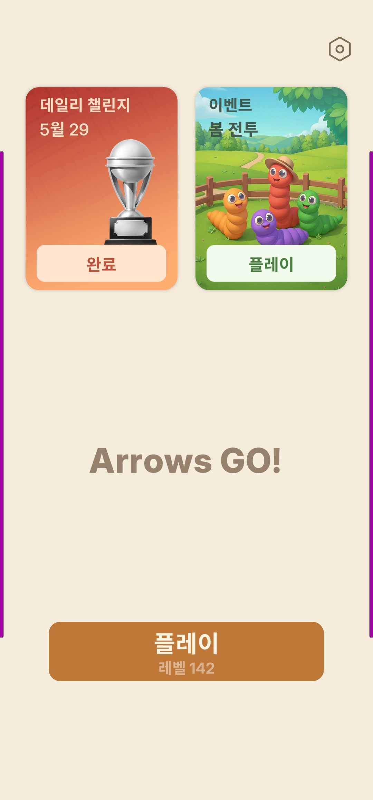
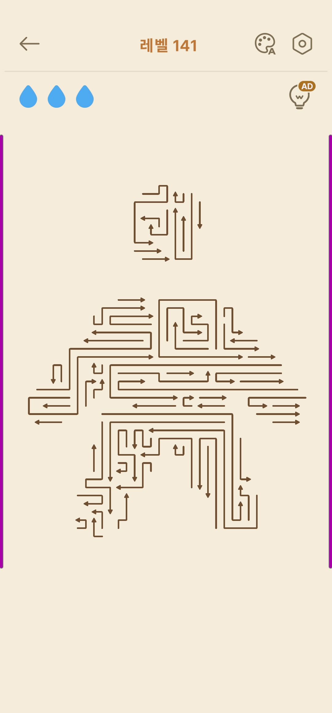
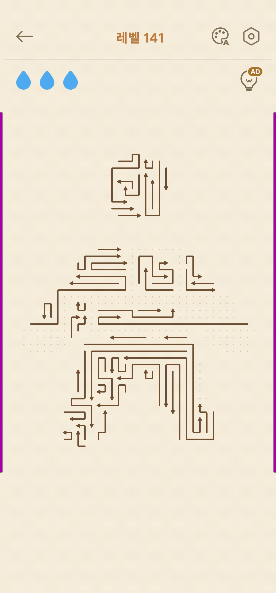
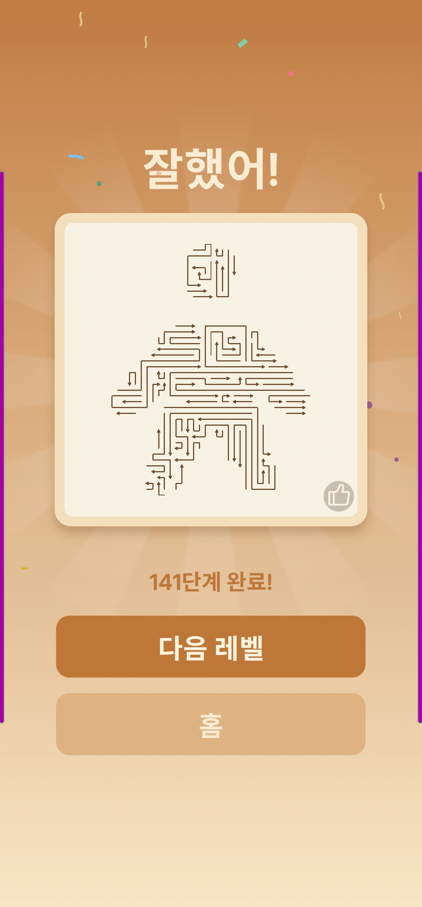

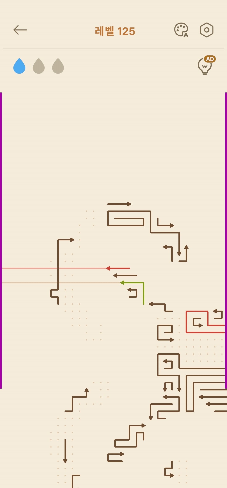 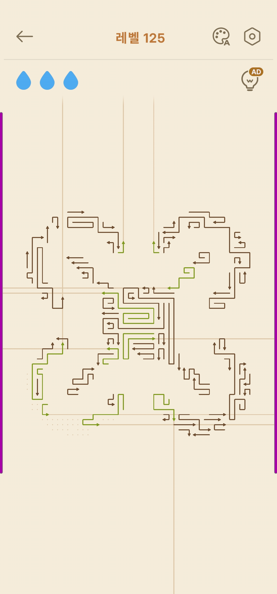 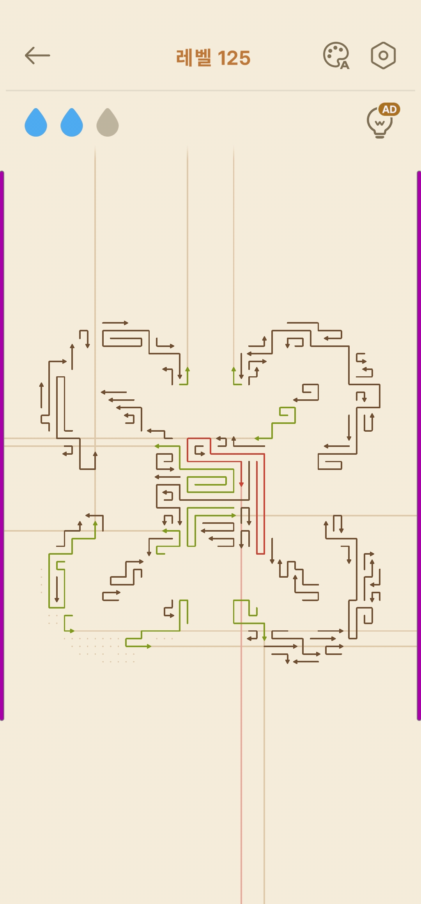 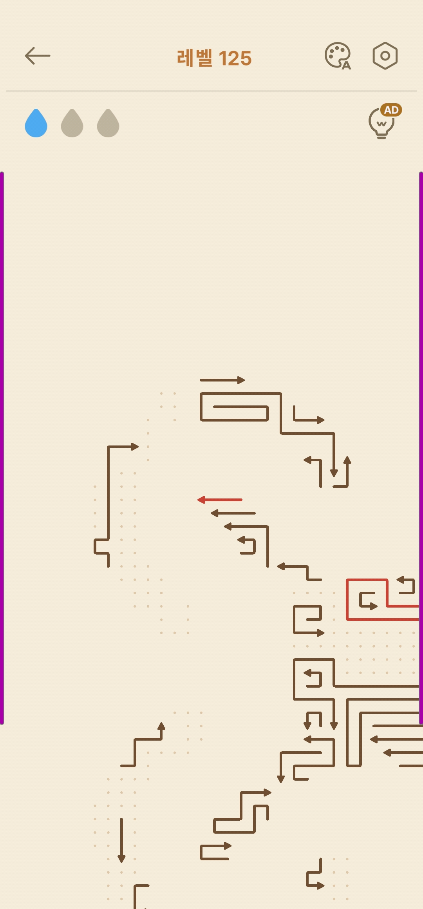

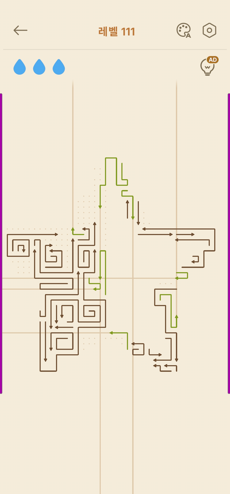 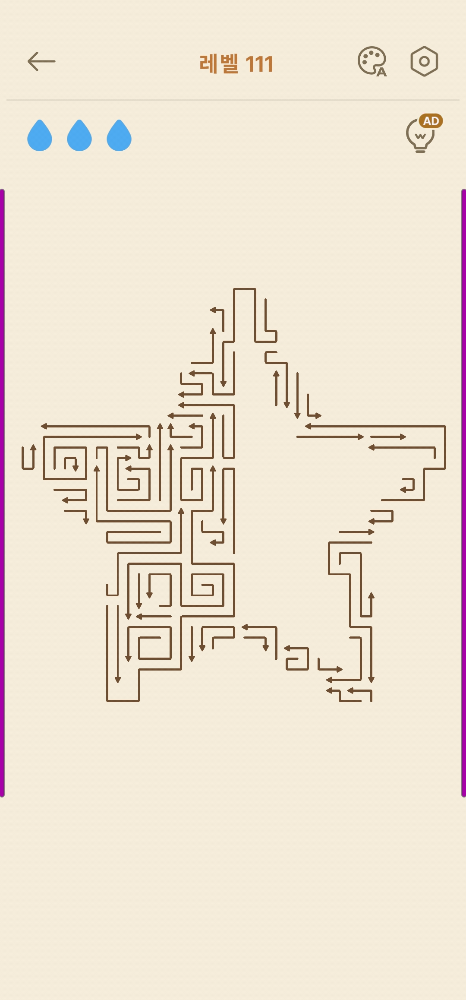 

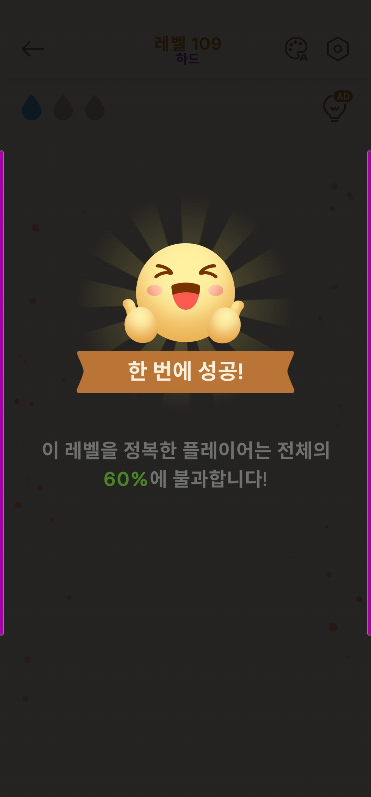

## 이미지를 확인한 기능 정의

> **문서 목적**: 대학생 강의용 교육 자료. Claude Code를 활용한 게임 개발 실습을 위한 기획안.
> 상용 앱의 부가 요소(데일리 챌린지, 이벤트, 광고 수익화 등)는 제외하고, **게임의 핵심 메커닉을 학습·구현하는 데 집중**한다.
> 기능은 **[MVP] 먼저 구현할 핵심 기능**과 **[확장] 여유가 될 때 추가할 기능**으로 구분한다.

### 게임 개요
- **게임명**: Arrows GO! (화살표 게임)
- **장르**: 길 빼기(Unblock) / 경로 빼내기 퍼즐 / 캐주얼 두뇌 게임
- **핵심 재미**: 보드 위에 **여러 칸에 걸쳐 꺾인 모양으로 놓인 화살표들**이 빽빽하게 얽혀 하나의 그림을 이룬다. 화살표를 탭하면 **화살촉이 향하는 방향으로 머리부터 기차처럼 미끄러져** 화면 밖으로 빠져나간다. 막히지 않고 빠질 수 있는 화살표를 잘 골라, 순서를 찾아 **모든 화살표를 제거**하면 한 판이 끝난다.

---

### 1. 핵심 게임플레이 (퍼즐) `[MVP]`

#### 1-1. 화살표의 구조
- 화살표 1개는 **연속된 여러 칸(셀)을 잇는 꺾인 경로(몸통) + 끝의 화살촉(머리)** 으로 이루어진다.
- 경로는 **직선 / ㄱ(L)자 / ㄷ자 / 계단형** 등으로 다양하게 꺾일 수 있다. (길이 1칸짜리 짧은 화살표도 가능)
- **화살촉(머리)** 은 경로의 한쪽 끝에 있으며, 그 화살표가 **나아갈 방향**을 가리킨다.
- 여러 화살표가 서로 겹치지 않게 보드를 빽빽이 채워 하나의 그림을 만든다.

#### 1-2. 제거 규칙 (탭 → 기차처럼 탈출)
- **목표**: 보드 위의 **모든 화살표를 화면 밖으로 빼내어 제거**하면 클리어.
- 화살표를 탭하면 **머리(화살촉)가 가리키는 방향(직선)으로 전진**하고, **몸통(꼬리)이 그 자취를 따라 기차처럼 끌려 나간다.**
- **탈출 조건**: 머리의 진행 방향 **직선 경로(머리 다음 칸 ~ 보드 밖)가 끝까지 비어 있어야** 화살표 전체가 보드 밖으로 빠져나가 제거된다.
- **막힘 판정**: 그 직선 경로 중간을 **다른 화살표(의 몸통 일부)가 가로막고 있으면** 빠져나갈 수 없다. (부분 이동 없이 제자리에 멈춤)
- 따라서 **머리 앞쪽 진로가 끝까지 뚫려 있는 화살표부터** 순서대로 빼내야 한다.

#### 1-3. 연쇄 풀이
- 하나의 화살표가 빠져나가면 그 화살표가 차지하던 칸들이 비워지고(점선 흔적으로 표시), 막혀 있던 다른 화살표의 진로가 새로 뚫린다.
- 이 과정을 반복해 모든 화살표를 제거한다.

#### 1-4. 막힌 화살표 탭 시 (실패 처리)
- 빠져나갈 수 없는(머리 앞이 막힌) 화살표를 탭하면, 머리가 진행하려다 **장애물에 부딪혀 제자리로 되돌아온다.**
- 이때 **물방울(생명) 1개가 차감**되고, 해당 화살표는 **빨간색**으로 변한다.

#### 1-5. 색상 피드백
- **갈색(기본)**: 일반(아직 제거되지 않은) 화살표
- **빨간색**: 막힌 상태로 탭해 부딪혀 되돌아온 화살표 (실패한 화살표 표시)
- **초록색**: 길게 누르기(롱프레스)로 선택/진행 경로를 미리보기 중인 화살표
- **점선(흐린 점)**: 빠져나간 화살표가 있던 빈 자리 흔적

### 2. 라이프(물방울) 시스템 `[MVP]`
- 화면 좌측 상단에 **물방울 아이콘 3개** 표시 (= **생명 3개**, 틀릴 수 있는 기회 3번).
- 막힌 화살표를 클릭해 부딪혀 되돌아올 때마다 물방울이 1개씩 소모(파랑 → 회색).
- **물방울 3개를 모두 소진하면 게임 오버(레벨 실패)** → 레벨 재시작.

### 3. 화살표 길게 누르기 (경로 미리보기) `[MVP]`
- 화살표를 **길게 누르면(롱프레스)** 그 화살표의 머리가 빠져나갈 **진행 방향이 화면 끝까지 선으로 표시**된다.
- 이를 통해 탭하기 전에 "이 화살표가 빠져나갈 수 있는지 / 어디서 막히는지"를 미리 가늠할 수 있다.
- **선 색상**:
  - 일반 화살표: 미리보기 경로가 **(기본/초록 계열) 선**으로 표시.
  - 이미 막혀 부딪혀서 **빨간색이 된 화살표**: 미리보기 경로가 **빨간색 선**으로 표시된다.

### 4. 레벨 & 진행 시스템 `[MVP]`
- 레벨은 번호로 순차 진행 (예: 1 → 2 → 3 ...).
- 클리어 시 **다음 레벨** 자동 해금 / 진행.
- 레벨별로 완성되는 그림(화살표 배치)이 다름 (별 모양, 하트/꽃 모양 등).
- 현재 도달한 레벨을 저장(로컬 저장)한다.

### 5. 클리어(결과) 화면 `[MVP]`
- 성공 메시지 표시: **"잘했어!"**
- **"N단계 완료!"** 텍스트 표시.
- 버튼: **[다음 레벨]**, **[홈]**.
- `[확장]` 완성된 그림을 카드 형태로 미리보기 제공.
- `[확장]` 실수 없이 클리어 시 **"한 번에 성공!"** 배너 표시.

### 6. 메인(홈) 화면 `[MVP]`
- 중앙: 게임 타이틀 **"Arrows GO!"**.
- 하단: 메인 **[플레이]** 버튼 + 현재 도달 레벨 표시(예: "레벨 5").
- 우측 상단: **설정** 버튼.

---

### `[확장]` 추가 기능 (여유가 될 때)
- **난이도 등급**: 특정 레벨에 "하드(Hard)" 등급 부여.
- **테마/색상 변경**: 보드 및 화살표 색상 테마 변경(팔레트 버튼).
- **줌(확대/축소)**: 화살표가 많은 복잡한 레벨에서 보드를 확대해 조작.
- **힌트**: 제거 가능한 화살표(다음 수)를 알려주는 기능.
- **사운드/이펙트**: 화살표 제거·실패·클리어 효과음 및 애니메이션.

> ※ 상용 앱에 있던 **데일리 챌린지 / 이벤트 모드 / 광고(AD) 수익화**는 교육용 범위에서 **제외**한다.

---

### 화면 구성 요약 (교육용 MVP 기준)
| 화면 | 주요 구성 요소 |
|------|----------------|
| 메인(홈) | 타이틀, 플레이 버튼(현재 레벨 표시), 설정 |
| 게임 플레이 | 뒤로가기, 레벨명, 물방울(생명 3), 퍼즐 보드(화살표들) |
| 클리어 | "잘했어!", 단계 완료 텍스트, 다음 레벨/홈 |
| 게임 오버 | 생명 소진 안내, 다시하기/홈 |

---

### 핵심 학습 포인트 (강의 관점)
- **2D 격자(그리드) 좌표계**와 화살표 데이터 모델링 (**여러 셀의 경로(폴리라인) + 화살촉 방향**).
- **점유(occupancy) 관리**: 화살표 하나가 여러 칸을 차지 → 어떤 칸이 비었는지/막혔는지 관리.
- **충돌 판정 로직**: 머리가 진행하려는 앞 칸을 다른 화살표가 막고 있는지 검사 (기차처럼 빠져나갈 수 있는지).
- **상태 관리**: 화살표 제거 → 보드 점유 상태 갱신 → 클리어/게임오버 판정.
- **입력 처리**: 클릭(탭)과 길게 누르기(롱프레스) 구분.
- **레벨 데이터 설계**: 화살표를 **경로(셀 목록)** 로 표현해 JSON으로 분리하기.
- **간단한 애니메이션**: 화살표가 경로를 따라 기차처럼 빠져나가는 / 부딪혀 되돌아오는 연출.

